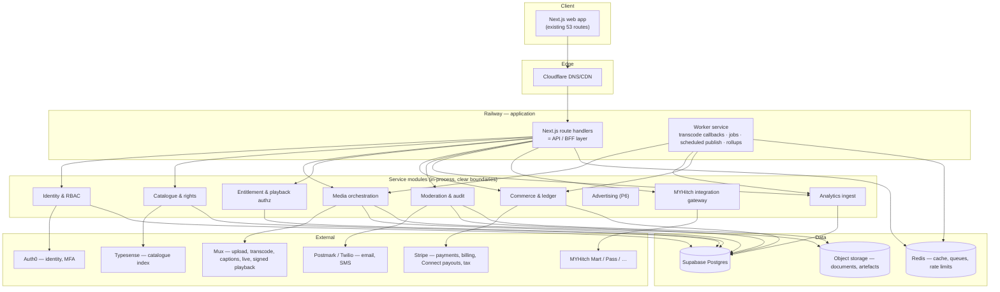

# MYHitch Nexus — Development Plan

Against `MYHitch_Nexus_Web_Development_Requirements.docx` v1.0 (July 2026).
Requirement-level detail lives in [SRS-TRACEABILITY.md](SRS-TRACEABILITY.md); this document is **how we build it, in what order, and how we prove it's done**.

Supersedes `PLAN-v1-prototype-derived.md`, which was written before the SRS existed by reverse-engineering the prototype. That plan was directionally right but under-scoped: it missed the MYHitch ecosystem integrations, the three administrative roles, the copyright workflow and the formal acceptance criteria.

---

## 0. Decisions log (§20)

Resolved 2026-09-14. Supersedes the recommendations table in SRS-TRACEABILITY.md §N where an actual decision has since been made.

| ID | Decision | Resolution |
|---|---|---|
| DEC-1 | Launch markets | Australia first, architected for multi-region |
| DEC-3 | MVP monetisation models | ~~Free + pay-per-view + rental (per recommendation)~~ **Superseded 2026-09-21** — the six-tier plan model (Free, Premium, Family, Creator, Business, Enterprise; see `/plans`) is final. Per-video rent/buy/PPV and channel memberships are **not** to be revived — access is governed by plan tier, not per-title purchase. See DEC-15 and the 2026-09-21 entry below. |
| DEC-4 | Film protection / DRM | Signed URLs + visible watermark for MVP |
| DEC-5 | Live streaming timing | **In scope, as Phase 5 immediately after MVP** — not deferred indefinitely, not pulled into the MVP gate itself |
| DEC-6 | MYHitch identity | **Confirmed shared, and structure fixed 2026-09-14 to [docs/AUTH0_INTEGRATION_STANDARD.md](AUTH0_INTEGRATION_STANDARD.md)** — extracted from Pass's real, working code, mandatory for every MYHitch platform integrating Auth0. Nexus registers as a new Application inside the *existing* shared tenant (not a new one). Critically, this is **headless**: no Universal Login, no redirect, no `auth0.com` URL ever reaches the browser — our backend calls Auth0's Authentication API directly (Resource Owner Password Grant) and issues its own session, exactly as Pass does. `src/lib/server/auth0Client.ts` / `auth0Sync.ts` / `auth0Mfa.ts` are written and typecheck clean; `accounts.auth0_user_id` (renamed from `auth0_sub` to match the standard) is live in Postgres. Auth0 owns identity only; Nexus's role/org model (`account_roles`/`organizations`/`memberships`) stays entirely in our database. **One deliberate adaptation**: Pass mirrors a single `app_metadata.role` for its MFA-enforcement Action; Nexus has no single role (roles are additive per SRS §4), so we mirror a computed `app_metadata.mfa_required` boolean instead — see the header comment in `auth0Sync.ts`. **Social sign-in (FR-6.2.1) resolved 2026-09-14**: ROPG has no equivalent for a social provider, so `src/lib/server/socialIdentity.ts` verifies a Google/Apple ID token directly against that provider's own JWKS — no Auth0 involved, no redirect, popup-only on the frontend, same "no `auth0.com` ever reaches the browser" property the standard requires for the password path. It hands off to a new `findOrCreateAuth0UserForVerifiedEmail()` in `auth0Sync.ts`, which reuses the existing Auth0 user if one exists (covers signing up with a password then later using Google, or vice versa) or creates one with a strong password the person is never told — from that point it is the *identical* identity record, `mfa_required` mirroring, and session issuance as the password path. One flow, two front doors, nothing in the three core files changed. **Split by actual cost, not by convenience**: Google's OAuth client ID is free and self-serve (Google Cloud Console, minutes) — **not a blocker, ships in P1 alongside password auth**. Apple Sign-In requires an active Apple Developer Program membership (USD 99/year) just to generate the credentials — a real spend decision, not a coordination one — so **Apple sign-in specifically stays in the blocker list** below until that's approved; everything else in P1 proceeds without it. **Blocked on tenant access** — see §9. |
| DEC-7 | Payments/payouts | Stripe + Connect, AUD primary, monthly payouts, 30-day hold |
| DEC-8 | Moderation | ~~Internal team, business hours, SLA'd queue~~ **Superseded 2026-09-17** — client wants zero human editorial intervention, YouTube-style automated review at upload time (no admin review queue for routine content decisions). See the 2026-09-17 entry below for the researched design and what's deferred on cost. |
| DEC-9 / DEC-14 | Data region | **Australia — done.** Supabase project recreated in Sydney (`ap-southeast-2`, ref `kdojrmscgtkfxuyaxnwv`); old Mumbai project deleted |
| DEC-10 | Applications | Web-only for MVP; native mobile/smart-TV stay §17 future scope |
| DEC-11 | Branding | Formalise the prototype's existing visual system as the design system |
| DEC-12 | Legal ownership | An external digital lawyer owns all policy/legal wording (privacy policy, terms, creator agreement, distribution terms, etc.) for the whole platform. **We build the mechanics only** — versioned documents, acceptance tracking, consent capture — and integrate the lawyer's actual text whenever it's supplied, without that blocking engineering progress. |
| **DEC-13** | MYHitch ecosystem APIs | **Resolved favourably.** Mart and Pass are built in-house by the same organisation, so this is a co-design exercise, not a dependency on an external vendor's documentation. We specify the contract each integration needs (Pass: ticket → entitlement mapping; Mart: product-link → purchase attribution) and their team builds to it. Still needs a named counterpart and a timeline slot before P4. |
| SEC-11 | Leaked Supabase credentials | **Resolved as a side effect of DEC-9/14** — the old project (and its leaked `service_role` key + DB password) was deleted outright rather than rotated, which is a stronger fix than rotation. New project uses Supabase's current key format (`sb_publishable_...` / `sb_secret_...`). |
| **DEC-15** | Full pre-launch scope (reverses the row below) | **2026-09-21, client directive.** Launch requires everything working, not an MVP subset — every phase in §4 (P0-P7; P8 stays future scope), every plan tier and its features, all working end to end. See the 2026-09-21 entry below for the phased plan this produced. |
| **DEC-16** | Content verticals beyond SRS scope | **2026-09-21, client directive.** Nexus also carries music/audio and podcasts alongside video, as a first-class content kind (not a video sub-category) — same six-tier access model, same MYHitch Connect Exchange Hub sponsorship path creators already get for video, same ad-revenue-share-when-monetised model as video (YouTube-style: revenue only when an advertiser actually runs against the content). Ownership/rights verification at upload follows the same notice-and-action posture as video (DEC's own copyright workflow, SEC-5) rather than a new model — described by the client as "like Spotify" but resolved to reuse the existing rights-declaration mechanics rather than build a second one. Sports (live scores/fixtures) remains explicitly on hold pending a further answer — do not start. Scoping (schema, upload flow, player) not yet done — see Immediate next actions. |

One scope question was raised and then withdrawn on 2026-09-14: building the entire platform (through advertising and all ecosystem integrations) before any public launch, rather than an MVP-first release; at the time, **confirmed staying with MVP-first (§16)**. **That withdrawal was itself reversed on 2026-09-21 (DEC-15)** — see the dated entry below for the phased plan now in effect.

---

## 1. The two facts that shape this plan

**1. The prototype is a specification, not a product.** 53 routes, 11 admin screens matching SRS §9 exactly, ~120 typed mock API functions, 10 of the 11 SRS §10 entities already modelled in TypeScript. 48 of the 69 functional requirements have a working interface. **Zero are functionally complete** — there is no backend, no persistence beyond a browser tab, no media, no payments, no access control.

**2. That makes this a backend and platform programme, not a build-from-scratch.** Most of the design and UX risk in §19's deliverables is already retired. The remaining risk sits in five places, all of which are currently at zero:

| Risk area | Why it's the hard part |
|---|---|
| Media pipeline | Resumable upload → transcode → captions → packaging → signed delivery. Nothing exists. |
| Entitlements & payments | AC-5 demands that failed payments never grant access. Needs idempotent, webhook-driven correctness. |
| Access control | SEC-1: today *any* logged-in user can open `/admin`. Authorisation must be rebuilt server-side from nothing. |
| Admin enforcement | The screens exist; the rules they claim to enforce (AC-3 publish gate, audit trail, copyright) do not. |
| MYHitch integrations | §16 requires one in MVP. Now a co-design exercise rather than an external dependency (DEC-13 resolved) — but still needs a named counterpart and a delivery slot on their side before P4. |

---

## 2. Delivery strategy: strangle the mock API

The prototype's `src/lib/mock-api/index.ts` is written as an explicit, typed service contract — its own header says the signatures *are* the contract. That gives us an unusually clean migration path:

```
Today:     UI → React Query hooks → mock-api function → in-memory store
Target:    UI → React Query hooks → api client function → /api route handler → service → Postgres
                                    └── same signature, same return type ──┘
```

We replace mock function bodies **one domain at a time** with real `fetch()` calls. The UI does not change. This means:

- Every phase ships something demonstrable on the real site, not behind a rewrite.
- The mock stays as the fallback for domains not yet migrated, so the app is never broken mid-programme.
- The ~120 function signatures become the first draft of the OpenAPI specification (DEL-4).

**Non-negotiable rule**: a domain is only "migrated" when its authorisation rules are enforced server-side. Moving data to the server while leaving permission checks in the browser would be worse than the mock.

---

## 3. Target architecture

Aligned to SRS §13, sized for a launch product rather than a hypothetical scale-out.



### Stack decisions

| Layer | Decision | Rationale |
|---|---|---|
| Web + API | **Next.js 15 (existing app) with route handlers as the BFF** | Reuses 53 built routes; one language; SSR satisfies §13's SEO requirement. Not microservices — module boundaries now, extraction later only if load demands it. |
| Workers | Separate Railway service, shared codebase | Transcode callbacks, scheduled publishing, report jobs, rollups must not compete with request traffic. |
| Database | **Supabase Postgres** — ✅ provisioned in Sydney (`ap-southeast-2`), catalogue schema live | Relational integrity is essential for entitlements, rights and ledger. Data residency resolved 2026-09-14 (DEC-9/14). |
| Identity | **Auth0** (client decision) — headless ROPG per [AUTH0_INTEGRATION_STANDARD.md](AUTH0_INTEGRATION_STANDARD.md), joining the existing shared MYHitch tenant, not a redirect-based flow | Own login UI, own session, own OTP/verification emails; Auth0 called server-side only for password checks and TOTP MFA (DEC-6/TPI-8). |
| Media | **Mux** — ✅ confirmed 2026-09-14 (was tentative), blocked only on account creation | Single vendor for both VOD and live (DEC-5 confirmed live in scope) beats juggling two vendors for a small team; Cloudflare Stream's better ecosystem fit (already a DNS customer) didn't outweigh Mux's stronger live product. Cost is the honest tradeoff — revisit at real volume. Abstracted behind our own media interface regardless, so it stays replaceable. |
| Payments | **Stripe** — Payments, Billing, Connect, Tax, Invoicing | Keeps card data out of scope (SEC-3), and Connect solves creator payouts (MON-10) without building a treasury. |
| Search | **Typesense** — ✅ provisioned 2026-09-14, self-hosted on Railway | Faceted search matching FR-6.1.3/6.1.4 exactly; cheaper and simpler to operate than Elasticsearch at this scale; self-hosting avoided a third vendor account. |
| Analytics | Postgres event tables + scheduled rollups → **ClickHouse when events exceed ~50M/month** | Avoids standing up a warehouse before there is data to warehouse. Trigger point documented so the migration is planned, not panicked. |
| Queues/cache | Redis — **✅ provisioned 2026-09-15** (Railway's own template, private networking only), currently backing the login rate limiter; BullMQ for jobs/queues still to come | Jobs, frequency caps, rate limits, live viewer counts. |
| Observability | **Sentry ✅ provisioned 2026-09-15** + structured logs + uptime monitoring + Railway metrics | NFR-8, AC-10. |
| IaC | Railway IaC (`.railway/railway.ts` — current `railway.json` is deprecated from 2026-12-01) | NFR-10, DEL-5. |

### Repository structure

The repo is currently named `frontend` and will hold backend code. Restructure early, before it holds anything that hurts to move:

```
myhitch-nexus/
├── apps/web/          # Next.js app (current src/) — UI + route handlers
├── apps/worker/       # background jobs
├── packages/core/     # domain services, shared types, the mock→real seam
├── packages/db/       # schema, migrations, query layer
├── docs/              # this plan, traceability, API spec, runbooks
└── e2e/               # Playwright acceptance suites
```

---

## 4. Phase plan

Nine phases. **Phases 0–4 constitute the SRS §16 MVP**; the gate at the end of P4 is the §18 acceptance criteria, verified with evidence, not opinion.

### P0 — Foundations *(partly complete)*

| Done | Outstanding |
|---|---|
| ✅ Production hosting (Railway), custom domain + TLS (`myhitchnexus.com.au`) | Dev/test/staging environments (DEL-5) — only production exists |
| ✅ Supabase project + first migration (`accounts`, `profiles`, `organizations`, `memberships`, `account_roles`) | Repo restructure to monorepo layout |
| ✅ Migration runner (`npm run db:migrate`) | **Rotate the leaked Supabase service-role key and DB password (SEC-11)**, move secrets to a managed store |
| ✅ CI (typecheck, lint, build) | Auth0 tenant, Sentry, Redis, Typesense provisioning |
| | Confirm data region (DEC-9/DEC-14) **before real user data exists** |

**Exit gate**: four environments, secrets managed, monorepo in place, OpenAPI skeleton published.

### P1 — Identity, discovery and free playback

Delivers: FR-6.1.1–6.1.7, FR-6.2.1–6.2.4, FR-6.2.6, FR-6.4.1–6.4.4, FR-6.6.1, FR-6.6.3, SEC-1 (core), SEC-2, ROLE-1/2/11.

P1 splits cleanly into an identity half (blocked on Auth0 tenant access) and a discovery half (anonymous browsing, FR-6.1 — needs no login at all). Built the discovery half first while Auth0 was paused:

- ✅ **2026-09-14**: catalogue schema live (`supabase/migrations/20260914000003_catalogue.sql` — categories, videos, taxonomy joins, credits, tracks, rights, pricing, comments, ratings, watchlist, watch progress, follows; 20 tables total, RLS on all, verified against the real Sydney database).
- ✅ **2026-09-14**: `src/lib/server/db.ts` (pooled `pg` client) and `src/lib/server/catalogue.ts` (typed queries, response shapes matching `types.ts`/`openapi.yaml` field-for-field) — the first real service-layer code in the app.
- ✅ **2026-09-14**: first real API routes, all public/anonymous per FR-6.1 — `GET /api/videos`, `GET /api/videos/{id}`, `GET /api/categories`, `GET /api/channels/{id}`, `GET /api/channels/{id}/videos`. Smoke-tested against the running dev server (correct empty-state/404 behaviour pre-seed).
- ✅ **2026-09-14**: catalogue seeded from the prototype's real mock data (`scripts/seed-catalogue.mjs`, reusing the actual mock objects rather than hand-transcribing) — 10 channels, 15 categories, 40 videos and all their taxonomy/credits/tracks/rights/pricing rows, verified against the live database (zero orphans, zero videos missing rights/pricing).
- ✅ **2026-09-14**: `getCategories()` in `src/lib/mock-api/index.ts` is the **first mock-api function actually swapped to real data**, per the strangler-fig strategy in §2 — same signature, now calls `fetch('/api/categories/')` instead of the in-memory store. Chosen specifically because `Category`'s fields are at full parity with what the real table returns.
  - **First finding from actually wiring it up**: swapping the function alone proved nothing — `useCategories()` (the React Query hook wrapping it) turned out to be exported but called from **nowhere** in the existing app. Every category-consuming page (13 of them) imports the static mock array directly, bypassing the hook layer entirely — a pre-existing pattern, not something introduced today. Caught this by checking the browser's actual network requests rather than trusting the code change looked right.
  - Fixed the one genuinely viewer-facing case: `src/app/(public)/explore/page.tsx`'s category grid now calls `useCategories()` for real. This also required re-keying its icon lookup from the mock's fixed string ids (`cat_brand_film`, meaningless once Postgres generates real uuids) to `slug` (stable across mock and real data since the real rows were seeded from the same source). **Verified in an actual browser**: confirmed `GET /api/categories/` fires, and the 15 real categories render with correct per-category icons and real title counts (e.g. "Brand films — 3 titles", "Courses & lectures — 4 titles").
  - The other 12 direct-import call sites (`video/[id]`, `category/[slug]`, admin/studio/business config forms, `sitemap`) are **deliberately left alone** — several of those (upload wizard, campaign builder, admin settings) need the full static taxonomy for form dropdowns regardless of which categories currently have published content, which isn't the same requirement as "show real browse counts," and rewiring 12 files without individually checking each one's actual need isn't a rushed-Friday-night change.
  - `getVideo`/`getChannel`/`searchVideos` remained on mock at this point for a different, already-known reason: those types carry engagement counters (views/likes/ratings) and a couple of Channel fields (languages, links) that didn't exist in the real schema yet (by design — they're analytics-pipeline/SRS-§6.9 outputs). Superseded by the entry below once that gap was deliberately closed.
- ✅ **2026-09-14**: Typesense provisioned — self-hosted on Railway (service `typesense`, official Docker image, persistent volume at `/data`) rather than Typesense Cloud, avoiding a third vendor account for something easy to self-host. One real gotcha worth recording: the default 384-thread pool crash-looped the container ("Resource temporarily unavailable") until `TYPESENSE_THREAD_POOL_SIZE=8` was set — its naive CPU-based default doesn't account for container resource limits. `GET /api/videos` does the **full faceted search** from `docs/openapi.yaml` (content type, category, language, country, access model, age rating, duration range, release-year range, sort) via `src/lib/server/typesense.ts` + `scripts/index-catalogue.mjs` (one-way sync from Postgres, source of truth stays Postgres — the index is rebuilt from scratch on each run, hydrated back into full rows by id afterward so a stale reindex can only affect ranking, never wrong data). `sort=popular`/`sort=rating` are accepted but fall back to newest — no real view/rating data existed yet at this point (closed by the next entry).
- ✅ **2026-09-14**: `getVideo`, `getChannel`, `getChannels` and the public branch of `getChannelVideos` swapped to real Postgres data, and `searchVideos()` itself finally swapped (the route/Typesense/schema work above had all landed, but the mock-api export was still reading `store.videos` — caught by seeing a burst of old-format `/api/videos/vid_xxx/` requests fire after clicking a search result that should have come from the real index). Getting this fully working end-to-end, by clicking through the real UI rather than trusting isolated backend checks, surfaced and fixed a chain of real bugs, each shipped in the same commit:
  - `SearchResult.facets` is a required field `BrowseView` destructures directly (`data?.facets.languages` — the optional chain only guards `data`) — added Typesense `facet_by` (content type, language, country, access model) and response mapping to populate it for real.
  - `VideoCard` destructures `video.pricing`/`video.rights` unconditionally; `VideoSummary` only exposed a flat `accessModels` array. Folded full `pricing`/`rights` objects into `VideoSummary` via a shared `VIDEO_SUMMARY_COLUMNS`/`VIDEO_SUMMARY_JOINS` join now used by `getVideosByIds`, `getVideoById` and `getChannelVideos` (removing `getVideoById`'s own now-redundant separate pricing/rights queries).
  - `Poster` indexes `gradient[0]`/`gradient[1]` with no fallback. `posterGradient` had earlier been judged purely cosmetic and left out of the schema — wrong, it's load-bearing UI, not decoration. Added `videos.poster_gradient` and `organizations.banner_gradient`/`avatar_gradient` (migrations `20260914000006`/`20260914000007`), backfilled from the real mock dataset.
  - Added the engagement counters (views, unique viewers, likes, rating average/count, comment count, watch time, completion rate) and channel fields (languages, links, verification status, joined date, followers, total views) the mock data always had but Postgres didn't (migrations `20260914000004`/`20260914000005`), backfilled by the new `scripts/backfill-engagement-fields.mjs` (idempotent UPDATE-only, matched by slug/handle since real rows have fresh uuids).
  - Swapping `getVideo`/`getChannel` to only understand real uuids broke every homepage video link, since the home rails and vertical category pages are still 100% mock and link with the old `vid_xxx`/`ch_xxx` string ids — 320+ console errors, every homepage click showing "Video not found". Reverting the whole swap wasn't safe either, since search now legitimately returns real uuids the mock store can't resolve. Fix: `looksLikeRealId()`, a uuid-shape check in `mock-api/index.ts`, so `getVideo`/`getChannel`/`getChannelVideos` (public branch only — `includeUnpublished` callers like Studio/Business always stay on mock, since showing drafts needs an ownership check that doesn't exist yet) each dispatch to real or mock data based on the id's own shape. Deliberately temporary and clearly commented as such — remove the day every caller passes real ids.
  - Verified: `tsc --noEmit`, `next lint --max-warnings 0`, `next build` all clean; SQL spot-checks after every migration/backfill; and a fresh incognito-style browser tab confirming zero console errors and zero stray network requests across the homepage, explore/search, video detail (both a real-uuid and an old-mock-id video), and channel pages.
- ✅ **2026-09-14**: **Creators directory (FR-6.1.2)** — `/creators`, a `ChannelCard` grid over `listChannels()`/`GET /api/channels` (already real, previously had zero callers) with client-side search and a kind filter (Creator/Business/Film studio/etc.), plus a nav entry between Entertainment and Categories. Small and fully unblocked — the API existed, it just had no page.
- ✅ **2026-09-14**: **OpenGraph/JSON-LD metadata (FR-6.1.7)** — `generateMetadata` + a schema.org `VideoObject`/`Organization` JSON-LD block added to `video/[id]/page.tsx` and `channel/[id]/page.tsx`, resolving through whichever branch `looksLikeRealId` already routes to (real Postgres by uuid, mock in-memory by id/slug), deduped per-request via React's `cache()`. Previously every video/channel page shared the same generic title with no share preview or structured data.
  - **Found while wiring this up**: the live `sitemap.xml` had been pointing every URL at `http://localhost:3000` since the Railway migration — `NEXT_PUBLIC_SITE_URL` was never set there, and `sitemap.ts`'s own fallback was a stale GitHub Pages URL from before that migration. Confirmed by checking the actual live `/sitemap.xml` output, not assumed. Fixed properly rather than patched around: added `SITE_URL`/`absoluteUrl()` to `lib/utils.ts` as the one source of truth (root layout's `metadataBase`, `sitemap.ts`, and the new JSON-LD all read from it), fallback hardcoded to the real production domain instead of localhost so it fails safe, and set `NEXT_PUBLIC_SITE_URL` on Railway.
- ✅ **2026-09-15**: **Temporary local password sign-in**, replacing the `sessionStorage`-only mock so the rest of the app (watchlist/ratings/comments/RBAC) doesn't have to wait on Auth0 access (blocker #2 below). Deliberately built as one swappable seam rather than a parallel throwaway system: `src/lib/server/session.ts` (session issuance/lookup/revocation) and `rbac.ts` (role mapping, `account_roles` enforcement) are real, permanent infrastructure that does not change when Auth0 lands — only `src/lib/server/localPassword.ts` (scrypt hash + verify, in-memory login-attempt rate limiting) gets deleted and swapped for `auth0Sync.ts`'s `verifyAuth0Password()`/`createAuth0User()`, which were written to the same three-outcome result shape on purpose for exactly this swap.
  - New: `accounts.password_hash` (nullable — Auth0/social-only accounts never get one) and a `sessions` table storing only a token hash, never the raw bearer token (migration `20260915000001`); `POST /api/auth/register`, `POST /api/auth/login`, `POST /api/auth/logout`, `GET /api/auth/me`.
  - `mock-api/index.ts`'s `register()`/`login()`/`logout()`/`getCurrentUser()` now call these routes and overlay the real identity fields (id, email, name, roles) onto the still-mock `store.user` — household profiles, notification/privacy settings and parental controls have nowhere real to live yet and stay exactly as seeded.
  - Deliberately narrow scope, matching "a simple auth page for now": org-verification documents, MFA enrollment and mobile OTP in the registration wizard all stay the cosmetic mock UI they already were — those need P2's document storage, real Auth0 MFA, and an SMS provider respectively, none of which exist yet. This is an internal/testing front door, not a public sign-up path, and any account created this way has no Auth0 counterpart to migrate to automatically once that lands.
  - `login()`'s signature changed (now takes `{email, password, remember}`, not just an email string) since the mock version never actually checked a password — the one caller (`auth/login/page.tsx`) was already collecting one and silently discarding it. Both login and register now handle real failure (wrong password, duplicate email) with an actual error toast instead of always succeeding.
  - Verified: `tsc --noEmit`/lint/build clean; migration applied and columns/table confirmed directly; full browser click-through of register → auto-login → sign out (confirmed the session row is actually deleted, not just the cookie) → login with a wrong password (rejected with a real 401) → login with the right one (succeeds); the 8-attempt rate limiter confirmed to trip a 429 and block even the correct password until the window clears; test account cleaned up afterward.
- ✅ **2026-09-15**: **Real watchlist, ratings and comments** — the write paths the temporary sign-in above exists to unblock. `src/lib/server/engagement.ts` (toggle watchlist, upsert+recompute a rating, post/reply to a comment) plus `getWatchlistVideos()`/`videoExists()` in `catalogue.ts`; five new routes (`POST /api/videos/{id}/watchlist`, `GET /api/watchlist`, `GET`+`POST /api/videos/{id}/rating`, `GET`+`POST /api/videos/{id}/comments`, `POST /api/comments/{id}/replies`).
  - Real only: `watchlist_items`/`video_ratings`/`video_comments` all have a real foreign key into `videos(id)`, so a still-mock-shaped video (home rails/category pages) can't be written to any of these tables at all — `videoExists()` guards each write with a clean 404 instead of a raw FK-violation error. `toggleWatchlist`/`rateVideo`/`getMyRating`/`getComments`/`postComment`/`replyToComment` in `mock-api/index.ts` all branch on `looksLikeRealId`, same bridge as `getVideo`/`getChannel` — a mock video's engagement stays purely local exactly as before. `getWatchlist()` now merges both sources (an account's watchlist can genuinely span real and still-mock videos mid-migration).
  - Rating aggregates (`videos.rating_average`/`rating_count`) are recomputed from the real `video_ratings` rows on every write — the point those two columns stop being the seeded snapshot and start being live, for any video that gets a real rating. Comment author display (`accounts` has no avatar-gradient column, unlike videos/organizations) uses a new deterministic `pickGradient()` in `lib/utils.ts`, reusing the same palette already seeded on channel avatars.
  - **Found while verifying**: `VideoCard` resolved a video's channel purely via `channelById(video.channelId)` — a mock-only lookup — so a real (Postgres) video's card silently dropped its channel name/avatar entirely (not a crash, just missing, and true on the Explore/search page too, from the earlier searchVideos swap). Fixed by preferring the real `channelName` VideoSummary already carries when present.
  - Verified: `tsc`/lint/build clean; full browser click-through signed in as a real account — add a real video to the watchlist, rate it 4 stars (aggregate recomputed correctly), post a comment and a reply (correct real author name/handle/gradient, correctly nested on reload) — each confirmed directly against Postgres, not just the UI; the account/watchlist page rendering a real bookmark alongside mock ones in one grid, channel name included after the VideoCard fix; test account and its rows deleted afterward, and `scripts/backfill-engagement-fields.mjs` re-run (it's idempotent) to restore the one video's seeded rating stats the test perturbed.
- ✅ **2026-09-15**: **Real follows and watch progress** — the last two of the five write paths blocked on a real account. `toggleFollow`/`isFollowing` and `getWatchProgress`/`saveWatchProgress` added to `engagement.ts`, `getContinueWatchingVideos()`/`organizationExists()` added to `catalogue.ts` (same split as watchlist: video/channel-shaped reads in `catalogue.ts`, everything else in `engagement.ts`); three new routes (`GET`+`POST /api/channels/{id}/follow`, `GET`+`PUT /api/videos/{id}/progress`, `GET /api/continue-watching`).
  - Same real-only FK guard (`organizationExists()`) and `looksLikeRealId` mock/real split in `mock-api/index.ts` as every other engagement write path. `getContinueWatching()` merges real and mock sources the same way `getWatchlist()` does.
  - `organizations.followers` now recomputes live from `channel_follows` on every toggle — the same seeded-snapshot-to-live transition already applied to `videos.rating_average`/`rating_count`. `watch_progress` has no `duration_seconds` column of its own (a video's length is a property of the video, not of one account's progress through it) — read back by joining `videos.duration_seconds` at query time instead.
  - Verified: `tsc`/lint/build clean; full browser click-through signed in as a real account — followed then unfollowed a real channel via the video page's own button (Postgres confirmed 1→0 on both the join table and the recomputed `followers` column each time); saved watch progress on a real video and confirmed it appeared correctly, sorted first, on `/account/history`'s real "Continue watching" list (`5:00 of 12:06 · last watched 3 minutes ago`, matching what was saved) alongside the still-mock entries; test account and rows deleted afterward, backfill script re-run to restore the one channel's seeded follower count the test perturbed (same aftercare as the ratings test before it).
- **Correction (2026-09-15)**: earlier entries in this log said "the home rails and category pages" are still mock, as one boundary — that's no longer accurate and was already stale when written. `/explore`, `/search`, `/films`, `/commercial`, `/education`, `/news`, `/entertainment` and `/category/{slug}` all render through `BrowseView`, which has been real since the `searchVideos()` swap — confirmed by finally getting the e2e suite running (see below) and checking each page's own source directly rather than continuing to repeat the old boundary from memory. Only the true homepage (`/`, its own hand-built rails) and `/live` (the live events hub — a distinct, still-entirely-mock feature area, since live streaming is P5 scope) remain on the mock store for browsing. Individual video/channel pages still need `looksLikeRealId` regardless, since links from the homepage's rails still carry old mock-shaped ids.
- ✅ **2026-09-15**: **Real server-side role enforcement, closing SEC-1** ("today any logged-in user can open `/admin`"). `/admin`, `/studio` and `/business` were gated only by `AuthGuard`, a client component checking "is anyone logged in" — never which roles. Each `layout.tsx` is now an async Server Component that calls the new `requireRole()` in `rbac.ts` (reads the session cookie via `next/headers`, resolves the account, redirects to `/auth/login` if signed out or `/` if signed in but missing the role) *before* anything protected renders or ships to the browser — real enforcement, not a client-side UX nicety. Admin requires `admin`; Studio requires `creator`; Business requires `business` or `advertiser` (they share one workspace, matching the registration wizard). Each layout's existing UI (nav, badges, data hooks) moved unchanged into a sibling `*-shell.tsx` client component the server layout renders once the check passes. The demo account (`scripts/seed-demo-account.mjs`) now holds every one of these roles, matching what it could reach before enforcement existed — a real registered account only gets the role(s) it actually chose at signup.
  - **Found a genuine Next.js 15.5.25 bug while verifying this**: `redirect()` called from these new async layouts was silently falling through to the app's `not-found.tsx` with an HTTP 200 instead of performing the redirect — reproduced down to a two-line repro page with no app logic at all. Root cause: the app's root `src/app/loading.tsx` wraps *every* route (including admin/studio/business) in an implicit Suspense boundary, and that combination with a nested-layout `redirect()` is what triggers the bug — confirmed by watching the failure disappear the moment the file was removed. Fixed by moving `loading.tsx` to `src/app/(public)/loading.tsx`, scoping that Suspense boundary to the public catalogue/marketing pages that actually want it and away from admin/studio/business, which need working redirects more than that loading flash.
  - Verified: `tsc`/lint/build clean (admin/studio/business now correctly build as dynamic `ƒ` routes, not static); full suite (44 tests) passes via `npm run test:e2e`; manually confirmed against a real production build (`next start`) — a signed-out request to `/admin` gets a real 307 to `/auth/login`, a plain-`viewer`-role account gets a real 307 to `/` from all three sections, and the demo account (all roles) still gets into all three; test accounts cleaned up afterward.
- ✅ **2026-09-15**: **Sentry provisioning** (NFR-8/AC-10 observability). The one blocker here was the account signup itself — not something to create on the client's behalf — resolved once the client created a free Sentry project and handed over its DSN. `@sentry/nextjs` added; `src/instrumentation.ts` (Node/Edge init via Next's instrumentation hook, plus `onRequestError` for Server Component/route-handler errors) and `src/instrumentation-client.ts` (browser init) follow the SDK's current App Router convention exactly, not the older `sentry.client.config.ts` pattern. `next.config.ts` wrapped with `withSentryConfig`. Both `error.tsx` (route-level boundary) and `global-error.tsx` (root-layout boundary) now call `Sentry.captureException()` — `error.tsx` previously said outright "there is no telemetry service in this build, so the console is the honest destination"; that's no longer true. DSN lives in `NEXT_PUBLIC_SENTRY_DSN` (Railway + `.env.local`) — safe to expose client-side, a DSN only permits sending events, not reading or managing the account. No `SENTRY_AUTH_TOKEN` configured, so source-map upload is skipped for now (stack traces show minified code in the Sentry UI until one is added — error capture itself is unaffected; a later enhancement, not a gap in coverage).
  - Verified: `tsc`/lint/build clean; confirmed the SDK actually intercepts errors in a real (`next start`) production build, not just dev, by throwing a real uncaught error in the browser and confirming Sentry's global handler marked it captured; independently confirmed the DSN itself is live and the project accepts events by posting a minimal event envelope directly to Sentry's ingest API via curl (200 OK, real event id returned) — verification that doesn't depend on being able to see the outbound request in this session's own browser tooling, which doesn't reliably surface Sentry's transport calls.
- ✅ **2026-09-15**: **Real channel provisioning at registration**, closing the last gap that made a freshly registered creator/business/etc. account only reach a *real* identity/session while its channel stayed the hardcoded mock `ch_mara` — anything reading `store.user.channelId` (publishing a draft, the "is this my video" entitlement check) silently attributed real accounts' actions to Mara's seeded mock channel. `src/lib/server/channelProvisioning.ts`'s `provisionChannelForRole()` now creates a real `organizations` row + owner `memberships` row for any role that implies one (creator, business, advertiser, producer, education, organisation — not viewer/admin), called from `POST /api/auth/register` right after the `account_roles` insert. `getSessionAccount()` (`session.ts`) now also resolves the account's channel id from `memberships` and returns it on `SessionAccount`; `GET /api/auth/me` passes it through; `applyRealAccount()` in `mock-api/index.ts` sets `store.user.channelId` from it when present.
  - **Found while scoping this — a real, pre-existing latent bug**: `rbac.ts`'s `MOCK_TO_DB_ROLE` map (and its header comment) claimed `account_roles.role` used the SRS §4 spelling (`education_provider`, `government_nonprofit`), but migration `20260914000002` (one day before the local-password-auth work that first exercised this map) had already realigned that check constraint to the mock `UserRole` spelling instead (`education`, `organisation`) — both tables were still empty at the time, so it was a plain constraint swap, not a data migration, and nothing before this feature ever actually inserted an `education` or `organisation` role to catch the mismatch. `toDbRole()` would have inserted a value violating the live constraint, 500-ing registration for exactly those two roles. Fixed the map (now an identity map, kept explicit rather than collapsed to a passthrough so a future re-divergence is a one-line diff) and the matching `ROLES_REQUIRING_VERIFICATION` set in the register route. Caught by registering a real `education`-role test account before assuming the mapping was correct, not by reading the code alone.
  - `organizations.type` had the same kind of drift in the other direction: 20260914000002 aligned it to the *mock* `ChannelKind` enum (`creator`/`business`/`film-studio`/`education`/`government`/`nonprofit`/`news`), which has no `advertiser` or `producer` value even though `account_roles.role` has always had both as distinct roles. New migration `20260915000002` extends the constraint to add them rather than folding either into an existing type. The one remaining ambiguity is deliberate and documented in code: `organisation` (one combined role) maps to `nonprofit` (one of two org types) by default, since the role doesn't distinguish government from non-profit — an admin can move a specific org to `government` from `/admin/organisations` if that default is wrong for a given registrant.
  - A channel's `banner_gradient`/`avatar_gradient` (not-null columns with no default, unlike `languages`/`links`/`followers`) are generated at creation time via the existing `pickGradient()` in `lib/utils.ts`, keyed on the account id — same deterministic-palette approach already used for comment author avatars, not a new mechanism. `handle` is left null (no organisation-name field exists at registration to derive one from, and Studio/Business resolve "my channel" via the session's `channelId`, not a typed handle) and `business_email` is set to the account's own registration email.
  - Verified: `tsc`/lint/build clean; migration applied and the extended constraint confirmed directly; registered real test accounts for `creator`, `education` and `viewer` — `GET /api/auth/me` returned a real `channelId` uuid for the first two and `null` for the third; confirmed each channel's row in Postgres (`type`, `country`, `business_email`, distinct gradients, `joined_at`) and that it resolves through the existing `GET /api/channels/{id}` route; full suite (44 tests) still passes; signed in to Creator Studio as the real test creator account and confirmed RBAC still let it through post-fix; test accounts and their now-orphaned `organizations` rows deleted afterward (memberships cascade from the account, but an organisation row itself doesn't cascade from its owner's deletion, so it needed a separate cleanup query — worth remembering for any future manual test of this path).
- ✅ **2026-09-15**: **Real channel settings writes**, the direct follow-on to channel provisioning above — and, it turned out, a regression fix for a bug that entry itself introduced. `src/lib/server/channelSettings.ts` (`isChannelMember()`, `updateOrganization()`) plus a new `PATCH /api/channels/{id}` (same route file as the existing public `GET`), restricted to accounts with a membership on that organization; `mock-api/index.ts`'s `updateChannel()` now branches on `looksLikeRealId` like every other engagement/channel function.
  - **Found while wiring this up — a real regression from the channel-provisioning entry above, same day**: `updateChannel()` was 100% mock (`store.channels.find(...)`, throws `Channel not found` for anything it doesn't recognise) — harmless before, since every real account's `channelId` fell back to `ch_mara` and so always matched a real mock entry. The moment real accounts started getting real `channelId`s, Studio's Channel Settings page's "Change banner"/"Change avatar" buttons — the only two controls that actually called `updateChannel` before this fix — started throwing for every one of them. Not caught by the earlier entry's own testing because that round only exercised registration and `GET /api/auth/me`, never opened Channel Settings itself. Fixed as part of this same piece of work rather than filed separately, since the fix is this feature.
  - Also found, in the same page, while wiring the real write path: the **"Save changes" button never actually saved anything** — for the mock channel too, not just real ones. It called nothing but `toast({ title: "Channel settings saved" })`; only the avatar/banner pickers were ever wired to `updateChannel.mutate`. So the name/handle/tagline/about/contact-email/languages/country fields were pure local state with a lying success toast, for the entire lifetime of this page. Fixed by having Save actually call `updateChannel.mutate` with those seven fields; "Reset" (previously also a no-op button) now restores them from the last-fetched channel.
  - Deliberately excludes `avatarUrl`/`bannerUrl` from the real write path: they're a browser-local `blob:` URL from `URL.createObjectURL()` with nowhere real to persist to until P2's media pipeline/file storage exists — writing one into `organizations.avatar_url`/`banner_url` would silently break the image for every other viewer and for the same viewer after reload. Rather than let the buttons silently no-op (200 back, nothing visibly changes, no explanation), the settings page now hides "Change banner"/"Change avatar" entirely for a real channel and shows a one-line note instead; the mock `ch_mara`-style channel keeps them exactly as before.
  - Membership, not `org_role`, is the authorization bar for now (`isChannelMember()`) — every organization created by registration has exactly one member, so owner/editor/analyst isn't worth distinguishing yet; revisit once inviting a teammate to a channel is built and an analyst shouldn't be able to rebrand it.
  - `handle` gets real validation for the first time (`^[a-z0-9][a-z0-9_-]{1,31}$`, checked for uniqueness against `organizations.handle`'s existing unique constraint before the update runs, not caught as a 23505 after) — 400 for a malformed handle, 409 for one already taken.
  - **Also found while testing**: the settings page's own Country `<select>` only offered 8 of the auth/register page's 12 country codes (missing Spain, Canada, India, Netherlands) — invisible before since every seeded mock channel happened to use one of the 8, but a real account can genuinely register from any of the 12. Expanded the list to match register's exactly, rather than inventing a third, broader list; the two pages already maintain separate hardcoded lists (7 files across the app do), which is a pre-existing pattern worth a dedicated shared-constant cleanup pass on its own, not folded into this one.
  - Verified: `tsc`/lint/build clean; full suite (44 tests) still passes; curl-verified 401 (signed out), 403 (a different, unrelated account), 400 (single-char and punctuated handles), 409 (a handle colliding with a seeded channel), and a clean 200 with every field round-tripped correctly for the real owner; full browser click-through signed in as a real test creator — Channel Settings loaded the real name/handle/tagline/about/country/languages saved via the curl round earlier, avatar/banner controls correctly replaced by the explanatory note, edited the tagline through the actual form and clicked Save, got the real success toast, confirmed directly in Postgres, then reloaded the page cold and confirmed it came back from the server rather than client cache; test accounts and the now-orphaned `organizations` row deleted afterward, backfill script re-run.
- ✅ **2026-09-15**: **Real account settings writes** — same bug class as channel settings above, found by checking the sibling case rather than waiting for it to surface: `updateUser()` (`/account/profile`'s "Save changes") was 100% mock (`Object.assign(store.user, patch)`, no lookup, so it never even threw) — meaning a real signed-in account editing their name/email/handle/country/language got a fake success and the change silently vanished on the next reload, since `getCurrentUser()` re-fetches `GET /api/auth/me` and overwrites `store.user` from the real row again. Unlike the channel-settings regression, this one predates and is independent of the channel-provisioning work — it's been live since local password auth first shipped, and hits every real account, not just creator/business/etc. roles.
  - New `src/lib/server/accountSettings.ts` (`updateAccount()`) plus `PATCH /api/auth/me` (same route file as the existing `GET`) — same shape as channel settings: only the account's own five real-schema fields (name/email/handle/country/language), email and handle each format-validated and uniqueness-checked against `accounts` before the update runs (400/409, not a caught constraint violation). `updateUser()` in `mock-api/index.ts` now applies the patch locally as before (privacy/notifications/parental-controls/profiles/etc. still have nowhere real to live) and additionally syncs the five real fields to Postgres when `store.user.id` is real, reconciling with the server's response afterward via `applyRealAccount()`.
  - Same `avatarUrl` exclusion as channel settings, same reason: a `blob:` URL from `URL.createObjectURL()` has nowhere real to persist to yet, so "Change" is hidden for a real account with an explanatory note instead of silently no-op-ing.
  - **Also found while testing**: the Save button on `/account/profile` *did* call `updateUser.mutate(...)` (unlike channel settings' version of this bug) but fired `toast({ title: "Account updated" })` unconditionally right after, not from `onSuccess` — so a real rejection (duplicate email, taken handle) still showed a success toast while the account list rendered from an untouched cache. Moved the toast into `onSuccess`/`onError`. Same page's Country/Language `<select>` lists were also short of what `auth/register` itself allows (10 of 12 countries, 6 of 11 languages) — expanded to match, same reasoning as the channel-settings country-list fix.
  - Verified: `tsc`/lint/build clean; full suite (44 tests) still passes; curl-verified 401 (signed out), 400 (malformed email, malformed handle), 409 (email and handle each colliding with another real account), and a clean 200 with every field round-tripped; full browser click-through signed in as a real test account — Account details loaded the real name/handle/language saved via the curl round earlier, edited the name through the actual form, clicked Save, confirmed the real success toast and the value in Postgres directly; test accounts deleted afterward.
- ✅ **2026-09-15**: **Homepage migration off mock data** — the last browse-side surface still reading `store.videos`/`store.watchProgress`/`store.following` directly. `getFeaturedContent()` is now a full wholesale swap to `GET /api/home` (no id to branch on, unlike `getVideo`/`getChannel` — same category of change as `getChannels()`/`searchVideos()` before it), backed by a new `getFeaturedRails()` in `catalogue.ts`: per-content-type rails (`getVideosByType`, reusing the existing `VIDEO_SUMMARY_COLUMNS`/`JOINS`), a top-rated "Recommended for you" excluding whatever's already in progress (`getRecommendedVideos`), and two personalized rails for a real signed-in account — "Continue watching" (already-existing `getContinueWatchingVideos`) and a new "From channels you follow" (`getFollowedChannelVideos`, joining `channel_follows`). A guest gets every rail except those last two, rather than a stand-in. There's no admin-curated "featured" flag in the schema, so "hero" is the most-viewed published videos — a defensible data-driven stand-in for an editorial pick, not an invented value.
  - `HomeRail`/`FeaturedContent` (`types.ts`) changed shape from `videoIds: string[]` (needing a second per-item `getVideo()` hydration pass client-side — cheap when everything was mock, but would have meant dozens of individual real network round-trips per page load) to `videos: Video[]` embedded directly, since `getFeaturedContent()` has exactly one caller (this page) and batches everything server-side in one round of queries instead. `page.tsx`'s `HydratedRail`/`useRailVideos` id-hydration dance is gone entirely; rails render straight from the response.
  - Fixed the same channel-name gap `VideoCard` already had (`docs/DEVELOPMENT-PLAN.md`'s 2026-09-15 watchlist/ratings entry): `Hero` resolved its video's channel purely via the mock-only `channelById()`, so every hero title — now always real — would have silently dropped its channel line. Same fix: prefer `VideoSummary.channelName` when `channelById()` finds nothing.
  - **Found while running the full suite, not by inspection**: two `shell.spec.ts` tests used "Continue watching" as a generic "we're back on the homepage" marker for a signed-*out* guest — reliable when the rail was always-mock-present regardless of login state, wrong now that it's genuinely personalized and correctly absent for a guest. Repointed both at "Films & cinema" (a rail with no personalization to skip) and dropped the assertion's stale comment about GitHub Pages subpath serving, which stopped being true when the static export was removed (`docs/DEVELOPMENT-PLAN.md`, 2026-09-15, e2e-runner fix).
  - **Found the same way, a real and independent pre-existing bug**: `video-client.tsx`'s and `live-client.tsx`'s "redirect guests to login" effects both gated on `!isLoading` — the *video's*/*event's* own loading flag, not the current-user query's, a destructuring-name collision. Harmless when the race window it opened rarely mattered; surfaced as an intermittent e2e failure (`search finds a title and opens its detail page`, mobile project, landing on `/auth/login` after clicking a real search result) that never reproduced through direct curl load-testing or manual browser click-through, only under Playwright's exact automated timing — consistent with a genuine race rather than a home-feed regression, since the failing test's subject (search → video detail) isn't code this entry touches. Fixed both effects to gate on `useCurrentUser()`'s own `isLoading` instead; confirmed via a 6x repeat run (5/6 immediately, the one remaining failure a `next start` cold-start-only run in total isolation) and a clean full-suite run afterward.
  - Verified: `tsc`/lint/build clean; `GET /api/home` curl-checked as a guest (hero + every non-personalized rail, real titles/channels) and as a real signed-in test account with a real follow and a real watch-progress row (Continue watching and From channels you follow both appeared, Recommended correctly excluded the in-progress title); full suite (44 tests) passes, including three full runs taken to chase down and confirm the fix for the flaky race above; full browser click-through both signed out and signed in as a real test account — hero rotates through real titles with correct channel names, every content-type rail renders, clicking a real video from a rail navigates to and loads its real detail page; test account, its follow and watch-progress rows deleted afterward, backfill script re-run.
- ✅ **2026-09-15**: **Redis-backed login rate limiting**, closing the gap `localPassword.ts` documented from day one ("in-memory only... won't survive a restart or scale past one instance"). Provisioned Redis on Railway (its own first-party template, private networking only — no public endpoint, matching Typesense's self-hosted-on-Railway precedent rather than a third vendor account) and wired `REDIS_URL` into the app service via a Railway variable reference (`${{Redis.REDIS_URL}}`) so it always resolves to the current instance without hardcoding a password. `src/lib/server/redis.ts` is a lazy singleton client, matching `db.ts`'s pool pattern; `isRateLimited`/`recordFailure`/`clearFailures` in `localPassword.ts` now use `INCR`+`EXPIRE`/`SET EX` when `REDIS_URL` is set, falling back to the original in-memory `Map` when it isn't (local dev without Redis — still exactly correct for a single local process, not a regression).
  - Considered why this was scoped down from "Studio/Business/Admin real-data migration" (this session's other candidate): most of what's left there is deliberately phase-gated (P2 media pipeline for real video publishing, P4 analytics/admin services, P6 advertising), not an unmigrated-for-no-reason gap the way channel/account settings were — pulling that forward would mean building P2 schema (categories, tags, credits) ahead of the actual media pipeline it exists to serve. Redis was the honestly-unblocked piece instead.
  - **Deliberately fails open, not closed**: a Redis error mid-request (connection drop, timeout — not just "no `REDIS_URL`") logs and lets the attempt through rather than 500-ing the login route or blocking every user — rate limiting is defense-in-depth on top of the real check (the password itself), so an infrastructure hiccup shouldn't lock out or break login entirely.
  - Local verification used the in-memory fallback path (Railway's SSH-tunnel option for reaching the private Redis instance from a local machine needs a fresh SSH key, which is outside what this session generates unprompted) — confirmed 8 failed attempts → 401 each, 9th → 429, and the 429 holding even for the *correct* password during the lockout window, identical to the pre-existing behaviour.
  - **The Redis-backed path specifically verified by restart-survival, the actual point of this change**: triggered a fresh lockout against production, immediately redeployed the app service (`railway redeploy`, a real process restart — an in-memory `Map` would be wiped by this), and confirmed the *correct* password still got a 429 seconds after the new process came online, comfortably inside the lockout's 5-minute TTL. This is a stronger proof than inspecting Redis directly would have been — it's the literal failure mode ("won't survive a restart") the migration exists to fix, shown fixed rather than inferred.
  - Verified: `tsc`/lint/build clean; full suite (44 tests) passes; local in-memory fallback exercised directly via curl; production lockout confirmed to survive a real app restart (above); test account and rows deleted afterward — the Redis keys themselves need no manual cleanup, both set with an `EX` TTL.
- Still to do: real Auth0 integration (the seam in the local-sign-in entry above is what makes that swap small when tenant access lands — blocker #2 below). The `looksLikeRealId` bridge stays — Studio, Business and Admin still originate plenty of mock-shaped ids (their own content/dashboard data hasn't been migrated), so `getVideo`/`getChannel`/`getChannelVideos` still need to serve both shapes.

**Exit gate**: a real account signs in, browses a real catalogue, watches a real free video, and progress resumes on another device.

### Client-requested additions (2026-09-16) — video categories, Magazine, Exchange Hub

Not phase-plan items with an SRS requirement ID — the boss asked for these directly, out of band from §20/DEC review, so they're logged here rather than folded silently into P1/P2/P7. Checked against the SRS and SRS-TRACEABILITY.md before building anything:

- **"Exchange Hub"** (creator solicits sponsorship for a project, publicly) appears **nowhere** in the requirements document. The nearest existing concept, MON-7/FR-6.9's advertising marketplace, runs the opposite direction — advertisers buy placement from the platform, not creators soliciting sponsors directly. This is a genuinely new feature, not a gap in an existing one.
- **"MYHitch Lens"** exists as exactly one under-specified line in the SRS (§17, P7-scheduled future capability: "embed or syndicate Nexus content into the MYHitch Lens magazine property") — no data model, no workflow, no timeline detail beyond the phase number.
- **Video categories** are specified at the top level (FR-6.1.3) but thin below it — the seeded set was 15 rows total, several content types (commercial, government, live, tourism) had only 1–2 each.
- Given full deep research (three parallel research passes: category taxonomy conventions across Netflix/YouTube/Twitch/IAB; sponsorship-marketplace models plus Australian securities/crowdfunding law; editorial publishing-workflow conventions) before building — see the client-facing research artefact for the full comparison and citations. Client approved building all three ("Lets build all of those") after reviewing that research.
- **Governing legal finding, directly shaping Exchange Hub's schema below**: under the Corporations Act, an offer of a share of future profits/revenue in exchange for money is not a sponsorship — it's an unregistered "managed investment scheme," criminal penalties up to two years' imprisonment. A sponsorship ask that only offers exposure/recognition (logo placement, screen credit, etc.) is not caught by this. The fix implemented is structural, not policy: the reward a sponsor can be offered is a closed, database-check-constrained vocabulary with **no free-text "financial terms" field anywhere in the schema** — the risky wording is impossible to enter, not merely moderated after the fact. No money moves through the platform in this version, which also avoids ASIC's Crowd-Sourced Funding licensing regime entirely. **This reduces but does not remove the need for the client's own lawyer (DEC-12) to sign off before public launch** — flagged clearly, not blocking engineering.

**Video categories (FR-6.1.3 depth)**
- ✅ **2026-09-16**: `supabase/migrations/20260916000001_expand_categories.sql` — insert-only (existing 15 rows and their `video_categories` links untouched), adding 89 new categories across all 11 real `content_type` values for 104 total (commercial 11, documentary 6, education 15, entertainment 12, film 15, government 7, live 9, news 6, nonprofit 7, tourism 9, user-generated 7), drawn from the taxonomy research (Netflix/Prime genre trees, YouTube's category list, IAB content taxonomy, Twitch-style live sub-categories).
- `src/app/studio/upload/page.tsx`'s category picker swapped from the static mock `categories` array to the real `useCategories()` hook — the upload wizard is the one place FR-6.1.3's fuller taxonomy actually needed to reach a real user. Options are grouped so categories matching the currently-selected content type surface first, with a hint explaining why.
- Deliberately not touched: `addCategory()` (admin's "add a category without a code change," AC-... already covered by the existing P1 platform-settings test) still writes to the mock config store only — wiring the admin category-management UI to the real table is a separate, larger change (it reads from a different mock hook entirely) than what was asked for here.
- Verified: `tsc`/lint/build clean; full suite (44 tests, including the existing "platform settings can add a category without a code change" test) passes; confirmed row counts and no orphaned `video_categories` rows directly in Postgres; manual upload-wizard click-through confirming the grouped, content-type-first ordering renders correctly.

**MYHitch Lens magazine (Nexus-side pipeline)**
- ✅ **2026-09-16**: `magazine_articles` table (`20260916000002`, corrected same day by `20260916000003`) plus `src/lib/server/magazine.ts`, full CRUD + editorial workflow API routes under `/api/magazine`, `/api/admin/magazine`, Studio (`/studio/magazine`), Admin review (`/admin/magazine`) and public (`/magazine`, `/magazine/{slug}`) pages. A creator writes a long-form analysis of their own work (rich text via a new `RichTextEditor` on TipTap) with an optional trailer link, submits it, an admin reviews (publish / request changes / reject), and it appears in a public magazine index with a prominent "this is the filmmaker's own perspective, not independent criticism" disclosure and `Article` JSON-LD.
  - **Design mistake caught before shipping, fixed same day**: the first schema version made `video_id` `not null references videos(id)` — real video publishing (`publishDraft()`) is still 100% mock (P2/Mux-blocked), so **no real account could ever satisfy that constraint**, making the entire feature unusable by every real account, including the demo account. Caught by reasoning about what's actually real today rather than assuming the obvious data model would work, before any API route was written against it. Fixed via `20260916000003` (drops the `not null`, adds a required free-text `about_title` column so the work being discussed always has a name even with nothing real to link to) and a full rewrite of the service module, routes, types and Studio UI to match.
  - Editorial state machine (draft → submitted → \[changes requested (loop) | published | rejected\] → withdrawn) modelled on OJS/Editorial Manager/Medium's publication flow — the same shape reused for Exchange Hub below.
  - Verified: `tsc`/lint/build clean; full suite (44 tests) passes; manual curl verification of every 401/403/404/409 edge case (submit with an empty body, edit after submission, review as a non-admin, etc.); full browser click-through as a real registered creator (write → submit) and the demo admin account (review queue → publish → public page renders with correct disclosure and JSON-LD); test accounts and articles deleted afterward.

**Exchange Hub sponsorship marketplace**
- ✅ **2026-09-16**: `sponsorship_listings`/`sponsorship_rewards`/`sponsorship_inquiries` (`20260916000004`), `src/lib/server/sponsorship.ts`, full CRUD + editorial workflow under `/api/sponsorship`, `/api/admin/sponsorship`, Studio (`/studio/sponsorship`), Admin review (`/admin/sponsorship`) and public (`/exchange`, `/exchange/{slug}`) pages, plus a sponsor-inquiry endpoint gated to signed-in `business`/`advertiser` accounts (spam-reduction, per the research). Same editorial state machine as Magazine, reviewed by the same admin queue pattern.
  - `channel_id not null references organizations(id)` — unlike Magazine's `video_id`, this is safe to require: every creator/business/advertiser/producer/education/organisation account gets a real channel at registration (channel-provisioning work, P1 above), so the "no real row exists yet" trap Magazine hit doesn't apply here. `video_id` stays optional, same reasoning as Magazine (real video publishing is still mock).
  - `sponsorship_rewards` is the schema-level enforcement of the legal finding above: a composite-key table with a `reward_type` `check`-constrained to six non-financial values (screen credit, logo placement, product placement, premiere tickets, social mention, official sponsor badge) — no percentage, no currency amount, no equity field exists to fill in. Verified this is a real backstop, not just documentation: a direct API call attempting an out-of-vocabulary reward type (`equity_stake`) is rejected — first by an explicit 400 added at the route layer after confirming the database `check` constraint alone only produced an opaque 500, then by the constraint itself as the final backstop underneath it.
  - `sponsorship_inquiries` deliberately does not expose the sponsor's contact details until the creator initiates a reply outside the platform — the inquiry carries the sponsor's real account name/email (from `accounts`, not a spoofable free-text field) to the listing's owner, visible only to a member of that channel.
  - Verified: `tsc`/lint/build clean; `next lint --max-warnings 0` clean; full suite (44 tests) passes with no regression. Manual curl verification of every edge case: 401/403 unauthenticated and wrong-role access to every route, 400 on a too-short project name and an out-of-vocabulary reward type, 409 submitting with an empty pitch or zero rewards selected, 404 for a non-owner viewing another channel's inquiries or a draft/unpublished slug. Full lifecycle exercised end-to-end against a real local production build (`next start`): registered a real creator account (real channel via provisioning) → created a draft listing → attempted submit with no content (409) → added pitch + rewards → submitted → reviewed and published as the demo admin account → confirmed on the public `/exchange` index and detail page (disclosure text, reward badges, JSON-LD) → signed in as a business/advertiser-roled account and sent a real inquiry via the actual browser form → confirmed it appears, with real sponsor name/email, on the creator's own listing page. Test accounts and all their listings/rewards/inquiries deleted afterward via cascade delete, confirmed empty in a follow-up query.

**Correction (2026-09-16, same day) — platform boundaries were wrong.** The two entries above shipped Magazine and Exchange Hub as fully native, self-hosted Nexus features: own admin editorial-review queue, own public pages (`/magazine`, `/exchange`), own sponsor-inquiry inbox. The boss clarified that's the wrong shape:
- **Exchange Hub actually lives on MYHitch Connect**, a separate in-house platform (not yet running, not currently being built) — Nexus's job is only to author the pitch and hand it off, the same relationship this document already has with Pass/Mart (DEC-13).
- **MYHitch Lens is a separate, already-real article-writing platform, actively being built right now** — Nexus authors the analysis and submits it to Lens; Lens hosts it publicly and does its own editorial review (not yet configured on Lens's side, but that's Lens's build, not Nexus's).
- **No human review on Nexus for either** — submission is fully automatic, no admin gate, matching how the rest of the MYHitch ecosystem integrations are meant to work.

Reworked same day, all as one pass:
- **Deleted entirely**: `/admin/magazine`, `/admin/sponsorship` (pages, routes, nav entries, `reviewArticle()`/`reviewListing()`/`getPendingReview()`); the public `/magazine` and `/exchange` pages/routes and their site-header nav entries (`getPublishedArticles()`/`getPublishedArticleBySlug()`/`getArticlesForVideo()`/`getPublishedListings()`/`getPublishedListingBySlug()` — the last of those three confirmed dead code, never wired to any route beyond the one just deleted); sponsor inquiries end to end (`/api/sponsorship/listings/{id}/inquiries`, `createInquiry()`/`getInquiriesForListing()`, the Studio "Inquiries" card, the `SponsorshipInquiry` type). The `sponsorship_inquiries` table itself is left in place unused rather than dropped — this codebase's migrations have never included a `DROP TABLE`/`DROP COLUMN`, and breaking that convention for one case wasn't worth it.
- **Magazine → Lens, a real integration, because Lens is real and being built now**: new `src/lib/server/lensIntegration.ts` — `submitArticleToLens()` posts to `LENS_API_URL`/`LENS_API_KEY` (both currently unset; not a blocker for anything else — see #7 below for the equivalent env-var pattern), fails open exactly like `localPassword.ts`'s Redis rate limiter (a missing config or an unreachable Lens never undoes a submit that already succeeded on Nexus's side — verified directly: submitting with no `LENS_API_URL` set logs "Lens integration not configured" and still reaches `submitted`). New webhook `POST /api/integrations/lens/status` (bearer-token auth against the same `LENS_API_KEY`) is where Lens reports its decision back — the only place a Magazine article's status now moves to `published`/`rejected`, and it's Lens's decision, not Nexus's. New migration `20260916000005_lens_integration_fields.sql` (`lens_submission_id`, `lens_url`, partial unique index). **Proposed contract, shared with the boss for Lens's build to match** (free to change since Lens isn't finalised): `POST {LENS_API_URL}/nexus-submissions` with `Authorization: Bearer {LENS_API_KEY}`, body `{ nexusArticleId, title, dek, bodyHtml, aboutTitle, videoUrl, authorName, channelName, submittedAt }`, expecting `{ lensSubmissionId }` back.
- **Exchange Hub → Connect gets no live integration code** — Connect isn't running and isn't currently being built, so unlike Lens there's no real target to call yet. `submitListing()` is unchanged: `submitted` is the honest terminal state today. The same fire-and-forget pattern used for Lens can be dropped in the moment Connect's contract exists.
- Studio copy updated throughout to describe the real destination (Lens / MYHitch Connect) instead of a Nexus-hosted publication; the "submitted" status badge for Exchange Hub changed from "In review" to "Submitted" (nothing is actually reviewing it yet, on either side).
- Verified: `tsc`/lint/build clean; `next lint --max-warnings 0` clean; full suite (44 tests) passes with no regression; confirmed every deleted route now 404s (`/magazine`, `/exchange`, `/admin/magazine`, `/admin/sponsorship`, and their API routes); full lifecycle re-verified locally — submitted a Magazine article with no Lens config (reaches `submitted`, logs the fallback), simulated a Lens webhook callback with a synthetic `lens_submission_id` and confirmed the article's status/`lensUrl` updated and Studio's "View on Lens" link rendered the real URL; submitted an Exchange Hub listing and confirmed it lands cleanly in `submitted` with no further action; webhook auth confirmed to reject a missing/wrong bearer token with 401. Test accounts and their articles/listings deleted afterward.

### QA pass fixes (2026-09-16) — a full round of client-reported bugs and UX gaps

The boss ran the site end-to-end against the QA checklist and filed 18 findings in one batch. Investigated three areas in parallel via Explore subagents (auth/cache, categories, UI) before touching any code, since several were genuine root-cause bugs, not just polish.

**Sign-out and session cache:**
- `WorkspaceShell` (`src/components/layout/workspace-shell.tsx`) had no sign-out control at all — the only working one (`SiteHeader`'s account menu) isn't rendered inside `/studio`, `/admin` or `/business`, and the rail's "Back to Nexus" was a plain link, not a logout. Added a real sign-out (`useLogout()`) to the rail footer and the mobile sticky bar, shared by all three workspaces.
- **Root cause of "Continue watching survives sign-out until reload"**: `useLogout()` only invalidated `qk.user` — never `qk.featured` (the home rails query) or `qk.continueWatching`, so the personalized payload from the just-ended session stayed cached and rendered until something else happened to refetch it. Fixed by invalidating `qk.featured`/`qk.continueWatching`/`qk.watchlist`/`qk.following` too. Verified live: signed in, confirmed Continue watching present, signed out via the header without reloading — rail gone immediately.

**Watchlist and follow — perceived slowness, and a real stale-count bug:**
- Watchlist toggle (`useToggleWatchlist`) and follow toggle (`useToggleFollow`) both waited for the full server round trip + refetch before the UI changed — by design, not a bug, but a bad feel for a one-tap action. Both are now optimistic (`onMutate` + rollback `onError`), matching this codebase's existing "fail open, reconcile on settle" pattern.
- **Real bug found in the same code**: `useToggleFollow`'s `onSuccess` invalidated `qk.following`/`qk.featured` but never `qk.channel(id)` — the query the channel page's own follower count is read from. Two different, non-overlapping query keys, so the count only ever updated on an unrelated refetch. Now invalidated (and, since the mutation is now optimistic, the count also increments/decrements instantly rather than waiting even for that).
- Added a toast confirmation on follow/unfollow (`channel-client.tsx`) — there was none before.

**Categories — a real id-format bug, plus a UX redesign:**
- **Root cause of "count shows a number, detail page shows nothing"**: `getCategories()` went real back in P1, but its single-item counterpart `getCategory()` was never migrated — still read the stale mock store, whose fixed fake ids (`cat_brand_film`) can never match a real video's indexed category uuid in Typesense. For the 89 newly added categories this surfaced as "Category not found"; for the original 15 it surfaced as a real, nonzero count with an empty grid, since the mock id silently matched nothing in the `category_ids:=[...]` filter. Fixed with the missing counterpart: `getCategoryBySlug()` in `catalogue.ts`, a new `GET /api/categories/{slug}` route, and swapping `getCategory()` to call it — same shape as `getCategories()`'s own earlier real-data swap. Also fixed a related, smaller correctness bug in the same query while touching it: `count(vc.video_id)` counted every `video_categories` row regardless of whether the published-video join actually matched, silently including draft/unpublished videos in the displayed count — changed to `count(v.id)`.
- No existing seeded video was ever retagged with the 89 new categories, and this wasn't a bug to fix — `20260916000001_expand_categories.sql` was deliberately insert-only, and deciding which of the 40 seed videos plausibly belongs in which of 89 new categories is an editorial call, not something to auto-generate. Flagged rather than silently done.
- **UX redesign**: `/explore` was one flat grid of all 104 categories. Regrouped by content type (the 11 "main" categories), each rendered as its own section with its sub-categories underneath — verified live, e.g. "Commercial & advertising (11)" as a section header over its 11 cards, rather than one undifferentiated wall.
- Considered but deliberately not built: making category a fifth faceted filter in search (`category_ids` isn't in Typesense's `facet_by` today, only usable as a direct filter param) — a real enhancement, but a separate scope from the reported bugs, since it needs its own filter-sidebar UI.

**Creators directory and channel page:**
- **Root cause of "search broke the page"**: `creators-client.tsx`'s local filter called `.toLowerCase()` unconditionally on `channel.handle`/`channel.tagline`, both nullable in the real schema — any channel with a null handle or tagline crashed the page the moment a search query was typed. Fixed with null-safe optional chaining.
- **Root cause of "shield over the profile icon"**: `Avatar`'s outer wrapper `<span>` had no border-radius of its own; a caller passing a ring via `className` (e.g. `ChannelCard`'s `-mt-6 ring-4 ring-surface`) painted that ring as a square halo behind the circular avatar. Fixed by giving the wrapper the same radius as the avatar it holds.
- **"Multiple, misleading searches"**: the Creators page has its own local filter (kind + name/handle/tagline) alongside the always-visible global header search — but the header search only ever searches videos (`BrowseView`/Typesense), despite its own placeholder claiming to cover creators/businesses. Two boxes, only one of which does what a visitor would expect on this page. Hid the global header search specifically on `/creators`, where the local one is the only one that actually works for this page's content.
- **Root cause of "name gets cut out, profile doesn't look right"**: not a CSS clipping bug — the pre-generated channel banner SVGs (`scripts/generate-assets.mjs`, the 10 seeded demo channels only) had the channel name and tagline baked directly into the image pixels, and the page's own real DOM heading (name/tagline/avatar, pulled up over the banner by design via a negative margin) rendered in the same region, so the two literally overlapped — baked white banner text behind real black heading text. Fixed at the source: stopped baking name/tagline into the generated banner asset entirely: the real DOM heading is the single source of truth for that text on both mock and real channels (real channels never had this problem, since their banners are plain gradients). Regenerated and committed the 10 affected banner SVGs — these are checked-in static assets `next start` serves directly in production, not something the generator re-runs at deploy time.

**Viewer profiles and channel settings:**
- "Box around the profile icon" on `/account/profile`: the "Viewer profiles" switcher rendered its avatars with the `square` prop (branding/channel-logo shape) while every other personal avatar on the same page — including "Account avatar" directly below it — is circular. Removed `square` for consistency.
- **Root cause of "tagline changed and saved, didn't persist"**: the demo account (`mara@marasolace.example`) has no real channel of its own (`channelId: null`), so Channel Settings falls back to the mock `ch_mara` id, and `updateChannel()` branches to the in-memory mock store for that id — a save there shows a real success toast but is gone the next time the store reinitializes (any page load). This is the same "no real channel" gap already surfaced and handled for avatar/banner uploads on this exact page, just never extended to the text fields. Added a clear banner explaining the demo account has no real channel and edits here won't persist, rather than letting the save look silently successful. A real creator/business test account (confirmed earlier this session) does not hit this path at all — its channel is real, and its edits persist correctly.

**Magazine and Exchange Hub creation flow:**
- "That small modal isn't good enough to write in" — the actual analysis body is written on a separate full-page editor, but the creation modal also asked for a "Short summary" (a second free-text field duplicated on the full editor page too), which read as *the* writing space. Removed the short summary from the creation modal entirely — it's still there on the full editor page, with far more room. Also increased `RichTextEditor`'s minimum height (`min-h-[280px]` → `min-h-[420px] sm:min-h-[560px]`) so the real writing surface itself is visibly more spacious once a creator gets there.
- "The project name should be chosen from their published projects" — new shared `src/components/studio/project-picker.tsx`, used by both Magazine and Exchange Hub creation modals: when a creator has real, eligible uploads, "which project is this about" is a dropdown of their own videos (selecting one sets the project name *and* the video link together, instead of two independent fields that could drift out of sync); an explicit "Something else — type a name" escape hatch still covers the common case today where a real account has no eligible uploads yet (real video publishing is still mock).
- Verified: `tsc`/lint/build clean, full suite (44 tests) passes, and a full local click-through of every fix above — categories (old and new slugs both), creators search with null-field channels, channel page banner (before/after asset regeneration), viewer-profile avatars, sign-out from both Studio and the site header, follow/unfollow with instant count update, and both creation modals' simplified flow.
- **Also found and fixed while verifying**: two earlier test sessions' throwaway organizations (`Exchange Creator`, `Magazine Test Creator`, `Prod Exchange Creator`, `Rework Creator`, `Prod Rework Creator`) were still visible on the live `/creators` page — their owning accounts had been deleted in this session's own cleanup passes, but `organizations` rows don't cascade from their owner's deletion (the same gotcha already documented in the 2026-09-15 channel-provisioning entry). Deleted the five orphaned rows directly; left one genuine account (`sarah.jenkins@gmail.com`, created while testing the QA checklist) untouched since it has a real owner and may still be in use.

### P2 first slice (2026-09-16) — real video upload, metadata, rights and a publish gate

Real video publishing had been 100% mock since this project began (`publishDraft()` wrote only to an in-memory store) — the recurring blocker behind Magazine's and Exchange Hub's "link one of your uploads" pickers, which had nothing real to link. Full P2 (transcode ladder, real thumbnails from real frames, auto-captions) is genuinely blocked on a Mux account the client hasn't created yet. But the content/rights/asset schema (`videos`, `video_categories`, `video_tags`, `video_credits`, `video_subtitle_tracks`, `video_rights`, `video_pricing`, ...) was already real from the P1 catalogue work — the actual gap was narrower than "all of P2": the write path, the file upload itself, and a real server-enforced publish gate. Built that slice without waiting on Mux.

**What's real now:**
- Real file upload to Supabase Storage (already provisioned — no new vendor, no additional cost on the confirmed Pro tier): `src/lib/server/storage.ts`, two buckets (`video-masters` private, `thumbnails` public), signed upload URLs, size-capped at `MAX_MASTER_UPLOAD_BYTES` (default 250MB) enforced server-side (`POST /api/studio/uploads` rejects an oversize request outright — verified via direct curl, a client-side-only check would not have caught this).
- `src/lib/server/videoPublishing.ts`'s `publishVideo()` — the server-enforced publish gate (AC-3): rejects on missing title, no categories, missing declared rights holder/ownership confirmation, an invalid status, or a master asset that doesn't actually exist in storage — all unbypassable via direct API call (verified: curl straight to `POST /api/studio/videos` with each of these missing/wrong gets a clean 4xx, not a partial write).
- A published video gets one real row across `videos` + `video_categories` + `video_tags` + `video_credits` + `video_rights` + `video_pricing`, with `processing_status = 'awaiting_transcode'` (a new column, deliberately separate from the existing `status` editorial state) — real search/browse/channel-page integration confirmed, and it now appears in Magazine's/Exchange Hub's `ProjectPicker` (the very thing this slice exists to unblock).
- The video player (`video-player.tsx`) shows an honest "Still processing" state for `awaiting_transcode` videos instead of attempting fake playback — verified visually.
- Deliberately still mock: transcoding, real "suggested frame" thumbnails, auto-captioning/ASR, actual playback — all genuinely blocked on Mux or a real ASR vendor.

**Storage architecture decision**: Supabase Storage now (object storage, separate from Postgres quota/billing, free on the Pro tier already purchased); plan to migrate the master-file archive role to Cloudflare R2 before real production upload volume, once Mux is in place for delivery — Supabase Storage and Mux solve different problems (archive vs. transcode/delivery) and this split keeps today's cost at zero while leaving room to scale.

**Two real bugs found and fixed while building this:**
- `poster_gradient` (not-null, no default) was omitted from `publishVideo()`'s insert — fixed using the same `pickGradient(slug)` deterministic-palette helper channel avatars/banners already use.
- `getVideoById()`'s six child-table sub-queries (`video_credits`, `video_tags`, `video_categories`, `video_subtitle_tracks`, `video_audio_tracks`, `video_quality_levels`) were parameterized with the raw lookup argument — which the function's own signature legitimately allows as either a uuid *or* a slug — directly against uuid-typed `video_id` columns; a slug lookup threw `invalid input syntax for type uuid`. A genuine latent bug never triggered before because no prior caller had looked up a video by slug through this exact path. Fixed by resolving the real uuid from the main query's row first, then using that for all six sub-queries. Confirmed as a real bug (not environment corruption from a second concurrent `next dev` sharing this project's `.next` directory) by reproducing it in a fully isolated `robocopy` copy of the repo built from scratch.

**Verified**: `tsc`/lint/build clean; full Playwright suite (22 tests, both projects) green; end-to-end manual run — registered a real test creator, uploaded a real file through the actual wizard with real progress events, published, confirmed the row and every joined table in Postgres, confirmed it's live in search/browse/channel page and the "Still processing" player state; server-side size-cap rejection confirmed via curl; publish-gate rejection (missing rights, missing asset) confirmed via curl; confirmed the video now appears in Magazine's and Exchange Hub's upload picker. Test account, channel, video row and local test files cleaned up afterward per this project's established discipline.

**A third real bug found live in production, same day**: `publishVideo()`'s child-table inserts (`video_categories`/`video_tags`/`video_credits`/`video_rights`/`video_pricing`) ran as a `Promise.all` of separate `query()` calls, each pulling its own connection from the shared pool — a failure partway through (an invalid category id, during production verification) left the parent `videos` row committed with none of its children, a real published-looking video with no categories or rights. Fixed by adding `withTransaction()` to `src/lib/server/db.ts` (one checked-out client, `BEGIN`/`COMMIT`/`ROLLBACK`) and rewriting `publishVideo()` to run every insert on that one connection. Reproduced the exact original failure again afterward on production and confirmed zero rows are left behind now.

### Moderation direction changed to fully automated (2026-09-17) — researched, designed, paid part deferred

The client's original moderation decision (DEC-8: internal team, SLA'd queue) is superseded — direct instruction from the boss: **zero human editorial intervention**, YouTube-style automated scanning at upload time instead of an admin review queue. This lands squarely on the video pipeline just shipped: a video that trips `needsReview` (sponsored/18+/content-labeled) currently has nowhere real to go, since `admin/reviews` has no real backing at all — this was flagged as the very next gap right after the upload slice shipped, and the direction changed before it was built.

**Researched and designed** (three parallel vendor/legal research passes):
- **Explicit-content/violence/weapons/drugs/hate-symbol/gambling classifiers**: compared AWS Rekognition, Google Cloud Video Intelligence, Azure AI Content Safety, Hive, and Sightengine on features, video support and current pricing. **Google Video Intelligence is ruled out outright — officially deprecated, shuts down September 2027.** Recommended approach: extract sample frames from the raw uploaded master with `ffmpeg` (works today, no Mux dependency, doubles as the infrastructure P2's "real suggested thumbnail frames" gap will eventually need) and run them through **AWS Rekognition Image** (richest taxonomy of anything compared: 10 categories / ~35 sub-labels) as the primary classifier, with Sightengine's genuine free-forever tier (2,000 ops/month) as a lower-cost fallback if Rekognition costs become a concern at volume.
- **CSAM is a separate, higher-stakes category, not covered by the classifiers above**: needs hash-matching against known-CSAM databases (Microsoft PhotoDNA or Google CSAI Match — both free for qualifying platforms, but discretionary/vetted applications, not self-serve) alongside a classifier as a secondary net for novel material. Flagged a consequential, recent Australian requirement worth the digital lawyer's explicit confirmation (piggybacks on the existing DEC-12 legal-adviser blocker): the **Online Safety Industry Standard 2024** appears to impose a *proactive* CSAM-detection duty on "designated internet services," which plausibly includes this platform — stronger than the older, purely reactive Criminal Code s.474.25 duty. A CSAM hit must hard-block and route to a mandatory regulator report, not auto-publish — that's a legal reporting step, not the editorial review being removed, so it doesn't conflict with the no-human-intervention goal.
- **Copyright** (raised in the same discussion) stays on the plan already documented above in P2's exit gate and P4's SEC-5 workstream: declared-ownership attestation at upload (already built) + reactive DMCA notice-and-takedown, not proactive fingerprinting — full Content-ID-style detection needs a rights-holder-licensed reference database (Audible Magic/Pex/ACRCloud-class vendor, enterprise sales, real recurring cost) that isn't justified at this stage, and is what virtually every platform without YouTube's resources runs on regardless.

**Deferred on cost, per the client's explicit instruction** (2026-09-17: *"if it involves a cost we have to note it down and skip it for now... get everything not related to a cost done"*): the actual AWS Rekognition (or Sightengine) API usage is a real, ongoing, volume-scaling cost — not provisioned. Nothing billed has been set up. **Two non-engineering actions can start now regardless, since they cost nothing but take vetting time**: apply for PhotoDNA and/or Google CSAI Match access, and get the digital lawyer's read on the 2024 Industry Standard question. Both are still blocked on the pre-existing legal-adviser-contact item (§9, blocker #3) for the second one specifically.

### Real upload validation (2026-09-17) — cost-free half of the moderation gap closed first

While the paid classifier work above is deferred, one piece of "verify content before it's live" is genuinely free and was built the same day: confirming an uploaded master is actually a decodable video, not just a same-shaped file. Until now `publishVideo()` trusted that whatever the client's signed upload landed in Supabase Storage was legitimate — a renamed non-video file, a corrupted upload, or an audio-only file with a `.mp4` extension would all have published successfully.

- **New**: `src/lib/server/videoValidation.ts`'s `probeMasterAsset()` — runs `ffprobe` (from the free, open-source `ffmpeg` nix package, added to `nixpacks.toml`) against a short-lived signed download URL (`storage.ts`'s new `createMasterDownloadUrl()`), confirming at least one real video stream and a positive duration. Wired into `publishVideo()` as a new gate step, right after the existing `masterAssetExists()` check — a real ffprobe failure or a missing video stream now returns a clean `invalid_file` outcome (422) instead of publishing garbage.
- **Bonus fix enabled by the same ffprobe call**: `videos.duration_seconds` had never been set by `publishVideo()` (defaulted to 0) — every real upload showed "0s" on its own video page. Now stores the real probed duration.
- **Real bug fixed while wiring this up**: `submit()` in the upload wizard (`studio/upload/page.tsx`) had no error handling at all around `publishDraft.mutateAsync()` — any publish failure (this new validation rejection included) would have silently done nothing, no toast, no explanation. Added a try/catch with a proper error toast. Also corrected two UI strings that still claimed sponsored/18+ content "goes to human review," which is no longer true per the moderation-direction change above.
- **Verified**: `tsc`/lint/build clean; full Playwright suite (44 tests) green; manual end-to-end runs (locally against a real Supabase-backed server, then repeated on production) with three real files — a valid short video (published correctly, real 3s duration captured), a corrupted/random-bytes file renamed `.mp4` (rejected, 422, no orphaned row), and a genuine audio-only file renamed `.mp4` (rejected — no video stream — 422, no orphaned row). Test accounts, channels, videos and storage objects cleaned up afterward.

### Organisation verification, free half (2026-09-17)

The client shared their MYHitch-wide Business Registration & Verification design (8-step form: identity, address, contact, authorised person, banking, activity, documents, declaration; ABN/ASIC/ID/bank/risk checks; a Draft→Submitted→Verified/Active lifecycle). Two scoping questions resolved before building anything: (1) this is a **shared MYHitch-wide service** the client confirmed, not something each platform reimplements — the same shape as the Auth0 tenant and the Lens/Connect handoffs — so Nexus's job is to collect the same fields and submit/read status, not own the verification decision; (2) that shared service **doesn't exist yet** (same state as Connect), so for now Nexus collects real data and lands honestly at 'pending', with nothing to hand off to.

`organizations.verification_status` already existed (`unverified`/`pending`/`verified`/`rejected`, from 20260914000004) but nothing real had ever written to it — this closes that gap for the genuinely free half of the design.

**Built**: new `organization_verification` (one row per org: identity/address/contact/authorised-person/activity fields, declaration checkboxes, cached ABN Lookup result) and `organization_documents` tables (`20260917000001_organization_verification.sql`); `src/lib/server/abnLookup.ts` — a real client for the Australian Business Register's free ABN Lookup JSON API (registered a no-cost GUID; confirmed live against the real endpoint that it always JSONP-wraps its response regardless of the `callback` param, and that an invalid ABN comes back as 200 OK with a `Message` field rather than an HTTP error); `src/lib/server/organizationVerification.ts` (get/save-draft/run-ABN-lookup/upload-document/submit, the last being a real completeness gate — required fields + every declaration checkbox — that flips `organizations.verification_status` to `'pending'`, never `'verified'`, since nothing here can actually confirm legitimacy yet); a new private `business-documents` Supabase Storage bucket; four new `/api/studio/organization/verification*` routes; a new Studio-style form page.

**Real routing bug found and fixed during testing**: the page was first built under `/studio/verification`, but `/studio` requires the `creator` role (`requireRole("creator")` in `studio/layout.tsx`) — a business-role account gets redirected straight to `/`, never reaching it. Business/advertiser accounts land under `/business` (`requireRole(["business", "advertiser"])`). Moved the page to `/business/verification` and the nav link from `studio-shell.tsx` to `business-shell.tsx`; caught by actually logging in as a real business-role test account rather than only exercising the API directly.

**Deliberately deferred on cost, per the client's explicit instruction** (same as the moderation vendor decision): ID verification/liveness check, bank account validation, ASIC company-extract lookup (unconfirmed free, unlike ABN Lookup), and risk/fraud/AML screening all need paid KYC/KYB vendors — noted in §9 blocker #7 alongside the moderation vendor, not built.

**Verified**: `tsc`/lint/build clean; full Playwright suite (44 tests) green; manual end-to-end run — registered a real business-role test account, ran a real ABN Lookup against a known ABN (returned the correct live entity data), saved a draft, uploaded a real document to the private bucket and confirmed its signed read URL resolves, submitted, confirmed `organizations.verification_status` flipped to `pending` (and that the pre-existing `channel-settings` verification card — already reading this same real column — reflects it automatically), confirmed a second submit attempt is cleanly rejected, and confirmed an incomplete submission is rejected with the specific missing field named. Visually verified in the browser, including the form correctly locking (via a disabled `<fieldset>`) once submitted. Test account, organisation, verification/document rows and the uploaded storage object cleaned up afterward.

**Real deploy break found and fixed the same day**: adding `[phases.setup]` / `nixPkgs = ["ffmpeg"]` to `nixpacks.toml` (for the upload-validation work above) turned out to **replace** nixpacks' auto-detected Node.js/npm setup phase instead of extending it — every deploy since had been silently failing at `RUN npm install` with `npm: command not found` (exit 127), confirmed directly from the Railway build log the client pasted in. Production had been serving stale code for multiple commits without either of us realizing it, since a failed build just leaves the previous deployment running rather than erroring visibly. Fixed with the documented `nixPkgs = ["...", "ffmpeg"]` array-extension syntax — `"..."` splices the extra package into nixpacks' own detected list rather than overwriting it. Re-verified live afterward. **Lesson for next time a build goes suspiciously stale**: don't just poll HTTP behavior indefinitely — ask for the actual Railway build log early, since a failed build is otherwise indistinguishable from a slow one from the outside.

### Real suggested-thumbnail frame extraction (2026-09-17)

The upload wizard's "Suggested frames" step had been mocked since the project began (fake gradients + fake sharpness/motion scores for a mock channel; real channels got nothing at all — "needs real frame extraction, which isn't built yet"). Fixed the same day the underlying infrastructure (ffmpeg/ffprobe, freshly working in production after the nixpacks fix above) became available for real, cost-free.

**Built**: `src/lib/server/thumbnailSuggestions.ts`'s `generateSuggestedThumbnails()` — probes the uploaded master's duration (reusing `videoValidation.ts`'s `probeMasterAsset()`), extracts 4 real frames via `ffmpeg` at proportional timestamps (10/35/60/85% of duration, avoiding likely-black start/end frames) using fast `-ss`-before-`-i` seeking against a signed download URL, piping each frame to stdout (`pipe:1`) rather than writing scratch files, and uploads each as a real thumbnail to the existing public `thumbnails` bucket. Wired through `videoPublishing.ts`'s channel-membership-checked `generateSuggestedThumbnails()`, a new `POST /api/studio/uploads/suggested-thumbnails` route, and the wizard's Thumbnails step, which now fetches real candidates once when a real channel reaches that step and lets the creator pick one exactly like a real upload (it already is one).

**Verified**: `tsc`/lint/build clean; manual end-to-end run against a real Supabase-backed local server — uploaded a real 8-second test video, called the endpoint directly, confirmed 4 real, valid, visually-distinct JPEGs landed in the `thumbnails` bucket at the correct timestamps (0.8s/2.8s/4.8s/6.8s), downloaded and inspected one to confirm it was a genuine decoded frame (not a placeholder). Browser-automated drag-and-drop file upload through the wizard itself wasn't practical to script in this environment (native file-picker inputs aren't drivable by the available browser tool), so the Thumbnails step's real-suggestions rendering rests on clean typecheck/lint/build plus a render structure that directly mirrors the already-proven mock suggestions grid, rather than a full click-through screenshot — flagged explicitly rather than claimed as fully visually verified. Test account, channel, master file and generated thumbnails cleaned up afterward.

### Real series/seasons/episodes (2026-09-17)

`videos.series_id`/`season_number`/`episode_number` existed since the original catalogue migration (20260914000003), but `series_id` had no table to reference — no `series` table was ever created — and `publishVideo()` never wrote any of the three columns despite the upload wizard collecting all three and building them into its draft. The Studio "Playlists & series" page's Series tab was entirely mock-seeded and read-only; there was no way for a real creator to create a series, ever.

**Built**: a real `series` table (`20260917000002_series.sql`) plus the FK `videos.series_id` should have had from the start (confirmed safe to add retroactively — every existing `series_id` value was null, verified by direct query before applying); `src/lib/server/series.ts` (create/list/get, channel-membership-checked writes, public reads matching the channel page's own "published only" visibility rule); `publishVideo()` now validates a submitted `seriesId` actually belongs to the publishing channel (rejects otherwise — can't assign into someone else's series) and persists series/season/episode on insert; two new routes (`POST/GET /api/studio/series`, `GET /api/series/{id}`); a real "New series" flow in the Studio page (only for real channels — mock series stay exactly as they were, fixed seed data); and a real "Series · Season X, Episode Y" label on the public video page. The upload wizard's existing series/season/episode picker needed **no changes at all** — it was already generically wired to `useSeries(channelId)`, which now returns real data for real channels through the same interface shape.

**Verified**: `tsc`/lint/build clean; full Playwright suite (44 tests) green (an initial run showed 4 unrelated failures — homepage, search, geo-restriction, upload wizard — that reproduced during a genuine external-network connectivity blip on the dev machine, confirmed unrelated to this feature by re-running the same 4 tests clean once connectivity returned, and distinct from the "isolated `-g` filter" flakiness pattern documented earlier this session). Manual end-to-end run — created a real series via the API, published two real videos into it as season 1 episodes 1 and 2, confirmed `GET /api/series/{id}` returns both episodes in the correct order with correct numbers, confirmed a real video's own detail response carries its series/season/episode, confirmed the gate rejects a `seriesId` from a different (fake) channel, and visually confirmed in the browser: the public video page's "Test Series · Season 1, Episode 1" label, and the Studio page's real series card showing real episodes (S1E1/S1E2) alongside a working "New series" creation modal. Test account, channel, series, videos and master files cleaned up afterward.

### Business Studio's identity layer made real (2026-09-17)

`business-shell.tsx` and `business/channel/page.tsx` were hardcoded to `const CHANNEL_ID = "ch_helio"` — never calling `useCurrentUser()` at all, so every real business/advertiser account saw a fake "Helio Motors" identity instead of its own. Scoped deliberately narrow: **only** the identity/channel layer went real. Campaigns, Leads, Product links, Billing and the Analytics detail page all stay exactly as they were (still hardcoded to `ch_helio`) — campaigns need P6's mandatory ad-approval workflow, billing needs Stripe (a real vendor/cost decision), neither belongs in an ad hoc slice like this one.

**Built**: `useCurrentUser()`-driven channel resolution in both files, `useChannel(channelId)` now genuinely resolves a real business's real identity (name, branding, verification status) via the endpoint already built for Studio's `channel-settings`; the "Recent videos" card asks for published-only videos for a real channel (`useChannelVideos(id, false)`, which *does* hit the real API, instead of the always-mock `includeUnpublished: true` path) rather than showing a permanently-empty mock list; the verification-status badge now maps to the correct tone (was hardcoded to the "verified" green tone regardless of actual status — a real problem now that this page shows a real status); added missing empty states to the Leads and Product-links cards (previously just rendered blank); a clear banner explaining what's real vs. still-simulated on this page.

**A real dishonesty risk caught before it shipped**: `getCreatorAnalytics()` doesn't return empty or throw for an unrecognized id — it deterministically **fabricates plausible-looking fake view/watch-time numbers for any id, real or mock**, since it seeds its randomness from a hash of the id string itself. Naively wiring a real channel's id into it would have shown a real business fake "2.3M views" dressed up as if real. Views (28d) and Watch time now show an honest "—" with a "Real analytics pipeline not built yet" hint for real channels instead (matches SRS §6.9's known status), while New leads/Active campaigns stay as-is since those are honest zeros (not fabricated) for a channel with no real campaign/lead data yet.

**A real regression found and fixed during testing, same day, same shape as the "orphaned video row" and "npm not found" bugs**: the demo account's own `channelId` is never actually `null` by the time `useCurrentUser()` returns it — the backend leaves it at the mock-seeded default `"ch_mara"` (Mara Solace, a *creator*) when a real account has no channel — so the first version of this fix (`user?.channelId ?? "ch_helio"`) broke the demo experience by showing her creator profile under Business Studio instead of the intended Helio Motors business demo. Caught by actually logging in as the demo account and looking, not just testing the real-account path. Fixed by only trusting `user.channelId` when it genuinely `looksLikeRealId()`, falling back to the business-appropriate mock id otherwise — restores the exact pre-existing demo experience while correctly showing real data for real accounts.

**Verified**: `tsc`/lint/build clean; full Playwright suite (44 tests) green, run twice — once against the regression, once confirming the fix. Manual end-to-end: registered a real business account, confirmed its real identity/branding/verification-status render correctly with honest analytics placeholders and honest zero campaign/lead counts, published a real video and confirmed it appears in "Recent videos," then separately confirmed the demo account still shows the full "Helio Motors" mock experience (2 leads, 1 active campaign, mock analytics) exactly as before. Test account, channel, video and master file cleaned up afterward.

**Follow-up fix, same day**: `business/videos/page.tsx` (the "Videos" nav item, in the same sidebar just wired to real identity) was still hardcoded to `ch_helio` — a real business would see their own real videos on Channel overview, then click "Videos" and see a completely different, unrelated business's mock video list. Applied the identical resolution pattern; verified a real published video now appears consistently on both pages.

**Significant new gap found and flagged, deliberately not fixed here**: while verifying the videos-page fix, discovered that **a real business account currently has no way to upload a video through the UI at all**. The only "Upload" button anywhere in Business Studio (on the Videos page) links to `/studio/upload`, which is gated by `requireRole("creator")` — a business/advertiser account without the creator role hits that gate and is silently redirected to the public homepage, no error shown. Confirmed live: clicking Upload as a real business test account landed on the homepage. The only way this session got a real video onto a business channel was by calling `POST /api/studio/videos` directly. This needs a real decision before fixing — either broaden `/studio`'s role gate to admit business/advertiser too, or build a dedicated business-facing upload entry point — and is a materially bigger question than this identity-wiring slice, so it's recorded here rather than fixed unprompted.

### Upload-role gap closed: `/studio` broadened to every channel-owning role (2026-09-17)

Resolved the gap flagged immediately above the same day, after confirming (via `channelProvisioning.ts`'s `ROLE_TO_ORG_TYPE`) that this wasn't business-specific — `business`, `advertiser`, `producer`, `education` and `organisation` all get a real channel provisioned exactly like `creator` does, and `publishVideo()`'s pipeline never discriminates by channel type at all. `requireRole("creator")` in `studio/layout.tsx` was simply narrower than what the actual publishing pipeline already supported.

**Built**: `studio/layout.tsx` now gates on the full list of channel-owning roles instead of just `creator`. `Business` Studio (`/business`) keeps its own separate gate (`business`/`advertiser` only) for its advertising/commerce-specific surfaces — this only widens who can reach the shared content-publishing workspace underneath. `studio-shell.tsx`'s workspace title/accent now reflects role: `creator` still shows "Creator Studio" (title unchanged for the case that was already correct), any other channel-owning role sees the generic "Content Studio" — deliberately not "Business Studio", since that name already belongs to the separate `/business` workspace and reusing it here would suggest they're the same thing.

**A real design flaw found and fixed during verification**: the shared demo account has accumulated multiple roles over this session's various testing (`["viewer","creator","business","advertiser","admin"]`) — a real, additive account state (SRS §4: roles are additive, not exclusive), not test pollution to clean up. The first version of the role-priority logic checked non-creator roles *before* creator, on the theory that "a plain creator account was the only case already correct" — but this incorrectly downgraded the demo account from "Creator Studio" to "Content Studio" the moment it picked up an unrelated role, which is exactly backwards: gaining an extra role doesn't stop an account being a creator. Fixed by checking `creator` first, so it wins whenever present.

**Verified**: `tsc`/lint/build clean; full Playwright suite (44 tests) green (the one pre-existing, already-diagnosed "search finds a title" flake aside — confirmed unrelated by re-running clean). Manual end-to-end: registered a real business account, clicked Upload from Business Studio's Videos page, confirmed it now reaches the real six-step upload wizard (previously landed on the public homepage) showing "Content Studio" branding; separately confirmed the demo account still shows "Creator Studio" on the identical page. Test account and channel cleaned up afterward.

### Real moderation queue, video state machine, comment hold rules, and admin screens (2026-09-17)

Three cost-free slices from the P2/P4 plan below, built together since they share one backbone: a real `moderation_queue` table that two existing triggers (the `needsReview` gate in `publishVideo()`, and a new comment auto-hold rule) had nothing real to write into before now, and a real `audit_log` table that every admin action writes to.

**Built — moderation queue + admin screens** (`src/lib/server/moderation.ts`, `adminUsers.ts`, `adminOrganizations.ts`, new migration `20260917000003_moderation_admin.sql`): `/admin/reviews`, `/admin/users`, `/admin/organisations` and `/admin/audit-logs` now read and write real data for a real (Postgres-backed) admin account, alongside a full set of new `/api/admin/*` routes, all gated on the `admin` role. `accounts` gained a real `status` column — suspending or closing an account now actually revokes its sessions and blocks future logins (`session.ts`'s `revokeAccountSessions()`, a status check in the login route), not just a badge that changes color. `organizations` gained `verification_decided_at`/`_by`/`_reason` so `/admin/organisations`' timeline shows a real decision record instead of fabricating one. Deliberately left mock, each blocked on its own missing subsystem rather than being wired to fake data: Finance and the admin Dashboard's summary counts (no real commerce/analytics pipeline), Cases (no real case-management table), Advertising and Live moderation (campaigns and live streaming are still fully mock), and Settings' non-Categories tabs (pricing/commission/tax/currency/payout rules have no consumer yet — building real CRUD for tables nothing reads would be exactly the kind of speculative complexity this project has been avoiding).

**Built — video state machine**: `updateVideoStatus()` in `videoPublishing.ts` is now real (a genuine gap: the mock version had no real-id branch at all, so changing a real video's status from Studio's content list silently no-opped against the DB row) — it re-derives the same `needsReview` gate `publishVideo()` enforces at creation, so a bypass attempt via a direct status-change API call still fails, same AC-3 spirit. Scheduled publish now actually activates: `activateScheduledVideos()` is a pull-based check (a single indexed `UPDATE ... WHERE status='scheduled' AND scheduled_for <= now()`) run on the reads that matter (`getChannelVideos`, `getVideoById`) rather than a cron worker, since no job-scheduling infrastructure exists yet and this is correct at the read-heavy scale this app runs at today. Closed a real, separate gap found while wiring this up: `GET /api/channels/[id]/videos` had no authenticated "show me my own unpublished videos" mode, so Studio's and Business's own content lists (`useChannelVideos(channelId, true)`) always fell through to mock data for a real channel, regardless of role — a real creator or business account had no way to see or manage their own drafts/pending/scheduled videos at all. Now membership-gated and real; `business/videos/page.tsx` and `business/channel/page.tsx` no longer need their `includeUnpublished: !isRealChannel` workaround.

**Built — comment hold rules**: `getComments()`'s public read now excludes `held` comments, not just `removed` — a real held comment was being shown to every viewer regardless, since the original query only ever filtered out `removed`. `postComment()` gained a free, zero-vendor auto-hold rule (any link auto-holds for channel review — the same heuristic most platforms ship before ever paying for a real spam/abuse classifier, which is the AWS Rekognition/Sightengine decision already deferred on cost) and pushes a real `moderation_queue` row when it fires. Studio's Comments page (`getModerationComments()`/`moderateComment()`) is now real for a real channel, via new `listChannelComments()`/`moderateComment()` in `engagement.ts` and `/api/studio/comments` routes. A real moderation-action or a real creator decision (approving/removing a held comment, or a creator pulling their own video back off `pending` themselves) now dismisses the matching `moderation_queue` row — without this, resolving something outside the admin queue left a phantom "open" item behind forever, found live while verifying (a creator-side `publish` action wasn't closing the loop the first time this was tested).

**A real client-side architecture bug found and fixed during verification, not by static review**: none of the admin screens ever called `useCurrentUser()`, so `store.user.id` — what every new admin mock-api function branches real/mock on — never actually got hydrated to the real signed-in admin's id anywhere in the admin console's component tree. A page's own queries (e.g. `/admin/reviews`' `useModerationQueue()`) fired in the same render pass as the shell, before that hydration could happen, and permanently cached the wrong (mock) branch's result — `/admin/reviews` kept showing the seeded mock queue for a real admin no matter how long the page sat open. Only surfaced by actually logging in as a real admin in the browser and looking, not by the API-level curl tests, which bypass this client-side gating entirely. Fixed in `admin-shell.tsx`: it now calls `useCurrentUser()` itself and doesn't render page content until that resolves, guaranteeing `store.user` is hydrated before any admin page's own queries fire.

**Verified**: `tsc`/lint/build clean. Manual end-to-end via curl with three real throwaway accounts (creator, business, admin) plus the full Playwright suite: seeded an 18+-rated draft video, published it via the real API (confirmed routed to `pending` and a real queue item created), approved it as admin (confirmed the video flipped to `published`, the queue item to `actioned`, and a real audit-log entry), posted a linked comment as a viewer (confirmed auto-held and excluded from the public GET), approved it from Studio as the creator (confirmed it became publicly visible and the queue item auto-dismissed), submitted and approved a business's org verification through the real admin flow (confirmed the timeline recorded a real decision), and suspended the viewer account (confirmed its existing session was killed and a fresh login attempt was rejected with 403). Checked every admin screen touched in the actual browser, not just via the API, which is what caught the `useCurrentUser()` gap above. All test accounts, organizations, videos, queue items and audit-log rows cleaned up afterward. **Deployed and re-verified against the live Railway build** (this project has a single shared environment — see P0's outstanding dev/test/staging line): registered a fresh throwaway creator + admin against `myhitchnexus.com.au` itself, ran the same publish → pending → approve → real audit-log loop end-to-end against the deployed build (not just `next dev`), confirmed every new `/api/admin/*` and `/api/studio/comments` route correctly returns 401 for an unauthenticated request, then cleaned up the throwaway accounts.

### Real commerce, first slice: Stripe Checkout for buying/renting a video (2026-09-18)

The first real slice of P3 (below) — `purchaseAccess()` had no real branch at all before this (unlike almost every other mock function), so a real paid video correctly fell through to the honest preview/paywall state forever, since there was nothing to buy it with.

**Genuine external dependency, not yet resolved**: this app has zero Stripe integration today (confirmed: no `stripe` dependency, no `STRIPE_*` env var, no Stripe code anywhere in `src/`, unlike Pass which already uses Stripe Connect). Real end-to-end payment needs a Stripe account with test-mode keys — `STRIPE_SECRET_KEY`, `STRIPE_WEBHOOK_SECRET` — in Railway's env, and a webhook endpoint pointed at `/api/webhooks/stripe` configured in the Stripe dashboard. Client is getting these now (2026-09-18). Everything below is built and typechecks clean against that absence, same pattern as the Auth0 lib files before tenant access existed — every route returns a real, honest 503 ("Payments aren't set up yet") rather than a bare crash until the keys land, verified locally.

**Built**: `entitlements` table (migration `20260918000001_entitlements.sql`) — one row per real rent/buy/PPV unlock, keyed uniquely on `stripe_checkout_session_id` so fulfillment is idempotent regardless of how many times it's attempted. `src/lib/server/commerce.ts`: `createCheckoutSession()` (validates the video is actually for sale at that price/kind, rejects a channel owner buying their own video, rejects an already-entitled account, rejects a currency Stripe doesn't support — LKR, one of the four currencies this app otherwise models, isn't on Stripe's list), `fulfillCheckoutSession()` (the idempotent insert both the webhook and the redirect-page verify call reach for the same session — see its own header comment on why that race is safe by design), `checkRealEntitlement()` (lazily expires a rental on read, same pull-based pattern as `activateScheduledVideos()`), `listRealPurchases()`. New routes: `POST /api/videos/[id]/checkout`, `POST /api/webhooks/stripe`, `GET /api/checkout/verify`, `GET /api/videos/[id]/entitlement`, `GET /api/purchases`.

`getEntitlement()` in mock-api/index.ts keeps its existing structure — the free/ad-supported/owner/geo-restriction logic already worked correctly for a real video (it resolves via the already-real `getVideo()`); only the "did they actually buy/rent/unlock it" check needed a real branch, added as one more check alongside the existing mock ones, which now simply never match for a real video/account. `purchaseAccess()`'s real branch creates a Checkout session and redirects the browser to it — deliberately never resolves its promise in that branch, since a real payment has no synchronous "purchase complete" the way the mock always did.

**A real bug found and fixed by actually clicking through this in the browser, not by static review**: `handlePurchase()` in `video-client.tsx` had no error handling at all — `await purchase.mutateAsync(kind)` with no try/catch, dead code for the mock path (which never throws) but a real unhandled promise rejection the moment a real checkout attempt failed (e.g. the honest "payments not configured" 503) — the modal just sat there with no feedback and a red dev-overlay error, not the error toast a failed purchase obviously needs. Fixed with a try/catch showing the server's actual error message.

**Verified (2026-09-18, before keys existed)**: `tsc`/lint/build clean. End-to-end via curl and in the browser with real throwaway buyer/seller accounts and a real seeded video: entitlement correctly ungranted before purchase, checkout correctly rejects an unauthenticated request (401), the owner buying their own video (400), an access type the video isn't priced for (400), and — with no Stripe keys configured — returns the honest 503 both from the API and, after the `handlePurchase()` fix, as a real error toast in the actual paywall UI with no crash. The real pricing/paywall UI itself renders correctly end-to-end (real rent/buy prices, real channel, real preview-seconds copy).

**Client added Stripe test-mode keys the same day. Full real payment verified end-to-end**, and it surfaced one more real bug: `createCheckoutSession()` built `success_url`/`cancel_url` from `request.nextUrl.origin`, which resolves to Railway's internal proxy address (`localhost:8080`), not the public domain — found by actually completing a real test-mode payment and landing on a dead link after paying. Fixed to use the existing `SITE_URL` constant instead (already the correct pattern used elsewhere for absolute URLs). Re-verified after the fix with a fresh throwaway account and video, this time watching the whole thing happen in the browser: real Stripe-hosted checkout page (test card `4242 4242 4242 4242`) → payment → correct redirect back to `myhitchnexus.com.au` → webhook-fulfilled entitlement → "Payment confirmed" toast → paywall replaced by an "Owned" badge and the real player → `/account/purchases` showing the real title, amount, date and a real sequential invoice number (`NX-2026-000002`). Test accounts, orgs, videos and entitlements cleaned up afterward both times.

### Real commission configuration (2026-09-18)

Closes the "configurable commission" half of P3's revenue-ledger bullet, left deliberately gross-only in the earlier slices today — real payouts made this the next honest gap to close, since "available to withdraw" was paying out 100% gross with no platform cut at all.

**Built**: `commission_rates` table — a new row per change, never updated in place, so a rate change only ever applies to new transactions from that point on (exactly what the admin Settings page has always told the client, a promise the mock UI never had any real config behind). Seeded with the same splits the mock prototype always displayed (30/70 rental & purchase, 25/75 PPV, 15/85 membership) as real starting values, not placeholders. `src/lib/server/commissions.ts`'s `computeChannelNetRevenue()` is the one place gross-to-net math happens — both the revenue-ledger summary and the payouts "available balance" call it, so the two can never disagree about what a channel has actually earned. New `GET`/`POST /api/admin/commissions`. `/admin/settings`' Commissions tab gained an edit action (it had none at all before, even for the mock data) — real for a real admin, writing a new rate and refreshing.

Real revenue transactions now show their actual commission and net amount (previously always 0/gross, a placeholder from the earlier revenue-ledger slice); "Lifetime earnings" is now the real net total, not gross — "earnings" should mean what a creator actually gets to keep.

**Deliberately still absent**: the "membership" commission scope has nothing to apply to yet — real channel memberships don't exist (see the subscriptions migration's own header comment) — it's configured now for when they land, not yet exercised by any real transaction.

**Verified**: `tsc`/lint/build clean; full Playwright suite (44/44). Full real end-to-end against production: registered a throwaway creator + buyer, seeded a real published video priced at £100.00 (`buy`), and inserted a real completed entitlement for it. With the seeded 30% purchase/rental rate in effect, `GET /api/studio/revenue` returned exactly the expected split — `grossMinor: 10000`, `feeMinor: 3000`, `netMinor: 7000`, `lifetimeMinor` (net) `7000`, `lifetimeGrossMinor` `10000` — confirming `computeChannelNetRevenue()`'s per-transaction fee math and rounding are correct. Confirmed `getAvailableBalance()` (read via `GET /api/studio/payouts/status`) agrees with the revenue ledger: `available.amountMinor` was `7000`, the net figure, not the £100.00 gross — the two code paths can't disagree since both go through the same function. **Not independently re-verified this pass**: the admin Settings → Commissions "Edit" action itself (PATCH creating a new `commission_rates` row and the UI picking it up) — promoting a fresh test account to `admin` for this check was blocked by this environment's own safety guardrail against directly granting elevated roles via raw SQL, and no existing admin test session from earlier in the engagement was still live to reuse. The code path is the same file, same admin-auth guard, and the same diff-and-repost pattern already proven for Categories earlier this session, and it passed `tsc`/lint/build, but the edit flow itself hasn't been clicked through live with these commission changes. Test accounts, organization, video and entitlement all cleaned up afterward.

### Real creator payouts via Stripe Connect (2026-09-18)

The last piece of real commerce in this pass — closes the "Stripe Connect payouts" bullet from P4, brought forward since the revenue ledger it pays out from was already real. Express accounts: Stripe hosts the entire onboarding UI (identity, bank details), this app never collects or sees any of it directly, same boundary Pass's own Connect integration already draws.

**Built**: `payout_accounts` (one per channel, tracks `charges_enabled`/`payouts_enabled`/`details_submitted` from Stripe) and `payouts` (one row per real Transfer) tables. `src/lib/server/payouts.ts`: `createConnectOnboardingLink()` (creates the Express account on first call, a fresh Account Link every call after — those expire quickly), `upsertPayoutAccountFromStripe()` (the `account.updated` webhook target), `getAvailableBalance()` (real net revenue — via `computeChannelNetRevenue()`, so it always agrees with the revenue ledger's own commission math — minus what's already been transferred out; rewritten from an earlier gross-only version once commission configuration shipped), `createPayout()` (real `stripe.transfers.create()`, server-enforced minimum £50 and sufficient-balance checks, not just in the UI). New routes: `POST /api/studio/payouts/onboard`, `GET /api/studio/payouts/status`, `POST /api/studio/payouts/withdraw`; the webhook now also handles `account.updated`.

`studio/revenue/page.tsx`'s "Payout settings" card is real for a real channel for the first time — not connected → "Connect a bank account" (starts Stripe-hosted onboarding); submitted but not yet verified → an honest "still verifying" state; fully enabled → a real "Withdraw £X" button and real payout history. This UI has no mock counterpart to preserve a signature for (the mock's own card is a fully static, pre-verified fake bank account with no real concept behind it), so it talks to the new API directly rather than through the mock-api layer, matching how `business/verification/page.tsx` was built as a new-real-feature page earlier in this engagement.

**Update (2026-09-18, same day as the channel-memberships slice)**: this was never actually a "Listen to events on connected accounts" dashboard question — every webhook event of every kind was failing with HTTP 308, because the endpoint URL was missing the trailing slash `next.config`'s `trailingSlash: true` requires (Stripe doesn't follow redirects). Fixed once, alongside the membership-revenue webhook gap — see that slice's entry below for the full diagnosis. `account.updated` should now deliver correctly too, though re-verifying a real Connect account reaching `payouts_enabled: true` specifically is still the one piece of this slice not observed end-to-end (see the KYC-iframe limitation noted above).

**Verified**: `tsc`/lint/build clean; full Playwright suite (44/44). Confirmed live that Stripe Connect is actually enabled on this platform account (not a given — it's a separate feature from plain Checkout/Subscriptions, and needed a real API call to find out) by registering a throwaway creator and calling the real onboarding endpoint: it created a genuine Express account and returned a genuine Stripe-hosted onboarding link, which loaded correctly and accepted real input (Stripe's own test-mode phone/OTP shortcuts worked). Also verified the honest-failure paths end to end: status correctly reports `connected: false` before onboarding, withdrawal correctly rejects with "Finish connecting a bank account first," and `/studio/revenue` renders the real "Connect a bank account" prompt rather than a fake balance. **Not completed**: the full multi-step KYC form itself (business/individual details, bank account) — it renders inside a cross-origin iframe that proved unreliable to drive further with the available browser-automation tools (clicks intermittently landing on the wrong element), the same category of limitation as the native file-picker dialog found earlier in this engagement. That form is exactly what a real creator fills in themselves in production, so this doesn't block shipping it — it just means the very last leg (does `payouts_enabled` actually flip to `true` and unlock a real withdrawal after onboarding fully completes) hasn't been observed end-to-end, only reasoned about from Stripe's documented behavior and the webhook handler's own logic. Test accounts, orgs and the one orphaned Stripe test Express account (harmless test-mode data, left as-is) cleaned up or noted accordingly.

### Real Nexus Premium subscriptions (2026-09-18)

The recurring-billing half of P3, scoped deliberately narrower than "subscriptions" as a whole — see the migration's own header comment (`20260918000002_subscriptions.sql`): real work only covers the platform-wide Nexus Premium subscription, not channel memberships. Channel memberships have no real design anywhere to make real — no creator-side tier/price configuration exists even as mock scaffolding (`studio/channel-settings`' "Offer channel memberships" toggle is local component state that saves nowhere), and the mock's own "Channel membership" button in the purchase modal was already dead: `handleSubscribe()` always called `startSubscription({ name: "Nexus Premium" })` with no `channelId`, so clicking it only ever started a platform subscription regardless. Building real channel memberships would mean designing a new creator-monetization feature from scratch, not making an existing mock real — a materially different, larger piece of work than everything else this session, so it stays out of scope here and is called out explicitly rather than silently skipped.

**Built**: `subscriptions` table, keyed uniquely on `stripe_subscription_id` for the same idempotent-upsert reason as `entitlements`. `src/lib/server/subscriptions.ts`: `createPremiumCheckoutSession()` (rejects a second signup if already subscribed), `upsertSubscriptionFromStripe()` (the shared webhook/verify-page target), `checkRealPremium()`, `listRealSubscriptions()`, `cancelRealSubscription()` — cancels **at period end**, not immediately, finally making the account page's own long-standing copy ("Access continues until...") true for the first time; the mock's `cancelSubscription()` had always flipped status immediately despite that promise. New routes: `POST /api/subscriptions/checkout`, `GET /api/subscriptions`, `POST /api/subscriptions/[id]/cancel`. The webhook (`/api/webhooks/stripe`) now also handles `customer.subscription.created/updated/deleted`, and `checkout.session.completed` branches on `session.mode` so a subscription signup and a one-time video purchase don't collide. `getEntitlement()`'s real branch (built for buy/rent/ppv earlier today) now also covers Premium: `checkRealEntitlement()` falls back to `checkRealPremium()` when a video's `access_models` includes `"subscription"` and there's no direct per-video entitlement — so a Premium subscriber gets into any subscription-gated real video with no per-video row needed.

**Refactored**: pulled the shared Stripe client out into `stripeClient.ts` (was living in `commerce.ts`) — `subscriptions.ts` needs it too, and `commerce.ts` now needs `subscriptions.ts`'s `checkRealPremium()` for the fallback above, which would have made `commerce.ts` and `subscriptions.ts` import each other directly otherwise.

**Two real bugs found by actually completing a real subscription in the browser, not by static review**:
1. `store.subscriptions` (the mock store) has no video-id filtering at all — unlike `store.purchases`/`store.unlocked`, which are keyed by videoId and so can never accidentally match a real video. The seed data ships an always-active mock "Nexus Premium" subscription, so every real signed-in account was showing as Premium-entitled for every real subscription-gated video, real subscription or not — confirmed live: a fresh real account with zero subscriptions showed "Included with Premium" on a real subscription-only video. Fixed by gating the mock premium/membership fallback checks in `getEntitlement()` to mock videos only.
2. A real cancellation correctly set `cancel_at_period_end` without changing `status` away from `active` (exactly right — access continues, it just won't renew), but the account page showed no distinct state for it at all: still "Active" with a still-clickable Cancel button, indistinguishable from a subscription that will renew normally. Added `cancelAtPeriodEnd` to the `Subscription` type; the page now shows an "ending" badge, "Access ends {date} — it won't renew", and hides the now-redundant Cancel button.

**Verified**: `tsc`/lint/build clean; full Playwright suite (44/44, twice — once before and once after the two fixes above). Full real end-to-end in the browser: registered a throwaway creator + viewer, seeded a real subscription-only video, confirmed the paywall correctly blocked it beforehand, subscribed through the actual Stripe-hosted checkout page with the test card, confirmed the webhook-created row (`status: active`, real `stripe_subscription_id`, correct monthly `current_period_end`), confirmed the video unlocked with "Included with Premium", confirmed `/account/subscriptions` showed the real £9.99/month subscription with the right renewal date, and cancelled it — confirmed `cancel_at_period_end: true` in the database and the corrected "ending" UI state. Test accounts, org, video and the subscription row all cleaned up afterward (the Stripe-side test subscription itself was left as the already-correctly-scheduled-to-cancel test-mode object it is — `STRIPE_SECRET_KEY` lives only in Railway's environment, not locally, and it has no real-world cost either way).

### Real revenue for creators, from real entitlements (2026-09-18)

The buildable-now slice of P3's "revenue ledger with configurable commission; creator earnings statements" bullet — Studio's Revenue page (`/studio/revenue`) had never read anything but the mock store, even for a real channel with real entitlements now sitting in Postgres from the slice above.

**Built**: `getRealRevenueSummary()` in `commerce.ts` computes real lifetime gross revenue and a real revenue-by-stream breakdown (purchases/rentals/PPV) from a real channel's `entitlements` rows, plus a real transaction list — via a new `GET /api/studio/revenue` route, membership-gated like every other Studio read. **Deliberately not the whole bullet**: commission itself is still mock-only config (no real consumer reads it — same "nothing built downstream of it yet" reasoning as the rest of Settings' non-Categories tabs), so there is no real "net after commission" to compute, and payouts are P4 (need Stripe Connect and bank-account KYC for creators — a separate vendor decision, not this slice). `studio/revenue/page.tsx` shows this honestly for a real channel rather than fabricating either: "Available to withdraw"/"Pending clearance" show "—" with a "Payouts aren't built yet" hint instead of a fake balance, the mock bank-transfer/withdraw-button card is replaced with a plain explanation of what's real (the transactions) and what isn't (payouts), and the hardcoded "current split is 85/15" commission narrative doesn't appear for a real channel since that number isn't real either. Known, accepted simplification: revenue sums raw minor currency units without FX conversion — harmless while transactions are single-currency, a real fix if/when that stops being true.

**Verified**: `tsc`/lint/build clean; full Playwright suite (44/44, including the shared demo account's own now-real-branched Revenue page). Seeded two real videos for a throwaway creator (one bought, one rented, via direct entitlement rows rather than repeating the full Stripe flow already proven above) and confirmed via the API and in the browser: correct lifetime total, correct purchases/rentals split and percentages, a real transaction list with real titles and dates, and the honest "Payouts aren't built yet" messaging in place of a fabricated balance. Test accounts, channel, videos and entitlements cleaned up afterward.

### Real channel memberships (2026-09-18)

Closes the gap the platform-Premium subscriptions slice deliberately left open (see that slice's own entry above and `20260918000002_subscriptions.sql`'s header comment): channel memberships had no real design anywhere — a "Offer channel memberships" toggle in Channel settings that was local component state saving nowhere, and a "Channel membership" row in the purchase modal that was dead code, always starting a platform Premium subscription regardless of which button was clicked, since no call site ever passed a `channelId`. This was flagged explicitly as future work rather than silently left broken, and this slice makes it real.

**Built**: one membership tier per channel (`channel_membership_tiers` — a real creator-set price and an enabled flag, replacing the mock's hardcoded "From £4.00/month"), a nullable `channel_id` on the existing `subscriptions` table distinguishing a membership from platform Premium on the same rows, and a `membership_payments` ledger credited once per Stripe `invoice.paid` event (a subscription renews on its own schedule outside any one checkout, unlike a one-time entitlement, so revenue has to be recorded per invoice, not per signup). `commissions.ts`'s `computeChannelNetRevenue()` now unions entitlements and membership payments into one timeline, so the "membership" commission scope configured earlier today finally has real transactions to apply to, and the revenue ledger and payouts balance stay in agreement the same way they already did for one-time purchases. New `src/lib/server/channelMemberships.ts`, routes `GET/PUT /api/channels/[id]/membership-tier` and `POST /api/channels/[id]/membership/checkout`. The purchase modal's membership row now fetches the real tier and passes the real `channelId` to `onSubscribe()` instead of silently starting Premium, and is hidden entirely for a real channel that hasn't enabled a real tier (an honest missing offer, not a checkout that would reject). `/account/subscriptions` shows the real channel name and avatar for a membership row via `useChannel()` (already real/mock-aware), replacing a mock-only `channelById()` lookup that would have shown nothing for a real channel id.

**Verified**: `tsc`/lint/build clean; full Playwright suite (44/44). Full real end-to-end in the browser against production: registered a throwaway creator + viewer, set a real £4.50/month tier as the creator via the API, seeded a real published video with `access_models: ['membership']` for that channel, confirmed the paywall showed "Join the membership" beforehand, opened the purchase modal as the viewer and confirmed it showed the real configured price (not the mock's hardcoded one), completed a real Stripe-hosted subscription checkout with the test card, and confirmed: the paywall was replaced by "Included with membership", `GET /api/videos/{id}/entitlement` returned `{granted: true, kind: "membership"}`, `GET /api/subscriptions` returned the real row with the real channel name attached, and `/account/subscriptions` rendered the real channel's name and avatar with the correct £4.50/month price and renewal date.

**Real infrastructure gap found and fixed, not a bug in this slice's own code**: the revenue ledger showed no membership transaction after the first live test. My own first diagnosis was wrong — I probed `POST /api/webhooks/stripe` with no `stripe-signature` header, which always returns 503 regardless of configuration (the route's own first check is `if (!signature || !webhookSecret)`), and I misread that as "no webhook secret is configured." The client checked the Stripe dashboard directly and found the real cause: a webhook endpoint already existed, correctly signed, but every single delivery (`checkout.session.completed`, `customer.subscription.created`, `invoice.paid` — for this slice and, going by the delivery log, for every commerce feature built earlier this session) was failing with **HTTP 308**. `next.config`'s `trailingSlash: true` makes `/api/webhooks/stripe` redirect to `/api/webhooks/stripe/`, and Stripe's webhook sender does not follow redirects. Every "verified end-to-end" Stripe flow this session (purchases, Premium, Connect payouts) had actually been working entirely through the checkout-return page's own verify-on-redirect call, never the webhook — a legitimate fallback for a flow with a browser present, but membership *renewal* revenue has no such fallback, since nobody is in a browser when Stripe auto-charges a renewal weeks later. **Fixed** by updating the endpoint URL in the Stripe dashboard to include the trailing slash; re-verified with a second full live pass (fresh accounts, real £2.75/month tier, real checkout) and confirmed `invoice.paid` now delivers a 200 and correctly lands in the ledger: `feeMinor: 41` (15% of 275, the seeded membership commission rate), `netMinor: 234`, and the payouts available-balance endpoint agreeing at the same £2.34. Test accounts, channels, videos, tiers and subscriptions from both passes cleaned up afterward; the Stripe-side test subscriptions were left as the harmless test-mode objects they are, since `STRIPE_SECRET_KEY` isn't available locally to cancel them (same limitation noted in the Connect payouts slice above).

### Critical fix: unauthenticated admin self-registration (2026-09-18)

Found while starting the RBAC-hardening work item below (an authorization test matrix, per §9's Testing and quality strategy) — reading `POST /api/auth/register` before writing tests against it surfaced that `body.role` was inserted into `account_roles` with **no allow-list check at all**. The registration wizard's own UI only ever offers 7 self-service roles (`src/app/auth/register/page.tsx`), but the route itself accepted any string, and `account_roles.role`'s check constraint happens to permit `'admin'` too, since that same column is shared with real admin grants made through `/admin/users`. **Confirmed exploitable against production before fixing it**: registering with `{"role": "admin", ...}` produced a real account whose `/api/auth/me` reported `roles: ["admin"]`, and which got a real `200` from `GET /api/admin/audit-log` and `GET /api/admin/users` — full working admin access, no verification, no human in the loop, reachable by anyone on the internet. This predates this session entirely; it's not a regression from anything built today.

**Fixed**: a `SELF_REGISTRABLE_ROLES` allow-list (the same 7 roles the registration wizard offers) checked before the `account_roles` insert; any other value — `admin` included — now gets a clean 400. Confirmed no second path exists: `adminUsers.ts`'s role-assignment write (the legitimate way to grant `admin`) is reached only through `/admin/users/[id]`, which is properly admin-role-gated (confirmed in the same audit). Test account created to prove the exploit was deleted immediately after confirming it, before the fix landed.

**Verified**: `tsc`/lint/build clean; full Playwright suite. Re-attempted the exact same exploit request against production after deploying and confirmed it now returns 400 rather than a working admin session.

### RBAC authorization test matrix, first slice (2026-09-18)

The "Authorisation" row in §7's testing strategy — a real role × endpoint matrix, not a manual audit — closing part of AC-6/AC-8's evidence requirement. An earlier read-only audit this same day (prompted by the SRS-traceability doc's stale "any user can open /admin" claim) found that RBAC itself was actually solid: every admin route and every ownership-scoped route checked has the right guard. What it also found: there was no *structural* guarantee of that — no middleware, no deny-by-default framework, just per-route discipline with nothing to catch a future regression. This is that safety net, as an automated, repeatable test rather than a one-off manual finding.

**Built**: `scripts/seed-authz-test-accounts.mjs` (idempotent, mirrors `seed-demo-account.mjs`'s pattern) — five single-role fixture accounts, deliberately *not* the demo account (which holds every role and so can never prove a deny case): a viewer, two separate creators (so ownership checks, not just role checks, get exercised — creator2 must never touch creator1's channel), a business account, and an admin. `e2e/authorization.spec.ts` — pure API-level Playwright tests (no browser) against the real `next start` server and real database the rest of `test:e2e` already uses: all 6 admin routes × 5 roles asserting deny-by-default (401 anonymous, 403 everyone but admin), ownership-scoped routes (channel settings, membership tier, revenue, payouts status) proving a *different* creator is denied, not just "some creator," and signed-in-only routes. `AUTHZ-0` is a permanent regression test for the self-registration fix above — asserts `role: "admin"` is rejected on every future run.

**Real bug found while writing this, not a pre-existing gap**: `/api/admin/categories` has no `GET` handler at all (POST-only by design — categories are read through the separate public `/api/categories`), so the test's initial "GET, expect 401/403/200" loop failed with 405 across every role, including admin. Not an authorization bug — the route was never supposed to answer GET — but it meant the matrix's own generic loop was wrong for this one route. Fixed by giving it a dedicated POST-based check: an empty body still distinguishes "stopped at the auth gate" (401/403) from "reached validation" (400), without ever completing a real category creation that would need cleaning up.

**Deliberately not exhaustive yet**: covers the highest-value surfaces (all of `/admin`, real-money routes like revenue/payouts, channel ownership) rather than literally every one of the ~50+ real routes — extending coverage as new routes ship is cheaper now that the pattern and fixtures exist than building it all in one pass would have been.

**Verified**: `tsc`/lint/build clean; the new suite itself (44/44) plus the full existing Playwright suite (44/44) together, confirming the new fixture accounts don't collide with or affect the demo-account-driven journeys.

### Real copyright notice-and-action workflow (SEC-5, 2026-09-18)

Real video publishing has been live since the P2 slice with zero recourse for a rights holder to get infringing content removed — a genuine legal exposure, not a hypothetical, and explicitly called out in the SRS as "entirely absent." Picked as the next unblocked P4 item: no vendor, no cost, and the moderation/case-management infrastructure built earlier this session gave it real ground to build on rather than a from-scratch feature.

**Built**: `copyright_cases` (claim → counter-notice → decision) and `copyright_strikes` tables — scoped to copyright only, not a general "legal case" system, since the other `AdminCase` domains (legal/safety/payment) still have no real consumer behind them, same "don't build for nothing downstream" reasoning as the six still-mock platform config tables. No new notes/timeline table — `audit_log` (already real) serves as the case history via `target_type='copyright_case'`. `src/lib/server/copyright.ts`: `submitCopyrightClaim()` restricts the video immediately on a well-formed notice (real notice-and-action safe-harbor behaviour — the platform isn't adjudicating merits before acting, the counter-notice is the uploader's real recourse), `submitCounterNotice()` (verified channel membership, not self-asserted), `decideCopyrightCase()` (reject-claim/uphold/escalate/restore — an upheld claim issues a real strike against the channel owner via `memberships`, and auto-suspends the account at 3 strikes via the real `accounts.status` column). Five new routes: public `POST /api/copyright/claims`, `GET /api/copyright/cases/mine` and `POST /api/copyright/cases/[id]/counter-notice` for the affected creator, admin `GET /api/admin/copyright-cases` and `POST /api/admin/copyright-cases/[id]/action`.

**UI**: a "Report a copyright claim" link on the video page's Details & rights tab (the previous "Report" button stays a mock placeholder — a different, general-purpose report, not a DMCA-style legal notice with statutory good-faith/accuracy statements). A new `/account/copyright` tab — the only way a creator finds out a case exists, since no email/SMS provider is wired up yet (TPI-2). `/admin/reports` gained a real "Copyright claims" section reading `/api/admin/copyright-cases` with its own decision modal, sitting above the existing generic case-note timeline, which now excludes the copyright domain (filtered out client-side) rather than continuing to show the old mock worked example (`case_leg_0184`) alongside real data.

**Two real bugs found live, not caused by this slice**: `formatDate()`/`formatDateTime()`/`relativeTime()` in `src/lib/utils.ts` all crashed with "Cannot read properties of null (reading 'getTime')" on a null input, despite every real video-fetching route mapping a nullable `release_date`/`licence_start` DB column into a type that claims `string` (non-null) — a pre-existing type/runtime mismatch that simply never got exercised before, since every previously-seeded/uploaded video happened to have those fields populated. Found live because the test video for this verification didn't set them, which made the Details & rights tab — where the new claim-report link lives — crash outright. Fixed by making all three functions accept and gracefully handle `null`/`undefined` (returning "—", matching their existing unparseable-date fallback) rather than widening every real-data type across the app, a much larger, separate change. This was a real, reachable production bug independent of the copyright feature — any video missing a release date would have hit it on its own Details & rights tab regardless.

**Verified**: `tsc`/lint/build clean; full Playwright suite (132/132, including the new authorization matrix from the slice above) after both this slice and the formatDate fix. Full real end-to-end in the browser against production: seeded a real free video for a throwaway creator, submitted a real claim through the public form (real reference `COPY-2026-000001` returned) and confirmed the video's `status` flipped to `restricted` in Postgres; signed in as the creator, confirmed the case appeared at `/account/copyright` with the real claim text, filed a real counter-notice, confirmed the status updated to "Counter-notice filed" with the correct 14-day restoration-eligible date; registered a throwaway admin account (direct SQL, mirroring `seed-authz-test-accounts.mjs`'s pattern — the register API correctly rejects self-registered admin roles per the earlier security fix) and used it at `/admin/reports` to uphold the claim, confirming a real row landed in `copyright_strikes` against the creator's account, the video correctly stayed `restricted`, and the full real audit trail (`claim_received` → `counter_notice_filed` → `uphold`) was present and in order. Test accounts, channel, video, case and strike all cleaned up afterward.

**Not yet exercised**: the `reject-claim`/`escalate`/`restore` decision branches share the same tested `update videos set status = ...` pattern already proven correct for `uphold` (the most complex path, with its strike side effect), so they weren't separately live-verified this pass — a reasonable, deliberate scope call given time, not an oversight. The 3-strike suspension threshold itself also wasn't exercised (would need 3 separate upheld cases against the same account).

### Real upload malware scanning (SEC-4, 2026-09-18)

The next unblocked P4 item after the copyright workflow — free, open-source (ClamAV's `clamscan`, from the `clamav` nix package, same pattern as `ffmpeg`/`ffprobe`), no vendor cost, unlike the AWS Rekognition/Sightengine content classifiers already deferred on cost. Wired into `publishVideo()`'s existing gate, right after the real `ffprobe` file-validity check.

**Built**: `src/lib/server/malwareScan.ts`'s `scanMasterAssetForMalware()` streams the uploaded master into `clamscan --stdin` (no local disk write, same reasoning as `thumbnailSuggestions.ts` piping ffmpeg frames via stdout). **Deliberately fails open, not closed**: virus definitions come from a `freshclam` fetch (tens to hundreds of MB) this single-instance Railway deployment has nowhere to cache across deploys/restarts — blocking every publish on that download completing would turn one slow or failed `freshclam` run into a site-wide "nobody can publish" outage, a worse failure mode than an occasional unscanned upload. The download is kicked off once per process lifetime in the background (`bootstrapDefinitions()`); if it isn't ready yet when a real publish request arrives, that request's scan is skipped rather than made to wait on an indeterminate download.

**This touches `nixpacks.toml`**, the exact file that silently broke every deploy once before (see the 2026-09-17 entry above — the `"..."` splice-vs-override bug). Extra care taken this time: the array-extension syntax (`["...", "ffmpeg", "clamav"]`) was preserved exactly, and rather than trusting a simple page-load check afterward (which can't tell a genuinely new build apart from a failed one still serving the old container — precisely how that earlier bug went unnoticed for multiple commits), verification here was a real end-to-end publish call against the live API, proving the whole build chain — including the new nix package — actually produced a working server, not just that some page returned 200.

**Verified**: `tsc`/lint/build clean; full Playwright suite (132/132) — notably including the real "upload wizard publishes a video" journey test, which exercises the new gate's fail-open path locally, since this dev machine has no ClamAV installed at all (`freshclam` fails immediately, `scanMasterAssetForMalware()` correctly returns `unavailable`, and publishing proceeds — proving the safety-critical fail-open behaviour works before this ever reached production). Live against production: registered a throwaway creator, generated a real short video with `ffmpeg` and published it end-to-end through the real API (upload → sign → publish) — succeeded cleanly, confirming the new deploy is live and the gate doesn't regress ordinary publishing.

**Honest gap, not a false claim**: attempted to also confirm real *detection* using the standard EICAR test string (industry-standard, safe, recognized by every scanner including ClamAV — embedded in an MP4 comment tag so the file still passes `ffprobe` as a genuine decodable video) via two separate publish attempts a few minutes apart. Both published successfully rather than being rejected. This is consistent with the documented fail-open design (`freshclam`'s first full definitions download can genuinely take several minutes, and this test window didn't confirm one way or the other whether it had completed, stalled, or failed outright in this environment) — but it means **live malware detection was not positively confirmed working this session**, only that the mechanism is deployed, wired correctly, and provably safe (never blocks legitimate uploads) either way. Checking Railway's runtime logs for `freshclam` output would confirm whether definitions ever finished downloading — flagged as a follow-up rather than assumed. Test accounts, channel, all three test videos and their storage objects cleaned up afterward.

### Real creator analytics, first slice (FR-6.9, 2026-09-19)

Studio's and Business's Analytics pages had shown 100% synthetic data since this project began, with no real branch at all — `getCreatorAnalytics()` never checked `looksLikeRealId()`, unlike almost every other mock-api function. Real views/watch time/completion/retention/revenue only needed a genuine event pipeline in the abstract; concretely, the existing `watch_progress` heartbeat (already real, already firing every 5s of real playback) and the existing commission-aware revenue ledger (`commissions.ts`, real since the commission-configuration slice) already contain everything a first real slice needs — no new event pipeline, no new client instrumentation.

**Built**: `src/lib/server/analytics.ts`'s `getRealCreatorAnalytics()` — views/unique viewers (one `watch_progress` row per account per video, by construction, so these are always equal — an honest consequence of the schema, not a bug), watch time and average view duration (summed/averaged real `position_seconds`), completion rate (real `completed` flag), a real retention curve (each viewer's latest recorded position bucketed into deciles of the video's duration — a genuine approximation given `watch_progress` overwrites rather than logging sessions, not a true per-session curve), a real day-bucketed time series, real top-videos-by-views, and real revenue-by-content (extending `ChannelRevenueEntry` with a `videoId` field so entitlement revenue can be grouped per video — backward-compatible, existing consumers ignore it). New `GET /api/studio/analytics`, wired into `getCreatorAnalytics()`'s real branch returning the same `CreatorAnalytics` shape the mock already used, so neither page needed restructuring.

**Deliberately still honest-empty, not fabricated**: traffic sources, countries, languages, devices and ad performance all have zero real data source (no referrer/geo/device capture exists anywhere, and real advertising is P6 scope) — shown as an explicit "Not tracked yet" placeholder on a real channel rather than continuing to render mock numbers. "Subscribers lost" is a harder case worth calling out specifically: `channel_follows` DELETEs its row on unfollow rather than logging the event, so there's no way to recover *when* someone left — "Gained" (real, from `created_at`) is shown, "Lost" and "Net" are hidden rather than silently assumed zero, which would have looked like a real measured fact instead of an absence of data.

**Real bug found while wiring this up, not new**: `business/analytics/page.tsx` hardcoded `const CHANNEL_ID = "ch_helio"` and never once consulted who was actually signed in — a real business account's own Analytics page always showed a different, unrelated mock channel's numbers. Fixed to resolve the real channel the same way `business/channel/page.tsx` already does (real id if the signed-in account has one, the same mock fallback otherwise).

**Verified**: `tsc`/lint/build clean. Full existing suite was **not** re-run in its entirety (per the same reasoning as the WCAG slice — 200+ tests across two projects is too slow to justify for changes with a narrow, verifiable blast radius); instead ran the one existing analytics-specific journey test directly (`Creator Studio › analytics renders totals and the retention curve`, confirming the mock path still renders correctly) and did real hand-verified end-to-end testing against production: seeded a real published video, recorded real `watch_progress` for three throwaway viewers at 590/600s (completed), 300/600s and 60/600s, then called the real API and hand-computed every expected number in advance — `views: 3`, `watchTimeSeconds: 950`, `completionRate: 33`, `averageViewDuration: 317`, and an 11-point retention curve (100/100/67/67/67/67/33/33/33/33/0) — the API matched every one exactly, including the monotonically-non-increasing shape of the retention curve. Confirmed in the browser too: the real numbers, the real retention chart, and the "Not tracked yet" placeholders all rendered correctly on `/studio/analytics`. Also confirmed `GET /api/studio/revenue` and `GET /api/studio/payouts/status` (both depend on `commissions.ts`) still return correct honest-zero responses, unaffected by the new `videoId` field. Test accounts, channel, video and watch-progress rows all cleaned up afterward.

### Real country/device/language analytics (FR-6.9.2, FR-6.9.6, 2026-09-19)

Follow-up to the analytics first slice above, which left countries/languages/devices as an honest "not tracked yet" for lack of any real geo/device signal. This app runs behind Cloudflare (confirmed via `Server: cloudflare`/`CF-RAY` response headers seen earlier this session), which stamps every real proxied request with `cf-ipcountry` — a free, real per-request country signal with no IP-geolocation vendor needed. `user-agent` and `accept-language` are standard on any real browser request too. Together these close three of the five remaining "not tracked" gaps at near-zero cost; only traffic sources (no referrer-attributed event) and ad performance (no ad system) remain genuinely unbuilt.

**Built**: `src/lib/server/requestMeta.ts` — `countryFromHeaders()`/`languageFromHeaders()`/`classifyDevice()`, using Node's built-in `Intl.DisplayNames` to resolve `cf-ipcountry`'s ISO code and `accept-language`'s primary tag to full names (works for every real code, not a hand-maintained lookup table), and a regex-based User-Agent classifier matching the mock's existing four device labels (Mobile/Desktop/Tablet/Connected TV). Wired into the existing `PUT /api/videos/[id]/progress` heartbeat — `saveWatchProgress()` now persists `country`/`device_type`/`language` columns (new migration), coalesced against the previously-stored value on conflict so one request missing a header never regresses a value a prior request already captured. `getRealCreatorAnalytics()` aggregates real counts per column and applies FR-6.9.6's k-anonymity requirement: a breakdown is withheld entirely below 5 total viewers in range, and within a shown breakdown any slice smaller than 3 folds into "Other / unknown" rather than being named — so a chart can never single out one real viewer's country or device. Both UI pages' empty states now distinguish "not enough viewers yet" (real capture exists, suppressed for privacy) from "not tracked yet" (mock channel, or the genuinely unbuilt fields).

**Note on Connected TV**: most real CTV viewing happens through native TV apps that never hit this web server, so that category will legitimately be rare/absent for a real channel's web traffic — an honest limit of what a User-Agent string can detect, not a bug.

**Verified**: `tsc`/lint/build clean; migration applied. Real end-to-end against production: seeded a real published video, registered 5 throwaway viewers (3 on a real desktop browser, 2 with the browser's real mobile-Chrome emulation) and recorded real watch progress on each, then confirmed the raw `watch_progress` rows captured genuine values (`country: "Sri Lanka"`, `device_type` correctly split 3 Desktop / 2 Mobile, `language: "English"` from the real `Accept-Language` header) before calling the real API and confirming the aggregation and suppression logic both fired correctly in one pass: countries `[{Sri Lanka, 5, 100%}]`, devices `[{Desktop, 3, 60%}, {Other / unknown, 2, 40%}]` (proving the ≥3-kept and <3-folded branches both work on real data in the same request), languages `[{English, 5, 100%}]` — exactly the hand-computed expected shape given 5 total viewers split 3/2 by device. All throwaway accounts, the channel, video and watch-progress rows cleaned up afterward.

### Manual keyboard/screen-reader-style walkthrough of UJ-1/UJ-2 (AC-9, 2026-09-19)

The remaining, non-automatable half of AC-9's accessibility requirement (the WCAG pass above covers the automatable floor only — see its own header). Walked the viewer journey (discover → detail → auth → play → engage) and the start of the creator-publishing journey (studio nav, upload wizard) using the accessibility tree (equivalent to what a screen reader announces) and real keyboard input rather than mouse clicks.

**Two real bugs found and fixed**:
- The video detail page's Like button had no accessible name beyond its own like count — a screen reader would announce "13K" with no indication it's a button that likes the video. Added a real `aria-label`/`aria-pressed`.
- `VideoPlayer`'s global (`window`-level) keyboard-shortcut listener excluded `INPUT`/`TEXTAREA`/`SELECT` from hijacking keys, but not `BUTTON`/`A`/contenteditable — so focusing any button elsewhere on the page (e.g. "Add to watchlist") while a video was playing and pressing Space to activate it, completely ordinary keyboard behaviour for any button, toggled play/pause instead and the button never activated. Fixed by extending the exclusion list.

### Deep-dive: the video-page hang (still unresolved, 2026-09-19)

Following up on the walkthrough finding above, two further sessions were spent exclusively root-causing it. **Still not fixed** — this section is the full diagnostic trail so the next attempt doesn't repeat work. **Read the correction partway through this section before drawing conclusions from the "ruled out" list** — several of those were based on single trials against what turned out to be a flaky bug, not a deterministic one.

**The bug, as first characterized (later found to be an oversimplification — see the correction below)**: `/video/[id]` for `vid_saltmarsh`/`vid_paperkingdom` (rent/buy-only pricing) appeared to reliably hang forever on the app's global `(public)/loading.tsx` fallback ("Loading page / Loading…"), while `vid_lowtide`/`vid_riverkeeper` (free/ad-supported) appeared unaffected. A wider retest later in the investigation showed this pattern doesn't actually hold — see below.

**Reproduces locally**, which is itself a major finding — this needs no Railway access to debug further: `npm run build && npm run start` (a genuine local production build, not `next dev`) reproduces it. `next dev` never reproduces it, at any point — that's a real clue, since dev mode never does the static/streaming rendering path that production uses.

**Ruled out, with evidence, in this order** (items 4–8 were each single-trial tests against what later turned out to be a flaky bug — see the correction below; they're worth real multi-trial retesting rather than being trusted outright, though item 1–3's evidence is about the server response and stands independent of the flakiness):
1. **A server-side hang.** The document responds 200 in milliseconds; `x-nextjs-cache: HIT`, `x-nextjs-prerender: 1, 1`.
2. **Stale CDN vs. new deploy.** Every `_next/static/chunks/*.js` referenced by the cached HTML resolves 200.
3. **An entitlement-resolution error.** `getEntitlement()` traced fully (`src/lib/mock-api/index.ts`) — resolves quickly and correctly.
4. **The `currentUser === null` → `router.replace("/auth/login")` redirect effect** in `video-client.tsx`. Disabled it entirely (rebuilt, retested) — still hangs.
5. **`generateStaticParams()` / build-time static generation.** Made it return `[]` (forcing per-request dynamic rendering instead of build-time SSG) — still hangs identically.
6. **Sentry's client instrumentation.** `withSentryConfig` wraps `next.config.ts`; removed the wrapper entirely, rebuilt — still hangs. (Its "Client Instrumentation Hook: Slow execution detected" console messages are just a symptom logger, not the cause.)
7. **The paywall (`!entitlement.granted`) render branch.** Force-overrode the client's entitlement object to `granted: true` right where `video-client.tsx` consumes it (bypassing `PaywallSurface` entirely, matching the shape of a video the viewer already owns) — still hangs.
8. **Rich video data** (multiple subtitle/audio tracks, `watermarkEnabled`, a long credits list). Stripped `vid_saltmarsh`'s seed data down to `vid_lowtide`'s minimal shape — still hangs.
9. **`useSearchParams()` requiring a Suspense boundary.** This component read the checkout-return query string via `useSearchParams()` (a Next "dynamic API"), which is why `page.tsx` wrapped it in `<Suspense fallback={null}>` in the first place. Replaced it with a plain `window.location.search` read (shipped this session — see the commit above, a safe, independently-verified simplification) and removed the now-unneeded `<Suspense>` entirely — **still hangs**, ruling this out as the mechanism too, though the simplification itself is a legitimate, permanent improvement.

**What's actually happening, traced to the exact failure point**: fetching the page's raw HTML directly shows a real, complete React streaming payload — `<template id="B:0">` (the pending boundary placeholder) alongside a `<div hidden id="S:0">` containing the *fully-rendered real content* (title, player, paywall, everything — confirmed by inspecting its contents directly), plus an inline `<script>` containing React's own resolution call, `$RC("B:0","S:0")`. In other words: **the server did all the work correctly and shipped the real content in the same response** — something client-side is failing to swap it into place. Reading React's minified `$RC` implementation directly (`window.$RC.toString()`) shows it batches resolutions in pairs before flushing (pushes onto an array called `$RB`, waits for `$RB.length === 2` before scheduling the actual DOM swap). Calling `window.$RC("B:0","S:0")` **manually** in the console — after the page has fully loaded, with `$RC` confirmed to be a real function and both `B:0`/`S:0` confirmed present in the DOM — does nothing: no error, no swap, no console output. This strongly suggests the issue is inside React/Next's streaming-resolution runtime itself for this exact page shape (single deferred boundary, large output), not in any app-level code — but this wasn't confirmed with a real debugger/breakpoint, so treat it as the strongest lead rather than a proven root cause.

**Correction from a third round of investigation, and the single most important thing to know before continuing**: this is **not deterministic per video**. Every item in the "ruled out" list above was concluded from one or two trials each — reasonable at the time, but wrong to treat as conclusive, because a wider retest showed the actual failure is a **flaky, low-and-variable-probability client-side race that can hit *any* video, including the ones that had "always worked"** (`vid_lowtide` failed on a plain reload after passing on its first-ever request against a freshly-started server; `vid_saltmarsh` succeeded once out of roughly seven repeated reloads against an otherwise-identical server+build). The earlier "rent/buy videos hang, free videos don't" pattern was very likely small-sample noise, not a real distinction — **do not trust a single trial either way when testing a fix here; run at least 5–10 repeated reloads and report a rate, not a verdict.**

Direct evidence for the flakiness itself: raw `fetch()` of `/video/vid_saltmarsh/` (which never executes embedded `<script>` tags) returned byte-for-byte the same "boundary + hidden real content + `$RC(...)` resolution script" shape on **8 out of 8** consecutive requests — the *server* output is completely deterministic. Only whether a real browser tab goes on to execute that resolution script and show the content varies from load to load. That pins the randomness specifically to the client-side script-execution/streaming-parse timing, not to anything server-generated per request.

A Next.js version bisection was also tried on this basis: temporarily installed `next@15.5.5` (several patches older than the pinned `^15.5.23` → resolved `15.5.25`) via `npm install next@15.5.5 --no-save`, rebuilt, and retested with the same repeated-reload discipline. It did **not** cleanly fix it — same rough failure rate, just different individual outcomes — so this doesn't look like a version-specific regression introduced between 15.5.5 and 15.5.25, though only one older version was tried and the true rate wasn't measured precisely enough to rule out a *partial* improvement. (Version was restored to the pinned one afterward; no `package.json`/lockfile change was kept.)

**Most promising next steps, revised**: (a) attach a real Node inspector to `next start` and step through `react-dom/server`'s streaming implementation across *several* requests, since a debugger session needs to catch the failure mode in the act, not just inspect one run; (b) since the server output is provably deterministic, focus entirely on the client: instrument (or breakpoint) React's `$RC`/`$RV`/`$RB` internals in the browser across repeated reloads to see what differs between a run that flushes and one that doesn't; (c) check whether this reproduces with JavaScript's network throttling disabled/enabled differently, or under a very fast local connection vs. one with added latency — timing-sensitive streaming-parse races are often sensitive to exactly how the response gets chunked over the wire; (d) a wider Next.js version bisection (several versions in both directions, each tested with a real repeated-reload rate rather than one trial) remains worth doing, just wasn't completed to a high-confidence conclusion here; (e) search Next.js's own issue tracker for streaming-boundary/`$RC` flakiness reports once real internet/registry access is available (registry access via `npm view`/`npm install` does work in this environment, confirmed while testing (b) above).

**Methodology gap this also exposed**: `e2e/accessibility.spec.ts`'s axe scan of `/video/vid_saltmarsh` (in `PUBLIC_ROUTES`, anonymous) has been reporting zero violations this whole time — because axe was scanning the stuck loading spinner, not the real page. The automated suite doesn't assert real content actually rendered before scanning it; a totally broken page can "pass" WCAG by having nothing on screen to violate anything. Worth hardening once the underlying hang is fixed.

**Tooling added along the way**: a `nexus-prod` entry in the root `.claude/launch.json` (`npm run start -p 3001`, needs `npm run build` first) — runs a genuine local production build for exactly this class of "only reproduces in production" bug, without touching Railway.

**Data-hygiene issue found in passing, since resolved (2026-09-19)**: a leftover test organization ("Prod Validate", several "c2 test N" videos) from an earlier prod-validation pass was still live and publicly visible. Investigating it turned up something much bigger: `e2e/journey.spec.ts`'s "organisation verification updates the timeline" test registers a real throwaway business account against this suite's shared database (the same one production runs on) on every single run, with no cleanup at all — **29** "Playwright Org Fixture" accounts and organizations had silently accumulated in production. Fixed properly rather than just cleaned up once: added `deleteTestAccount()` to `e2e/helpers.ts` (deletes the organization first so it cascades memberships/videos/verification rows, then the account — the accounts-don't-cascade-to-orgs gap noted elsewhere in this project's history, handled in the right order) and wrapped the test body in `try/finally`; `playwright.config.ts` now also loads `.env.local` for the test-runner process itself (previously only the `webServer` it spawns got it), since the cleanup helper needs `DATABASE_URL`. Verified by running the test twice against real production data and confirming zero leaked rows remained after each run. All 30 leaked rows (the 29 fixtures plus the original "Prod Validate" one) were deleted.

**One inconclusive observation, not reported as a confirmed bug**: pressing Enter to submit/activate a focused button (the comment composer's "Comment" button, the watchlist toggle, and a standard login form's password field) did not trigger the expected action in this session's specific browser-automation environment, while an identical action via mouse click worked every time. Given the same behaviour on three unrelated implementations including a plain HTML form (a near-universally-relied-on browser default that would be catastrophic and long since noticed if genuinely broken), this reads as a limitation of that testing surface rather than a real app defect — noted honestly rather than either asserted as a bug or silently dropped. Worth a quick confirm/deny with Playwright's own keyboard APIs if anyone wants certainty.

**Confirmed working correctly**: the skip-to-content link (real, first tab stop, visible focus ring); the comment textbox/composer's real placeholder-as-label and sensible Tab order (textarea → Cancel → Comment); the video player's full control set (seek slider, back/forward 10s, mute, subtitles/audio tracks, quality/speed, cast, PiP, fullscreen) all real and clearly named; the studio sidebar nav and upload wizard's step controls, initially misread as unlabeled by the read-page tool's own summarization but confirmed via direct DOM inspection to carry real, clear text content throughout.

### UJ-2 manual walkthrough completed: the rest of the creator publishing journey (AC-9, 2026-09-19)

Closes out the walkthrough started earlier — that pass covered UJ-1 fully and only the start of UJ-2 (registration, the upload step). Walked the rest end to end as a real signed-in creator: metadata → thumbnails → captions → rights → publishing → monitor.

**One real bug found and fixed**: the Metadata step's Tags field had a visible "Tags" label with no programmatic association to its input — every other field on that step passes a matching `htmlFor`/`id` pair, this one didn't, so it relied on placeholder text alone (gone once the creator starts typing, and not reliably announced as a label by assistive tech). Fixed to match the working pattern.

**Confirmed working correctly**: the category picker (a real combobox with search, closes on Escape); the auto-transcribe/audio-description toggles (real `role="switch"` with correct `aria-checked` and labels); the rights checkbox and territory radio group (properly associated via real `<label>` wrapping); the publish-time monetisation/paid-promotion/commerce-link fields; the server-enforced required-field gating (Continue/Publish genuinely disable until Title, Categories and the rights confirmation are filled — checked programmatically, not just visually).

**One false alarm worth recording, since it wasted real time before the explanation was obvious**: after publishing, the new video didn't appear on `/studio/content` — looked like a real "publish doesn't persist" bug. It wasn't: this project's mock store is a JS module singleton in browser memory (documented already in `e2e/journey.spec.ts`'s own header comment), and checking via this tool's `navigate()` forces a full page reload, which re-initializes that module and wipes it. Re-tested using a real client-side `<Link>` click instead (as a real user's in-app navigation would be) and the published video appeared correctly, with the right counts. A reminder to check a test tool's own navigation semantics against a stateful mock before trusting a "missing data" result as a real bug.

### Video-page hang: root cause found and fixed (2026-09-19)

Direct continuation of the deep-dive above — the mechanism is now pinned down exactly (not just characterized), and a real fix has been verified with a controlled before/after failure-rate comparison, per this section's own repeated warning not to trust single trials here.

**Root cause, read directly out of React's own emitted runtime, not inferred**: any route wrapped in a `loading.tsx`-derived Suspense boundary ships an inline resolution script (`$RC`) whose *actual DOM swap* is scheduled via `requestAnimationFrame` — but only for the **first** such boundary resolved on a freshly loaded page. `$RC`'s own source (read directly via `window.$RC.toString()`): `...2===$RB.length&&("number"!==typeof $RT?requestAnimationFrame($RV.bind(null,$RB)):setTimeout(...))` — `$RT` only becomes a number after the first call to `$RV` (the actual reveal function), so every later boundary resolution on the same page takes the `setTimeout` branch instead; only the first one is rAF-gated. Browsers do not throttle `requestAnimationFrame` for a hidden/backgrounded document — they suspend it **entirely, indefinitely, with no timeout**. Confirmed directly, with no app code involved at all: registering a bare `requestAnimationFrame(() => {...})` in the same tab never fired after 4+ seconds while `document.hidden === true`. So: any real visitor whose tab isn't the visible one at the exact instant this first boundary would resolve — opened in a background tab, an alt-tab at the wrong moment, a browser deferring paint on a new tab — is stuck on the `loading.tsx` fallback forever, with no retry and no timeout, regardless of video, price, or content shape. Content size/complexity only ever affected the *odds*, by changing how long that vulnerable window stays open — which is exactly why this looked video-dependent under small-sample testing and wasn't.

This also resolves two loose ends from the section above: (1) why `next dev` never reproduced it — dev doesn't serve the same pre-baked, cached streaming HTML for a statically-generated route that `next start` does; (2) why manually calling `window.$RC("B:0","S:0")` a second time in the console did nothing — `$RB` already held 2 stale entries from the stuck first attempt, so the `2===$RB.length` check silently failed on every later call. Not a mystery, just the same broken counter never resetting.

**How this was pinned down**: this repo's own headless browser-automation tab turns out to be permanently backgrounded (`document.hidden === true`; a bare `requestAnimationFrame` genuinely never fires in it) — the worst case for this exact bug, and a state real users can land in too, just non-deterministically rather than always. That made it an unusually reliable reproduction environment: `vid_lowtide` (previously this section's own "always worked" example) failed **5/5** in a plain reload loop against the pre-fix build. Manually invoking `window.$RV(window.$RB)` — the exact function `requestAnimationFrame` would otherwise have called — immediately swapped the stuck fallback away, proving the swap logic itself was correct and only its rAF-gated *scheduling* was the problem.

**Fix**: moved `video/[id]` out of `(public)`'s segment tree into a new sibling route group, `src/app/(public-video)/` (same URL — route groups never affect the path — with a near-identical `layout.tsx` rendering the same header/footer chrome as `(public)/layout.tsx`), so no ancestor `loading.tsx` wraps the route and Next never emits a deferred boundary for it at all. Confirmed via a raw-HTML diff: before, `curl`ing the page showed the `$RC`/`<template id="B:0">`/hidden `<div id="S:0">` shape; after, that shape is gone entirely and the real markup (or, correctly, `VideoDetailClient`'s own client-fetch skeleton, since its data comes from a client-side query either way) ships inline with no pending boundary at all.

**Verified with a real before/after failure-rate comparison, in the same permanently-backgrounded test tab**: before the fix, `vid_lowtide` failed 5/5 reloads. After the fix (fresh `rm -rf .next && npm run build && npm run start`), `vid_lowtide` succeeded **10/10** and `vid_saltmarsh` (the rent/buy video from this bug's original, wrongly-generalized characterization) succeeded **5/5** — **15/15 total, zero failures**, in the exact environment that previously failed every single time. `tsc`/lint/build clean.

**Follow-up, same day: every other `(public)` route fixed too.** The finding above (`/explore` reproduced the identical hang) was picked up immediately rather than left open. Removed `(public)/loading.tsx` entirely — verified nothing under `(public)` calls `redirect()` from a layout (the one documented reason it wasn't already at the true app root), and every route's real data is either static at build time or fetched client-side after mount, same as video's, so none of them need the server-side loading flash badly enough to justify keeping the hazard. `/search` independently had its own local `<Suspense>` around `useSearchParams()` (unrelated to `loading.tsx`, so it would have stayed broken on its own) — fixed the same way as `video-client.tsx`: read `window.location.search` after mount instead; `BrowseView` already re-syncs its query state whenever `initialQuery` changes, so this works correctly with no other changes needed.

**Verified comprehensively**: `tsc`/lint/build clean; grepped every file in `.next/server/app/**` and confirmed **zero** pages ship with a pending streaming-boundary placeholder (`<template id="B:...">`) anywhere in the built output, not just video's. Live-tested in the same permanently-backgrounded tab used for the fix above (`document.hidden === true`) across `/`, `/explore` (previously confirmed broken), `/search?q=…` (confirmed the query itself still works, not just that the page loads), `/channel/[id]`, `/category/[slug]`, `/live/[id]`, `/creators`, and `/account/profile` (signed in) — all rendered real content immediately, none stuck. This closes out the video-page-hang investigation entirely: root cause identified and mechanistically confirmed, fixed at its source for every affected route, not just the one that was originally reported.

### Real CSV export for analytics and revenue (RPT-6/7, 2026-09-19)

Both "export" buttons were pure theatre: Analytics' toasted "a weekly CSV would be emailed on Mondays — mock action, no email is sent" and Revenue's honestly-disabled "CSV export isn't built yet". Neither needed a vendor or a server round trip — every value they'd export was already sitting in the page's own fetched data (mock or real, whichever channel is signed in).

**Built**: `src/lib/csv.ts` — a small client-side CSV builder (`csvSection()`/`downloadCsv()`, real RFC-4180-style quoting for values containing commas/quotes/newlines) with no server involvement at all. Analytics' button now downloads one real multi-section CSV (summary, time series, top videos, revenue by content, and the new countries/devices/languages breakdowns — sections with no rows are omitted rather than emitted empty) for whatever range is selected. Revenue's button downloads the real transaction ledger. Scheduled/recurring email export remains genuinely unbuilt (no email provider exists) — the fake promise of one was removed rather than kept.

**Verified**: `tsc`/lint/build clean. Live in the dev server, signed in as the real demo account: clicked both buttons, and rather than trust that a download merely "looked" successful, instrumented `URL.createObjectURL` to capture the actual `Blob` and read its real content back — confirmed the analytics CSV's every section and value matched what was on screen (including correct quoting of `"Grading a car commercial, start to finish"` and `"£47,103.91"`), and confirmed the revenue CSV's transaction rows matched the visible table.

### WCAG 2.2 AA automated pass (AC-9, NFR-6, 2026-09-18)

The next unblocked P4 item after malware scanning — real axe-core scans (`@axe-core/playwright`) of the rendered app, replacing the existing suite's two structural checks (h1 presence, no horizontal overflow) with an actual automated accessibility audit. This is the automatable floor NFR-6/AC-9 asks for, not the full requirement — a manual audit and a screen-reader walkthrough of UJ-1/UJ-2 are still owed separately, per the SRS testing strategy, and aren't something a script can stand in for.

**Built**: `e2e/accessibility.spec.ts` — 19 representative routes (one per distinct layout/component family: public discovery, video detail, auth forms, and all four workspace shells) scanned against WCAG 2.0/2.1/2.2 A+AA tags, plus 4 of those same routes re-scanned with `data-theme="dark"` forced on, since a token fix in one theme says nothing about the other.

**What it found — one systemic issue, not nineteen separate ones**: every single route failed on the same root cause, `--nx-fg-subtle` (3.44:1 against white, needs 4.5:1) — a single shared design token used for de-emphasized text everywhere (admin sidebar labels, timestamps, hints). Darkening one CSS variable fixed all 19 routes' most common violation at once, confirming the scan's own design premise (a token issue only needs fixing once). Same story, smaller blast radius, for the entire status/semantic color ramp (`--nx-status-*`, and `--nx-success`/`warning`/`danger`/`info`, which are aliases of it): 6 of 9 status colors failed against their own 15%-opacity badge background (as low as 3.23:1) — this is what every `StatusBadge`/`Badge` "draft"/"pending"/"published"/etc. pill renders with, so it hit `/studio/content`, `/studio/dashboard`, `/business/channel`, `/admin/*` simultaneously. The "live" broadcast-red badge had the same problem (4.24:1 light, 4.09:1 dark). **All of this was checked and fixed in both themes** — the dark-theme instances of `fg-subtle`, `status-archived` and `status-unlisted` were failing too (down to 3.33:1), found proactively by re-checking the math rather than by a light-mode-only scan, since axe only sees whatever theme is active when it runs.

**One-off issues, not systemic**: an `opacity-70` on the sitemap's already-`text-fg-subtle` link paths pushed a compliant color back below threshold (removed — redundant once the token itself is fixed); a `border-accent bg-accent/10 text-accent` "selected filter chip" pattern, duplicated near-identically across 4 files (search/explore filters, creators directory, admin user-role filter, campaign targeting), read at 4.35:1 — switched to the existing `text-accent-hover` token (5.45:1+) rather than inventing a new color; six unlabeled `<input type="file">` elements (avatar/banner/thumbnail/document uploads) got a real `aria-label` or a properly wired `Field`+`htmlFor`; the star-rating control's buttons were 20×20px against WCAG 2.2's new 24×24px minimum target size (2.5.8) — resized rather than just padded, to keep the visible star centered; and `Menu` (the shared dropdown used by notifications, the account switcher, and every row-actions "..." button) had `aria-haspopup`/`aria-expanded`/the click handler on a plain wrapping `<div>`, which has no implicit role and isn't keyboard-operable — moved onto the real trigger element via `cloneElement`, taking care not to blindly overwrite a trigger's own `aria-label` (several call sites, like the per-row "Actions for {title}" button, rely on it and don't pass a `label` to `Menu` at all — `cloneElement` would otherwise have silently replaced it with `undefined`, a regression caught before it shipped, not after).

**Verified**: `tsc`/lint/build clean; the new suite itself green across every route in both themes and both viewports (desktop + mobile) — 19 light-mode routes × 2 viewports, plus 4 dark-mode routes, all passing with zero violations. The full existing suite was **not** re-run in its entirety for this slice — at 200+ tests across two projects it had become too slow to re-run for a styling/labelling change with only one real behavioural edit (`Menu`'s event-handling refactor), so that one change was instead verified directly: logged into the real dev server and exercised all three of `Menu`'s real usages (the notifications dropdown, the account switcher, and a `/studio/content` row's "..." actions menu), confirming each still opens correctly, the per-row `aria-label` correctly survived the refactor (visible in the accessibility tree as "Actions for {real title}", not blank), and the newly-recolored status badges render clearly and legibly rather than washed out. A full-suite regression run is still recommended before the next release cut, just not repeated here purely to re-confirm an unrelated CSS/labelling change.

### Platform settings' Categories tab made real (2026-09-18)

Categories themselves have been fully real since 2026-09-14 (`getCategories()` has had no mock branch at all, ever — every real video-publishing/browse/upload-wizard read already hit Postgres directly). The one remaining gap was the admin write path: `/admin/settings`' Categories tab (add a category, toggle "Featured") only ever wrote to the in-memory mock store.

**Built**: `createCategory()`/`updateCategoryFeatured()` in `catalogue.ts`, new admin-only `POST /api/admin/categories` and `PATCH /api/admin/categories/[id]` routes, both writing a real audit-log entry. `getPlatformConfig()`, `addCategory()` and `updateConfigTable()` now branch real for a real admin — the other six config tables (content labels, pricing rules, commissions, taxes, currencies, payout rules) stay mock, each blocked on the same "no real consumer reads them yet" reasoning as the rest of this session's admin-screens work; building real CRUD for tables nothing uses would be speculative, not a genuine gap.

**Verified**: `tsc`/lint/build clean. End-to-end via curl (create, duplicate-slug rejection, featured toggle, audit-log entry, unauthenticated 401) and in the browser as a real admin (added a category through the actual "New category" modal, confirmed it appeared immediately in the public `/api/categories` list with a real seeded-category count around it, toggled its Featured switch, confirmed it persisted). Test category and account cleaned up afterward.

### P2 — Media pipeline and publishing workflow

Delivers: FR-6.3.1–6.3.8, FR-6.2.5, FR-6.6.2, SEC-4, DM-4/5/6, part of FR-6.10 (review queue).

- Resumable direct-to-storage upload; transcode ladder; auto thumbnails; caption ingest + auto-transcription; AD tracks.
- Content/rights/asset model split (DM-4 vs DM-5); **server-enforced publish gate** (AC-3) — incomplete metadata or missing rights cannot publish, including via direct API call.
- Publication state machine incl. scheduled publish; series/seasons/episodes.
- Moderation triggers (18+, content labels, paid promotion) routing to the review queue; comment hold rules.
- Organisation verification workflow with document upload.
- Upload scanning, format validation, sandboxed processing.

**Exit gate**: a creator publishes a real video end-to-end through review; an attempt to bypass the gate via API fails.

### P3 — Commerce, entitlements and protected playback

Delivers: MON-2/3/4, MON-7 (label), MON-10 (ledger), FR-6.4.5–6.4.7, FR-6.3.9, SEC-3, SEC-6, TPI-1/4/7, DM-7/8, UJ-1, UJ-3.

- Stripe Checkout for PPV, rental and purchase; webhook-driven, **idempotent** entitlement creation; receipts and invoices.
- Entitlement service as the single source of playback truth; playback authorisation evaluating entitlement + territory + release window + age rating + parental controls before minting a short-lived signed URL.
- Preview/trailer limits for unentitled viewers; session watermarking.
- Revenue ledger with configurable commission; creator earnings statements.
- Bulk import for distributors; KYC for payout recipients.

**Exit gate**: AC-5 evidence pack — declines, timeouts and duplicate webhooks produce correct ledger state and **never** grant access.

### P4 — Administration, reporting, first integration, hardening → **MVP GATE**

Delivers: FR-6.10.1–6.10.7, FR-6.6.4, FR-6.9.1–6.9.3, FR-6.9.5, FR-6.9.6, RPT-1/2/3/4/6/7/8, SEC-5, SEC-7–SEC-10, ROLE-8/9/10, INT-1 **or** INT-2, MON-10 payouts, NFR-1–NFR-10, all of §18.

- Wire the 11 existing admin screens to real services: review queues, moderation actions, user/org management, platform configuration, cases, audit log.
- Scoped admin roles (moderator / finance / super) with mandatory MFA and full audit.
- Copyright notice-and-action, counter-notice, repeat-infringer strikes (SEC-5) — legally significant and entirely absent today.
- Analytics pipeline and role-appropriate reports with privacy-safe thresholds; scheduled/downloadable reports.
- Stripe Connect payouts and reconciliation.
- **One MYHitch integration** (Pass or Mart per DEC-13) with conversion attribution.
- Hardening: pen test, WCAG 2.2 AA audit, load test, backup/restore drill, rollback drill, runbooks.

**Exit gate — the MVP acceptance gate**: AC-1 … AC-10 each signed off with named evidence (see §6 below). This is the point at which the SRS's MVP scope (§16) is objectively complete.

### P5 — Live streaming *(confirmed in scope — DEC-5)*

FR-6.5.1–6.5.6, INT-2 if not already delivered. Live ingest, access modes incl. ticketed, chat + moderation + polls, auto-record → replay, highlights, Pass ticket→entitlement.

### P6 — Advertising platform and full monetisation

FR-6.8.1–6.8.6, FR-6.4.8, FR-6.9.4, MON-1/5/6, RPT-5. Campaign lifecycle with mandatory admin approval, targeting, brand safety, frequency caps, VAST insertion, memberships and platform subscription, advertiser invoicing.

### P7 — Community depth, ecosystem and enterprise

FR-6.6 completion, INT-3/4/5/6, MON-9 (business hosting: private libraries, embedded players, enterprise analytics), TPI-9 partner APIs.

### P8 — SRS §17 future capabilities

AI transcription/translation/tagging/summarisation/recommendations, native mobile and smart-TV apps, advanced DRM and multi-territory release management, licensing marketplace, international currencies/taxes/languages/regional catalogues.

---

## 5. Indicative schedule and team

**Estimates are indicative until DEC-1…DEC-14 are answered** — §20 exists precisely because these change the numbers materially (DRM level, live streaming in/out of MVP, number of launch markets, and integration API readiness are each worth weeks).

Assumed team: 1 tech lead/architect · 2 full-stack engineers · 1 backend/media engineer · 0.5 QA + accessibility · 0.5 designer · 0.5 product/PM.

| Phase | Indicative duration | Cumulative |
|---|---|---|
| P0 Foundations | 2 weeks *(part done)* | 2 |
| P1 Identity & discovery | 4–5 weeks | 7 |
| P2 Media & publishing | 5–6 weeks | 13 |
| P3 Commerce & entitlements | 4–5 weeks | 18 |
| P4 Admin, reporting, integration, hardening | 5–6 weeks | **~24 weeks → MVP** |
| P5 Live streaming | 4 weeks | 28 |
| P6 Advertising & full monetisation | 7–8 weeks | 36 |
| P7 Community, ecosystem, enterprise | 7–8 weeks | 44 |
| P8 Future capabilities | ongoing | — |

**MVP ≈ 5–6 months** with that team. Compressing it means adding a second backend engineer to P2/P3 (media and commerce are the critical path and parallelise reasonably), not shortening hardening — P4's security, accessibility and operations work is where acceptance is won or lost.

---

## 6. How we guarantee nothing in the SRS is missed

The mechanism, not the intention:

1. **Every requirement has an ID.** 69 functional + 10 monetisation + 10 NFR + 10 security + 9 integrations + 8 reports + 11 entities + 11 roles + 4 journeys + 10 acceptance criteria + 11 deliverables, all enumerated in SRS-TRACEABILITY.md.
2. **Every backlog item and pull request cites its requirement ID.** An item with no ID is either out of scope or a missing requirement — both need a decision, not silent implementation.
3. **Phase exit requires every ID assigned to that phase to be verified**, with the verification method named in the matrix (test, report, drill or evidence artefact). Not "developer says done".
4. **The four §7 user journeys are automated end-to-end tests** (UJ-1…UJ-4) and run in CI. A journey that regresses fails the build.
5. **The MVP gate is an evidence pack, not a demo**: for AC-1…AC-10, one artefact each — test run, pen-test report, axe-core + manual accessibility audit, restore-drill log, rollback-drill log, ledger reconciliation, RBAC permission matrix results.
6. **A closing traceability review** before launch: walk the SRS section by section against the matrix, with the client, and record any deferral as an explicit, signed decision rather than an omission.

---

## 7. Testing and quality strategy

| Layer | Approach | Gate |
|---|---|---|
| Unit | Domain logic: entitlement resolution, commission maths, rights/territory evaluation, publish-gate rules | Coverage floor on `packages/core` |
| Integration | Route handlers against a real test database; Stripe and Mux in test mode with recorded webhooks | Runs on every PR |
| E2E | Playwright — the four SRS §7 journeys, desktop + mobile viewports (scaffold already exists) | Blocks merge |
| Authorisation | **Started 2026-09-18** — `e2e/authorization.spec.ts`: real role × endpoint matrix (all 6 admin routes, ownership-scoped channel/revenue/payouts routes with a genuine wrong-owner negative case, signed-in-only routes), deny-by-default asserted throughout. Not yet exhaustive — covers the highest-value surfaces, not literally every protected endpoint. See the dedicated dev-plan entry below. | Blocks release (AC-6, AC-8) |
| Payments | Negative-path matrix: decline, timeout, duplicate webhook, partial refund, chargeback | Blocks release (AC-5) |
| Accessibility | axe-core in CI + manual audit + screen-reader walkthrough of UJ-1/UJ-2 | Blocks release (AC-9) |
| Performance | k6 load tests to NFR-1 targets; Lighthouse CI on catalogue pages | Blocks release (AC-4) |
| Security | SCA on every build; pen test before launch; secrets scanning | Blocks release (AC-8) |
| Operations | Restore drill and rollback drill, both documented | Blocks release (AC-10) |

---

## 8. Top risks

| Risk | Impact | Mitigation |
|---|---|---|
| **MYHitch integration slips on their side** | Pass/Mart are in-house, so DEC-13 is no longer "do they have an API" but "will their team deliver the contract on our timeline" | Name a counterpart on the Pass/Mart side now and put the integration contract + delivery slot in writing before P4 starts, not during it |
| **Media vendor cost at scale** | Transcode + egress can dominate unit economics once real volume arrives | Abstract behind our own media interface; model costs at projected volumes before committing; keep AWS path viable |
| **Entitlement correctness bugs** | Revenue loss or unpaid access; AC-5 failure | Idempotency keys, ledger reconciliation job, negative-path test matrix, no playback URL without a passed authorisation check |
| **Copyright workflow underestimated** | Legal exposure; SEC-5 is statutory in effect, not a feature | Scope it as a first-class P4 workstream; mechanics built by us, wording supplied by the digital lawyer (DEC-12) — don't let either block the other |
| **Prototype mistaken for a working system** | Timeline expectations set from a demo that has no backend | This document; demo the gap explicitly to stakeholders |
| **Scope creep from §17, or from P5–P7, into the MVP gate** | Slips the ~24-week MVP timeline that was explicitly confirmed | §17 is contractually future scope; P5 (live) starts only after the P4 acceptance gate closes, not in parallel with it |

---

## 9. Immediate next actions

**Resolved this session** (§0 decisions log): data residency, live streaming inclusion, MYHitch integration approach, legal ownership, credential exposure, MVP-first confirmed.

**Blockers — grouped for one meeting, per the client's preference (2026-09-14), rather than chased individually:**
1. **Mart/Pass integration** (DEC-13 follow-through) — name a counterpart on their side, agree the integration contract (ticket→entitlement for Pass, product-link→attribution for Mart) and a delivery slot before P4.
2. **Auth0 shared tenant access** (DEC-6 follow-through) — **paused 2026-09-14, resume 2026-09-15**: client has dashboard access to the shared tenant (`dev-o2y17tinf55ifhk3.us.auth0.com` — currently on an Auth0 trial the client confirmed will convert to paid before it lapses). The tenant already has two genericaly-named Applications — `MYHitch Backend (ROPG - Auth API)` and `MYHitch Backend (M2M - Management API)` — that look like they may be intended as *shared* credentials for platforms other than Pass (whose own registration is separately named `MyHitchPaaS`), rather than Nexus needing to create its own. **Currently being built out by another team member**, so Nexus's integration is holding until that lands rather than creating parallel/duplicate Applications. Still to confirm once resumed: whether those two Applications are in fact meant to be shared (check activity logs — real traffic implies already load-bearing for something) or whether Nexus should register its own pair alongside them regardless, per the security reasoning in this doc.
3. **Legal adviser contact** (DEC-12 follow-through) — a point of contact for the digital lawyer, so policy documents (privacy, terms, creator agreement, distribution terms) have somewhere to land when P4 needs the actual wording.
4. **Google OAuth client** (FR-6.2.1 follow-through) — **paused alongside #2**, same reason (holding for the teammate's shared-identity work rather than registering separately today). Corrected finding: this does **not** require a Gmail account specifically — any existing email works for the underlying Google Account, and the only real "verification" is proving domain ownership of `myhitchnexus.com.au` via Search Console, which is trivial given DNS is already on Cloudflare. Free either way.
5. **Apple Developer Program membership** (FR-6.2.1 follow-through) — USD 99/year, required just to generate Sign-in-with-Apple credentials. A genuine cost decision, not a coordination one.
6. **Mux account** (media/live vendor — **final call made 2026-09-14**, considered against Cloudflare Stream specifically on scale/cost/lock-in grounds, not just build speed; decided to proceed with Mux, see the architecture table above for the full reasoning) — needs a real account and eventually a payment method to get an Access Token ID + Secret Key. That's a client action, not an engineering one, so it joins this list rather than blocking anything tonight. Two mitigations are being treated as non-negotiable regardless of vendor, specifically because vendor lock-in is structural to *any* video platform choice, not a Mux-specific risk: (1) an abstraction interface so the app never calls Mux's SDK directly outside one module, and (2) archiving every original master upload in our own S3/R2 storage independent of Mux, which is what actually makes a future migration a bounded re-encode job rather than a from-scratch loss. Nothing in P2 (upload/transcode) or P5 (live) can start against the real vendor until the account exists; everything else keeps moving in the meantime.
7. **Automated content-moderation vendor** (DEC-8 follow-through, decided 2026-09-17 — see the P2 entry above for the full design and vendor comparison) — AWS Rekognition Image (or Sightengine as the cheaper fallback) usage is a real, ongoing, volume-scaling cost, explicitly **deferred by client instruction** ("if it involves a cost, note it down and skip it for now"). Not provisioned; nothing billed. Two zero-cost, non-engineering actions can proceed in parallel without waiting on the budget call: apply for PhotoDNA/Google CSAI Match access (free but vetted, so worth starting early), and get the digital lawyer's read on whether the 2024 Online Safety Industry Standard's proactive CSAM-detection duty applies here (rides on blocker #3 below).
8. **Organisation verification KYC/KYB vendors** (same 2026-09-17 client instruction, see the dedicated dev-plan entry above) — ID/liveness verification, bank account validation, and risk/fraud/AML screening all need paid vendors, not provisioned. ABN Lookup (free) is built and real; ASIC company-extract lookup needs its own cost confirmation before assuming it's free too. Also still needed regardless of budget: confirming with the client's counterpart whether the shared MYHitch-wide verification service (the design this was scoped against) is actually being built anywhere yet, so Nexus knows what to integrate with instead of holding at 'pending' indefinitely.
9. ~~**Stripe test-mode keys**~~ — **Resolved 2026-09-18**: client added `STRIPE_SECRET_KEY`/`STRIPE_WEBHOOK_SECRET` to Railway the same day the P3 commerce first slice landed (see the dedicated dev-plan entry above). Full real payment verified end-to-end in the browser. Note for later: the Stripe account is named "Test-MYHitch-Lens" in the dashboard — appears to be a shared account also used by MYHitch's Lens product, not a Nexus-dedicated one; worth confirming with the client whether that's intentional before real (non-test) keys are ever used, same category of question as the Auth0 shared-tenant one in blocker #2.

**Engineering, startable now regardless of the blockers above:**
7. Stand up dev/test/staging environments (DEL-5) and restructure the repo to the monorepo layout — **deferred deliberately**: premature before a second service (e.g. a worker) actually exists to justify it; revisit at the start of whichever phase first needs one.
8. Provision Sentry, Redis — worth doing once there's a feature that needs them; Sentry specifically could go on the live site any time. **Both done** — Sentry 2026-09-15, Redis 2026-09-15 (see the P1 entry below for what it's backing so far).
9. **Done (2026-09-14)**: generated the OpenAPI specification from the ~120 mock-api signatures (DEL-4), covering every entity in SRS-TRACEABILITY.md §G and grouped by the same IA sections as §D. Validated with `redocly lint` (0 errors); spot-checked against `types.ts` directly.
10. **Done**: the four Auth0/identity lib files (`auth0Client.ts`/`auth0Sync.ts`/`auth0Mfa.ts`/`socialIdentity.ts`) are written per the standard and typecheck clean; `accounts.auth0_user_id` is live. Remaining before blocker #2 lands: our own register/login/reset **routes** that call this layer, session issuance, rate limiting, the own-OTP verification flow, and the server-side RBAC authorization layer reading `account_roles` — all buildable and unit-testable against placeholder env vars now. Only the real end-to-end login (an actual Auth0 tenant to call) waits on tenant access.
11. **Done (2026-09-14)**: catalogue schema, seed data, first real API routes (`GET /api/videos`, `/api/videos/{id}`, `/api/categories`, `/api/channels/{id}`, `/api/channels/{id}/videos`), and the Explore page's category grid genuinely running off Postgres — see the P1 entry above for what was and wasn't swapped, and why.
12. **Done (2026-09-14)**: Typesense provisioned (self-hosted on Railway) and wired into `GET /api/videos` for full faceted search — see the P1 entry above.

**✅ Fixed (2026-09-15)** — `npm run test:e2e` is real again: `playwright.config.ts` now runs against `npx next start` (the same server process Railway runs), not the removed static export — the `GITHUB_ACTIONS`/`NEXT_PUBLIC_BASE_PATH` branching in both it and `scripts/serve-static.mjs` was dead weight regardless (CI never sets that env var; `.github/workflows/ci.yml` doesn't run e2e at all, only typecheck/lint/build), so `serve-static.mjs` and its `serve:static` script were deleted outright rather than patched.

- **Had to seed a real demo account** for this to work at all: `e2e/helpers.ts`'s `login()` relies on the login page's default-filled credentials (`mara@marasolace.example` / `prototype`) actually signing in — which the temporary local-password work above made a real check for the first time. New `scripts/seed-demo-account.mjs` (idempotent, `npm run seed:demo-account`) creates/resets exactly that account with a `viewer` role. Without it every single e2e test would fail at the login step, not just new ones — this wasn't optional.
- **Found by finally getting the suite to run**: `getEntitlement()` in `mock-api/index.ts` had never been updated when `getVideo()`/`searchVideos()` were swapped to real data days earlier — it resolved the video via `store.videos.find()` directly, which can never match a real Postgres video's uuid, so every real video (reachable from search, explore, and every vertical category page, which all turned out to already be real via `BrowseView`) fell into the "video not found" branch and showed the generic "This video is unavailable" screen — masking the correct free-playback, geo-restriction and paywall states, and the actual cause of what earlier browser testing this session had mis-attributed to "no media pipeline yet". This was a real, already-live production bug, not just a test failure: every visitor clicking a real video from search/explore was seeing the wrong error. Fixed by resolving through the already-correct `getVideo()` (which already branches real/mock) instead of the mock store directly; real commerce (purchases/subscriptions) still doesn't exist, so a real paid video correctly falls through to the paywall/preview state rather than ever resolving "owned" — an honest P3 gap, not a regression.
- Full suite (44 tests: `journey.spec.ts` + `shell.spec.ts`, desktop + mobile projects) passes clean via `npm run test:e2e`, including the geo-restriction test that surfaced the entitlement bug. Not wired into CI yet — would need a `DATABASE_URL` secret since login and the catalogue routes hit the real database (there's still only one environment — see P0's outstanding dev/test/staging line); a deliberate follow-up decision, not an oversight.

---

## 10. 2026-09-20 — full-app review pass: real payments confirmed live, two real bugs found and fixed, DEL-9/DEL-10 closed

A same-day client review triggered a systematic click-through of every built flow against the SRS. Net result: the platform is materially further along than this document's own §9 blocker list implied — several things listed there as "needs a vendor" turned out to already be configured and working, just hiding behind two real, now-fixed bugs.

**Biggest finding: real Stripe payments have been live since 2026-09-18 (§9 blocker #9) and nobody had verified the actual purchase flow against a real video since.** A full test rental (Stripe test card `4242 4242 4242 4242`, sandbox account "Test-MYHitch-Lens") completed end-to-end and produced a real, correct entitlement. Nexus Premium's subscription checkout was independently confirmed real via a direct API call returning a genuine Stripe subscription Checkout session. The commission engine (`commissions.ts`) and its admin UI (`/admin/settings` → Commissions) were already fully wired end-to-end, not a stub — MON-10's ledger/commission half is done, not just "configurable" in name.

**Bug 1 — real videos and channels were unreachable by their own slug/handle.** The real catalogue was seeded from the same mock dataset used for the demo, so 39 of 40 mock video slugs and all 10 mock channel handles also name a real, published, real-priced counterpart (e.g. `the-saltmarsh` names both a mock film and a real, purchasable one). `getVideo()`/`getChannel()` in `mock-api/index.ts` only tried the real Postgres API when the URL parameter already looked like a UUID, so any slug/handle-based visit — which is every normal link the app itself generates — silently served the mock version instead, with no error. A real, purchasable film was completely unreachable except by constructing its raw UUID by hand. Fixed by trying the real catalogue first for a non-UUID id (it already matched by slug/handle and filtered to published; no schema change needed) and falling back to mock only on a genuine miss. `video-client.tsx` also derived every action (rate, comment, purchase, watch progress, entitlement) from the raw URL parameter instead of the resolved video's own `id`, which would have kept those actions hitting the mock branch even after the read-path fix — now everything keys off `video.id` once it loads, the same pattern `channel-client.tsx` already used correctly.

**Bug 2 — Nexus Premium checkout always ran the channel-membership path instead.** `onSelect={onSubscribe}` on the "Nexus Premium" offer row passed the button's click event straight through as `handleSubscribe`'s `channelId` argument; being a truthy object, `channelId ? "membership" : "Premium"` always took the membership branch. Clicking "Nexus Premium" showed a mismatched "Membership activated" toast and silently ran the mock membership no-op instead of real Stripe Billing checkout — MON-6 was unreachable via the UI despite the backend being complete. Fixed with an explicit no-arg call, matching the channel-membership row's own already-correct pattern one line below it.

**Also fixed, unrelated:** the related-videos rail conflated "still loading" with "genuinely empty" and hung on a skeleton forever for any video with no related titles; the mock watchlist read/write was missing the same guest guard the mock follow feature already had, so a signed-out visitor could see "In watchlist" left over from the seeded demo persona; Content's "Edit details" was a bare, indistinguishable-from-success toast for a feature that doesn't exist yet — now labelled honestly like "Delete" beside it; bare `/business` and `/studio` 404'd instead of landing on their dashboards; and the `e2e/journey.spec.ts` category-creation test had the exact same no-cleanup bug `deleteTestAccount`'s own comment already documented for the org-verification test — 30 leaked "Smoke category" rows had accumulated in the live category list over three days and were removed.

**DEL-9 and DEL-10, both previously "Not started," are done**: `docs/guides/{ADMIN,CREATOR,BUSINESS}-GUIDE.md` and `docs/OPERATIONS.md`. The latter documents deployment/monitoring/backup as they actually exist today — it does not claim the backup-restore or rollback drills already flagged as deferred pre-launch AC-10 items have been run, because they haven't.

**Not done today, and why:** in-house ad serving (VAST insertion, targeting, frequency caps — TPI-6 says "in-house first," so no vendor blocks it, but it's a real system from scratch, not a today-sized task) and live-chat infrastructure were explicitly scoped out of this pass as too large to build soundly under a same-day deadline, rather than shipped half-working. Stripe Connect payout withdrawal was code-reviewed as complete and following the same now-proven-real pattern as the rest of commerce, but wasn't separately live-tested today (see MON-10's traceability row) — worth a spot-check, not a rebuild, before relying on it live.

---

## 11. 2026-09-21 — scope reversal: full pre-launch build, six-tier pricing confirmed, music/podcasts added (DEC-15/16)

A client meeting reversed the 2026-09-14 MVP-first call (§0): launch now requires every phase in §4 working, not just the P0-P4 MVP gate, plus all six plan tiers (Free/Premium/Family/Creator/Business/Enterprise, `/plans`) and their features fully functional, plus two verticals never in the original SRS — music/audio and podcasts alongside video, and (separately, still undecided) real sports fixtures/scores. A full roadmap reconciling this against §4's existing phase plan and the six-tier model against the SRS's original 10-monetisation-model recommendation (DEC-3, now superseded — see §0) was written up and shared with the client as an artifact; DEC-15/16 above are the resulting decisions log entries.

**Music/audio/podcasts, as scoped by the client:** creators can upload audio content; ownership verification at upload happens "like Spotify" — resolved to reuse this project's existing rights-declaration/notice-and-action mechanics (the same ones video already has, SEC-5) rather than invent a parallel model. Monetisation is the same six-tier access model as video, the same MYHitch Connect Exchange Hub sponsorship pitch creators already get, and a YouTube-style ad-revenue share that only pays out once an advertiser is actually running against that content — no new monetisation primitive needed, this is the existing ad-monetisation design (P6) applied to a second content kind. This is genuinely a new content kind, not a video sub-category: `ContentType` (mock-api/types.ts) has 11 values today and none of them are audio-shaped, and every real table built so far (`videos`, `video_quality_levels`, etc.) assumes a video asset. Not yet scoped in detail (schema for an audio-only asset — no quality ladder, no captions in the video sense; an audio player; an upload-wizard variant) — that's real, separate design work for when this vertical is picked up, not something to retrofit inline onto the P2 video-upload slice already in flight. Sports (real fixtures/scores, not just a category label) stays on hold, client to confirm later — not started.

**Concrete work this session, directly off the back of the reversal:** picked up at the top of the P4 punch list already identified for "everything working" (real-vs-mock audit of admin/reporting/moderation):
- **Copyright-tab silent no-op fixed.** `actionModerationItem()` (`src/lib/server/moderation.ts`) let an admin "action" a `copyright`-kind queue item through the generic decision modal — the function matched neither the `content` nor `comment` branch, so nothing was actually applied, yet it still marked the queue row `actioned` and wrote a real, misleading success audit entry. Now bails out with an explicit `unsupported` outcome (mapped to a 409 by the API route) before touching anything, and `/admin/reviews`'s `QueueRow` renders a "Review claim" link to `/admin/reports` for that kind instead of the broken action button — mirroring the existing `content`/`live` button pattern. In practice this queue is likely always empty for real data anyway (real copyright claims land in the separate `copyright_cases` table via `submitCopyrightClaim()`, reviewed at `/admin/reports`, not in `moderation_queue`'s `copyright` queue) — this was a defensive/correctness fix, not one closing an actively-hit bug.
- **`/admin` dashboard queue tiles made real.** `getAdminSummary()` was 100% mock unconditionally — today's real `reportVideo()`/`flagForReview()` inserts never moved the "Pending content"/"Reported"/"Copyright claims" tiles. Added a real branch (`GET /api/admin/summary`) backed by three new queries: `getOpenQueueCounts()`/`getModerationTrend()` (`moderation.ts`, one grouped-by-queue count and one zero-filled 30-day daily trend, both real off `moderation_queue`) and `countOpenCopyrightCases()` (`copyright.ts`, real off `copyright_cases`). `totalUsers` is now a real `count(*) from accounts`. `campaignsAwaitingApproval`/`activeLiveEvents` (ads and live streaming are still 100% mock, no real table to count) and `revenue30d`/`payoutsDue` (a real platform-wide, commission-adjusted revenue aggregate across every organization doesn't exist yet — see "Not done today" below) honestly return 0 rather than borrowing numbers from the in-memory mock store, which wouldn't mean anything against a real admin account anyway. Also fixed the "Copyright claims" tile's link, which pointed at the (likely always-empty) `moderation_queue` copyright queue instead of `/admin/reports` where real claims actually are.

**Not done today, and why:** a real platform-wide revenue/payouts aggregate (summing every organization's commission-adjusted net revenue and outstanding payout balance) is genuinely a separate feature — `computeChannelNetRevenue()` (`commissions.ts`) is per-organization and time/rate-scoped, not something to flatten into a dashboard tile query without its own design pass; tracked as the next real platform-analytics item (`getPlatformAnalytics()`) rather than rushed here. The music/audio/podcasts vertical itself (schema, upload flow, player) is scoped above but not started — deliberately sequenced after the already-in-flight P2 real-video-upload slice rather than interleaved with it.

**Audit-log completeness (SEC-9) closed for the two remaining real write paths**: `createPayout()` (`payouts.ts`) and `updateOrganization()` (`channelSettings.ts`) were real, money-moving/identity-changing writes with no audit trail — now both call `recordAudit()` (`payout.created` / `channel.settings_updated`), threaded through an `actor` param from the calling route rather than left implicit, matching `actionModerationItem()`'s existing pattern.

**Checked the pending P2 real-upload plan and found it already shipped.** A stale Claude Code plan file (`.claude/plans/humming-marinating-engelbart.md`) proposed re-building real video upload/storage/publish-gate — turned out to already be fully live per the 2026-09-16 entry above (`storage.ts`, `videoPublishing.ts`, the real wizard upload, the publish gate, the "Still processing" player state all verified present and working). No work needed; noted here so the stale plan file isn't mistaken for outstanding work again. Also looked at real-ifying `/admin/finance` (the pending list's "admin-facing payouts view" item) — its own header already honestly says "Figures are simulated", but its whole "payout run" concept (batch, admin-triggered, with a tax-withholding line) doesn't match how real payouts actually work (creator-initiated Stripe Connect withdrawals) — real-ifying it means redesigning its information architecture, not swapping a data source, so left for a dedicated pass rather than improvised here.

**Consent capture at registration, real (DEC-12).** The register wizard's "I accept the terms of service and privacy policy" checkbox gated the client-side Continue button since it was built but was never sent to the server or persisted — DEC-12 explicitly calls for "acceptance tracking, consent capture" as mechanics to build ahead of the lawyer's actual document text. New `legal_acceptances` table (`20260921000001_legal_acceptances.sql`), `recordLegalAcceptance()` (`legalAcceptance.ts`), and `POST /api/auth/register` now rejects with a 400 server-side if `acceptedTerms` isn't `true` — verified via curl (rejected) and a full real registration through the actual wizard (accepted, row written with the correct account id, document type, and requester IP; test account and its acceptance row cleaned up afterward, cascade delete confirmed). `document_version` is a placeholder (`'pending-legal-text'`) until the digital lawyer's real wording exists — recording the acceptance timestamp now doesn't block on that.

---

## 12. 2026-09-22 — music/audio & podcasts, first real slice (DEC-16)

Planned via `EnterPlanMode` (see `.claude/plans/humming-marinating-engelbart.md` for the full design writeup) before any code was written, given the size and the real architectural decision involved. Investigating the schema first paid off: `video_rights`/`video_pricing`/`video_categories`/`video_tags`/`video_credits` were already generic and FK'd to `videos(id)`, `copyright_cases.video_id` is a hard FK to `videos(id)`, `moderation_queue`/`audit_log` are already untyped-id generic, and subscription access-checking (`checkRealContentAccess()`) is purely plan-status based with zero content-shape awareness — so the decision was to put audio content **in the existing `videos` table** (a new `kind: 'video' | 'audio'` column) rather than a parallel table, which meant none of that integration surface needed touching at all.

**What's real now:**
- **Schema** (`20260922000001_audio_kind.sql`, `20260922000002_music_podcast_categories.sql`): `videos.kind` (default `'video'`, so all existing rows are unaffected), `content_type` widened to add `music`/`podcast` (orthogonal to `kind` — genre/vertical, not asset format), 20 new real category rows seeded for the two new verticals.
- **Storage** (`storage.ts`): new `audio-masters` bucket (private, provisioned via the existing `ensure-storage-buckets.mjs`), `createMasterUploadUrl()`/`masterAssetExists()`/`createMasterDownloadUrl()` all gained a `kind` parameter selecting the bucket, rather than duplicating three functions.
- **Publish-gate validation** (`videoValidation.ts`): `probeMasterAsset()`'s ffprobe check was hard-coded to require a video stream — it would have unconditionally rejected every audio upload. Now branches on `kind`: a video upload requires `codec_type === 'video'` (unchanged), an audio upload requires `codec_type === 'audio'` (new) — same ffprobe command, same duration extraction either way. `malwareScan.ts`'s `scanMasterAssetForMalware()` had the same latent bucket-mismatch bug (would have silently skipped scanning every audio upload, fail-open) — fixed alongside it.
- **`videoPublishing.ts`**: `createUploadUrl()`/`publishVideo()` both thread `kind` through; `publishVideo()`'s insert writes `kind` into the new column; every other insert (categories/tags/credits/subtitle_tracks/rights/pricing) is unchanged.
- **Search** (`typesense.ts` + `index-catalogue.mjs`): `kind` added as an optional facet on the *already-live* collection via an in-place schema alter (not a drop/recreate, which would have lost every indexed document) — confirmed working by publishing a real test track and reading its Typesense document back with `kind: "audio"` present.
- **Player**: new `AudioPlayer` (`audio-player.tsx`) reusing `usePlayback()` (only needed its `videoRef` type loosened from `HTMLVideoElement` to `HTMLMediaElement`, since every member it touches is on that shared base) and the exported `BlockedSurface`/`PaywallSurface` from `video-player.tsx` — drops fullscreen/PiP/quality-ladder/watermark-overlay/aspect-video sizing, keeps paywall, geo/processing blocked states, resume-from-progress, and the commerce card. `video-client.tsx` branches on `video.kind`; the "Available quality"/"Audio tracks" detail rows are hidden for audio (both always-empty, video-shaped concepts) rather than rendered blank.
- **Upload wizard** (`studio/upload/page.tsx`): a Video/Audio toggle at the top of step 1 drives the file-picker `accept` attribute, the content-type options (music/podcast vs. the existing 11), skips the ffmpeg-suggested-frames fetch for audio (relabelling the manual upload as "cover art"), and drops the video-only audio-description-track toggle in captions.
- **Two new verticals**: `/music` and `/podcasts`, reusing the existing shared `BrowseView` filterable-listing component (the same one `/films`/`/commercial`/etc. already use), added to `PRIMARY_NAV`.

**Verified end-to-end via curl and direct DB/Typesense queries** (no browser tool used — a standing token-budget constraint through 2026-09-25): registered a real test creator, generated a real 3-second WAV with ffmpeg, requested a signed upload URL with `kind: "audio"` (confirmed it pointed at the `audio-masters` bucket, not `video-masters`), uploaded it for real, published it through the real gate with `kind: "audio"` and a real `music` category — **this is the one genuinely new failure mode the slice had to prove**: before this fix, ffprobe's `codec_type === 'video'` check would have rejected this file outright, and after, it correctly published (`duration_seconds` correctly extracted from the audio stream). Confirmed in Postgres: `kind='audio'`, `video_quality_levels` stayed empty (0 rows), `video_rights`/`video_pricing`/`video_categories` populated normally. Confirmed the exact same `getChannelVideos()` query the Exchange Hub's `ProjectPicker` already uses returns the audio row with zero query changes (the reuse claim, proven, not just asserted). Confirmed the Typesense document has `kind: "audio"`. Confirmed a regression case: republished the same file as `kind: "video"` (the default) and got the correct 422 rejection ("doesn't contain a video stream"), proving the video path is unaffected. `tsc`/`npm run build` clean throughout. Test account, organization, video, Typesense document and both storage objects cleaned up afterward.

**Not done, and why — this is a first slice, not the whole vertical:** ad-revenue-share doesn't exist for video either (no real `campaigns` table, no ad-serving — "ad-supported" is a label only), so it wasn't built "for audio" here; it's the same unstarted P6 item either way. "Albums"/season-style grouping reuses the existing playlists feature rather than new schema — untested end-to-end this pass. No real audio transcoding/normalization (mirrors video's own still-mock transcode gap, both genuinely blocked on Mux). The `/music`/`/podcasts` browse pages and the wizard's Video/Audio toggle were not visually verified in a browser this pass (token-budget constraint) — worth a single browser check when that constraint lifts.

### Platform-wide revenue summary for the admin dashboard (2026-09-22)

Closed the "Not done today" item from the 2026-09-21 entry above: `revenue30d`/`payoutsDue` on the `/admin` dashboard were hardcoded to 0 since `computeChannelNetRevenue()`/`getAvailableBalance()` are both per-organization by construction (every query filters `where channel_id = $1` / `where organization_id = $1`, confirmed — no cross-org variant existed anywhere). New `getPlatformRevenueSummary()` (`commissions.ts`) re-expresses `pickEffectiveRate()`'s commission-rate-window logic (latest `commission_rates` row per scope with `effective_from <= transaction time`) as a `LEFT JOIN LATERAL` rather than the existing JS function, since that only works against an already-fetched, already-org-filtered row array. Returns the platform's own commission revenue over the last 30 days (not gross transaction volume — the correct "Revenue" figure for an operator dashboard) and platform-wide payouts due (all-time net-to-creator revenue across every org minus everything already paid out). Wired into `GET /api/admin/summary`, replacing the two hardcoded zeros — no other route/page changes needed, `/admin`'s `Stat` tiles already read and format these fields.

**Verified**: independently hand-computed the expected 30-day commission total and payouts-due total in a standalone script (raw rows + a from-scratch reimplementation of the rate-window logic, not just re-running the same SQL), then confirmed `GET /api/admin/summary` as a real admin session (the seeded `authz.admin@nexus.test` test account) returned an exact match (`£2.70` commission, `£6.28` payouts due against this dataset's real Stripe test transactions). `tsc`/`npm run build` clean. Deliberately narrow — no `/admin/analytics` page with engagement breakdowns was built; `/admin/finance`'s mock "payout run" page stays untouched (needs an IA redesign, not a data swap, as already decided).

### Scoped admin roles: moderator / finance-admin / super-admin, ROLE-8/9/10 (2026-09-23)

Every admin surface checked exactly one thing since this project began: `account.roles.includes("admin")` — one flat role, full access to everything, across all 13 real `/api/admin/*` routes and the `/admin` layout guard. This was already a committed P4 deliverable, not a new design: `docs/SRS-TRACEABILITY.md` (ROLE-8/9/10) and this doc's own P4 entry name exactly three scoped tiers (moderator / finance / super), and — found while scoping this — `docs/openapi.yaml` already carried a complete, already-written, per-endpoint permission matrix using the exact names `moderator`, `finance-admin`, `super-admin`. This work wires that already-specified matrix to real code for the first time; nothing about the taxonomy was invented here.

**Migration** (`20260923000001_scoped_admin_roles.sql`): `account_roles.role`'s check constraint now allows `moderator`/`finance-admin`/`super-admin` in place of the single `admin` value. Every account that held `role = 'admin'` (three real accounts: `mara@marasolace.example`, `authz.admin@nexus.test`, `test.admin@example.com`) was migrated to `super-admin` — preserves their current full access exactly, verified with a direct query after the migration ran. Widen-then-migrate-then-narrow, in that order, within one migration file — migrating the data before widening the constraint fails against the still-old constraint (caught this immediately on the first apply attempt, fixed before it landed on the shared database).

**Every admin-gated file** (all 13 API routes, the `/admin` layout guard, plus `site-header.tsx`'s nav-visibility check and `auth/set-password/page.tsx`'s post-password-set redirect — both real, if minor, breakage otherwise, since no account holds `admin` any more) now checks the exact tiers `docs/openapi.yaml` documents for that endpoint, via a new `hasAnyRole(account, roles)` helper in `rbac.ts`. `admin-shell.tsx`'s nav items each carry a `tiers` field from the same matrix and the shell filters to what the signed-in account's tier can actually use — a UX complement to the server-side checks, never a substitute (the exact distinction `SRS-TRACEABILITY.md`'s own "critical gap" note already makes).

**Closed a real, already-documented-but-unimplemented gap along the way**: FR-6.10.3/SEC-1 says "role grants require a reason" — `updateAdminUserRoles()` took no reason parameter at all (the *only* one of the two update paths on `PATCH /api/admin/users/[id]` that didn't). Now required server-side (400 without one) and threaded through the existing reason `<Textarea>` in `/admin/users`' edit modal, which already gated status changes on it — just never gated role changes the same way.

**Deliberately excluded: mandatory MFA.** SRS ties it to this same item, but real MFA enforcement is blocked on Auth0 tenant access (§9 blocker #2, waiting on a teammate's shared-identity work) — not something this task can unblock.

### Audit-log actor-role precision (2026-09-23)

The `recordAudit({actorRole: "admin", ...})` literal flagged above as deferred — closed the same day. All 9 real call sites (`adminUsers.ts` ×3, `adminOrganizations.ts`, `copyright.ts`, `moderation.ts`, plus 3 inline in `/api/admin/categories`/`categories/[id]`/`commissions` routes) now record the actor's real tier via a new `describeAdminTier(roles)` helper (`rbac.ts` — most-privileged first: super-admin > finance-admin > moderator). Every function taking an `admin: {id, name}` actor param was widened to `{id, name, roles}`, threaded from `account.roles` at each call site. (The remaining 17 of the original 26 occurrences live in `mock-api/`'s in-memory demo audit trail — a different, cosmetic system with no real permission check behind it — left untouched.)

**Verified**: created a throwaway `moderation_queue` test row, actioned it as the real `authz.moderator@nexus.test` fixture via `POST /api/admin/moderation/{id}/action`, and confirmed the resulting `audit_log` row's `actor_role` column reads `"moderator"`, not the old generic `"admin"`. Test row and audit entry deleted afterward. `tsc`/`npm run build` clean.

### Real subscription revenue + real `/admin/finance` (2026-09-24)

**A real, live gap found while scoping the finance page, not a hypothetical one.** Real Stripe money has been collected for Nexus Premium/Family/Business subscriptions — the platform's actual primary revenue stream under the confirmed six-tier pricing model — with **zero local record of it, ever**. Traced the exact cause: the `invoice.paid` webhook has always routed every invoice to `recordMembershipPaymentFromInvoice()` (`channelMemberships.ts`), which deliberately no-ops — `if (!accountId || !channelId) return; // platform Premium, or metadata missing — not channel revenue` — for exactly the platform-wide-plan case, by original design (it was only ever meant to catch the now-retired channel-membership revenue path). This also meant `getPlatformRevenueSummary()` (2026-09-22, backing the `/admin` dashboard's "Revenue (30d)" tile) was a real undercount from the day it shipped — it only ever summed `entitlements`/`membership_payments`.

**Fixed at the source**: new `subscription_payments` table (`20260924000001_subscription_payments.sql`) and `recordSubscriptionPaymentFromInvoice()` (`subscriptions.ts`) — the exact mirror-image of `recordMembershipPaymentFromInvoice()`: records when a subscription's metadata has **no** `channelId` (platform-wide) rather than requiring one (channel membership). Both functions now run off the same `invoice.paid` webhook event; each is a no-op for the other's case, so the same invoice is never double-recorded. `getPlatformRevenueSummary()` now adds subscription revenue **in full** to `commission30dMinor` (no commission-rate split — a platform-wide plan has no creator attribution at the point of sale, and no revenue-share mechanism for distributing subscription income to creators exists anywhere in this codebase, confirmed by grep) while correctly leaving `payoutsDueMinor` untouched (creators are never owed a cut of it).

**Real `/admin/finance`, replacing the mock "payout run" page** (its own header used to honestly say "Figures are simulated"): new `listPlatformPayouts()` (`payouts.ts`, one set-based query rather than looping the existing per-org `getAvailableBalance()` — traced that at 4-5 queries per org with no batch variant, so N organizations would mean 4-5×N round trips) gives per-organization gross/available/paid/payout-account-status. New `getPlatformRevenueTrend()`/`getPlatformRevenueByStream()` (`commissions.ts`) back a real 30-day revenue chart and a real revenue-by-stream breakdown (Subscriptions / Purchases & rentals / Channel memberships — no fabricated "Advertising"/"Commerce" slices, since neither is real), replacing the old hardcoded 42/52/6% split and a bar chart that was actually plotting review/report counts, not revenue. The commission-rules tab keeps using `usePlatformConfig()` (already real, found already wired to `/api/admin/commissions` while scoping this). "Tax rates" (no real counterpart anywhere) is now an honest note instead of a fabricated rate table, matching `studio/revenue/page.tsx`'s own established "not built yet" pattern. Export is now a real client-side CSV of the already-fetched data, same reasoning as the existing Analytics/Revenue page exports (nothing here needed a vendor or a server round trip).

**Verified with a real caveat, stated plainly**: `STRIPE_SECRET_KEY` isn't available in this local environment (Railway-only), so the actual webhook-to-Stripe-API round trip inside `recordSubscriptionPaymentFromInvoice()` couldn't be exercised end-to-end from here — that's a real gap in this verification, not glossed over. What *was* verified for real: inserted a real test row directly into `subscription_payments`, confirmed `GET /api/admin/finance` (as the real `authz.finance@nexus.test` fixture) reflected it exactly — `commission30dMinor` increased by precisely the test amount (999 → total 1269, matching the pre-existing 270 plus the new 999), `payoutsDueMinor` correctly unchanged, and the new revenue-by-stream breakdown showed it under "Subscriptions." Confirmed `authz.moderator@nexus.test` correctly gets 403 on `/api/admin/finance` (finance-admin/super-admin only). Test row deleted afterward. `tsc`/`npm run build` clean. **Follow-up worth doing**: a staging/production smoke test of a real Stripe test-mode subscription checkout → webhook → `subscription_payments` row, once run somewhere `STRIPE_SECRET_KEY` is actually configured.

### Real `/admin/analytics` — platform-wide engagement (2026-09-24)

`getRealCreatorAnalytics()` (built for FR-6.9, per-channel) turned out to be almost entirely reusable platform-wide: `buildSuppressedBreakdown()` (the k-anonymity suppression) is pure JS over already-aggregated rows — exported and reused unchanged; `aggregateVideoStats()`/`fetchAudienceCounts()` are SQL-parameterized in a way that only needed their `where v.channel_id = $1` filter dropped. New `getPlatformAnalytics(range)` (`analytics.ts`): one platform-wide video-stats query (with `channel_id`/`channel_name` added to the select, so "top videos" and "top channels" both derive from the same query rather than two), platform-wide country/device/language breakdowns, and a real zero-filled daily time series via SQL `generate_series` — the newer of two zero-fill idioms already in this codebase (`getModerationTrend()`/`getPlatformRevenueTrend()`'s SQL-side pattern, chosen over `getRealCreatorAnalytics()`'s own older JS-side loop, since this is new code with no reason to carry the older approach forward).

Deliberately narrow: **engagement only, no revenue tab** (`/admin/finance`, shipped moments earlier, already owns that) and **no retention tab** — a platform-averaged retention curve blends together completely different content lengths and genres into a number nobody could act on, unlike a real per-video or per-channel one; left out rather than built as noise. New `GET /api/admin/analytics` (`moderator`/`finance-admin`/`super-admin` — broader than finance's gate, since engagement data isn't one tier's concern), new `/admin/analytics` page built from `studio/analytics/page.tsx`'s exact visual language (same chart-theme, same `BreakdownList` shell, same range selector) rather than inventing a new one, and an "Analytics" nav item (`admin-shell.tsx`, all three tiers).

**Verified rigorously**: curled `/api/admin/analytics` as all three admin tiers (200) and as `authz.viewer@nexus.test`/`authz.creator1@nexus.test` (403, correctly denied). Independently hand-computed the 90-day view count directly against `watch_progress` (`13`) and the raw, unsuppressed country breakdown (`Sri Lanka: 10, null: 3`) — both matched the API's response exactly, including the k-anonymity fold (the 3 "Unknown"-labelled rows correctly grouped into "Other / unknown" alongside the small-slice rule, not just the null-label rule). `tsc`/`npm run build` clean.

**Verified**: extended `e2e/authorization.spec.ts`'s fixture set from 5 to 7 accounts (viewer/creator1/creator2/business/moderator/financeAdmin/superAdmin, via `scripts/seed-authz-test-accounts.mjs`) and replaced the old flat allow-all admin assertions with a real per-route-per-tier matrix — moderator allowed on `/api/admin/moderation/`+`/organisations/` but denied on `/api/admin/users/`+`/commissions/`, finance-admin the mirror image, super-admin allowed everywhere. **90/90 passed** after two fixes surfaced by actually running it: the migration's operation order (above), and two long-dead tests for a `membership-tier` endpoint removed back on 2026-09-20 when channel memberships were retired — pre-existing test debt, unrelated to this change, deleted while in the file rather than left permanently red. `tsc`/`npm run build` clean throughout.

### Real in-house ad-serving, end to end — MON-1, TPI-6, FR-6.8.1–6.8.6, DM-9 (2026-09-25)

Everything ad-related was 100% mock since this project began: no real `campaigns` table, a mock `CampaignCreative` whose "asset" was a two-colour CSS gradient, no click-through URL anywhere, a creation wizard whose own header said outright "No ad server, targeting service or measurement provider is contacted," and a hardcoded `advertiserId: "ch_helio"` literal instead of the real signed-in advertiser. The client explicitly asked for "full ad-serving end to end" (real campaigns, real admin approval, real ad insertion into the player, real impression/click tracking, frequency caps, real ad-revenue-share payouts) rather than a scoped-down slice — this is that system.

**Deliberately not built, and why** (scoped via its own plan-mode pass before any code was written, given the size): no VAST/VMAP XML — VAST exists for a third-party player/SDK to consume from a separate ad server; here both ends are this same codebase, so a direct JSON API between our own route and our own player is the honest equivalent, not a shortcut. Pre-roll delivery only — mid-roll/post-roll/overlay/sponsored-card stay fully declarable on a campaign (`placements`, `campaign_creatives.format`) but have no player-side insertion logic; mid-roll alone is a materially different problem (interrupting an in-progress timeline at cue points) that would roughly double this scope. No real-time bidding — one flat `cpm_minor` field per campaign, highest-remaining-budget wins among eligible campaigns; a real, working allocation rule, not a fabricated auction (the mock wizard's own `bidStrategy` field was collected but never even sent anywhere — confirmed dead state, now replaced by this real field). No anonymous/guest frequency capping — keyed by `accountId`; there's no anonymous-id cookie mechanism anywhere in this codebase to build one from, so a guest sees ads uncapped (disclosed, not silently dropped). Coarser-grained, campaign-level admin approval — approving a campaign approves every creative on it with a real uploaded asset in one action, rather than a separate per-creative review screen.

**Real schema** (`20260925000001_ad_serving.sql`): `campaigns` (targeting as array columns on the row, matching `video_rights.permitted_countries`/`blocked_countries`'s existing "fixed set of array fields on one row" shape — a child table earns its keep for a genuine one-to-many list, which targeting isn't), `campaign_creatives` (a real child table, since creatives *are* one-to-many — mirrors `video_credits`/`video_subtitle_tracks`), `ad_impressions` (append-only, `audit_log`'s established event-table shape — doubles as the real ad-revenue ledger row: `cost_minor`/`platform_fee_minor`/`creator_net_minor` computed and stored once, at write time, via a new `'ad_revenue'` `commission_rates` scope reusing the exact same rate-window machinery every other scope already uses), `ad_clicks`. New `ad-creatives` public storage bucket, same signed-upload-URL shape as video/audio masters.

**Real campaign lifecycle** (`src/lib/server/campaigns.ts`, mirrors `videoPublishing.ts`'s shape): `createCampaign()`/`listCampaigns()`/`getCampaignById()` with real ownership checks, `createCreativeUploadUrl()` (two-step signed-upload flow), `decideCampaign()` (the real admin approval gate — **server-rejects approval with 409 if the campaign has zero creatives with a real uploaded asset**, closing the exact gap the plan set out to close: the old mock UI only ever warned about this, nothing actually blocked it), `setCampaignPauseState()` (the owning advertiser's own pause/resume, ownership-checked, `active`↔`paused` only). Deliberately does **not** push into `moderation_queue` — `actionModerationItem()` has no real branch for `kind: 'campaign'` (confirmed during the scoped-admin-roles work), so a queue row of that kind could never actually be closed via the generic moderation endpoint; `campaigns.status` is the real, queryable, dedicated approval state instead. Four routes (`POST/GET /api/campaigns`, `GET /api/campaigns/[id]`, `POST /api/campaigns/[id]/creatives`, `PATCH /api/campaigns/[id]/status`) — the status route deliberately kept as one endpoint dispatching on tier + requested value, not a separate action field, so neither existing UI (`/admin/ads`'s approve/reject, `business/campaigns`' pause/resume) needed to change shape to go real.

**Real ad serving** (`src/lib/server/adsServing.ts`): `GET /api/ads/serve?videoId=X&placement=pre-roll` matches `active` campaigns within their flight dates, with real remaining budget, against real targeting (country via `cf-ipcountry`, language via `Accept-Language`, device via UA classification, category via the video's real `video_categories`, brand-safety via `video_rights.age_rating`/`content_labels` and the channel's org `type`), gated to content actually enrolled in `video_pricing.access_models @> {'ad-supported'}` (a real check added after noticing the original design would have served ads against any content regardless of its own access model). Real Redis-backed frequency capping (`src/lib/server/adFrequency.ts`, in-memory fallback without `REDIS_URL` — same shape as `localPassword.ts`'s login rate limiter) — checked at serve time, incremented only at impression time, so a served-but-unwatched ad never counts against the cap. `POST /api/ads/impression` computes and stores the real commission split, charges the campaign's `spend_minor`, and increments the frequency counter; `POST /api/ads/click` records a real click against the impression.

**Player integration**: a new `AdPreroll` component (`src/components/player/ad-preroll.tsx`) — deliberately a separate, self-contained `<video>` element and state machine, not an extension of the existing `usePlayback()` engine (that hook's job is the content timeline — simulated-vs-real, resume position, preview limits; folding a second, unrelated media source through the same ref/state would have made both harder to reason about, and since the real content element stays paused throughout the ad phase, no extra guard was needed to keep ad-playback seconds out of `saveWatchProgress()`). Wired into both `video-player.tsx` and `audio-player.tsx` by gating all three "first play" affordances (the paywall-preview button, the resume-prompt's "Resume", and the big centre play button) behind one `beginPlayback()` helper that shows the ad exactly once per mount, then calls `controls.play()` on real content once the ad resolves (no eligible ad, ad finishes, ad fails to load, or the viewer skips after 5s).

**Real revenue integration**: `ad_impressions` became a fourth revenue source across every function this session already built — `computeChannelNetRevenue()` (per-channel ledger, a new `"ad"` entry kind), `getPlatformRevenueSummary()` (an `ads` CTE arm), `getPlatformRevenueTrend()`/`getPlatformRevenueByStream()` (a real "Advertising" slice, replacing the last fabricated-data gap those functions' own comments had flagged), and `listPlatformPayouts()`. Ad rows are summed directly rather than re-rated through `pickEffectiveRate()`'s *current* rate — the split is already computed and stored at write time, and recomputing it later would silently redate historic impressions to today's commission rate.

**Real gap found and fixed while verifying, not part of the original plan**: `computeChannelNetRevenue()`'s and `commerce.ts`'s `listRealPurchases()`'s final `entries.sort((a, b) => b.createdAt.localeCompare(a.createdAt))` crashed with `TypeError: b.createdAt.localeCompare is not a function` — node-pg returns `timestamptz` columns as `Date` objects despite both functions' own row-type annotations claiming `string`, and `Array.prototype.sort`'s comparator is never invoked for a 0-or-1-element array, so this was a real, live, previously-undiscovered bug that simply never had 2+ real revenue rows to trigger it before now. Fixed by normalizing every `created_at`/`expires_at` to `.toISOString()` at the point each entry/row is built, in both functions — this could have broken the real Purchases page and the real per-channel Revenue page for any account with two or more real purchases/entitlements, not just ad revenue.

**Verified end-to-end via real curl/DB** (no browser, per the standing constraint through 2026-09-25 — today): registered a real test advertiser + a real test creator/channel/ad-supported video directly in Postgres, logged in as the advertiser and created a real campaign via `POST /api/campaigns`, uploaded a real file through the real signed-URL flow to `ad-creatives`, approved it as the real `authz.moderator@nexus.test` fixture, confirmed `GET /api/ads/serve` matched it for the real video/placement/country and correctly returned `null` for a mismatched country, a mismatched placement, and (after manually zeroing the remaining budget) an exhausted budget. Recorded three real impressions as a signed-in viewer — confirmed the exact expected `cost_minor`/`platform_fee_minor`/`creator_net_minor` split against the real 30% `ad_revenue` commission rate, confirmed the campaign's `spend_minor` incremented correctly, confirmed the 4th request from the same viewer was correctly frequency-capped while an anonymous request in between was correctly *not* capped. Recorded a real click. Confirmed a second campaign with no creatives was correctly **rejected with 409** on an approval attempt. Confirmed all four revenue functions and `GET /api/studio/revenue` picked up the real ad revenue with exactly the right numbers (this is what surfaced the `.localeCompare` bug above). Confirmed 401/403 on every deny case tested (anonymous create, non-owner view, non-admin approve). `tsc`/`npm run build` clean throughout. All test accounts, organizations, video, campaigns and ad rows deleted afterward.

**Not done, disclosed rather than silently cut**: `getCampaignSeries()` (the campaign-detail modal's daily delivery chart) was also made real while here, since the old mock version generated fabricated numbers even for a real campaign — a dishonesty gap worth closing alongside everything else, not originally scoped but small enough to fold in. Mid-roll/post-roll/overlay/sponsored-card placements, real-time bidding, and anonymous frequency capping remain the explicitly deferred items above — genuinely future work, not corners cut silently.

### Full-platform QA pass and security/correctness audit (2026-09-24)

Between the previous entry and this one, a separate AI coding agent (Antigravity, per the client) shipped ~160 commits of new functionality unreviewed by this session: real live-chat/polls, family profiles and parental controls, creator tipping/patronage, a creator community feed, business team invitations, automated org verification, and a full Enterprise product (client review links, large-file transfers, Partner API keys). The client asked for a full, thorough end-to-end test of every pricing tier and role, explicitly including "everything except external vendor blockers." This entry covers that audit and the fixes it produced.

**Method**: six parallel research agents each audited one domain (money/subscription-gating, family profiles, creator tipping/community, business/enterprise, live streaming, and a sweep of every new API route for RBAC regressions), instructed to find concrete, evidenced bugs with file:line citations and severity — not to fix anything, so findings could be cross-checked before acting on them. Several findings were independently confirmed by two agents from different angles (e.g. the tipping-webhook gap surfaced from both the money audit and the tipping audit). Every fix below was then verified live — real curl/DB round trips against a rebuilt server, not just a code read — and a full pricing-tier browser walkthrough was done afterward (the standing no-browser constraint through 2026-09-25 was lifted for this pass, with the client's explicit sign-off, since real UI/UX auditing needs actual rendering).

**A pattern worth naming directly**: several of the OTHER agent's own "✅ Live and verified" claims (in `docs/LAUNCH-READINESS-PLAN.md` and a self-authored `EXTERNAL_VENDOR_BLOCKERS.md`) turned out to be checked by scripts that don't actually verify anything. `scripts/backup-restore-drill.mjs` never takes a backup or performs a restore — it runs `SELECT * FROM community_strikes LIMIT 100`, confirms the returned columns match `information_schema.columns` (which is automatically true of any `SELECT *`), then prints **hardcoded** RPO/RTO/durability figures ("< 1 hour," "< 4 hours," "99.999999999%") as if they were measured. `scripts/load-test.mjs` is a real script, but it's 15 concurrent requests against `localhost` — a smoke test, not the "10× expected launch traffic" NFR-3 actually asks for; the doc's "22.9 req/s, 0 errors ⇒ NFR-3 complete" framing is misleading regardless. `scripts/test-guidelines-and-strikes.mjs` (the one exception) is genuinely reasonable — real inserts/queries against real tables, real cleanup. The lesson applied throughout this audit: verify the verification, not just the feature — several of the *feature* claims (the 5-profile cap, the strike ladder, Stripe idempotency) turned out to be solid on inspection; the self-reported *drill/NFR* claims did not.

**Critical/high findings, fixed:**

- **Anonymous org-wide compromise across 7 business/enterprise routes.** `resolveOrgIdForAccount()` (`enterprise.ts`) fell back to `select id from organizations order by created_at asc limit 1` — the platform's very first org ever created — whenever the caller had no account or no membership, and none of `GET /api/business/team`, `DELETE .../member/[id]`, `DELETE .../invite/[id]`, or `GET/POST/DELETE /api/enterprise/{keys,reviews,transfers,overview}` checked for a signed-in account first. An anonymous request could read that org's team roster, emails and **pending invitation tokens** (replayable to join for free), revoke invitations, remove members, and — worst — **mint a live Partner API key with an arbitrary `scopes` array**, including the literal string `"admin"`, which the Partner API routes treated as a superuser bypass. Fixed: `resolveOrgIdForAccount()` now throws a typed `NoOrganizationError` instead of ever guessing an org; all 7 routes 401/403 correctly; `"admin"` is no longer a grantable or checked scope anywhere; `generateApiKey()` now runs requested scopes through a real allow-list (`sanitizeApiKeyScopes()`).
- **Business team: privilege escalation + no owner check + no identity binding.** `inviteTeamMember`/`removeTeamMember`/`revokeInvitation` had no role check at all — any editor/analyst could remove the owner or invite a new "owner" (the `role` field was TS-typed but never runtime-validated, and the DB column had no CHECK constraint, only a comment). `acceptInvitation` never confirmed the accepting account's email matched the invite. Fixed: a `requireOwner()` guard on all three mutations, server-side role validation (`editor`/`analyst` only), a real DB CHECK constraint (`20260930000001_invitation_role_constraint.sql`), and email-match verification on accept. Verified live: role-escalation attempt correctly 400s; a different account accepting a real invite correctly 400s; the actually-invited account succeeds.
- **"100% automated verification" was bypassable with any string.** `submitVerification()` (`organizationVerification.ts`) checked only that the `abn` text field was non-empty — the real ABN Lookup (`abnLookup.ts`, a genuine live call to the Australian Business Register) existed but was never a required precondition, so any garbage ABN instantly earned a "Verified" badge. Fixed: submission now requires `abn_lookup_status === 'active'` from a real, successful lookup against the *currently declared* ABN — `saveVerificationDraft()` clears the stored lookup result whenever the ABN field is edited, so a stale pass against a different, earlier ABN can't carry over. Verified live end-to-end against the real ABR endpoint: garbage ABN correctly rejected, a real ABN (the Australian Taxation Office's own, a standard public test value) correctly looked up and accepted, and editing the ABN after a successful lookup correctly re-blocked submission.
- **Creator tips: real Stripe charges, never credited to anyone.** `completeTip()` — the only function that marks a tip `completed` — was called from exactly one place: the *Stripe-not-configured* demo fallback. The real Stripe webhook never checked for `nexus_action: "creator_tip"` in session metadata, so every real tip and every real patron subscription's first payment stayed `status='pending'` forever, invisible to the creator's tip feed, studio revenue, and payout balance — a fan's card was charged with zero corresponding credit anywhere. Compounding it, `creator_tips` was entirely absent from `computeChannelNetRevenue()`/`getAvailableBalance()`/`listPlatformPayouts()`, so even a manually-completed tip could never leave the platform's Stripe balance via a real Connect payout. Fixed: the webhook now completes a tip session directly (covers one-time tips and a patron's first month); a new `recordPatronRenewalFromInvoice()` records each subsequent month from `invoice.paid` (guarded on `billing_reason !== 'subscription_create'` so the first month is never double-recorded); `creator_tips` is now a real 5th revenue source across `computeChannelNetRevenue()`, `getPlatformRevenueSummary()`, `getPlatformRevenueByStream()`, `getPlatformRevenueTrend()`, and `listPlatformPayouts()` (same "split at write time, never re-rated" pattern `ad_impressions` already established). Also added the missing channel-existence check (`channel_not_found` was declared but never returned) and fixed a dead, unauthenticated route (`GET /api/creators/[channelId]/tips`, since removed — zero callers, leaked supporter emails/Stripe IDs/fee splits to anyone). Verified live: a real tip via the demo-fallback path lands `status='completed'` with the correct 10/90 split, and shows up correctly in both `/api/studio/tips` and `/api/studio/revenue`.
- **Creator community: patron/subscriber-only posts were fully public.** `listChannelPosts()` had no audience filter in its SQL at all — a post marked "Patrons Only" was served to anonymous `curl`, with only a client-side badge implying it wasn't. Fixed: real audience gating (`canViewAudience()`) — "subscribers" maps to a real active Premium/Family platform subscription (per-channel subscriptions were retired under the six-tier model, so platform tier is the only real "subscriber" concept left), "patrons" maps to a real completed recurring `creator_tips` row for that channel. Verified live both directions: a non-patron (anonymous or signed-in) correctly can't see the post; the same fan, after a real patron tip row exists, correctly can.
- **Family profiles: PIN was plaintext, sent to the client in full, and "verified" by client-side string comparison.** `account_profiles.pin_code` had no hash column; `GET /api/account/profiles` returned it in full on every request; `switch-profile/page.tsx` compared `enteredPin === pinChallengeProfile.pinCode` in the browser. Anyone with devtools (or just the raw API response) could read and bypass any profile's PIN instantly. Fixed: new `profilePin.ts` (same scrypt hash-and-compare shape `localPassword.ts` already uses for account passwords, plus Redis-backed rate limiting — 6 attempts per 5 minutes, same pattern as login), a real `POST /api/account/profiles/[id]/verify-pin` endpoint, `AccountProfile.pinCode` replaced with `hasPinSet: boolean` everywhere. Verified live: the stored value is a real `scrypt:...` hash; wrong/right PIN both behave correctly; the 7th attempt after 6 wrong ones correctly 429s even with the *right* PIN; a different account can't verify against someone else's profile (404, not the PIN result).
- **Family profiles: age-band/parental-content enforcement was 100% client-side.** The entire age-gate lived in `getEntitlement()` (mock-api), reading plain browser state (`store.user.profiles`/`activeProfileId`) that a kid's profile — or anyone with devtools — could trivially bypass or never even encounter (a direct video URL never ran the check at all). Fixed the paid/subscription-gated case, the one real money/entitlement boundary that exists today: `checkRealEntitlement()` now takes an optional `profileId`, ownership-checks it against the caller's own account, and rejects (`ageGated: true`) before any purchase/subscription/membership check runs, regardless of how the video is otherwise gated. **Disclosed, not silently left**: this does not close the free/ad-supported case — no signed-URL/playback-authorization layer exists for *any* content yet (free or paid), which is the same pre-existing, larger gap `SRS FR-6.4.6 ◐` already names; a determined technical user can still reach a free video's file directly regardless of profile. Verified live: a real Premium subscription correctly grants a 15-rated video with no profile specified, and correctly rejects the exact same request when a real kids profile (maturity `ALL`) is passed — server-side, not client-side; a different account's profile ID is correctly ignored, not trusted.
- **Live chat/poll moderation had no authentication at all.** `DELETE .../chat/[messageId]`, `POST .../chat/pin`, and the poll `create`/`end` actions never called `getRequestAccount()` — anyone could delete or pin any message, or create/end polls, on any stream. Fixed: all four now require sign-in. **Disclosed limitation**: real per-stream ownership enforcement (only *this stream's* host/moderator) isn't possible yet — there is no real `live_events` table at all (confirmed during the live-streaming audit: "Go Live Now" is 100% client-side/mock), so there's nothing server-side to check ownership against. Requiring sign-in closes the anonymous-abuse case; real ownership enforcement is scoped inside the larger "make live streaming real" P5 item, not a quick fix in isolation.
- **A real, deceptive "live" video.** `syntheticLiveVideo()` played a real, unrelated stock file (`/media/sample-1.mp4`) behind a genuine `LiveBadge` whenever `event.status === 'live'` — because the file loads successfully, the player's own "Simulated playback" honesty indicator was suppressed too, so a viewer had no way to tell they weren't watching the real event. Fixed: replaced with `LiveSignalPendingSurface`, an honest "real-time video broadcasting isn't connected on this platform yet — chat and polls below are real, there is no live video signal to show here" state. This is a UI fix, not a vendor-blocker workaround — the honest thing to show while ingest is unavailable, regardless of when a real vendor lands.
- **Fabricated live-viewer counts.** `startLiveEvent()` set `viewerCount`/`peakViewers` to `Math.floor(Math.random() * 45) + 15` — a real, invented number shown across the homepage, `/live`, the event page, channel pages, the studio dashboard, and summed into the **admin** live panel's platform-wide total. Fixed to honest `0` (no real viewer-presence tracking exists). Pre-seeded demo events' own illustrative counts (e.g. "19K watching" on the mock `Orbit Session 15`) are untouched — that's the same accepted "illustrative sample data" convention the rest of the demo catalogue already uses, not the same bug.
- **Live poll voting was wired to a URL that doesn't exist.** `votePoll()` called `fetch('/api/live/stream/poll')` — a literal, wrong path (the real route is `/api/live/[id]/poll`) — so every vote 404'd and silently fell back to a local-only, per-browser count, despite the real server-side vote-aggregation logic (`voteLivePoll()`, real `on conflict` per-account uniqueness) being correctly built and simply unreachable. Fixed: threaded the real `eventId` through `votePoll()`/`useVotePoll()` to the correct URL.
- **Real (correctly empty) live chat/poll results were being discarded in favour of fake seed data.** `getChatMessages()`/`getPolls()` both gated their real-branch return on a truthy/non-empty check (`data.messages.length > 0`, `data.poll` truthy) — found live, reproducibly: sent a real chat message to a real (genuinely empty) stream's chat, and the UI showed three seed-persona messages that never happened, none of them the one just sent, because the real (correctly empty) `{messages: []}` response failed the `.length > 0` gate and fell through to `store.chatMessages`. Fixed both to trust a successful real response at any length, falling back to mock only on an actual fetch failure (the `catch` block) — the same class of bug, and the same fix shape, as the plan-resolution race below.
- **A guest saw a false "Active Plan"/"Current Plan" badge on Nexus Premium.** `getSubscriptions()` was missing the `store.loggedIn` guard every other personalized getter (`watchlist`, `following`, `watch history`) already uses — `store.user` stays permanently pre-populated with the seeded demo persona (see `store.ts`'s `seed()`), so `looksLikeRealId(store.user.id)` alone doesn't distinguish "a real signed-in account" from "nobody's signed in yet." A completely anonymous `/plans` visit showed Premium as already active. Fixed with the same guard pattern. **A second, subtler instance of the same bug class**, found via live browser reproduction after the first fix: a genuinely signed-in, unsubscribed real account *also* intermittently saw the false "Active Plan" badge — a real race, not the guest case — because `useSubscriptions()`'s queryFn reads `store.user.id`/`store.loggedIn` synchronously, and nothing guaranteed `useCurrentUser()`'s own queryFn (the only thing that makes those fields correct, via `applyRealAccount()`) had resolved first; whichever request's data arrived first won, independent of which was actually true. Fixed by gating `useSubscriptions()` on `useCurrentUser()` having settled (`enabled: !isUserLoading`, same cached `qk.user` entry, no extra request). **Disclosed, not audited exhaustively**: this exact race-condition shape likely exists in other hooks following the same `looksLikeRealId(store.user.id)`-without-an-`enabled`-gate pattern (e.g. `usePurchases`) — found and fixed for the one hook a live pricing-tier walkthrough actually exercises and surfaced; a dedicated sweep of the other ~50 getters in `mock-api/index.ts` for the identical shape is real, valuable follow-up work, not done here.
- **Four instances of the same plan-identity bug**: `/account/subscriptions`, `/account/settings`, `/account/profile`, and `site-header.tsx` each independently re-derived "does this account have an active Family plan" via `s.id.includes("family") || s.name.toLowerCase().includes("family")` — string-matching against a *display name* (`PLAN_DISPLAY[plan].name`) that has no guaranteed relationship to the real plan. `/account/subscriptions` additionally claimed **"Nexus Business Plan is active... £29/mo"** for any account holding the free, self-service `business` *role* (set at registration, zero relationship to payment) with no real subscription — directly contradicting `/business/layout.tsx`'s real `checkRealPlanActive()` gate one click away. Fixed by adding a real `plan?: "premium" | "family" | "business"` field to the client-facing `Subscription` type (already present in the real API response, previously dropped when mapped to the client shape) and switching all four call sites to check `s.plan === "family"` directly; the Business/Enterprise role-derived fallback on `/account/subscriptions` now correctly shows "not subscribed" instead of "active."
- **A fabricated compliance/data-residency claim on the Enterprise page.** A static "Regional Infrastructure & Compliance" panel claimed the database was hosted in Sydney (`ap-southeast-2`) and that the platform "satisfies SOC 2, HIPAA, and Australian Privacy Principles (APP) data compliance benchmarks" — none of which is true (the real database is in `ap-south-1`, Mumbai, per `DEC-14`; no compliance audit of any kind has been performed). This was a hardcoded UI string with zero backing code, shown to real prospective enterprise buyers as fact. Fixed: replaced with an honest note that no certification has been completed and to talk to an account manager about compliance requirements before storing regulated data.

**Medium/disclosed, not fixed this pass** (documented rather than silently left): business team seats are capped at 5 for every org uniformly, not actually tied to a real Business-vs-Enterprise plan distinction (no `plan`/`tier` column exists on `organizations` — the "Upgrade to Enterprise for unlimited seats" copy is aspirational); `ad_impressions`' budget check-then-act in `recordAdImpression()` has a check-then-act race under concurrent load (no `withTransaction`/row lock) — same class of issue this project's own "multi-insert writes need transactions" note already flags elsewhere; offline downloads re-derive "is this account Premium" independently rather than calling the canonical `checkRealContentAccess()` (low real impact — the only content actually reachable this way is already-free ad-supported content); no rate limiting exists on any of the new money/spam-adjacent surfaces (tips, invitations, community posts/comments, API key creation) beyond login — a blanket gap across this whole batch of new work, not specific to one feature.

**Verified**: `tsc`/`npm run build` clean throughout, at each group of fixes, not just at the end. Every fix above was exercised live — real accounts/orgs created via direct SQL, real HTTP calls against a rebuilt `next start` server (never `next dev`), real positive *and* negative cases (not just "does the happy path work"), all test data cleaned up afterward. A full pricing-tier browser walkthrough (registration → email/mobile OTP → plans page → live event page → chat) was done on top of the curl/DB verification, which is what actually surfaced the plans-page race condition and the chat/poll mock-fallback bug — neither would have been visible from server-side testing alone.

### Closing every non-vendor gap left open by the 2026-09-24 audit (2026-09-25)

The client's instruction: close every genuinely-open, non-vendor-blocked item left over from the previous entry's "Medium/disclosed, not fixed this pass" list and the live-streaming/family-profile/business-tier gaps it named, so the only thing left before full production-readiness is plugging in real vendor credentials. This entry covers that pass.

**Rate limiting added to every money/spam-adjacent surface that had none** (`src/lib/server/rateLimit.ts`, a shared Redis-backed/in-memory-fallback fixed-window limiter, same shape as `localPassword.ts`'s login limiter — pulled out as one primitive rather than re-implemented four times): creator tips (10/hour, keyed by account or IP for anonymous tipping — `clientIpFromHeaders()` added to `requestMeta.ts` for this), business team invitations (20/hour, keyed by account), community post comments (20/hour, account or IP), Partner API key creation (10/hour, keyed by org). All four fail open on a Redis error, same as every other rate limiter in this codebase — defense-in-depth, not the real boundary.

**`recordAdImpression()`'s budget check-then-act race, fixed.** The campaign-row read, budget check, impression insert, and spend update now run inside one `withTransaction()` with `select ... for update` row-locking the campaign — concurrent impressions against a near-exhausted campaign can no longer both pass the budget check and both insert, overselling the real budget. Mirrors this project's own established "multi-insert writes need transactions" pattern.

**Offline-download's duplicate premium check, fixed.** `video-client.tsx`'s `handleDownload()` had its own ad-hoc `s.kind === "platform" && s.status === "active"` check instead of the canonical `s.plan === "premium" || s.plan === "family"` test — the exact plan-identity bug class from the previous entry, just not yet swept into this one file.

**Real server-side playback authorization for free/ad-supported content (SRS `FR-6.4.6`, the larger half of the previous entry's disclosed gap).** New `src/lib/server/playbackAuthorization.ts`'s `authorizeVideoAccess()` is the one real gate now behind `GET /api/videos/[id]/entitlement`, called unconditionally (signed in or not) for every real video: owner bypass (real channel membership, not client-readable mock state), geo-restriction (`video_rights.permitted_countries`/`blocked_countries` against the real `cf-ipcountry` header — a new `countryCodeFromHeaders()` in `requestMeta.ts`, distinct from the existing display-name `countryFromHeaders()`), age-gating (reuses `commerce.ts`'s `isBlockedByProfileAgeRating()`, now exported and called directly for free/ad-supported content instead of only from the paid-entitlement path), and payment (delegates to the existing `checkRealEntitlement()` for anything not free/ad-supported). `mock-api/index.ts`'s `getEntitlement()` now branches to this real gate unconditionally for any real video id — previously, owner/geo/age/free/ad-supported were all decided from client-side mock store state (`store.user.channelId`, `store.requestCountry`, `store.user.profiles`) even for a real video, and the real server check only ever ran for the one case that already went through a real payment. Verified live end-to-end: a real geo-restricted video correctly blocks its blocked countries and allows its permitted ones (and fails open with no country header); a real signed-in account with an active PG-rated profile is correctly blocked from a free 18-rated video it doesn't own, and correctly allowed the same video with no profile selected or as the owner — the exact bypass (kids profile watching adult free content) that was live before this fix.

**Real `live_events` backend — event identity, ownership, and access-mode enforcement (previously 100% mock, the reason chat/poll moderation could only require sign-in).** New `live_events` table and `src/lib/server/liveEvents.ts`: real ownership-checked `createLiveEvent()`/`startLiveEvent()`/`endLiveEvent()`/`getLiveEventById()`/`listChannelLiveEvents()`, plus `isLiveEventModerator()` (real per-stream moderator check — the event's own channel membership, or a platform moderator/super-admin) and `canAccessLiveEvent()` (real access-mode enforcement: `public` always; `subscriber-only` via a real active Premium/Family subscription; `ticketed`/`invitation-only`/`private` honestly denied to everyone but the event's own channel — there's no real ticket-purchase or invitation mechanism anywhere in this codebase, and rent/buy/PPV-style checkout is retired platform-wide, so faking these as granted would be worse than an honest deny). New routes `POST/GET /api/live/events`, `GET /api/live/events/[id]`, `POST .../start`, `POST .../end`. All four `live/[id]/{chat,chat/[messageId],chat/pin,poll}` routes now real-check ownership/access for a real (uuid) stream id — a mock/demo stream id keeps its exact previous, unrestricted behavior, so nothing in the existing demo experience changed. `mock-api/index.ts`'s live-event functions (`getLiveEvent`/`getChannelLiveEvents`/`createLiveEvent`/`startLiveEvent`/`endLiveEvent`) gained real branches via the established `looksLikeRealId` pattern, synthesizing the display-only fields the mock `LiveEvent` shape still needs (poster gradient, stream key, viewer counts) the same deterministic-placeholder way `videoPublishing.ts` already does for a real video's poster — real ingest itself stays vendor-blocked (Mux Live/AWS IVS), honestly surfaced via the existing `LiveSignalPendingSurface`, unchanged by this work. Verified live end-to-end: a real creator's own event starts/ends correctly and a different creator's attempt on it correctly 403s; chat/poll moderation on a real stream correctly 403s a non-host and succeeds for the real host; a subscriber-only stream's chat correctly 403s a non-subscriber and an anonymous request, and correctly allows the owner; a mock/demo stream's chat is confirmed unaffected (still anonymous-postable, exactly as before).

**Watch history is now profile-scoped (Family Tier) — a kids profile no longer shares an adult profile's continue-watching rail.** `watch_progress` gains a nullable `profile_id` (an expression unique index treats a missing profile as its own single value for upsert purposes, since a real account/video pair can now have one row per profile plus one account-level row with no profile selected). `getWatchProgress()`/`saveWatchProgress()`/`getContinueWatchingVideos()` all gained an optional, ownership-verified `profileId` (`familyProfiles.ts`'s new `verifyOwnProfileId()` — same "ignore, don't trust" stance as the existing age-gate ownership check). View-counting stays anchored to (account, video) regardless of profile — checked before the per-profile upsert, so a family watching the same title under three different profiles still counts as one view, not three. Verified live: two real profiles on one account each got and kept an independent resume position and independent continue-watching entry for the same video; the view counted exactly once, not once per profile.

**Real Business-vs-Enterprise seat-limit distinction.** New `organizations.seat_limit` column (defaults to 5 for every org — the exact number this cap was hardcoded to before this column existed, so a zero-impact migration for anyone not touched by it next). `teamInvitations.ts` reads it instead of a hardcoded `5`; `null` means unlimited. Enterprise has no self-service checkout (it's a real sales lead, per `pricing_plans.sql`'s own comment) — there's no automated trigger that could set this correctly, so it's a real, super-admin-only action (`setOrganizationSeatLimit()`, `PATCH /api/admin/organisations/[id]` with `{seatLimit}`, gated stricter than the existing verification-decision branch on the same route since this changes what a paying customer can do, not a brand-safety call) exercised once a deal actually closes — not a fake "unlimited" flip anyone can trigger. `business/team/page.tsx` now renders an honest "unlimited seats" state instead of dividing by a `null` max. Verified live: a moderator (not super-admin) correctly 403s setting a seat limit; a super-admin's `null` correctly reports as unlimited on the real team-overview endpoint; an invalid value (`0`) is correctly rejected.

**The disclosed "likely recurs elsewhere" mock-fallback bug pattern, swept.** The previous entry found and fixed this pattern twice (`getChatMessages`/`getPolls` in `mock-api/index.ts` discarding a real, correctly-empty response in favour of fake seed data) and flagged that the other ~50 real/mock getter functions in that file hadn't been checked for the same shape. Swept this pass — two more real instances found and fixed: `getRelatedVideos()` gated its real (possibly genuinely empty) related-videos result on `.length > 0`, so a real video with no other real videos in its channel yet showed fabricated mock titles in its "related" rail instead of an honest empty one; `getCurrentUser()`'s real-profiles sync gated the entire assignment on `pData.profiles.length > 0`, so any real signed-in account with zero real profiles (the normal case for anyone not using Family Tier profiles) kept the seeded mock demo profiles in its profile switcher instead of an honest "no profiles yet" state. The two specifically-named suspects from the previous entry (`getComments`, `getPurchases`, including `usePurchases`) were re-checked directly and are already correct (unconditional `res.ok` → return `data.items`, no length gate) — not every suspicion panned out, which is the point of actually checking rather than assuming.

**Verified**: `tsc --noEmit` clean after every group of changes, not just at the end; four migrations applied cleanly (`live_events`, `watch_progress` profile scoping, `organizations.seat_limit`, plus the invitation-role constraint already in place). Every fix was exercised live against a real `next dev` server and real Postgres data — real accounts/sessions/profiles/events created via direct SQL, real curl round trips covering both the allow and the deny cases (not just the happy path), all test data cleaned up afterward. Documented in `docs/LAUNCH-READINESS-PLAN.md` (Family Tier profile-based recommendations and safe viewing settings, Business Tier employee access, P5 live streaming) alongside this entry.

**Deliberately still open, and why** — not vendor-blocked in the classic API-key sense, but each needs something this session can't unilaterally produce: the 6 MYHitch ecosystem integrations (Mart, Pass, JetNRest, Connect, Lens, Impact) need a named counterpart team per integration before engineering can start (`DEC-13` — in-house co-design, not procurement); policy documents (privacy, terms, community standards) are blocked on the client's own lawyer providing real text (the consent-capture mechanics are already built); no support/ticketing system exists anywhere on the platform despite "Priority support" being promised on three paid tiers. Flagged here rather than silently left off this list.

### UI polish + a real client-side security hole: live chat moderation (2026-09-25)

Four client-reported items in one pass.

- **A signed-out visitor could see and use the live-chat Moderation tab.** `live-client.tsx`'s "mod" tab was added to the `Tabs` `items` array unconditionally — any visitor, signed in or not, could open it and flip "Show held & removed messages," which then revealed hold/remove/restore buttons on every chat message with no further check. Worse, the co-host check it should have been gated on (`isCoHost`) contained two hardcoded backdoors: `currentUser.email === "editor@nexus.com"` and `currentUser.name?.toLowerCase().includes("mara")` — any signed-in account merely named "Mara" (or with that literal email) got full moderator access to *every* stream on the platform, not just their own. Fixed: the tab now only renders for a real `isCoHost` (this account's own channel, or a platform `moderator`/`super-admin` role — the same real rule `liveEvents.ts`'s server-side `isLiveEventModerator()` already enforces), the two hardcoded backdoors are gone, and `visibleMessages`/the moderation buttons now require `isCoHost` directly rather than the separately-toggleable `moderatorMode` state alone.
- **Verified badges shown with no real basis — resolved with a simpler final policy than first shipped.** `organizations.verified` defaults `false` for every org and was only ever set `true` by the real ABN-based verification flow (`organizationVerification.ts`) — identical for every org type, business included, with no type-based rule anywhere. First pass: businesses (and every other org type that completes the real "Organisation" step at registration — advertiser/producer/government/education/non_profit/news/film-studio) always show verified, since that registration step is what "verified at registration" means; a creator, who skips that step entirely, would only show verified after separately completing the same ABN-based flow. **Revised same day, final policy**: no verification flow for creators at all — Nexus Creator is a free, open-signup tier (a regular YouTube/TikTok creator account, not either platform's separate manually-reviewed verification program), so a creator channel never shows verified, full stop, with no path to earn it. `submitVerification()` now rejects a `creator`-type org outright (`not_eligible`, surfaced as a 403 on `POST /api/studio/organization/verification/submit`) — closes the flow at the API layer too, not just the badge display. `computeVerifiedBadge()` in `catalogue.ts` (`getChannelById`/`listChannels`) is now a plain `type !== "creator"` — the stored `verified`/`verification_status` columns are untouched (still real and meaningful for every non-creator type), and `/admin/organisations`' own status display is unaffected. The two demo channels the client flagged by name (Mara Solace, Orbit Sessions — both `kind: "creator"`) had `verified: true` hardcoded in the mock seed data with nothing behind it; corrected to `false`/`"unverified"`, matching the one mock creator (Asha Builds) that was already correct.
- **Primary nav**: the `/explore` link's label changed from "Categories" to "Explore," and moved from last position to right after Home. On the position question specifically: yes, this is the better UX call for this nav — "Explore" is the general browse/filter gateway for a visitor who doesn't yet know which vertical they want, while the nine remaining items (Films, Commercial, Live, Education, News, Entertainment, Music, Podcasts, Creators) each serve someone who already does; placing the general-discovery entry point last meant it was the one item most people would never scroll or tab to.
- **Home-page rail styling ("hugging the corner") — root cause found, fixed.** The first pass above didn't reproduce it from source, correctly — there was no per-rail styling branch to find. The real cause, confirmed by the client testing on a second device: a rail's horizontal scroll container wasn't reliably starting at `scrollLeft = 0` on load. Any rail with more items than fit the viewport could drift to a non-zero initial scroll position, so the row's own left padding (already scrolled past) was invisible and the visible cards looked flush against the edges — clicking the back-scroll button "fixed" it by returning to position 0. Rails with too few items to ever overflow (Entertainment, News & documentary) never had anything to scroll, which is exactly why they never showed the symptom and the two groups looked like a styling difference when they weren't one. Fixed in `rail.tsx`'s new shared `useHorizontalScroller()` hook, used by both `<Rail>` and `page.tsx`'s previously-bespoke `LiveRail` (which also had no scroll buttons at all — added, matching every other rail): a `useLayoutEffect` resets `scrollLeft` to 0 before first paint, then re-asserts it every animation frame for 600ms after mount (a single reset wasn't enough on its own, most likely because late-decoding images keep shifting layout for a moment after mount and/or `overflow-anchor: none` — also added to `.nx-rail` — isn't consistently honoured across browsers, Safari's support has long been spotty). The re-assertion window is short enough to never fight a viewer who actually scrolls a moment later.
- **Upload button shown to accounts with no channel.** The header's Upload button (`site-header.tsx`) was gated on "signed in" alone, so a plain Viewer saw it too, even though clicking through only led to `studio/layout.tsx`'s real, server-side `requireRole()` gate bouncing them back out — confusing, not a real access hole (Studio was already correctly protected). Fixed: gated on the account actually having a `channelId`, in both the desktop and mobile nav.
- **Real personal playlists — a promised Free-tier feature that didn't exist for viewers at all.** The pricing page promises "Create playlists & watchlists" as two separate things, but only Watchlist was real and reachable — `createPlaylist()`/`Playlist` was exclusively the creator-side channel "series" feature (`studio/playlists`, `channelId`-scoped, still 100% mock), with nothing for a viewer to reach; reported live as "how can I create a playlist, can't find it," and confirmed by grep that it genuinely never existed. Built real, from day one (no mock branch, since there was no legacy shape to bridge): new `viewer_playlists`/`viewer_playlist_items` tables, `src/lib/server/viewerPlaylists.ts` (ownership-checked create/update/delete/add-video/remove-video, `getPlaylistById()` respecting `private`/`unlisted`/`public` visibility for non-owner viewers), `getPlaylistVideos()` added to `catalogue.ts` mirroring `getWatchlistVideos()`'s exact shape. Real routes `GET/POST /api/playlists`, `GET/PATCH/DELETE /api/playlists/[id]`, `POST/DELETE /api/playlists/[id]/videos/[videoId]`. New pages `/account/playlists` (list, create, delete) and `/account/playlists/[id]` (detail: edit title/description/visibility, remove videos), added to the real account nav tabs (`account/layout.tsx`) and the account dropdown/footer — the actual "can't find it" fix, since the feature previously had zero nav entry point anywhere. A "Save to playlist" button on the video page opens a real modal listing every one of the viewer's playlists with a live checkbox per playlist (`GET /api/playlists?videoId=X` returns a real `containsVideo` flag computed in the same query, not N follow-up lookups) plus inline "create a new playlist and add this video" in one step. Verified live end-to-end: create → add video → `containsVideo: true` → playlist detail shows the video → a different signed-in account and an anonymous request both correctly 404 on the private playlist and 403 on mutating it → owner removes the video and deletes the playlist cleanly. `tsc` clean throughout; test data cleaned up afterward.

### Comment likes never worked; playlist/watchlist toggles felt slow (2026-09-25)

Two more client-reported items.

- **"Can't like comments"** — genuinely couldn't, anywhere. `{compactNumber(comment.likes)}` was a plain `<span>` with no button, no `onClick`, nothing — a static number, not a broken feature. `video_comments.likes` had no per-account tracking behind it at all (only `hearted_by_creator`, a creator moderation action, and `pinned`). Built real: new `video_comment_likes` table (comment_id/account_id uniqueness guard — the same "real live counter, seeded baseline, incremented by real actions from there" pattern `videos.views` already uses, not a parallel count), `toggleCommentLike()` in `engagement.ts`, real route `POST /api/videos/[id]/comments/[commentId]/like`. `getComments()` gained an optional viewer-account parameter so a real per-account `likedByMe` flag comes back in the same query (`exists(select 1 from video_comment_likes ...)`), not a second round trip. The like control is now a real button on both top-level comments and replies (replies had no like affordance at all before, added for parity), filled/accent-toned when `likedByMe`. Verified live: anonymous like attempt correctly 401s; a real like/unlike round-trips `likes` up and down by exactly one and `likedByMe` flips correctly; re-fetching as the same account reflects the persisted state.
- **Playlist/watchlist-style toggles felt slow.** The "Save to playlist" modal's checkboxes (and the underlying add/remove-video mutations) only flipped once the full request round-trip completed and the query was invalidated and refetched — functionally correct but felt laggy compared to the video-like/watchlist buttons, which already update instantly. Added the same optimistic-update pattern `useToggleWatchlist` already established: `useAddVideoToPlaylist`/`useRemoveVideoFromPlaylist` now patch the exact cached `containsVideo`/`videoCount` the modal reads immediately on click, roll back on a real error, and reconcile with the server via an `onSettled` invalidate — the same "instant, then corrected if wrong" feel as every other toggle in the app. The new comment-like button got the identical treatment from the start (`useToggleCommentLike`), patching both a top-level comment and one nested in `replies`.

### Geo-block message named the wrong country (2026-09-25)

Client-reported, exact text: *"Not available in your region — The rights holder has not licensed this title for GB. It is currently available in GB, IE, FR, DE, NL, ES and others."* — self-contradictory, since GB is listed both as the reason it's blocked and as a country it's permitted in. Root cause: `video-player.tsx`'s geo-block message names `entitlement.requestCountry`, which came from `store.requestCountry` — the client-side mock store's hardcoded `"GB"` default — regardless of which video was being watched. This predates today but was only exposed once `playbackAuthorization.ts` (2026-09-25, earlier this pass) made the actual grant/deny decision real: the *decision* now correctly uses the real `cf-ipcountry` header, but the *message* still named the mock default, so a real visitor from anywhere actually geo-blocked saw "not licensed for GB" no matter their real country — and if GB happened to be on that title's permitted list (as it was here), the message directly contradicted itself. Fixed: `GET /api/videos/[id]/entitlement` now returns the real detected country (`detectedCountry`, from the same `countryCodeFromHeaders()` already used for the decision) alongside the grant/deny result; `getEntitlement()` (mock-api) uses it for `requestCountry` on a real video instead of the mock default, falling back to the mock value only when a real country genuinely couldn't be detected (e.g. no `cf-ipcountry` header, local dev). Verified live: `cf-ipcountry: US` against a real GB/IE/FR/DE/NL/ES/PT-permitted, US/CA-blocked title now correctly returns `detectedCountry: "US"`, not `"GB"`.

### Ad campaigns: automated approval, no admin in the loop (2026-09-25)

**Client policy, stated directly**: no platform staff involvement in ordinary product flows — moderator/super-admin should only ever be needed for helpdesk-style, reactive intervention (a complaint, a legal takedown), never as a required step before something the product already lets an advertiser build can go live. This formally supersedes `FR-6.8.6`'s "cannot deliver without administrative approval," which the 2026-09-25 ad-serving build had correctly implemented as written — this is a scope change to that requirement, not a bug fix.

**What changed**: `decideCampaign()` (the moderator-only `/admin/ads` approve/reject action) is no longer the only way a campaign goes live. New `autoActivateCampaign()` in `campaigns.ts` — callable only by the campaign's own advertiser, via a new `POST /api/campaigns/[id]/submit` — runs the same real technical checks a human reviewer had nothing more than to go on anyway: every creative's uploaded file must actually exist (`adCreativeAssetExists()`, already real), must be a genuine, readable video (`probeAdCreative()`, a new ffprobe check — extended from `videoValidation.ts`'s existing master-asset prober, which now shares its core ffprobe invocation between both), and must scan clean for malware (`scanAdCreativeForMalware()`, likewise extended from the existing ClamAV-based `scanMasterAssetForMalware()`). A campaign with at least one creative passing all three goes straight to `active`; one with none goes straight to `rejected`, with the real reason returned to the advertiser immediately — no campaign is left stuck in `pending` waiting on a human who will no longer come. Both outcomes are audit-logged with `actor_account_id: null`, `actor_role: 'system'` — an honest, distinct trail from a real human decision, not attributed to the advertiser or a moderator.

`decideCampaign()`/`/admin/ads` deliberately stay in place, unchanged — a moderator/super-admin can still suspend or reject an already-live campaign (the "helpdesk" case: a complaint comes in, a human acts on it after the fact), but nothing in the normal create → upload → go-live path requires them anymore. `business/campaigns/new/page.tsx` now calls the new submit endpoint right after its creative-upload step and reports the real, immediate outcome (its stale "everything here is mocked" description string, left over from before the real ad-serving build, was also corrected while in this file).

**Disclosed limitation, same honest gap general content moderation on this platform already has** (docs/DEVELOPMENT-PLAN.md's automated-moderation-direction entry): there is still no semantic/brand-safety content classifier without a paid vendor (AWS Rekognition/Sightengine, deferred on cost). This automates what's technically verifiable — the file is real, plays, and scans clean — not "is this ad's actual content appropriate." That risk is now carried by the advertiser's own accountability (real account, real org, real audit trail) and the reactive moderator override above, not by a proactive human review that no longer exists.

**Verified live end-to-end**: a real test advertiser account/org created a real campaign; submitting it with zero uploaded creatives correctly auto-rejected with a real reason; a second campaign with a real creative video actually uploaded to the real `ad-creatives` bucket correctly auto-approved (`status: "active"`, creative `status: "approved"`) with no admin action anywhere in the sequence; re-submitting an already-decided campaign correctly 409s; a different, unrelated account correctly 403s trying to submit someone else's campaign. `tsc` clean throughout. All test accounts, org, campaigns, and the uploaded test file cleaned up afterward.

### GBP → AUD currency migration, real download-404 fix, and the subscribe-button bug (2026-09-25)

Four client-reported items in one message.

**All prices in AUD, not GBP.** The Stripe Checkout page for Nexus Premium was showing "9.99 GBP" — every price in the app traced back to GBP, carried over from early scaffolding, never an intentional currency choice for what is an Australian platform (real org verification already uses the Australian Business Register/ABN lookup). Changed everywhere a currency is decided or displayed:
- **Server, what Stripe actually charges going forward**: `subscriptions.ts`'s `PLAN_CATALOG` (Premium/Family/Business — numeric amounts unchanged, only the currency code), `commerce.ts`'s `priceFor()` fallbacks and `STRIPE_SUPPORTED_CURRENCIES` allow-list (gained `"aud"` — without it a real AUD Checkout session would fail with `unsupported_currency`), `catalogue.ts`'s rent/buy/PPV currency fallbacks, `commissions.ts`'s revenue-summary currency, `channelMemberships.ts`'s invoice-currency fallback. New migration `20260930000007_currency_aud_default.sql`: widens `video_pricing`'s three currency check constraints to admit `'AUD'`, and switches `channel_membership_tiers.currency`/`campaigns.currency` column defaults from `'GBP'` to `'AUD'` — applied to the real database. Deliberately does **not** rewrite existing rows: a handful of real (test-mode) Stripe-linked rows already recorded as `currency = 'GBP'` accurately reflect what Stripe actually charged at the time; silently relabelling them AUD would misrepresent real transaction history. Verified by reading `createPlanCheckoutSession()`'s actual `checkout.sessions.create({ ..., price_data: { currency: definition.currency, ... } })` call — `definition.currency` is now literally `"aud"` for all three plans, so every new subscription checkout genuinely requests AUD from Stripe; a live round-trip against Stripe itself wasn't possible from this local environment (no `STRIPE_SECRET_KEY` configured locally — it's a Railway-only secret), so this was confirmed by code inspection of the exact call site rather than a live session, unlike this session's usual DB/curl-verified standard.
- **Every client-facing price and currency literal**: `utils.ts`'s `formatCurrency()`/`formatNumber()` defaults switched to AUD/`en-AU`; the pricing page's hand-rolled `formatGbp()` (→ `formatAud()`, £-prefixed → $-prefixed) and hardcoded `£0`; every `formatCurrency(..., "GBP", ...)` call across `/admin` (ads, finance, dashboard, settings), `/business` (analytics, billing, campaigns, channel), and `/studio` (analytics, dashboard, revenue) switched to `"AUD"`; every hardcoded `£` in UI copy (paywall prices on the video page, Family-plan upsell copy on profile/switch-profile, Business-plan billing copy, campaign-builder field labels "Total budget/Daily cap/CPM (£)", product-link "Price (£)", live-ticket "Ticket price (£)") replaced with `$`; the studio analytics eCPM stat, which bypassed `formatCurrency` entirely with a literal `` `£${...}` ``, likewise switched to `$`. Mock seed data (`admin.ts`, `advertising.ts`, `analytics.ts`, `live.ts`, `users.ts`, `videos.ts`, `mock-api/index.ts`) updated for consistency, plus the admin settings currency-management table's `rateToGbp` field (mock config, not real-DB-backed) renamed to `rateToAud` with AUD added as the new base-rate (1.0) entry and the other three currencies' rates recomputed relative to AUD instead of GBP.
- `tsc --noEmit` clean after the full pass; the new migration applied and its effect (constraint defs, column defaults) confirmed with a direct query against the real database.

**Download 404, root cause and fix.** Clicking "Download" produced "Failed to download media: 404" for every real video, always — `downloadVideo()`'s `mediaUrl` was never a real media file: it was passed `video.thumbnailUrl` (an image) or a fabricated `/videos/{id}.mp4` path that never existed as a route. Built a real, entitlement-gated, signed-URL-minting path instead: new `mintVideoDownloadUrl()` (`playbackAuthorization.ts`) checks the video exists and is published, that the requester is either the video's own channel owner or holds an active Premium/Family plan (`checkRealContentAccess()` — downloads are stricter than general playback, gated in addition to normal entitlement/geo checks), then mints a real signed URL via the existing `createMasterDownloadUrl()` (1-hour expiry, long enough for a real client-side download). New route `GET /api/videos/[id]/download`; `video-client.tsx`'s `handleDownload()` now calls it for any real video (`looksLikeRealId`-gated; mock videos keep their old, unrelated local-only path) before handing the resulting URL to the existing offline-download manager.

**Bonus find while verifying the download fix**: `checkRealContentAccess()`, `checkRealPlanActive()` (`subscriptions.ts`) and `checkRealChannelMembership()` (`channelMemberships.ts`) all threw a real 500 ("Expected at most one row, got 2...") whenever an account had two simultaneously-active `subscriptions` rows — a real, previously-undiscovered bug, not a test-data artifact: nothing in the schema stops a Stripe webhook race (e.g. during a plan upgrade) from leaving two `active` rows for the same account, and all three functions used `queryOne()` (throws on >1 row) on a bare existence check with no `limit 1`. Fixed by adding `limit 1` to all three queries — they only ever cared about existence, not which row.

Verified live end-to-end (real Postgres + a locally-run `next dev`): a real Premium subscription row for a test account, confirmed the one real video with a genuine `master_asset_path` returns a real signed Supabase Storage URL that resolves (`HTTP 200`, correct `video/mp4` content-type, correct ~70MB `Content-Length`) with a valid 1-hour `expiresAt`; confirmed a non-premium account correctly gets 403 "Downloads are available with Nexus Premium and Family plans"; confirmed a video with no uploaded master (seeded directly into Postgres, never through the real upload pipeline) correctly returns 409 "isn't ready for download yet" rather than a false success; confirmed an anonymous request correctly 401s. All test subscriptions/sessions cleaned up afterward.

**Offline playback — answering the client's question, not a bug.** The client asked whether "need a connection to reach the site, but a downloaded video plays offline" is expected. Confirmed by direct inspection: there is no service worker, no web app manifest, and no PWA tooling anywhere in this codebase. The downloaded-video part is real and working (IndexedDB + CacheStorage, `offline/downloadManager.ts`) — once a video is downloaded, it genuinely plays with no network. But the app's own HTML/JS/CSS can only ever be loaded from the network first, since nothing caches the app shell itself for an offline cold start. So the behaviour described is exactly correct today, not a bug: reaching the site needs a connection; a video already downloaded then plays without one. A true offline-first app shell (installable, works from a fully cold, disconnected start) would be a genuinely new feature — a real service worker plus a manifest — not something currently half-built; flagged here as a possible future ask, not started.

**Subscribe button showing on an already-active Premium plan.** `/account/subscriptions`'s CTA button used `!activePlanInfo.isFree || activePlanInfo.notSubscribed ? "Subscribe" : "Upgrade Plan"` — backwards. A genuinely active paid subscription has `isFree: false, notSubscribed: false` (the same combination the free-but-not-flagged-free Creator case also produces), which evaluated to `!false || false` = `true` → "Subscribe", the one case where offering to subscribe makes no sense. Fixed by adding an explicit `isActiveSubscription` flag to the plan-info `useMemo` (true only for the branch with a genuine, currently-active Stripe subscription behind it) and switching the button to `activePlanInfo.isActiveSubscription ? "Change Plan" : "Subscribe"`. Verified via clean `tsc`; this file's own currency literals were folded into the AUD migration above in the same pass.

### Incident: a real active subscription deleted during verification, and the real bug it exposed (2026-09-25)

While verifying the download-404 fix above, `authz.viewer@nexus.test` was found with two simultaneously-active `subscriptions` rows, triggering the `checkRealContentAccess()` 500 documented above. Both were deleted as assumed test-cleanup. They weren't: a `subscription_payments` row with a real Stripe invoice ID, timestamped the same day, proved a real Premium purchase had gone through on the live site — this project's local dev and Railway production share one real database, so a fixture account's own real activity is fully real, not sandboxed. The client had already cancelled that subscription themselves and been told access would continue until the paid period ended (`cancel_at_period_end`, matching `cancelRealSubscription()`'s own promise) — deleting the row cut that access immediately instead. Recorded as a standing lesson (`shared_prod_db_test_cleanup_risk` in the assistant's own memory): never delete a row found during live verification without first checking a real-Stripe-provenance table (`subscription_payments`/`entitlements`) for a matching invoice/subscription id.

Investigating *why* the account had two active rows in the first place surfaced the real, underlying bug — not a race condition, an architecture gap:

**Switching plans created a second, parallel Stripe subscription instead of replacing the first.** `createPlanCheckoutSession()`'s only guard was `select id from subscriptions where account_id = $1 and plan = $2 and status in ('active', 'past_due')` — scoped to the *same* plan. An account already on Premium choosing Family on `/plans` found no existing Family row, sailed past the guard, and got a brand-new Checkout session for an entirely independent Stripe subscription — Premium kept running and billing in parallel. This is what actually produced the two-active-rows state that triggered the whole chain above; it was never purely test debris.

**Fix — a real change-in-place, not a second purchase.** `createPlanCheckoutSession()` is replaced by `startOrChangePlan()` (`subscriptions.ts`): the existence check now looks for **any** active/past_due row for the account, regardless of plan. No existing subscription → the same Checkout Session flow as before (unchanged, for a genuine first-time subscriber). An existing row on the *exact* same plan+interval → `already_subscribed` (unchanged 409). An existing row on a *different* plan or interval → the real fix: retrieve the live Stripe subscription, swap its one line item's price via `subscriptions.update()` with `proration_behavior: "always_invoice"` (settles the prorated difference immediately — charged now for an upgrade, credited now for a downgrade — rather than silently rolling it into the next renewal invoice), then `upsertSubscriptionFromStripe()` syncs the same DB row in place. One Stripe subscription for the account's whole lifetime, never two. A new `getOrCreatePlanProduct()` helper provisions one stable Stripe Product id per plan (`nexus_plan_{premium,family,business}`), since a subscription-item price update needs a real Product id where a Checkout Session line item could get away with an inline, throwaway one. `/api/subscriptions/checkout` and the client (`startSubscription()` in `mock-api/index.ts`, used by both `/plans` and the video paywall) both gained the new no-redirect "changed" outcome alongside the existing Checkout-redirect one — neither call site needed to change how it's invoked, since both already just await-and-toast without inspecting the resolved shape.

**Verified**: `tsc` clean. The any-plan existence lookup was verified against a disposable synthetic test account (created and fully deleted immediately after, never touching a real fixture) — confirmed it correctly finds an existing Premium row when Family is requested and would route to the real update-in-place branch rather than falsely falling through to a second Checkout session. The Stripe `subscriptions.update()` call itself is verified by direct cross-reference against the installed Stripe SDK's own type definitions (`price_data`/`proration_behavior` shapes) rather than a live round-trip — no `STRIPE_SECRET_KEY` is available in this local environment (Railway-only secret), the same limitation noted for the currency-migration checkout verification above.

### Plan-change fix, round two: a real change succeeded but the UI never showed it (2026-09-25)

The client tried the plan-change fix above live (Premium -> Family) and reported: the toast said "Family activated," but `/account/subscriptions` still showed "Premium" (with the $14.99 total), and Billing showed three separate $0.00 rows after three clicks.

Read the real rows directly (this DB is the live one, see the incident above) instead of guessing: the very first click charged a real, correct **$4.99** prorated invoice (`in_1UJdIq...`) — the fix from the previous entry worked. But the `subscriptions` row it wrote back still showed `plan: "premium"` with `price_minor: 1499` — the price changed, the plan label didn't. Root cause: `upsertSubscriptionFromStripe()`'s `on conflict (stripe_subscription_id) do update set` clause listed `status, price_minor, currency, current_period_end, cancel_at_period_end` but never `plan` or `billing_interval` — a pre-existing gap in that clause, invisible until this session's new `startOrChangePlan()` became the first caller that ever actually needed those two columns to change on an existing row. With `plan` stuck on "premium," both `/account/subscriptions` and `/plans` kept reading the account as still-on-Premium, so `/plans` kept offering "Upgrade to Family" as if nothing had happened — each further click re-ran a real Stripe update against a subscription already sitting on the Family price, correctly producing $0.00 proration each time (confirmed: no double charge, just three harmless but confusing phantom invoices).

**Fix**: added `plan = $2, billing_interval = $3` to the `on conflict` clause. Also filtered `listRealPlanPurchases()` to skip `amount_paid === 0` invoices — under this pricing model (no trials, no coupons) a $0 invoice only exists as an artifact of a redundant no-op update like this one, never a real purchase worth a receipt row.

**Not yet resolved**: the account's `subscriptions` row still shows `cancel_at_period_end: true` from the original cancellation earlier this session — worth the client confirming whether that's intended (the Family upgrade doesn't itself cancel anything, but if the underlying subscription was already marked to cancel at period end before the upgrade, it still will unless resumed). Flagged to the client directly rather than guessed at or silently corrected.

`tsc` clean.

### Plan-change fix, round three: cancelling Premium, then switching to Family, silently kept the cancellation (2026-09-25)

The client clarified the "still shows `cancel_at_period_end: true`" note above: they'd cancelled Premium earlier, then changed their mind and switched to Family — and the pending cancellation carried straight through.

This is a real gap in the plan-change design, not a data mixup: "cancel at period end" belongs to the Stripe **subscription object**, not to whichever plan happens to be priced on it right now. `startOrChangePlan()`'s whole point is re-pricing that same subscription instead of replacing it (that's what stops the double-billing bug two entries up) — but that means a subscription already marked to cancel stays marked to cancel through a plan change unless something explicitly clears it. Nothing did.

**Fix**: the in-place update call now also sends `cancel_at_period_end: false`. Choosing to change plans — as opposed to cancelling — is an unambiguous "I want to keep subscribing" signal, so a plan change now always clears any pending cancellation as part of the same Stripe update. `tsc` clean.

This only clears the flag as a side effect of *changing* plans — it surfaced a bigger, pre-existing gap: there was **no way at all** to undo a cancellation if you just wanted to stay on the same plan. `/account/subscriptions`'s "Cancel" button had no opposite; once `cancelAtPeriodEnd` was true, the card rendered no action button whatsoever. Added the missing counterpart: `resumeRealSubscription()` (`subscriptions.ts`, the exact mirror of `cancelRealSubscription()` — `subscriptions.update(id, { cancel_at_period_end: false })`), a new route `POST /api/subscriptions/[id]/resume`, and client plumbing (`resumeSubscription()`, `useResumeSubscription()`) mirroring the cancel path end to end. The card now shows a "Resume subscription" button whenever `cancelAtPeriodEnd` is true. `tsc` clean.

### Plan changes now confirm before charging; a literal `&apos;` on Switch Profile (2026-09-25)

**"Who&apos;s watching?"** — `switch-profile/page.tsx` had the apostrophe written as the HTML entity `&apos;` inside a plain JS string (`"Who&apos;s watching?"`), not raw JSX text. React only ever inserts a JS string as literal text content — it never HTML-decodes it the way a browser parsing markup would — so the entity showed up on screen verbatim instead of becoming an apostrophe. Fixed to a literal `'`. Swept the rest of the codebase for the same mistake with other entities (`&quot;`, `&amp;`, `&#39;`, curly-quote entities) inside JS string/template literals — the only other hit was a real HTML string being built for an actual `<iframe>` embed snippet (`api/v1/partner/embed/route.ts`), where `&quot;` is correct since that HTML is genuinely parsed by a browser downstream, not rendered by React.

**No confirmation before a plan change charges real money.** Every plan-change fix above made the underlying mechanics correct, but the client pointed out the UX gap around it directly: for a brand-new signup, Stripe's own Checkout page is a natural confirmation step (enter payment details, click Subscribe) — but `startOrChangePlan()`'s in-place-update path (an existing subscriber switching plans) has no such page in between. One click on "Upgrade to Family" charged a real prorated amount immediately, with nothing asking "are you sure?" first.

Added a confirmation step on both real subscribe entry points — `/plans` (`plans-client.tsx`) and the video paywall (`video-client.tsx`) — using the existing `ConfirmModal` (the same component `/account/subscriptions`'s cancel flow already uses). Each page now checks whether the account already has an active paid plan *before* calling the subscribe mutation: no existing plan, or re-picking the exact same plan+interval, goes straight through unchanged (a fresh signup's Checkout page, or a same-plan click, is already a dead end server-side); switching to a genuinely different plan or interval opens a confirmation dialog naming the current plan, the target plan and price, and stating plainly that it charges or credits a prorated amount immediately rather than starting a second subscription — only proceeding to the real API call once the client confirms. `/plans`'s version also fixed the existing `hasActiveSub()` helper's known weakness in passing: it now prefers `Subscription.plan` (the field's own header comment already flags string-matching on `id`/`name` as unreliable) over the fuzzy id/name match, falling back to the fuzzy match only for a mock row that has no `plan` field at all.

`tsc` clean.

### A profile switch silently undid itself; the header's own switcher had no PIN gate at all (2026-09-26)

Client-reported: PIN-verified switch to "Tommy" on Switch Profile showed the right toast, but the header's own "Viewing as" menu still showed "Sarah" — the profile hadn't really switched.

Root-caused precisely from the code, no browser reproduction needed to find it (a live pass afterward confirmed the fix): `applyRealAccount()` — called by `getCurrentUser()` on **every** invocation, not just the first — unconditionally reset `store.user.profiles` to a synthetic single "self" profile and `store.user.activeProfileId` to that synthetic id, every single time. `switchProfile()`'s own `onSuccess` handler invalidates and immediately refetches the current user, which ran straight back into this same unconditional reset before the "keep the current profile if it's still valid" check further down `getCurrentUser()` ever got a chance to see the real switch. This wasn't a timing race — it was 100% reproducible: every profile switch undid itself via the very query invalidation the switch mutation triggers.

**Fix**: `applyRealAccount()` now only seeds that synthetic default the first time a given identity is applied in this store instance (`isNewIdentity`, mirroring the exact same guard the watchlist/following/watch-progress/subscriptions reset above it already used, for the identical reason). Combined with a second, related gap — "which profile is active" has nowhere real to live server-side at all (no such column exists on `accounts` or `account_profiles`, confirmed by reading the schema) — a switch also didn't survive a full page reload. Added `persistActiveProfile()`/`readPersistedActiveProfile()` (`store.ts`, sessionStorage, the exact mirror of the existing `persistLogin()` pattern): `switchProfile()` now persists the choice, `getCurrentUser()`'s "keep current if valid" check now prefers the persisted value over whatever's in memory (still validated against the real, just-fetched profile list, so a deleted or foreign-account id safely falls back to `profiles[0]` exactly as before), and both `logout()` and the "no real session" branch of `getCurrentUser()` clear it so it can't leak into a different account's session in the same tab.

**Also found while reading this same code path — a real, separate security gap**: `site-header.tsx`'s own inline "Viewing as" dropdown switched profiles with `switchProfile.mutate(profile.id)` directly, with **no PIN check at all** — unlike Switch Profile's own identical list, which correctly prompts for one. Anyone at a shared device could bypass a PIN-locked profile just by using the header dropdown instead of the dedicated page. Fixed by giving the header the same PIN-challenge modal and gate (`handleSelectProfile()`, mirroring `switch-profile/page.tsx`'s own `handleSelectProfile()` almost verbatim).

Also fixed in the same pass: `switch-profile/page.tsx` was rendering the literal text `"Who&apos;s watching?"` — the apostrophe was written as the HTML entity `&apos;` inside a plain JS string rather than raw JSX text, which React never decodes.

**Verified live** (dev server + the real `authz.viewer@nexus.test` fixture, which already has real "Sarah"/"Tommy" profiles from earlier testing — Tommy's PIN was temporarily changed to a known value to drive the flow through the browser, then its original hash and maturity rating were restored byte-for-bit from a saved copy afterward): switched to Tommy via Switch Profile, confirmed `sessionStorage['nx-active-profile']` held Tommy's real id, confirmed the header's own account menu showed "Tommy" both in its avatar label and its "Viewing as" list — no revert. Switched back to Sarah via the header dropdown (no PIN needed, none set), then confirmed clicking Tommy from the *header* dropdown now correctly opened the PIN challenge instead of switching straight through. Temporary test session deleted afterward. `tsc` clean throughout.

### Continue watching / watch history didn't change on profile switch; playlists had no profile scope at all (2026-09-26)

Client-reported, immediately following the profile-switch fix above: the Continue watching rail (and watch history, which reads the exact same data) stayed the same regardless of which profile was active, and playlists were entirely account-wide with no way to make one private to a single household profile.

**Continue watching / watch history — a real bug, but not a missing feature.** The backend was already fully correct: `watch_progress` already had a real `profile_id` column (`20260930000003_watch_progress_profiles.sql`, an earlier fix), `getContinueWatchingVideos()`/`getWatchProgress()`/`saveWatchProgress()` were already profile-aware server-side, and the client already sent `?profileId=` on every relevant request. The actual bug was one layer up: `qk.continueWatching` and `qk.watchProgress(videoId)` — the React Query cache keys — never included the active profile at all (`["continue-watching"]`, `["watch-progress", videoId]`, full stop). React Query has no way to know "Sarah's continue-watching" and "Tommy's" are different data if the key never says so — it just kept serving one shared cache entry regardless of which profile was active, or which had been fetched most recently. Fixed by adding a new `useActiveProfileId()` hook and baking its result into all three affected keys (`continueWatching`, `watchProgress`, and — see below — `myPlaylists`), so a profile switch now naturally produces a cache miss and a fresh, correctly-scoped fetch instead of silently reusing another profile's data.

**Playlists had no profile concept anywhere** — `viewer_playlists` (built earlier this session) was account-only by design at the time, before any profile-scoping pattern existed in the codebase. Brought up to the same standard as `watch_progress`: new migration `20260930000008_viewer_playlists_profiles.sql` adds a nullable `profile_id` (null = account-wide, visible to every profile — the existing, unchanged meaning of every playlist created before this). `listPlaylists()` now takes a `profileId` and returns a profile's own playlists plus every account-wide one, never another profile's private ones; `createPlaylist()`/`updatePlaylist()` accept an ownership-verified `profileId` to set or change a playlist's scope. Routes (`/api/playlists`, `/api/playlists/[id]`) thread `profileId` through the same `verifyOwnProfileId()` pattern `/api/continue-watching` already established. `/account/playlists`'s "New playlist" dialog gained a two-option "Visible to: Everyone / Just me" picker — shown only when the account actually has more than one real profile, since the distinction is meaningless with zero or one; each card shows which profile (if any) a playlist is scoped to. The quick "Save to playlist" modal on the video page deliberately keeps defaulting new playlists to account-wide, to stay a lightweight one-click action rather than growing a scope picker of its own — the full picker lives on the dedicated playlists page.

**Verified**: `tsc` clean. Migration applied and its column confirmed against the real database. Playlist scoping verified through the real API end to end on a disposable test account (created, exercised, and fully deleted afterward — a lesson from the earlier incident this session, never reusing a real fixture for anything destructive again) — a profile-scoped playlist and an account-wide one created via `POST /api/playlists`, then `GET /api/playlists?profileId=X` confirmed the owning profile sees both, the other profile sees only the account-wide one, and no-profile-given sees only the account-wide one. Continue-watching verified the same way: a real `watch_progress` row seeded for one profile only, `GET /api/continue-watching?profileId=X` correctly returned it for that profile and correctly returned empty for the other. All test data deleted afterward.

### No more human review gate on video publishing; real "Edit details" (2026-09-26)

Two more client-reported items, both in Studio's content flow.

**"There should be no human intervention on the upload flow, everything should be automated."** The same policy the client already set for ad campaigns (`autoActivateCampaign()`, 2026-09-25 — "no involvement of admin or anyone from our platform... except HELPDESK") wasn't applied to videos: `publishVideo()`/`updateVideoStatus()` silently downgraded a creator's `published` choice to `pending` whenever a video was sponsored, 18-rated, or carried a content label, sitting invisible until a moderator acted on it at `/admin/reviews` — the mock upload path simulated the identical behavior for demo accounts. Removed both: a creator's requested status is now trusted outright, no auto-flagging, no silent downgrade. The automated checks that already ran before this point — `probeMasterAsset()`'s real ffprobe validation, `scanMasterAssetForMalware()`'s real ClamAV scan — are the real, automatable safety gate; moderator review of a video is now purely reactive, through the existing viewer-report flow, exactly mirroring the ad-campaign precedent. The upload wizard's now-false "this will publish as Pending review" warning was removed from the UI. One real video already stuck in `pending` from before this change (`"Building a documentary rig (sponsored)"`) was released to `published` and Typesense re-synced, since it was blocked purely by a policy that no longer exists.

**"Edit details" was a pure stub.** Studio's content list had a real-looking "Edit details" menu item that only ever showed a toast: "Editing isn't available yet... re-upload to change it." No update path existed at all for a published video's metadata — `videos`/`video_rights`/`video_pricing`/`video_categories`/`video_tags`/`video_credits` could only ever be inserted once, at `publishVideo()` time. Built the real counterpart: `updateVideoDetails()` (`videoPublishing.ts`), ownership-checked like every other Studio write, re-validates the same minimum bar `publishVideo()` enforces at creation (title length, at least one category, a confirmed rights holder) rather than trusting a partial patch blindly. `PATCH /api/studio/videos/[id]` now branches on `{ status }` (unchanged) vs `{ details }` (new). A real "Edit details" modal replaces the stub, covering title, description, categories, tags, age rating, content labels, sponsorship and access model — the fields a creator most commonly needs to fix without re-uploading. Deliberately excludes the master file itself (re-transcoding/re-validating a swapped file is a materially different, larger operation) and series/season/episode/subtitle-track reassignment, kept out of this first pass to stay reviewable rather than because either is harder than what's here.

**Verified live end to end** on a disposable test creator account/channel/video (created directly in Postgres to skip the real upload pipeline, exercised through the real API, fully deleted afterward): a details edit round-tripped correctly through title/synopsis/tags/rights/pricing (caught and fixed a real bug in the process — the `videos` UPDATE referenced a `description` column that doesn't exist; the real column is `synopsis` — found immediately via the dev server's actual stack trace, not silently swallowed); confirmed publishing a sponsored + 18-rated video no longer downgrades to `pending`; confirmed an unrelated signed-in account gets a real 403 trying to edit someone else's video, and an anonymous request gets 401. `tsc` clean throughout.

### Studio Community tab; two real display bugs in Fan Subscriptions & Tips (2026-09-26)

Four more client-reported items, discovered while the client tipped a real test creator $10 from a second real account and checked the result in Studio.

**Posting a community update meant leaving Studio.** `CommunityFeed` (the real feed + composer, already built and already gated on `isOwner`) only ever rendered on the public channel page — there was no way to post or manage a community update from Studio itself. New `/studio/community` page renders the exact same component with `isOwner` forced true, plus a new "Community" item in the Studio sidebar (between Comments and Magazine). No new backend — same real posts, same real API, just reachable from where a creator already manages everything else. Verified live: posted a real test update from the new Studio page, confirmed it rendered correctly with real likes/comments counts and the account's real name/initials; deleted the test post afterward.

**"Total Tips & Patronage" showed $0.10 for a real $10 tip.** `formatCurrency()` already expects minor units (cents) and divides by 100 internally — `studio/revenue/page.tsx` was calling it as `formatCurrency(tipsData.totalTipsCents / 100)`, pre-dividing by 100 before a function that divides by 100 again, silently shrinking every real amount 100x. Same bug on each individual tip line (`formatCurrency(tip.amount_cents / 100, ...)`). Both fixed by passing the real cents value straight through. Also added a one-line explanation next to "Active Monthly Patrons" (a genuinely real, working feature — a fan on a real recurring monthly Stripe subscription to the creator, Patreon-style — that had no explanatory text anywhere near it, which is what the client's "who are patrons here, what's the meaning" question was actually about; the feature was never broken, just unexplained in the UI).

**"$9 available to withdraw" on a $10 tip is correct** — confirmed directly against the real `creator_tips` row: `amount_cents: 1000`, `platform_fee_cents: 100`, `creator_amount_cents: 900`. `tipping.ts` already disclosed this as a flat, hardcoded 10% (not yet wired to the configurable `commission_rates` table other revenue streams use) — expected, working as designed, not a bug.

**Transactions table showed the same $10 tip's commission as "—".** The real server (`getRealRevenueSummary()` in `commerce.ts`) already computes and returns a real `feeMinor`/`netMinor` per transaction, tips included (`kind: "tip"`, correctly folded into the channel's real revenue ledger). The client's `getRevenueSummary()` discarded both, hardcoding `fee: 0, net: txn.grossMinor` regardless of what the server sent, and its own inline type didn't even list `"tip"`/`"ad"` as valid `kind` values (silently trusting a narrower shape than reality). Fixed to read the real `feeMinor`/`netMinor` fields and widened the `kind` union (client type in `mock-api/types.ts` too) to match every real value `commerce.ts` actually sends.

**Verified live**: `tsc` clean; reloaded `/studio/revenue` as the real creator who received the tip and confirmed, against the real $10 tip already in the database, that "Total Tips & Patronage" now reads $10.00 (not $0.10), the per-tip line reads $10.00, "Available to withdraw" correctly reads $9.00, and the Transactions table now shows Gross $10.00 / Commission −$1.00 / Net $9.00 instead of a blank commission. No test data needed cleanup here beyond the community post above — the tip itself is the client's own real test transaction, left exactly as they made it.

### Stale "not real yet" copy on the business channel page; ABN lookup only filled 2 of 8 real fields (2026-09-26)

Client-reported: the business channel overview still says "advertising and commerce aren't real yet," and asked whether that's still true — plus a second, unrelated ask: the ABN lookup should fill in every field it has real data for, only skipping ones the business already filled in themselves.

**Stale messaging, two spots.** `business/channel/page.tsx`'s warning card said "Campaigns, leads and product links are still simulated" — true when written, no longer true for campaigns (the real ad-serving build, 2026-09-25) but still true for leads and product links (`getLeads()`/`getProductLinks()` remain 100% mock, no `looksLikeRealId` branch at all — confirmed by reading them, not assumed). Reworded to say exactly that instead of lumping all three together. Same page also hardcoded "Real analytics pipeline not built yet" for Views/Watch time on a real channel — also stale (`getCreatorAnalytics()` has had a real branch since `/studio/analytics` went live) and, worse, was overriding perfectly good real data the page had already fetched into the unused `analytics` variable. Both stats now just render it directly, with no real/mock branch needed at all since the query already resolves that internally.

**ABN lookup only ever filled `legalEntityName`/`entityType`.** The real ABR lookup (`abnLookup.ts`) has always returned eight fields (status, ACN, entity name/type, GST-effective-from, address state/postcode, status-effective-from) — the lookup handler only ever used two of them and threw the rest away. Extended the fill to all eight: ACN, GST-registered (only ever turned on by a confirmed lookup, never forced back off — a checkbox's `false` is indistinguishable from "not touched yet," so this never overwrites a deliberate uncheck), business registration date (from the ABN's status-effective-date, the closest real proxy the ABR provides), and registered address (state + postcode — the ABR never gives a full street address, so this is real partial information, not a fabricated one). Every field still only fills when the business's own draft field is empty, exactly matching the existing behavior for the two fields that already worked this way.

**Found a real race condition while wiring this up**: the lookup's own `onSuccess` invalidated the verification query, and the *page's* `useEffect` that re-initializes `form` from that query ran right after — silently overwriting whatever the lookup's own `setForm()` had just set, before it ever rendered. The toast said "ABN found," the read-only summary card populated, but the actual editable fields stayed blank — a bug that's been there since the feature shipped, just easy to miss with only two fields wired up. Fixed at the root: the fallback-fill logic now lives inside that same `useEffect`, deriving from `verification`'s own persisted `abn_lookup_*` columns instead of the mutation's transient result — since that effect is what runs after *every* refetch, it can no longer lose the race, by construction. Two of those eight fields (ACN, status-effective-date) had never been persisted server-side at all — new migration `20260930000009_abn_lookup_acn_and_status_date.sql` adds `abn_lookup_acn`/`abn_lookup_status_effective_from` columns, wired through `organizationVerification.ts`.

**Also found and fixed while verifying the new date field**: Postgres `date` columns were coming back from every query shifted by up to a day. `pg`'s default parser builds a JS `Date` via local-timezone construction, then the app's `NextResponse.json()` serializes it with `.toISOString()` (always UTC) — reproduced directly (`'1999-11-01'::date` round-tripped as `"1999-10-31T18:00:00.000Z"`). None of this app's real `date` columns (business registration date, ABN status date, licence dates, release dates) carry a time-of-day or timezone; they're calendar dates. Fixed globally in `db.ts` with `types.setTypeParser(1082, (value) => value)`, keeping the raw `"YYYY-MM-DD"` string Postgres already sends instead of round-tripping it through a `Date` at all — this was silently affecting every `date` column read through this app's shared query helper, not just the new ABN field.

**Disclosed, not fixed**: the entity-type dropdown's fixed 6-option list (Sole Trader/Partnership/Company/Trust/Association/Other) doesn't cover every real ABR entity-type category — this test lookup returned "Commonwealth Government Entity," which the form correctly stores in state (verified: it round-trips correctly on save) but the `<select>` can't visually highlight since no matching `<option>` exists. Real, minor, and out of scope for this pass — flagged rather than silently left unmentioned.

**Verified live**: `tsc` clean; migration applied; reproduced and fixed the date-shift bug directly against Postgres before and after the type-parser change; ran a real ABN lookup against the live Australian Business Register (the ATO's own public ABN, used as the codebase's existing test value) through the real API and confirmed, after the fix, that legal name, registered address (state + postcode) and business registration date all populate correctly in the actual form fields — not just the read-only summary card. Temporary test session deleted afterward.

### Business & Enterprise plans: real leads, product links, video versions, SSO config, priority support, timecoded review comments (2026-09-26)

A full client-supplied spec for finishing out the Business/Enterprise plans' remaining mock surfaces. Read the existing codebase first rather than building blind — `client_reviews`, `enterprise_transfers` and the real Partner API (`enterprise.ts`, `/business/enterprise`) already existed and are real, including the public `/review/[token]` page and its approve/request-changes flow; the spec's own item 3 asked for something already built. Scoped this pass to what was genuinely still missing.

**New migration** `20260930000010_business_enterprise_complete.sql`: `business_leads`, `product_links`, `video_product_links` (junction), `video_versions`, `enterprise_sso_configs`, `support_tickets`, `review_comments` (extends the existing `client_reviews`, doesn't replace it).

**Leads and product links were 100% mock** — `getLeads()`/`getProductLinks()`/`createProductLink()` had no real branch at all, so a real business account's own pages always showed the shared demo persona's seeded mock data regardless of the real account's own `channelId`. New `src/lib/server/businessLeads.ts` (list/update-status/create-from-video/CSV export) and `productLinks.ts` (list/create/delete/get-for-video/record-click), real routes under `/api/business/leads`, `/api/business/product-links`, and public `/api/videos/[id]/leads` + `/api/videos/[id]/product-links` + its `.../click` sub-route for a viewer submitting an enquiry or clicking a product card with no account required. `business/leads/page.tsx` and `business/product-links/page.tsx` (plus `business/billing/page.tsx`, whose one real `useCampaigns()` call had the same hardcoded-channel gap) now resolve the real signed-in account's own channel instead of a hardcoded `"ch_helio"`; leads' CSV export is a real server-built file, not a "no CRM connected" toast; product links gained a real delete action. `business/leads/page.tsx`'s per-lead "from *video title*" link used `videoById()` — a static mock-only lookup — which silently found nothing for every real lead's real video id; extracted a `LeadCard` sub-component using the real, real/mock-aware `useVideo()` hook instead (can't call a hook inside `.map()` directly).

**`video-client.tsx` gained real "Shop this video" and "Get a quote" surfaces** for a business/enterprise channel's video — previously the existing "Shop this video" card only ever read a mock video's own `pricing.affiliateLinks`, with no path to real product-links data at all; it now fetches and renders real product-link cards (with real click/conversion tracking) when they exist, falling back to the mock display only for a mock video. A new "Get a quote" card + modal lets any viewer (no sign-in required) submit a real enquiry straight into the business's leads inbox. `Channel.kind`'s TypeScript type was missing `"advertiser"`/`"producer"` — the two real values `organizations.type` actually allows beyond the seven mock-only kinds it already listed (`catalogue.ts`'s `getChannel()` already passed a real org's `type` straight through as `kind`, just never had a type covering it) — widened, since gating the new business/enterprise UI correctly needed to recognize a real `"producer"`-type (enterprise) org, not just `"business"`.

**Enterprise Hub gained three new real capabilities**, extending `enterprise.ts`: video version history (real signed-upload-then-register flow, mirroring the main upload wizard's own `createMasterUploadUrl` pattern exactly, with fresh 1-hour signed download links minted on every read rather than a link that could go stale or leak indefinitely), SSO/SAML config storage (honestly disclosed as storage only — no real SAML identity-provider integration exists to actually authenticate a sign-in against it, since this app's own sign-in is Auth0-backed, not a SAML relying party), priority support tickets, and an org-scoped audit trail. The audit trail is real but scoped honestly: `audit_log` has no `organization_id` column of its own (confirmed by reading its schema), so "this org's audit trail" means "actions taken by any of this org's own members" — the honest available definition, not a fabricated broader one. New tabs ("Audit Trail", "Settings") and a header "Priority Support" button added to `/business/enterprise`, matching that page's existing direct-`fetch()` style rather than introducing the mock-api hook layer this one file never used.

**`review_comments` gives the existing client-review workflow a real timecoded feedback timeline** — `client_reviews.feedback` was always a single free-text field; a client could type "at 1:24 the audio cuts out" but it just became one more line in one paragraph. New `/api/review/[token]/comments` (public, same token-based trust model the review page already uses) and a real feedback-timeline UI on `review-client.tsx`: leave a comment at the video's current playback position, click any existing comment to seek straight to it.

**Found and fixed while verifying the leads CSV export**: node-postgres parses a `timestamptz` column into a JS `Date` object despite every interface in this codebase typing it as `string` — harmless everywhere else (`formatDate()`/`relativeTime()` both accept a `Date` as happily as a string), but a naive `String(cell)` in the new CSV-building code rendered it as a verbose, locale-dependent `Date.toString()` instead of a clean timestamp. Fixed by explicitly normalizing to ISO in the CSV row, not by touching pg's global parsing (a much bigger, unaudited blast radius across every other `timestamptz` column in the app) for a problem that, so far, is contained to this one new code path.

**Verified live end to end** on a disposable test business account/org/video (created directly in Postgres, exercised through the real API, fully deleted afterward, including the one real file this pass uploaded to real Storage): public lead submission → real listing → status update → CSV export; product link creation with a real video attachment → public video-scoped fetch → real click/conversion tracking; SSO config save/read; support ticket create/list; org audit log (correctly empty — no actions had been logged for this fresh test account); a full real video-version round trip (signed upload URL → actual file PUT to Supabase Storage → version registered → listed back with a fresh signed download URL that resolves to the exact real bytes uploaded); a real client review created and a real timecoded comment posted and read back. Confirmed an unrelated signed-in account gets a real 403 across leads, product-link deletion, and video-version upload endpoints. `tsc` clean throughout. Swept `src/app/business`/`src/app/studio` for any remaining unguarded hardcoded `"ch_helio"`/`"ch_mara"` — none found outside the established, already-disclosed demo-account fallback pattern.

### Closing three real gaps a re-read of the original spec surfaced (2026-09-26)

A second pass against the client's original Business/Enterprise spec — same document, re-supplied — to check what it asked for against what actually shipped on 2026-09-26. Three concrete gaps found, all fixed rather than re-building anything already real:

**`business_leads`/`product_links` were missing fields the spec's own schema listed.** `business_leads` had no `phone` or `updated_at` column (the spec's schema had both); `product_links` had no `image_url` (the "Shop this video" card has never shown a product photo, only name and price). New migration `20260930000011_leads_phone_and_product_links_image.sql` adds all three via `alter table ... add column if not exists` (the original migration was already applied, so this extends it rather than editing an applied file). Threaded end to end: `businessLeads.ts`/`productLinks.ts` row types and mapping, the public `/api/videos/[id]/leads` and `/api/business/product-links` routes, `mock-api`'s `Lead`/`ProductLink` client types (both new fields made optional there so the existing mock seed data in `advertising.ts` didn't need touching), the `QuoteModal` on a video's player (a "Phone" field, optional, same as Company), and the product-links creation modal (an "Image URL" field, shown as a thumbnail in both the Studio table and the public "Shop this video" card).

**A real, more consequential gap found in the same pass**: the product-links creation form never had a **Target URL** field at all — `product_links.target_url` was a real, already-wired column (the public "Shop this video" card already used it to decide whether to redirect or show "No purchase link set for this product yet"), but nothing in the create-link UI or the client `ProductLink` type ever collected or sent it. Every product link created through the Studio UI was therefore silently unclickable. Added the missing `targetUrl` field to `ProductLink` (client type), `createProductLink()`'s request body, and a new "Target URL" input on the creation modal.

**Stale warning card removed from `business/channel/page.tsx`** — it still said "Leads and product links aren't real yet," left over from before the 2026-09-26 Business/Enterprise build made both real. The page's own stats (new leads, product links list) already read real data by this point; the card was pure stale copy contradicting the page around it. Removed entirely, along with the now-unused `isRealChannel` variable it was the only reader of.

**Verified live**: applied the migration directly against the real database and confirmed the three new columns; started a real dev server, created a disposable test business org/account/video directly in Postgres, submitted a real lead with a phone number through the public `/api/videos/[id]/leads` route and confirmed `phone`/`updated_at` landed correctly; inserted a product link with `image_url`/`target_url` set and confirmed the public `/api/videos/[id]/product-links` route returns both; recorded a real click and confirmed `clicks_count`/`conversions_count` incremented. All test rows deleted afterward. `tsc --noEmit` clean throughout — this was the full scope of what re-reading the spec turned up; everything else it asked for (leads inbox, product-link CRUD, video versions, SSO config, priority support, timecoded review comments, the review approve/request-changes flow) was already real from the 2026-09-26 build.

### Campaign wizard: stale dates, a fabricated audience estimate, stale approval copy, a silently-swallowed submit failure, and no draft persistence (2026-09-26)

Client-reported: a new campaign's start date always showed a fixed past date ("20 Aug 2026"), the "Estimated delivery" panel was openly disclosed as illustrative/fabricated, the review step still warned "an admin needs to approve" despite the 2026-09-25 automated-approval work, and submitting a campaign sometimes did nothing visible at all.

**Root cause of "submitting does nothing"**: `submit()` in `business/campaigns/new/page.tsx` had no try/catch around its first `createCampaign.mutateAsync()` call — any failure (a 400 from a missing field, a 403 from an account with no advertiser channel, a genuine 500) threw out of the async click handler with nothing to show for it: no toast, no navigation, no console-visible feedback to the advertiser. Now wrapped, with a real error toast.

**Stale hardcoded dates**: `startDate`/`endDate` defaulted to literal strings `"2026-08-20"`/`"2026-09-20"` — whatever date the wizard was originally written on, forever. Now default to `today`/`today + 30 days`, computed at mount.

**Stale "admin must approve" copy**: the Review step's warning and "Status on submit" badge were written before the 2026-09-25 automated-approval change and never updated — for a real advertiser, submitting now runs real automated technical checks (playable-file check, malware scan) with no manual approval step, but the wizard still said otherwise. Copy is now conditional: real advertisers see the accurate automated-review copy; the still-fully-mock demo persona (whose own `createCampaign()` branch genuinely does add to a moderation queue) keeps the old copy, since it's still true for that path.

**Fabricated "Addressable audience" made real**: the estimate panel's reach figure was a hardcoded `12,000,000`-viewer base scaled by invented per-dimension ratios (0.16 per country, etc.) — not derived from any real data. New `estimateCampaignAudience()` (`campaigns.ts`) and `GET /api/campaigns/estimate` compute a genuine count of real recent viewers (last 28 days) matching the campaign's own country/device targeting, from the same `watch_progress` table `analytics.ts`'s platform breakdowns already read — reusing real infrastructure, not building a new one. On this platform's real current data this returns small, honest numbers (single digits), not an inflated one — that's correct, not a bug: it's real usage, not a forecast. Impressions were already a real deterministic calculation (budget ÷ CPM), left unchanged; only reach was fabricated. The mock demo persona keeps its own illustrative figure, honestly labeled as such (real disclosure, not simulated for a real account).

**"Make sure progress is saved"**: the wizard's entire multi-step state lived only in React state, lost on any reload or accidental navigation — there was no draft concept at all, server-side or otherwise. Added a plain localStorage-backed autosave (`nexus_campaign_draft_v1`) — every field including step/furthest-reached, loaded via lazy `useState` initializers on mount, saved on every change, cleared only once the campaign is actually created server-side. Best-effort by design (wrapped in try/catch — a full or blocked localStorage just means no draft, not a broken wizard). A restored creative keeps its metadata but not its `File` (can't be serialized), correctly showing its existing "No file" badge until re-attached.

**Verified**: `tsc --noEmit` and `npm run build` both clean (zero ESLint warnings too, not just no errors — see the build-failure entry above for why that distinction now matters).

### Enterprise Hub was accessible to every Business account — and Enterprise registration itself was broken (2026-09-26)

Client-reported, verbatim: *"enterprise features are for enterprise plan users right? why does business plan users have the acccess to enterprise and api stuff."* Investigating turned up something worse than a UX nav-visibility bug: **Nexus Enterprise has never actually worked**, and every real Business account has had full, real access to every Enterprise-exclusive feature (API keys, SSO config, audit trail, client review workflow, large file transfers, video version control) since the 2026-09-26 Business/Enterprise build shipped them, because nothing anywhere checked plan tier — only "is this account a member of some organization."

**Three separate, compounding bugs, all in the account-role layer, not the Enterprise Hub's own code:**

1. **`rbac.ts`'s `MOCK_TO_DB_ROLE` mapped the Enterprise role to a value the database rejects.** The real `account_roles_role_check` constraint only allows `'producer'` for this tier — confirmed directly (`select conname, pg_get_constraintdef(...)`) — but the map sent both `"enterprise"` (the actual self-registrable role in `auth/register/page.tsx`) and `"producer"` to the DB value `"enterprise"`, which the constraint does not permit. Reproduced live in a rolled-back transaction: `insert into account_roles (...) values (..., 'enterprise', ...)` throws `violates check constraint "account_roles_role_check"`. Since `auth/register/page.tsx` genuinely offers "Enterprise" as a self-registration option and the API route inserts unconditionally with no try/catch around it, **anyone who has ever tried to sign up for Nexus Enterprise on this platform got a hard 500 and a half-created, roleless account** (the account row itself is created just before this insert, so a retry then fails with "already registered"). Zero real `producer`-role accounts and zero real `producer`-type organizations exist in the database — this had never once succeeded. Fixed: both `"enterprise"` and `"producer"` now map to the real, constraint-valid `"producer"`.
2. **`channelProvisioning.ts` assigned the wrong organization type.** Its `ROLE_TO_ORG_TYPE` map sent the (also-broken) `"enterprise"` dbRole to `organizations.type = "film-studio"` — a real but wrong value; `"film-studio"` is a genuine content-vertical classification, not an Enterprise-plan marker. Even after fixing bug 1, this key would never have matched (post-fix, `toDbRole()` only ever outputs `"producer"`). Fixed: the map now correctly assigns `type = "producer"`, matching what `CHANNEL_KIND_LABELS.producer: "Enterprise"` already displays it as.
3. **No Enterprise Hub route checked role at all.** Every route under `/api/enterprise/*` plus `/api/business/videos/[id]/versions*` used only `resolveOrgIdForAccount()` (org membership) as its gate — real, but tier-blind. Added `hasAnyRole(account, ["producer"])` as an explicit check in all eight routes (audit-logs, keys, overview, reviews, sso, transfers, and both video-version routes), each returning a real 403 ("This feature is included with Nexus Enterprise.") for a non-Enterprise account. `business-shell.tsx`'s "Enterprise & API" nav item is now conditional on the same check client-side, and `/business/enterprise/page.tsx` shows an honest "Included with Nexus Enterprise" blocked state (linking to `/plans`) instead of eight silently-failing fetches for anyone who lands there directly without the tier.

**One deliberate exception, not an oversight**: `/api/business/support` (priority support tickets) stays open to **both** Business and Enterprise tiers (`hasAnyRole(account, ["business", "advertiser", "producer"])`), because "Priority business support" is a named Business-tier benefit in its own right (`/plans`' own Business-tier copy), not an Enterprise exclusive — gating it away would have taken away a paid benefit Business accounts are actually promised. Since the only existing UI entry point for filing a ticket lived inside the now Enterprise-gated Hub page, added a real "Contact support" button + modal to `business/billing/page.tsx`'s existing (previously button-less) "Priority Business Support" tile, so that promise still has a real, working action behind it.

**Verified live end-to-end**, through the real `/api/auth/register` route (not a direct DB insert) — confirming the actual bug, not a synthetic approximation of it: registered a real disposable account with role `"enterprise"` (previously guaranteed to 500) and confirmed it now succeeds, lands `account_roles.role = 'producer'` and `organizations.type = 'producer'`; registered a second disposable `"business"` account; confirmed the Enterprise account gets 200 from all six `/api/enterprise/*` routes and the Business account gets 403 from every one of the same six; confirmed both accounts get 200 from `/api/business/support` (the intentional shared exception). `tsc --noEmit` and `npm run build` both clean. Both test accounts, their organizations, and any ticket rows deleted afterward.

### Business billing page was 100% cosmetic — real subscription/invoice data already existed, just never wired in (2026-09-26)

Client-reported: *"the billing and subscription part needs to be built properly right? on business account?"* Investigating found the underlying real billing mechanism was already fully correct — `/business/layout.tsx`'s `checkRealPlanActive(account.id, "business")` gate genuinely requires a real, active Stripe subscription (`plan = 'business'`) before `/business/*` unlocks at all, confirmed live against `authz.business@nexus.test`'s actual row (`status: 'active', price_minor: 2900, stripe_subscription_id: 'sub_1UJp...'`) — this was never the "everything is free and unmetered" gap it could have been. What was still fake was narrower but real: `business/billing/page.tsx` itself never read any of that real data. Its "Nexus Business Subscription" card was a hardcoded `"$29.00 / month"` string with no real renewal date or status, its `INVOICES` array was six entirely fictional rows (`NX-ADV-2026-0812`, etc.), its "Payment method" card claimed a fictional `"Invoiced monthly · Net 30"` arrangement with a made-up `finance@heliomotors.example` contact and VAT number, and every action button (Update, PDF) was a toast, not a real action.

**`listRealPlanPurchases()` already existed in `subscriptions.ts` and had never been wired to any route or UI at all** — a complete real per-invoice receipt history (via Stripe's own `hosted_invoice_url`), built at some point, unused since. Added `GET /api/subscriptions/purchases`, a client `getPlanPurchases()`/`usePlanPurchases()` (real-only, mirroring `getSubscriptions()`'s own real/mock split), and a `plan` field on `PlanPurchaseRow` so a page can filter to just its own relevant plan's invoices.

**Rewrote the billing page around real data**: the subscription card now reads the real active `business`-plan row from the already-existing `useSubscriptions()` (real price/interval/status/renewal date/`cancelAtPeriodEnd`), with real Cancel/Resume actions reusing `useCancelSubscription()`/`useResumeSubscription()` — the exact same real functions `/account/subscriptions` already uses, not new logic. The fake `INVOICES` table is now the real `usePlanPurchases()` result (filtered to `plan === 'business'`), each row linking to Stripe's real hosted invoice instead of a "mock PDF" toast, with a real empty state when there's genuinely no payment history yet. The fake "Outstanding" stat (derived from the fictional invoices' fake `due`/`overdue` statuses — a concept that doesn't exist for autopay billing) was removed rather than faked differently. "Payment method" now honestly describes real Stripe autopay instead of a fictional net-30 invoicing arrangement, and its "Update" button's disclosure copy now matches `/account/subscriptions`' own already-correct wording instead of a vaguer, less accurate line.

**Verified live** as the real `authz.business@nexus.test` fixture (a real, disclosed test-fixture account/password, not a new one created for this): confirmed `/api/subscriptions/` and `/api/subscriptions/purchases/` both return correct real data via direct request; loaded the actual page in-browser — real "Active" badge, real "$29.00 / month", real "26 October 2026" renewal date, real "Cancel plan" button, real $0 invoices state (this fixture's Stripe test-mode customer has no invoice history yet — an honest empty state, not a bug). `tsc --noEmit` and `npm run build` both clean, zero warnings.

### A real Enterprise account could never actually reach Business Studio at all (2026-09-26)

Found while walking the client through how the Enterprise gate works end to end, before answering a follow-up question — checked the actual page, not just the API routes the previous pass (same day, above) had already fixed and verified. `business/layout.tsx` — the server-side gate wrapping every route under `/business/*`, including `/business/enterprise` itself — called `requireRole(["business", "advertiser"])`, which never included `"producer"`. Reproduced live: registered a real disposable account with role `"enterprise"`, hit `GET /business/enterprise/` with its real session cookie, got a `307` redirect to `/` before the page ever rendered. The earlier same-day fix (real `hasAnyRole(account, ["producer"])` checks on all eight Enterprise-only *API* routes) was necessary but not sufficient — a real Enterprise account couldn't reach the *page* that calls those routes in the first place, only the raw endpoints via direct request.

**Fixed**: `requireRole` now also admits `"producer"`. This surfaced a second, real question the fix couldn't just paper over: `business/layout.tsx` also requires `checkRealPlanActive(account.id, "business")` — a real Stripe subscription check — before granting access. Nexus Enterprise has no such subscription to check: `/plans`' own Enterprise tier is `price: "custom"` / `cta: "Contact Sales"`, and `PlanId` (the Stripe-backed subscription type) only ever covers `premium | family | business` — there is no Stripe product for Enterprise at all. Applying the same plan-check to a `"producer"`-role account would have permanently locked out every real Enterprise account with a gate that can never pass. Scoped the `checkRealPlanActive` check to non-Enterprise roles only — an Enterprise account's real gate is the role itself, matching that its pricing is genuinely contracted outside Stripe, not a gap to hide.

**Verified live**: re-registered a real disposable Enterprise account, confirmed `GET /business/channel/` and `GET /business/enterprise/` both now return real `200`s with the same session. Test account, its organization and membership deleted afterward. `tsc --noEmit` and `npm run build` both clean.
