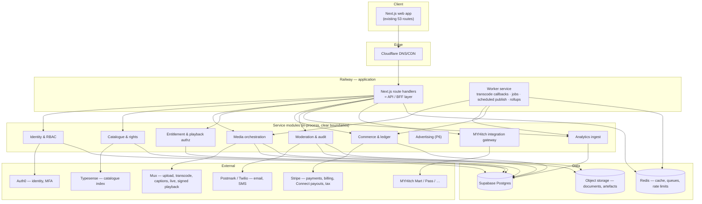

# MYHitch Nexus — Development Plan

Against `MYHitch_Nexus_Web_Development_Requirements.docx` v1.0 (July 2026).
Requirement-level detail lives in [SRS-TRACEABILITY.md](SRS-TRACEABILITY.md); this document is **how we build it, in what order, and how we prove it's done**.

Supersedes `PLAN-v1-prototype-derived.md`, which was written before the SRS existed by reverse-engineering the prototype. That plan was directionally right but under-scoped: it missed the MYHitch ecosystem integrations, the three administrative roles, the copyright workflow and the formal acceptance criteria.

---

## 0. Decisions log (§20)

Resolved 2026-09-14. Supersedes the recommendations table in SRS-TRACEABILITY.md §N where an actual decision has since been made.

| ID | Decision | Resolution |
|---|---|---|
| DEC-1 | Launch markets | Australia first, architected for multi-region |
| DEC-3 | MVP monetisation models | Free + pay-per-view + rental (per recommendation) |
| DEC-4 | Film protection / DRM | Signed URLs + visible watermark for MVP |
| DEC-5 | Live streaming timing | **In scope, as Phase 5 immediately after MVP** — not deferred indefinitely, not pulled into the MVP gate itself |
| DEC-6 | MYHitch identity | **Confirmed shared, and structure fixed 2026-09-14 to [docs/AUTH0_INTEGRATION_STANDARD.md](AUTH0_INTEGRATION_STANDARD.md)** — extracted from Pass's real, working code, mandatory for every MYHitch platform integrating Auth0. Nexus registers as a new Application inside the *existing* shared tenant (not a new one). Critically, this is **headless**: no Universal Login, no redirect, no `auth0.com` URL ever reaches the browser — our backend calls Auth0's Authentication API directly (Resource Owner Password Grant) and issues its own session, exactly as Pass does. `src/lib/server/auth0Client.ts` / `auth0Sync.ts` / `auth0Mfa.ts` are written and typecheck clean; `accounts.auth0_user_id` (renamed from `auth0_sub` to match the standard) is live in Postgres. Auth0 owns identity only; Nexus's role/org model (`account_roles`/`organizations`/`memberships`) stays entirely in our database. **One deliberate adaptation**: Pass mirrors a single `app_metadata.role` for its MFA-enforcement Action; Nexus has no single role (roles are additive per SRS §4), so we mirror a computed `app_metadata.mfa_required` boolean instead — see the header comment in `auth0Sync.ts`. **Social sign-in (FR-6.2.1) resolved 2026-09-14**: ROPG has no equivalent for a social provider, so `src/lib/server/socialIdentity.ts` verifies a Google/Apple ID token directly against that provider's own JWKS — no Auth0 involved, no redirect, popup-only on the frontend, same "no `auth0.com` ever reaches the browser" property the standard requires for the password path. It hands off to a new `findOrCreateAuth0UserForVerifiedEmail()` in `auth0Sync.ts`, which reuses the existing Auth0 user if one exists (covers signing up with a password then later using Google, or vice versa) or creates one with a strong password the person is never told — from that point it is the *identical* identity record, `mfa_required` mirroring, and session issuance as the password path. One flow, two front doors, nothing in the three core files changed. **Split by actual cost, not by convenience**: Google's OAuth client ID is free and self-serve (Google Cloud Console, minutes) — **not a blocker, ships in P1 alongside password auth**. Apple Sign-In requires an active Apple Developer Program membership (USD 99/year) just to generate the credentials — a real spend decision, not a coordination one — so **Apple sign-in specifically stays in the blocker list** below until that's approved; everything else in P1 proceeds without it. **Blocked on tenant access** — see §9. |
| DEC-7 | Payments/payouts | Stripe + Connect, AUD primary, monthly payouts, 30-day hold |
| DEC-8 | Moderation | Internal team, business hours, SLA'd queue |
| DEC-9 / DEC-14 | Data region | **Australia — done.** Supabase project recreated in Sydney (`ap-southeast-2`, ref `kdojrmscgtkfxuyaxnwv`); old Mumbai project deleted |
| DEC-10 | Applications | Web-only for MVP; native mobile/smart-TV stay §17 future scope |
| DEC-11 | Branding | Formalise the prototype's existing visual system as the design system |
| DEC-12 | Legal ownership | An external digital lawyer owns all policy/legal wording (privacy policy, terms, creator agreement, distribution terms, etc.) for the whole platform. **We build the mechanics only** — versioned documents, acceptance tracking, consent capture — and integrate the lawyer's actual text whenever it's supplied, without that blocking engineering progress. |
| **DEC-13** | MYHitch ecosystem APIs | **Resolved favourably.** Mart and Pass are built in-house by the same organisation, so this is a co-design exercise, not a dependency on an external vendor's documentation. We specify the contract each integration needs (Pass: ticket → entitlement mapping; Mart: product-link → purchase attribution) and their team builds to it. Still needs a named counterpart and a timeline slot before P4. |
| SEC-11 | Leaked Supabase credentials | **Resolved as a side effect of DEC-9/14** — the old project (and its leaked `service_role` key + DB password) was deleted outright rather than rotated, which is a stronger fix than rotation. New project uses Supabase's current key format (`sb_publishable_...` / `sb_secret_...`). |

One scope question was raised and then withdrawn: building the entire platform (through advertising and all ecosystem integrations) before any public launch, rather than an MVP-first release. **Confirmed: staying with MVP-first (§16)**, phased exactly as below.

---

## 1. The two facts that shape this plan

**1. The prototype is a specification, not a product.** 53 routes, 11 admin screens matching SRS §9 exactly, ~120 typed mock API functions, 10 of the 11 SRS §10 entities already modelled in TypeScript. 48 of the 69 functional requirements have a working interface. **Zero are functionally complete** — there is no backend, no persistence beyond a browser tab, no media, no payments, no access control.

**2. That makes this a backend and platform programme, not a build-from-scratch.** Most of the design and UX risk in §19's deliverables is already retired. The remaining risk sits in five places, all of which are currently at zero:

| Risk area | Why it's the hard part |
|---|---|
| Media pipeline | Resumable upload → transcode → captions → packaging → signed delivery. Nothing exists. |
| Entitlements & payments | AC-5 demands that failed payments never grant access. Needs idempotent, webhook-driven correctness. |
| Access control | SEC-1: today *any* logged-in user can open `/admin`. Authorisation must be rebuilt server-side from nothing. |
| Admin enforcement | The screens exist; the rules they claim to enforce (AC-3 publish gate, audit trail, copyright) do not. |
| MYHitch integrations | §16 requires one in MVP. Now a co-design exercise rather than an external dependency (DEC-13 resolved) — but still needs a named counterpart and a delivery slot on their side before P4. |

---

## 2. Delivery strategy: strangle the mock API

The prototype's `src/lib/mock-api/index.ts` is written as an explicit, typed service contract — its own header says the signatures *are* the contract. That gives us an unusually clean migration path:

```
Today:     UI → React Query hooks → mock-api function → in-memory store
Target:    UI → React Query hooks → api client function → /api route handler → service → Postgres
                                    └── same signature, same return type ──┘
```

We replace mock function bodies **one domain at a time** with real `fetch()` calls. The UI does not change. This means:

- Every phase ships something demonstrable on the real site, not behind a rewrite.
- The mock stays as the fallback for domains not yet migrated, so the app is never broken mid-programme.
- The ~120 function signatures become the first draft of the OpenAPI specification (DEL-4).

**Non-negotiable rule**: a domain is only "migrated" when its authorisation rules are enforced server-side. Moving data to the server while leaving permission checks in the browser would be worse than the mock.

---

## 3. Target architecture

Aligned to SRS §13, sized for a launch product rather than a hypothetical scale-out.



### Stack decisions

| Layer | Decision | Rationale |
|---|---|---|
| Web + API | **Next.js 15 (existing app) with route handlers as the BFF** | Reuses 53 built routes; one language; SSR satisfies §13's SEO requirement. Not microservices — module boundaries now, extraction later only if load demands it. |
| Workers | Separate Railway service, shared codebase | Transcode callbacks, scheduled publishing, report jobs, rollups must not compete with request traffic. |
| Database | **Supabase Postgres** — ✅ provisioned in Sydney (`ap-southeast-2`), catalogue schema live | Relational integrity is essential for entitlements, rights and ledger. Data residency resolved 2026-09-14 (DEC-9/14). |
| Identity | **Auth0** (client decision) — headless ROPG per [AUTH0_INTEGRATION_STANDARD.md](AUTH0_INTEGRATION_STANDARD.md), joining the existing shared MYHitch tenant, not a redirect-based flow | Own login UI, own session, own OTP/verification emails; Auth0 called server-side only for password checks and TOTP MFA (DEC-6/TPI-8). |
| Media | **Mux** — ✅ confirmed 2026-09-14 (was tentative), blocked only on account creation | Single vendor for both VOD and live (DEC-5 confirmed live in scope) beats juggling two vendors for a small team; Cloudflare Stream's better ecosystem fit (already a DNS customer) didn't outweigh Mux's stronger live product. Cost is the honest tradeoff — revisit at real volume. Abstracted behind our own media interface regardless, so it stays replaceable. |
| Payments | **Stripe** — Payments, Billing, Connect, Tax, Invoicing | Keeps card data out of scope (SEC-3), and Connect solves creator payouts (MON-10) without building a treasury. |
| Search | **Typesense** — ✅ provisioned 2026-09-14, self-hosted on Railway | Faceted search matching FR-6.1.3/6.1.4 exactly; cheaper and simpler to operate than Elasticsearch at this scale; self-hosting avoided a third vendor account. |
| Analytics | Postgres event tables + scheduled rollups → **ClickHouse when events exceed ~50M/month** | Avoids standing up a warehouse before there is data to warehouse. Trigger point documented so the migration is planned, not panicked. |
| Queues/cache | Redis (BullMQ) | Jobs, frequency caps, rate limits, live viewer counts. |
| Observability | Sentry + structured logs + uptime monitoring + Railway metrics | NFR-8, AC-10. |
| IaC | Railway IaC (`.railway/railway.ts` — current `railway.json` is deprecated from 2026-12-01) | NFR-10, DEL-5. |

### Repository structure

The repo is currently named `frontend` and will hold backend code. Restructure early, before it holds anything that hurts to move:

```
myhitch-nexus/
├── apps/web/          # Next.js app (current src/) — UI + route handlers
├── apps/worker/       # background jobs
├── packages/core/     # domain services, shared types, the mock→real seam
├── packages/db/       # schema, migrations, query layer
├── docs/              # this plan, traceability, API spec, runbooks
└── e2e/               # Playwright acceptance suites
```

---

## 4. Phase plan

Nine phases. **Phases 0–4 constitute the SRS §16 MVP**; the gate at the end of P4 is the §18 acceptance criteria, verified with evidence, not opinion.

### P0 — Foundations *(partly complete)*

| Done | Outstanding |
|---|---|
| ✅ Production hosting (Railway), custom domain + TLS (`myhitchnexus.com.au`) | Dev/test/staging environments (DEL-5) — only production exists |
| ✅ Supabase project + first migration (`accounts`, `profiles`, `organizations`, `memberships`, `account_roles`) | Repo restructure to monorepo layout |
| ✅ Migration runner (`npm run db:migrate`) | **Rotate the leaked Supabase service-role key and DB password (SEC-11)**, move secrets to a managed store |
| ✅ CI (typecheck, lint, build) | Auth0 tenant, Sentry, Redis, Typesense provisioning |
| | Confirm data region (DEC-9/DEC-14) **before real user data exists** |

**Exit gate**: four environments, secrets managed, monorepo in place, OpenAPI skeleton published.

### P1 — Identity, discovery and free playback

Delivers: FR-6.1.1–6.1.7, FR-6.2.1–6.2.4, FR-6.2.6, FR-6.4.1–6.4.4, FR-6.6.1, FR-6.6.3, SEC-1 (core), SEC-2, ROLE-1/2/11.

P1 splits cleanly into an identity half (blocked on Auth0 tenant access) and a discovery half (anonymous browsing, FR-6.1 — needs no login at all). Built the discovery half first while Auth0 was paused:

- ✅ **2026-09-14**: catalogue schema live (`supabase/migrations/20260914000003_catalogue.sql` — categories, videos, taxonomy joins, credits, tracks, rights, pricing, comments, ratings, watchlist, watch progress, follows; 20 tables total, RLS on all, verified against the real Sydney database).
- ✅ **2026-09-14**: `src/lib/server/db.ts` (pooled `pg` client) and `src/lib/server/catalogue.ts` (typed queries, response shapes matching `types.ts`/`openapi.yaml` field-for-field) — the first real service-layer code in the app.
- ✅ **2026-09-14**: first real API routes, all public/anonymous per FR-6.1 — `GET /api/videos`, `GET /api/videos/{id}`, `GET /api/categories`, `GET /api/channels/{id}`, `GET /api/channels/{id}/videos`. Smoke-tested against the running dev server (correct empty-state/404 behaviour pre-seed).
- ✅ **2026-09-14**: catalogue seeded from the prototype's real mock data (`scripts/seed-catalogue.mjs`, reusing the actual mock objects rather than hand-transcribing) — 10 channels, 15 categories, 40 videos and all their taxonomy/credits/tracks/rights/pricing rows, verified against the live database (zero orphans, zero videos missing rights/pricing).
- ✅ **2026-09-14**: `getCategories()` in `src/lib/mock-api/index.ts` is the **first mock-api function actually swapped to real data**, per the strangler-fig strategy in §2 — same signature, now calls `fetch('/api/categories/')` instead of the in-memory store. Chosen specifically because `Category`'s fields are at full parity with what the real table returns.
  - **First finding from actually wiring it up**: swapping the function alone proved nothing — `useCategories()` (the React Query hook wrapping it) turned out to be exported but called from **nowhere** in the existing app. Every category-consuming page (13 of them) imports the static mock array directly, bypassing the hook layer entirely — a pre-existing pattern, not something introduced today. Caught this by checking the browser's actual network requests rather than trusting the code change looked right.
  - Fixed the one genuinely viewer-facing case: `src/app/(public)/explore/page.tsx`'s category grid now calls `useCategories()` for real. This also required re-keying its icon lookup from the mock's fixed string ids (`cat_brand_film`, meaningless once Postgres generates real uuids) to `slug` (stable across mock and real data since the real rows were seeded from the same source). **Verified in an actual browser**: confirmed `GET /api/categories/` fires, and the 15 real categories render with correct per-category icons and real title counts (e.g. "Brand films — 3 titles", "Courses & lectures — 4 titles").
  - The other 12 direct-import call sites (`video/[id]`, `category/[slug]`, admin/studio/business config forms, `sitemap`) are **deliberately left alone** — several of those (upload wizard, campaign builder, admin settings) need the full static taxonomy for form dropdowns regardless of which categories currently have published content, which isn't the same requirement as "show real browse counts," and rewiring 12 files without individually checking each one's actual need isn't a rushed-Friday-night change.
  - `getVideo`/`getChannel`/`searchVideos` remained on mock at this point for a different, already-known reason: those types carry engagement counters (views/likes/ratings) and a couple of Channel fields (languages, links) that didn't exist in the real schema yet (by design — they're analytics-pipeline/SRS-§6.9 outputs). Superseded by the entry below once that gap was deliberately closed.
- ✅ **2026-09-14**: Typesense provisioned — self-hosted on Railway (service `typesense`, official Docker image, persistent volume at `/data`) rather than Typesense Cloud, avoiding a third vendor account for something easy to self-host. One real gotcha worth recording: the default 384-thread pool crash-looped the container ("Resource temporarily unavailable") until `TYPESENSE_THREAD_POOL_SIZE=8` was set — its naive CPU-based default doesn't account for container resource limits. `GET /api/videos` does the **full faceted search** from `docs/openapi.yaml` (content type, category, language, country, access model, age rating, duration range, release-year range, sort) via `src/lib/server/typesense.ts` + `scripts/index-catalogue.mjs` (one-way sync from Postgres, source of truth stays Postgres — the index is rebuilt from scratch on each run, hydrated back into full rows by id afterward so a stale reindex can only affect ranking, never wrong data). `sort=popular`/`sort=rating` are accepted but fall back to newest — no real view/rating data existed yet at this point (closed by the next entry).
- ✅ **2026-09-14**: `getVideo`, `getChannel`, `getChannels` and the public branch of `getChannelVideos` swapped to real Postgres data, and `searchVideos()` itself finally swapped (the route/Typesense/schema work above had all landed, but the mock-api export was still reading `store.videos` — caught by seeing a burst of old-format `/api/videos/vid_xxx/` requests fire after clicking a search result that should have come from the real index). Getting this fully working end-to-end, by clicking through the real UI rather than trusting isolated backend checks, surfaced and fixed a chain of real bugs, each shipped in the same commit:
  - `SearchResult.facets` is a required field `BrowseView` destructures directly (`data?.facets.languages` — the optional chain only guards `data`) — added Typesense `facet_by` (content type, language, country, access model) and response mapping to populate it for real.
  - `VideoCard` destructures `video.pricing`/`video.rights` unconditionally; `VideoSummary` only exposed a flat `accessModels` array. Folded full `pricing`/`rights` objects into `VideoSummary` via a shared `VIDEO_SUMMARY_COLUMNS`/`VIDEO_SUMMARY_JOINS` join now used by `getVideosByIds`, `getVideoById` and `getChannelVideos` (removing `getVideoById`'s own now-redundant separate pricing/rights queries).
  - `Poster` indexes `gradient[0]`/`gradient[1]` with no fallback. `posterGradient` had earlier been judged purely cosmetic and left out of the schema — wrong, it's load-bearing UI, not decoration. Added `videos.poster_gradient` and `organizations.banner_gradient`/`avatar_gradient` (migrations `20260914000006`/`20260914000007`), backfilled from the real mock dataset.
  - Added the engagement counters (views, unique viewers, likes, rating average/count, comment count, watch time, completion rate) and channel fields (languages, links, verification status, joined date, followers, total views) the mock data always had but Postgres didn't (migrations `20260914000004`/`20260914000005`), backfilled by the new `scripts/backfill-engagement-fields.mjs` (idempotent UPDATE-only, matched by slug/handle since real rows have fresh uuids).
  - Swapping `getVideo`/`getChannel` to only understand real uuids broke every homepage video link, since the home rails and vertical category pages are still 100% mock and link with the old `vid_xxx`/`ch_xxx` string ids — 320+ console errors, every homepage click showing "Video not found". Reverting the whole swap wasn't safe either, since search now legitimately returns real uuids the mock store can't resolve. Fix: `looksLikeRealId()`, a uuid-shape check in `mock-api/index.ts`, so `getVideo`/`getChannel`/`getChannelVideos` (public branch only — `includeUnpublished` callers like Studio/Business always stay on mock, since showing drafts needs an ownership check that doesn't exist yet) each dispatch to real or mock data based on the id's own shape. Deliberately temporary and clearly commented as such — remove the day every caller passes real ids.
  - Verified: `tsc --noEmit`, `next lint --max-warnings 0`, `next build` all clean; SQL spot-checks after every migration/backfill; and a fresh incognito-style browser tab confirming zero console errors and zero stray network requests across the homepage, explore/search, video detail (both a real-uuid and an old-mock-id video), and channel pages.
- ✅ **2026-09-14**: **Creators directory (FR-6.1.2)** — `/creators`, a `ChannelCard` grid over `listChannels()`/`GET /api/channels` (already real, previously had zero callers) with client-side search and a kind filter (Creator/Business/Film studio/etc.), plus a nav entry between Entertainment and Categories. Small and fully unblocked — the API existed, it just had no page.
- ✅ **2026-09-14**: **OpenGraph/JSON-LD metadata (FR-6.1.7)** — `generateMetadata` + a schema.org `VideoObject`/`Organization` JSON-LD block added to `video/[id]/page.tsx` and `channel/[id]/page.tsx`, resolving through whichever branch `looksLikeRealId` already routes to (real Postgres by uuid, mock in-memory by id/slug), deduped per-request via React's `cache()`. Previously every video/channel page shared the same generic title with no share preview or structured data.
  - **Found while wiring this up**: the live `sitemap.xml` had been pointing every URL at `http://localhost:3000` since the Railway migration — `NEXT_PUBLIC_SITE_URL` was never set there, and `sitemap.ts`'s own fallback was a stale GitHub Pages URL from before that migration. Confirmed by checking the actual live `/sitemap.xml` output, not assumed. Fixed properly rather than patched around: added `SITE_URL`/`absoluteUrl()` to `lib/utils.ts` as the one source of truth (root layout's `metadataBase`, `sitemap.ts`, and the new JSON-LD all read from it), fallback hardcoded to the real production domain instead of localhost so it fails safe, and set `NEXT_PUBLIC_SITE_URL` on Railway.
- ✅ **2026-09-15**: **Temporary local password sign-in**, replacing the `sessionStorage`-only mock so the rest of the app (watchlist/ratings/comments/RBAC) doesn't have to wait on Auth0 access (blocker #2 below). Deliberately built as one swappable seam rather than a parallel throwaway system: `src/lib/server/session.ts` (session issuance/lookup/revocation) and `rbac.ts` (role mapping, `account_roles` enforcement) are real, permanent infrastructure that does not change when Auth0 lands — only `src/lib/server/localPassword.ts` (scrypt hash + verify, in-memory login-attempt rate limiting) gets deleted and swapped for `auth0Sync.ts`'s `verifyAuth0Password()`/`createAuth0User()`, which were written to the same three-outcome result shape on purpose for exactly this swap.
  - New: `accounts.password_hash` (nullable — Auth0/social-only accounts never get one) and a `sessions` table storing only a token hash, never the raw bearer token (migration `20260915000001`); `POST /api/auth/register`, `POST /api/auth/login`, `POST /api/auth/logout`, `GET /api/auth/me`.
  - `mock-api/index.ts`'s `register()`/`login()`/`logout()`/`getCurrentUser()` now call these routes and overlay the real identity fields (id, email, name, roles) onto the still-mock `store.user` — household profiles, notification/privacy settings and parental controls have nowhere real to live yet and stay exactly as seeded.
  - Deliberately narrow scope, matching "a simple auth page for now": org-verification documents, MFA enrollment and mobile OTP in the registration wizard all stay the cosmetic mock UI they already were — those need P2's document storage, real Auth0 MFA, and an SMS provider respectively, none of which exist yet. This is an internal/testing front door, not a public sign-up path, and any account created this way has no Auth0 counterpart to migrate to automatically once that lands.
  - `login()`'s signature changed (now takes `{email, password, remember}`, not just an email string) since the mock version never actually checked a password — the one caller (`auth/login/page.tsx`) was already collecting one and silently discarding it. Both login and register now handle real failure (wrong password, duplicate email) with an actual error toast instead of always succeeding.
  - Verified: `tsc --noEmit`/lint/build clean; migration applied and columns/table confirmed directly; full browser click-through of register → auto-login → sign out (confirmed the session row is actually deleted, not just the cookie) → login with a wrong password (rejected with a real 401) → login with the right one (succeeds); the 8-attempt rate limiter confirmed to trip a 429 and block even the correct password until the window clears; test account cleaned up afterward.
- ✅ **2026-09-15**: **Real watchlist, ratings and comments** — the write paths the temporary sign-in above exists to unblock. `src/lib/server/engagement.ts` (toggle watchlist, upsert+recompute a rating, post/reply to a comment) plus `getWatchlistVideos()`/`videoExists()` in `catalogue.ts`; five new routes (`POST /api/videos/{id}/watchlist`, `GET /api/watchlist`, `GET`+`POST /api/videos/{id}/rating`, `GET`+`POST /api/videos/{id}/comments`, `POST /api/comments/{id}/replies`).
  - Real only: `watchlist_items`/`video_ratings`/`video_comments` all have a real foreign key into `videos(id)`, so a still-mock-shaped video (home rails/category pages) can't be written to any of these tables at all — `videoExists()` guards each write with a clean 404 instead of a raw FK-violation error. `toggleWatchlist`/`rateVideo`/`getMyRating`/`getComments`/`postComment`/`replyToComment` in `mock-api/index.ts` all branch on `looksLikeRealId`, same bridge as `getVideo`/`getChannel` — a mock video's engagement stays purely local exactly as before. `getWatchlist()` now merges both sources (an account's watchlist can genuinely span real and still-mock videos mid-migration).
  - Rating aggregates (`videos.rating_average`/`rating_count`) are recomputed from the real `video_ratings` rows on every write — the point those two columns stop being the seeded snapshot and start being live, for any video that gets a real rating. Comment author display (`accounts` has no avatar-gradient column, unlike videos/organizations) uses a new deterministic `pickGradient()` in `lib/utils.ts`, reusing the same palette already seeded on channel avatars.
  - **Found while verifying**: `VideoCard` resolved a video's channel purely via `channelById(video.channelId)` — a mock-only lookup — so a real (Postgres) video's card silently dropped its channel name/avatar entirely (not a crash, just missing, and true on the Explore/search page too, from the earlier searchVideos swap). Fixed by preferring the real `channelName` VideoSummary already carries when present.
  - Verified: `tsc`/lint/build clean; full browser click-through signed in as a real account — add a real video to the watchlist, rate it 4 stars (aggregate recomputed correctly), post a comment and a reply (correct real author name/handle/gradient, correctly nested on reload) — each confirmed directly against Postgres, not just the UI; the account/watchlist page rendering a real bookmark alongside mock ones in one grid, channel name included after the VideoCard fix; test account and its rows deleted afterward, and `scripts/backfill-engagement-fields.mjs` re-run (it's idempotent) to restore the one video's seeded rating stats the test perturbed.
- ✅ **2026-09-15**: **Real follows and watch progress** — the last two of the five write paths blocked on a real account. `toggleFollow`/`isFollowing` and `getWatchProgress`/`saveWatchProgress` added to `engagement.ts`, `getContinueWatchingVideos()`/`organizationExists()` added to `catalogue.ts` (same split as watchlist: video/channel-shaped reads in `catalogue.ts`, everything else in `engagement.ts`); three new routes (`GET`+`POST /api/channels/{id}/follow`, `GET`+`PUT /api/videos/{id}/progress`, `GET /api/continue-watching`).
  - Same real-only FK guard (`organizationExists()`) and `looksLikeRealId` mock/real split in `mock-api/index.ts` as every other engagement write path. `getContinueWatching()` merges real and mock sources the same way `getWatchlist()` does.
  - `organizations.followers` now recomputes live from `channel_follows` on every toggle — the same seeded-snapshot-to-live transition already applied to `videos.rating_average`/`rating_count`. `watch_progress` has no `duration_seconds` column of its own (a video's length is a property of the video, not of one account's progress through it) — read back by joining `videos.duration_seconds` at query time instead.
  - Verified: `tsc`/lint/build clean; full browser click-through signed in as a real account — followed then unfollowed a real channel via the video page's own button (Postgres confirmed 1→0 on both the join table and the recomputed `followers` column each time); saved watch progress on a real video and confirmed it appeared correctly, sorted first, on `/account/history`'s real "Continue watching" list (`5:00 of 12:06 · last watched 3 minutes ago`, matching what was saved) alongside the still-mock entries; test account and rows deleted afterward, backfill script re-run to restore the one channel's seeded follower count the test perturbed (same aftercare as the ratings test before it).
- Still to do: real Auth0 integration (the seam in the local-sign-in entry above is what makes that swap small when tenant access lands — blocker #2 below); the end-to-end test harness (`npm run test:e2e`) is still non-functional (see the finding at the bottom of §9); remove the `looksLikeRealId` bridge once the home rails and category pages migrate off the mock store — the last remaining item keeping any of P1's engagement/discovery work on two parallel data sources.

**Exit gate**: a real account signs in, browses a real catalogue, watches a real free video, and progress resumes on another device.

### P2 — Media pipeline and publishing workflow

Delivers: FR-6.3.1–6.3.8, FR-6.2.5, FR-6.6.2, SEC-4, DM-4/5/6, part of FR-6.10 (review queue).

- Resumable direct-to-storage upload; transcode ladder; auto thumbnails; caption ingest + auto-transcription; AD tracks.
- Content/rights/asset model split (DM-4 vs DM-5); **server-enforced publish gate** (AC-3) — incomplete metadata or missing rights cannot publish, including via direct API call.
- Publication state machine incl. scheduled publish; series/seasons/episodes.
- Moderation triggers (18+, content labels, paid promotion) routing to the review queue; comment hold rules.
- Organisation verification workflow with document upload.
- Upload scanning, format validation, sandboxed processing.

**Exit gate**: a creator publishes a real video end-to-end through review; an attempt to bypass the gate via API fails.

### P3 — Commerce, entitlements and protected playback

Delivers: MON-2/3/4, MON-7 (label), MON-10 (ledger), FR-6.4.5–6.4.7, FR-6.3.9, SEC-3, SEC-6, TPI-1/4/7, DM-7/8, UJ-1, UJ-3.

- Stripe Checkout for PPV, rental and purchase; webhook-driven, **idempotent** entitlement creation; receipts and invoices.
- Entitlement service as the single source of playback truth; playback authorisation evaluating entitlement + territory + release window + age rating + parental controls before minting a short-lived signed URL.
- Preview/trailer limits for unentitled viewers; session watermarking.
- Revenue ledger with configurable commission; creator earnings statements.
- Bulk import for distributors; KYC for payout recipients.

**Exit gate**: AC-5 evidence pack — declines, timeouts and duplicate webhooks produce correct ledger state and **never** grant access.

### P4 — Administration, reporting, first integration, hardening → **MVP GATE**

Delivers: FR-6.10.1–6.10.7, FR-6.6.4, FR-6.9.1–6.9.3, FR-6.9.5, FR-6.9.6, RPT-1/2/3/4/6/7/8, SEC-5, SEC-7–SEC-10, ROLE-8/9/10, INT-1 **or** INT-2, MON-10 payouts, NFR-1–NFR-10, all of §18.

- Wire the 11 existing admin screens to real services: review queues, moderation actions, user/org management, platform configuration, cases, audit log.
- Scoped admin roles (moderator / finance / super) with mandatory MFA and full audit.
- Copyright notice-and-action, counter-notice, repeat-infringer strikes (SEC-5) — legally significant and entirely absent today.
- Analytics pipeline and role-appropriate reports with privacy-safe thresholds; scheduled/downloadable reports.
- Stripe Connect payouts and reconciliation.
- **One MYHitch integration** (Pass or Mart per DEC-13) with conversion attribution.
- Hardening: pen test, WCAG 2.2 AA audit, load test, backup/restore drill, rollback drill, runbooks.

**Exit gate — the MVP acceptance gate**: AC-1 … AC-10 each signed off with named evidence (see §6 below). This is the point at which the SRS's MVP scope (§16) is objectively complete.

### P5 — Live streaming *(confirmed in scope — DEC-5)*

FR-6.5.1–6.5.6, INT-2 if not already delivered. Live ingest, access modes incl. ticketed, chat + moderation + polls, auto-record → replay, highlights, Pass ticket→entitlement.

### P6 — Advertising platform and full monetisation

FR-6.8.1–6.8.6, FR-6.4.8, FR-6.9.4, MON-1/5/6, RPT-5. Campaign lifecycle with mandatory admin approval, targeting, brand safety, frequency caps, VAST insertion, memberships and platform subscription, advertiser invoicing.

### P7 — Community depth, ecosystem and enterprise

FR-6.6 completion, INT-3/4/5/6, MON-9 (business hosting: private libraries, embedded players, enterprise analytics), TPI-9 partner APIs.

### P8 — SRS §17 future capabilities

AI transcription/translation/tagging/summarisation/recommendations, native mobile and smart-TV apps, advanced DRM and multi-territory release management, licensing marketplace, international currencies/taxes/languages/regional catalogues.

---

## 5. Indicative schedule and team

**Estimates are indicative until DEC-1…DEC-14 are answered** — §20 exists precisely because these change the numbers materially (DRM level, live streaming in/out of MVP, number of launch markets, and integration API readiness are each worth weeks).

Assumed team: 1 tech lead/architect · 2 full-stack engineers · 1 backend/media engineer · 0.5 QA + accessibility · 0.5 designer · 0.5 product/PM.

| Phase | Indicative duration | Cumulative |
|---|---|---|
| P0 Foundations | 2 weeks *(part done)* | 2 |
| P1 Identity & discovery | 4–5 weeks | 7 |
| P2 Media & publishing | 5–6 weeks | 13 |
| P3 Commerce & entitlements | 4–5 weeks | 18 |
| P4 Admin, reporting, integration, hardening | 5–6 weeks | **~24 weeks → MVP** |
| P5 Live streaming | 4 weeks | 28 |
| P6 Advertising & full monetisation | 7–8 weeks | 36 |
| P7 Community, ecosystem, enterprise | 7–8 weeks | 44 |
| P8 Future capabilities | ongoing | — |

**MVP ≈ 5–6 months** with that team. Compressing it means adding a second backend engineer to P2/P3 (media and commerce are the critical path and parallelise reasonably), not shortening hardening — P4's security, accessibility and operations work is where acceptance is won or lost.

---

## 6. How we guarantee nothing in the SRS is missed

The mechanism, not the intention:

1. **Every requirement has an ID.** 69 functional + 10 monetisation + 10 NFR + 10 security + 9 integrations + 8 reports + 11 entities + 11 roles + 4 journeys + 10 acceptance criteria + 11 deliverables, all enumerated in SRS-TRACEABILITY.md.
2. **Every backlog item and pull request cites its requirement ID.** An item with no ID is either out of scope or a missing requirement — both need a decision, not silent implementation.
3. **Phase exit requires every ID assigned to that phase to be verified**, with the verification method named in the matrix (test, report, drill or evidence artefact). Not "developer says done".
4. **The four §7 user journeys are automated end-to-end tests** (UJ-1…UJ-4) and run in CI. A journey that regresses fails the build.
5. **The MVP gate is an evidence pack, not a demo**: for AC-1…AC-10, one artefact each — test run, pen-test report, axe-core + manual accessibility audit, restore-drill log, rollback-drill log, ledger reconciliation, RBAC permission matrix results.
6. **A closing traceability review** before launch: walk the SRS section by section against the matrix, with the client, and record any deferral as an explicit, signed decision rather than an omission.

---

## 7. Testing and quality strategy

| Layer | Approach | Gate |
|---|---|---|
| Unit | Domain logic: entitlement resolution, commission maths, rights/territory evaluation, publish-gate rules | Coverage floor on `packages/core` |
| Integration | Route handlers against a real test database; Stripe and Mux in test mode with recorded webhooks | Runs on every PR |
| E2E | Playwright — the four SRS §7 journeys, desktop + mobile viewports (scaffold already exists) | Blocks merge |
| Authorisation | Explicit matrix test: every role × every protected endpoint, expecting deny-by-default | Blocks release (AC-6, AC-8) |
| Payments | Negative-path matrix: decline, timeout, duplicate webhook, partial refund, chargeback | Blocks release (AC-5) |
| Accessibility | axe-core in CI + manual audit + screen-reader walkthrough of UJ-1/UJ-2 | Blocks release (AC-9) |
| Performance | k6 load tests to NFR-1 targets; Lighthouse CI on catalogue pages | Blocks release (AC-4) |
| Security | SCA on every build; pen test before launch; secrets scanning | Blocks release (AC-8) |
| Operations | Restore drill and rollback drill, both documented | Blocks release (AC-10) |

---

## 8. Top risks

| Risk | Impact | Mitigation |
|---|---|---|
| **MYHitch integration slips on their side** | Pass/Mart are in-house, so DEC-13 is no longer "do they have an API" but "will their team deliver the contract on our timeline" | Name a counterpart on the Pass/Mart side now and put the integration contract + delivery slot in writing before P4 starts, not during it |
| **Media vendor cost at scale** | Transcode + egress can dominate unit economics once real volume arrives | Abstract behind our own media interface; model costs at projected volumes before committing; keep AWS path viable |
| **Entitlement correctness bugs** | Revenue loss or unpaid access; AC-5 failure | Idempotency keys, ledger reconciliation job, negative-path test matrix, no playback URL without a passed authorisation check |
| **Copyright workflow underestimated** | Legal exposure; SEC-5 is statutory in effect, not a feature | Scope it as a first-class P4 workstream; mechanics built by us, wording supplied by the digital lawyer (DEC-12) — don't let either block the other |
| **Prototype mistaken for a working system** | Timeline expectations set from a demo that has no backend | This document; demo the gap explicitly to stakeholders |
| **Scope creep from §17, or from P5–P7, into the MVP gate** | Slips the ~24-week MVP timeline that was explicitly confirmed | §17 is contractually future scope; P5 (live) starts only after the P4 acceptance gate closes, not in parallel with it |

---

## 9. Immediate next actions

**Resolved this session** (§0 decisions log): data residency, live streaming inclusion, MYHitch integration approach, legal ownership, credential exposure, MVP-first confirmed.

**Blockers — grouped for one meeting, per the client's preference (2026-09-14), rather than chased individually:**
1. **Mart/Pass integration** (DEC-13 follow-through) — name a counterpart on their side, agree the integration contract (ticket→entitlement for Pass, product-link→attribution for Mart) and a delivery slot before P4.
2. **Auth0 shared tenant access** (DEC-6 follow-through) — **paused 2026-09-14, resume 2026-09-15**: client has dashboard access to the shared tenant (`dev-o2y17tinf55ifhk3.us.auth0.com` — currently on an Auth0 trial the client confirmed will convert to paid before it lapses). The tenant already has two genericaly-named Applications — `MYHitch Backend (ROPG - Auth API)` and `MYHitch Backend (M2M - Management API)` — that look like they may be intended as *shared* credentials for platforms other than Pass (whose own registration is separately named `MyHitchPaaS`), rather than Nexus needing to create its own. **Currently being built out by another team member**, so Nexus's integration is holding until that lands rather than creating parallel/duplicate Applications. Still to confirm once resumed: whether those two Applications are in fact meant to be shared (check activity logs — real traffic implies already load-bearing for something) or whether Nexus should register its own pair alongside them regardless, per the security reasoning in this doc.
3. **Legal adviser contact** (DEC-12 follow-through) — a point of contact for the digital lawyer, so policy documents (privacy, terms, creator agreement, distribution terms) have somewhere to land when P4 needs the actual wording.
4. **Google OAuth client** (FR-6.2.1 follow-through) — **paused alongside #2**, same reason (holding for the teammate's shared-identity work rather than registering separately today). Corrected finding: this does **not** require a Gmail account specifically — any existing email works for the underlying Google Account, and the only real "verification" is proving domain ownership of `myhitchnexus.com.au` via Search Console, which is trivial given DNS is already on Cloudflare. Free either way.
5. **Apple Developer Program membership** (FR-6.2.1 follow-through) — USD 99/year, required just to generate Sign-in-with-Apple credentials. A genuine cost decision, not a coordination one.
6. **Mux account** (media/live vendor — **final call made 2026-09-14**, considered against Cloudflare Stream specifically on scale/cost/lock-in grounds, not just build speed; decided to proceed with Mux, see the architecture table above for the full reasoning) — needs a real account and eventually a payment method to get an Access Token ID + Secret Key. That's a client action, not an engineering one, so it joins this list rather than blocking anything tonight. Two mitigations are being treated as non-negotiable regardless of vendor, specifically because vendor lock-in is structural to *any* video platform choice, not a Mux-specific risk: (1) an abstraction interface so the app never calls Mux's SDK directly outside one module, and (2) archiving every original master upload in our own S3/R2 storage independent of Mux, which is what actually makes a future migration a bounded re-encode job rather than a from-scratch loss. Nothing in P2 (upload/transcode) or P5 (live) can start against the real vendor until the account exists; everything else keeps moving in the meantime.

**Engineering, startable now regardless of the blockers above:**
7. Stand up dev/test/staging environments (DEL-5) and restructure the repo to the monorepo layout — **deferred deliberately**: premature before a second service (e.g. a worker) actually exists to justify it; revisit at the start of whichever phase first needs one.
8. Provision Sentry, Redis — worth doing once there's a feature that needs them; Sentry specifically could go on the live site any time.
9. **Done (2026-09-14)**: generated the OpenAPI specification from the ~120 mock-api signatures (DEL-4), covering every entity in SRS-TRACEABILITY.md §G and grouped by the same IA sections as §D. Validated with `redocly lint` (0 errors); spot-checked against `types.ts` directly.
10. **Done**: the four Auth0/identity lib files (`auth0Client.ts`/`auth0Sync.ts`/`auth0Mfa.ts`/`socialIdentity.ts`) are written per the standard and typecheck clean; `accounts.auth0_user_id` is live. Remaining before blocker #2 lands: our own register/login/reset **routes** that call this layer, session issuance, rate limiting, the own-OTP verification flow, and the server-side RBAC authorization layer reading `account_roles` — all buildable and unit-testable against placeholder env vars now. Only the real end-to-end login (an actual Auth0 tenant to call) waits on tenant access.
11. **Done (2026-09-14)**: catalogue schema, seed data, first real API routes (`GET /api/videos`, `/api/videos/{id}`, `/api/categories`, `/api/channels/{id}`, `/api/channels/{id}/videos`), and the Explore page's category grid genuinely running off Postgres — see the P1 entry above for what was and wasn't swapped, and why.
12. **Done (2026-09-14)**: Typesense provisioned (self-hosted on Railway) and wired into `GET /api/videos` for full faceted search — see the P1 entry above.

**Found, not yet fixed** — `npm run test:e2e` is currently non-functional: `playwright.config.ts` still expects a static export (`scripts/serve-static.mjs` serving an `out/` directory), which stopped being produced when `output: "export"` was removed for the Railway migration. Tonight's Explore page change was verified manually in a real browser instead (network requests, screenshots, page text) rather than via this suite. Fixing the harness to run against `next start` like the real deployment does is its own task — worth doing before P2's upload/publish flows need real e2e coverage, not urgent tonight.
