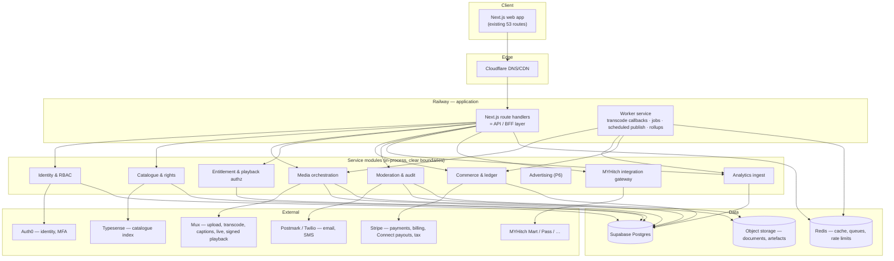

# MYHitch Nexus — Development Plan

Against `MYHitch_Nexus_Web_Development_Requirements.docx` v1.0 (July 2026).
Requirement-level detail lives in [SRS-TRACEABILITY.md](SRS-TRACEABILITY.md); this document is **how we build it, in what order, and how we prove it's done**.

Supersedes `PLAN-v1-prototype-derived.md`, which was written before the SRS existed by reverse-engineering the prototype. That plan was directionally right but under-scoped: it missed the MYHitch ecosystem integrations, the three administrative roles, the copyright workflow and the formal acceptance criteria.

---

## 0. Decisions log (§20)

Resolved 2026-09-14. Supersedes the recommendations table in SRS-TRACEABILITY.md §N where an actual decision has since been made.

| ID | Decision | Resolution |
|---|---|---|
| DEC-1 | Launch markets | Australia first, architected for multi-region |
| DEC-3 | MVP monetisation models | Free + pay-per-view + rental (per recommendation) |
| DEC-4 | Film protection / DRM | Signed URLs + visible watermark for MVP |
| DEC-5 | Live streaming timing | **In scope, as Phase 5 immediately after MVP** — not deferred indefinitely, not pulled into the MVP gate itself |
| DEC-6 | MYHitch identity | **Confirmed shared, and structure fixed 2026-09-14 to [docs/AUTH0_INTEGRATION_STANDARD.md](AUTH0_INTEGRATION_STANDARD.md)** — extracted from Pass's real, working code, mandatory for every MYHitch platform integrating Auth0. Nexus registers as a new Application inside the *existing* shared tenant (not a new one). Critically, this is **headless**: no Universal Login, no redirect, no `auth0.com` URL ever reaches the browser — our backend calls Auth0's Authentication API directly (Resource Owner Password Grant) and issues its own session, exactly as Pass does. `src/lib/server/auth0Client.ts` / `auth0Sync.ts` / `auth0Mfa.ts` are written and typecheck clean; `accounts.auth0_user_id` (renamed from `auth0_sub` to match the standard) is live in Postgres. Auth0 owns identity only; Nexus's role/org model (`account_roles`/`organizations`/`memberships`) stays entirely in our database. **One deliberate adaptation**: Pass mirrors a single `app_metadata.role` for its MFA-enforcement Action; Nexus has no single role (roles are additive per SRS §4), so we mirror a computed `app_metadata.mfa_required` boolean instead — see the header comment in `auth0Sync.ts`. **Social sign-in (FR-6.2.1) resolved 2026-09-14**: ROPG has no equivalent for a social provider, so `src/lib/server/socialIdentity.ts` verifies a Google/Apple ID token directly against that provider's own JWKS — no Auth0 involved, no redirect, popup-only on the frontend, same "no `auth0.com` ever reaches the browser" property the standard requires for the password path. It hands off to a new `findOrCreateAuth0UserForVerifiedEmail()` in `auth0Sync.ts`, which reuses the existing Auth0 user if one exists (covers signing up with a password then later using Google, or vice versa) or creates one with a strong password the person is never told — from that point it is the *identical* identity record, `mfa_required` mirroring, and session issuance as the password path. One flow, two front doors, nothing in the three core files changed. **Split by actual cost, not by convenience**: Google's OAuth client ID is free and self-serve (Google Cloud Console, minutes) — **not a blocker, ships in P1 alongside password auth**. Apple Sign-In requires an active Apple Developer Program membership (USD 99/year) just to generate the credentials — a real spend decision, not a coordination one — so **Apple sign-in specifically stays in the blocker list** below until that's approved; everything else in P1 proceeds without it. **Blocked on tenant access** — see §9. |
| DEC-7 | Payments/payouts | Stripe + Connect, AUD primary, monthly payouts, 30-day hold |
| DEC-8 | Moderation | Internal team, business hours, SLA'd queue |
| DEC-9 / DEC-14 | Data region | **Australia — done.** Supabase project recreated in Sydney (`ap-southeast-2`, ref `kdojrmscgtkfxuyaxnwv`); old Mumbai project deleted |
| DEC-10 | Applications | Web-only for MVP; native mobile/smart-TV stay §17 future scope |
| DEC-11 | Branding | Formalise the prototype's existing visual system as the design system |
| DEC-12 | Legal ownership | An external digital lawyer owns all policy/legal wording (privacy policy, terms, creator agreement, distribution terms, etc.) for the whole platform. **We build the mechanics only** — versioned documents, acceptance tracking, consent capture — and integrate the lawyer's actual text whenever it's supplied, without that blocking engineering progress. |
| **DEC-13** | MYHitch ecosystem APIs | **Resolved favourably.** Mart and Pass are built in-house by the same organisation, so this is a co-design exercise, not a dependency on an external vendor's documentation. We specify the contract each integration needs (Pass: ticket → entitlement mapping; Mart: product-link → purchase attribution) and their team builds to it. Still needs a named counterpart and a timeline slot before P4. |
| SEC-11 | Leaked Supabase credentials | **Resolved as a side effect of DEC-9/14** — the old project (and its leaked `service_role` key + DB password) was deleted outright rather than rotated, which is a stronger fix than rotation. New project uses Supabase's current key format (`sb_publishable_...` / `sb_secret_...`). |

One scope question was raised and then withdrawn: building the entire platform (through advertising and all ecosystem integrations) before any public launch, rather than an MVP-first release. **Confirmed: staying with MVP-first (§16)**, phased exactly as below.

---

## 1. The two facts that shape this plan

**1. The prototype is a specification, not a product.** 53 routes, 11 admin screens matching SRS §9 exactly, ~120 typed mock API functions, 10 of the 11 SRS §10 entities already modelled in TypeScript. 48 of the 69 functional requirements have a working interface. **Zero are functionally complete** — there is no backend, no persistence beyond a browser tab, no media, no payments, no access control.

**2. That makes this a backend and platform programme, not a build-from-scratch.** Most of the design and UX risk in §19's deliverables is already retired. The remaining risk sits in five places, all of which are currently at zero:

| Risk area | Why it's the hard part |
|---|---|
| Media pipeline | Resumable upload → transcode → captions → packaging → signed delivery. Nothing exists. |
| Entitlements & payments | AC-5 demands that failed payments never grant access. Needs idempotent, webhook-driven correctness. |
| Access control | SEC-1: today *any* logged-in user can open `/admin`. Authorisation must be rebuilt server-side from nothing. |
| Admin enforcement | The screens exist; the rules they claim to enforce (AC-3 publish gate, audit trail, copyright) do not. |
| MYHitch integrations | §16 requires one in MVP. Now a co-design exercise rather than an external dependency (DEC-13 resolved) — but still needs a named counterpart and a delivery slot on their side before P4. |

---

## 2. Delivery strategy: strangle the mock API

The prototype's `src/lib/mock-api/index.ts` is written as an explicit, typed service contract — its own header says the signatures *are* the contract. That gives us an unusually clean migration path:

```
Today:     UI → React Query hooks → mock-api function → in-memory store
Target:    UI → React Query hooks → api client function → /api route handler → service → Postgres
                                    └── same signature, same return type ──┘
```

We replace mock function bodies **one domain at a time** with real `fetch()` calls. The UI does not change. This means:

- Every phase ships something demonstrable on the real site, not behind a rewrite.
- The mock stays as the fallback for domains not yet migrated, so the app is never broken mid-programme.
- The ~120 function signatures become the first draft of the OpenAPI specification (DEL-4).

**Non-negotiable rule**: a domain is only "migrated" when its authorisation rules are enforced server-side. Moving data to the server while leaving permission checks in the browser would be worse than the mock.

---

## 3. Target architecture

Aligned to SRS §13, sized for a launch product rather than a hypothetical scale-out.



### Stack decisions

| Layer | Decision | Rationale |
|---|---|---|
| Web + API | **Next.js 15 (existing app) with route handlers as the BFF** | Reuses 53 built routes; one language; SSR satisfies §13's SEO requirement. Not microservices — module boundaries now, extraction later only if load demands it. |
| Workers | Separate Railway service, shared codebase | Transcode callbacks, scheduled publishing, report jobs, rollups must not compete with request traffic. |
| Database | **Supabase Postgres** — ✅ provisioned in Sydney (`ap-southeast-2`), catalogue schema live | Relational integrity is essential for entitlements, rights and ledger. Data residency resolved 2026-09-14 (DEC-9/14). |
| Identity | **Auth0** (client decision) — headless ROPG per [AUTH0_INTEGRATION_STANDARD.md](AUTH0_INTEGRATION_STANDARD.md), joining the existing shared MYHitch tenant, not a redirect-based flow | Own login UI, own session, own OTP/verification emails; Auth0 called server-side only for password checks and TOTP MFA (DEC-6/TPI-8). |
| Media | **Mux** — ✅ confirmed 2026-09-14 (was tentative), blocked only on account creation | Single vendor for both VOD and live (DEC-5 confirmed live in scope) beats juggling two vendors for a small team; Cloudflare Stream's better ecosystem fit (already a DNS customer) didn't outweigh Mux's stronger live product. Cost is the honest tradeoff — revisit at real volume. Abstracted behind our own media interface regardless, so it stays replaceable. |
| Payments | **Stripe** — Payments, Billing, Connect, Tax, Invoicing | Keeps card data out of scope (SEC-3), and Connect solves creator payouts (MON-10) without building a treasury. |
| Search | **Typesense** — ✅ provisioned 2026-09-14, self-hosted on Railway | Faceted search matching FR-6.1.3/6.1.4 exactly; cheaper and simpler to operate than Elasticsearch at this scale; self-hosting avoided a third vendor account. |
| Analytics | Postgres event tables + scheduled rollups → **ClickHouse when events exceed ~50M/month** | Avoids standing up a warehouse before there is data to warehouse. Trigger point documented so the migration is planned, not panicked. |
| Queues/cache | Redis — **✅ provisioned 2026-09-15** (Railway's own template, private networking only), currently backing the login rate limiter; BullMQ for jobs/queues still to come | Jobs, frequency caps, rate limits, live viewer counts. |
| Observability | **Sentry ✅ provisioned 2026-09-15** + structured logs + uptime monitoring + Railway metrics | NFR-8, AC-10. |
| IaC | Railway IaC (`.railway/railway.ts` — current `railway.json` is deprecated from 2026-12-01) | NFR-10, DEL-5. |

### Repository structure

The repo is currently named `frontend` and will hold backend code. Restructure early, before it holds anything that hurts to move:

```
myhitch-nexus/
├── apps/web/          # Next.js app (current src/) — UI + route handlers
├── apps/worker/       # background jobs
├── packages/core/     # domain services, shared types, the mock→real seam
├── packages/db/       # schema, migrations, query layer
├── docs/              # this plan, traceability, API spec, runbooks
└── e2e/               # Playwright acceptance suites
```

---

## 4. Phase plan

Nine phases. **Phases 0–4 constitute the SRS §16 MVP**; the gate at the end of P4 is the §18 acceptance criteria, verified with evidence, not opinion.

### P0 — Foundations *(partly complete)*

| Done | Outstanding |
|---|---|
| ✅ Production hosting (Railway), custom domain + TLS (`myhitchnexus.com.au`) | Dev/test/staging environments (DEL-5) — only production exists |
| ✅ Supabase project + first migration (`accounts`, `profiles`, `organizations`, `memberships`, `account_roles`) | Repo restructure to monorepo layout |
| ✅ Migration runner (`npm run db:migrate`) | **Rotate the leaked Supabase service-role key and DB password (SEC-11)**, move secrets to a managed store |
| ✅ CI (typecheck, lint, build) | Auth0 tenant, Sentry, Redis, Typesense provisioning |
| | Confirm data region (DEC-9/DEC-14) **before real user data exists** |

**Exit gate**: four environments, secrets managed, monorepo in place, OpenAPI skeleton published.

### P1 — Identity, discovery and free playback

Delivers: FR-6.1.1–6.1.7, FR-6.2.1–6.2.4, FR-6.2.6, FR-6.4.1–6.4.4, FR-6.6.1, FR-6.6.3, SEC-1 (core), SEC-2, ROLE-1/2/11.

P1 splits cleanly into an identity half (blocked on Auth0 tenant access) and a discovery half (anonymous browsing, FR-6.1 — needs no login at all). Built the discovery half first while Auth0 was paused:

- ✅ **2026-09-14**: catalogue schema live (`supabase/migrations/20260914000003_catalogue.sql` — categories, videos, taxonomy joins, credits, tracks, rights, pricing, comments, ratings, watchlist, watch progress, follows; 20 tables total, RLS on all, verified against the real Sydney database).
- ✅ **2026-09-14**: `src/lib/server/db.ts` (pooled `pg` client) and `src/lib/server/catalogue.ts` (typed queries, response shapes matching `types.ts`/`openapi.yaml` field-for-field) — the first real service-layer code in the app.
- ✅ **2026-09-14**: first real API routes, all public/anonymous per FR-6.1 — `GET /api/videos`, `GET /api/videos/{id}`, `GET /api/categories`, `GET /api/channels/{id}`, `GET /api/channels/{id}/videos`. Smoke-tested against the running dev server (correct empty-state/404 behaviour pre-seed).
- ✅ **2026-09-14**: catalogue seeded from the prototype's real mock data (`scripts/seed-catalogue.mjs`, reusing the actual mock objects rather than hand-transcribing) — 10 channels, 15 categories, 40 videos and all their taxonomy/credits/tracks/rights/pricing rows, verified against the live database (zero orphans, zero videos missing rights/pricing).
- ✅ **2026-09-14**: `getCategories()` in `src/lib/mock-api/index.ts` is the **first mock-api function actually swapped to real data**, per the strangler-fig strategy in §2 — same signature, now calls `fetch('/api/categories/')` instead of the in-memory store. Chosen specifically because `Category`'s fields are at full parity with what the real table returns.
  - **First finding from actually wiring it up**: swapping the function alone proved nothing — `useCategories()` (the React Query hook wrapping it) turned out to be exported but called from **nowhere** in the existing app. Every category-consuming page (13 of them) imports the static mock array directly, bypassing the hook layer entirely — a pre-existing pattern, not something introduced today. Caught this by checking the browser's actual network requests rather than trusting the code change looked right.
  - Fixed the one genuinely viewer-facing case: `src/app/(public)/explore/page.tsx`'s category grid now calls `useCategories()` for real. This also required re-keying its icon lookup from the mock's fixed string ids (`cat_brand_film`, meaningless once Postgres generates real uuids) to `slug` (stable across mock and real data since the real rows were seeded from the same source). **Verified in an actual browser**: confirmed `GET /api/categories/` fires, and the 15 real categories render with correct per-category icons and real title counts (e.g. "Brand films — 3 titles", "Courses & lectures — 4 titles").
  - The other 12 direct-import call sites (`video/[id]`, `category/[slug]`, admin/studio/business config forms, `sitemap`) are **deliberately left alone** — several of those (upload wizard, campaign builder, admin settings) need the full static taxonomy for form dropdowns regardless of which categories currently have published content, which isn't the same requirement as "show real browse counts," and rewiring 12 files without individually checking each one's actual need isn't a rushed-Friday-night change.
  - `getVideo`/`getChannel`/`searchVideos` remained on mock at this point for a different, already-known reason: those types carry engagement counters (views/likes/ratings) and a couple of Channel fields (languages, links) that didn't exist in the real schema yet (by design — they're analytics-pipeline/SRS-§6.9 outputs). Superseded by the entry below once that gap was deliberately closed.
- ✅ **2026-09-14**: Typesense provisioned — self-hosted on Railway (service `typesense`, official Docker image, persistent volume at `/data`) rather than Typesense Cloud, avoiding a third vendor account for something easy to self-host. One real gotcha worth recording: the default 384-thread pool crash-looped the container ("Resource temporarily unavailable") until `TYPESENSE_THREAD_POOL_SIZE=8` was set — its naive CPU-based default doesn't account for container resource limits. `GET /api/videos` does the **full faceted search** from `docs/openapi.yaml` (content type, category, language, country, access model, age rating, duration range, release-year range, sort) via `src/lib/server/typesense.ts` + `scripts/index-catalogue.mjs` (one-way sync from Postgres, source of truth stays Postgres — the index is rebuilt from scratch on each run, hydrated back into full rows by id afterward so a stale reindex can only affect ranking, never wrong data). `sort=popular`/`sort=rating` are accepted but fall back to newest — no real view/rating data existed yet at this point (closed by the next entry).
- ✅ **2026-09-14**: `getVideo`, `getChannel`, `getChannels` and the public branch of `getChannelVideos` swapped to real Postgres data, and `searchVideos()` itself finally swapped (the route/Typesense/schema work above had all landed, but the mock-api export was still reading `store.videos` — caught by seeing a burst of old-format `/api/videos/vid_xxx/` requests fire after clicking a search result that should have come from the real index). Getting this fully working end-to-end, by clicking through the real UI rather than trusting isolated backend checks, surfaced and fixed a chain of real bugs, each shipped in the same commit:
  - `SearchResult.facets` is a required field `BrowseView` destructures directly (`data?.facets.languages` — the optional chain only guards `data`) — added Typesense `facet_by` (content type, language, country, access model) and response mapping to populate it for real.
  - `VideoCard` destructures `video.pricing`/`video.rights` unconditionally; `VideoSummary` only exposed a flat `accessModels` array. Folded full `pricing`/`rights` objects into `VideoSummary` via a shared `VIDEO_SUMMARY_COLUMNS`/`VIDEO_SUMMARY_JOINS` join now used by `getVideosByIds`, `getVideoById` and `getChannelVideos` (removing `getVideoById`'s own now-redundant separate pricing/rights queries).
  - `Poster` indexes `gradient[0]`/`gradient[1]` with no fallback. `posterGradient` had earlier been judged purely cosmetic and left out of the schema — wrong, it's load-bearing UI, not decoration. Added `videos.poster_gradient` and `organizations.banner_gradient`/`avatar_gradient` (migrations `20260914000006`/`20260914000007`), backfilled from the real mock dataset.
  - Added the engagement counters (views, unique viewers, likes, rating average/count, comment count, watch time, completion rate) and channel fields (languages, links, verification status, joined date, followers, total views) the mock data always had but Postgres didn't (migrations `20260914000004`/`20260914000005`), backfilled by the new `scripts/backfill-engagement-fields.mjs` (idempotent UPDATE-only, matched by slug/handle since real rows have fresh uuids).
  - Swapping `getVideo`/`getChannel` to only understand real uuids broke every homepage video link, since the home rails and vertical category pages are still 100% mock and link with the old `vid_xxx`/`ch_xxx` string ids — 320+ console errors, every homepage click showing "Video not found". Reverting the whole swap wasn't safe either, since search now legitimately returns real uuids the mock store can't resolve. Fix: `looksLikeRealId()`, a uuid-shape check in `mock-api/index.ts`, so `getVideo`/`getChannel`/`getChannelVideos` (public branch only — `includeUnpublished` callers like Studio/Business always stay on mock, since showing drafts needs an ownership check that doesn't exist yet) each dispatch to real or mock data based on the id's own shape. Deliberately temporary and clearly commented as such — remove the day every caller passes real ids.
  - Verified: `tsc --noEmit`, `next lint --max-warnings 0`, `next build` all clean; SQL spot-checks after every migration/backfill; and a fresh incognito-style browser tab confirming zero console errors and zero stray network requests across the homepage, explore/search, video detail (both a real-uuid and an old-mock-id video), and channel pages.
- ✅ **2026-09-14**: **Creators directory (FR-6.1.2)** — `/creators`, a `ChannelCard` grid over `listChannels()`/`GET /api/channels` (already real, previously had zero callers) with client-side search and a kind filter (Creator/Business/Film studio/etc.), plus a nav entry between Entertainment and Categories. Small and fully unblocked — the API existed, it just had no page.
- ✅ **2026-09-14**: **OpenGraph/JSON-LD metadata (FR-6.1.7)** — `generateMetadata` + a schema.org `VideoObject`/`Organization` JSON-LD block added to `video/[id]/page.tsx` and `channel/[id]/page.tsx`, resolving through whichever branch `looksLikeRealId` already routes to (real Postgres by uuid, mock in-memory by id/slug), deduped per-request via React's `cache()`. Previously every video/channel page shared the same generic title with no share preview or structured data.
  - **Found while wiring this up**: the live `sitemap.xml` had been pointing every URL at `http://localhost:3000` since the Railway migration — `NEXT_PUBLIC_SITE_URL` was never set there, and `sitemap.ts`'s own fallback was a stale GitHub Pages URL from before that migration. Confirmed by checking the actual live `/sitemap.xml` output, not assumed. Fixed properly rather than patched around: added `SITE_URL`/`absoluteUrl()` to `lib/utils.ts` as the one source of truth (root layout's `metadataBase`, `sitemap.ts`, and the new JSON-LD all read from it), fallback hardcoded to the real production domain instead of localhost so it fails safe, and set `NEXT_PUBLIC_SITE_URL` on Railway.
- ✅ **2026-09-15**: **Temporary local password sign-in**, replacing the `sessionStorage`-only mock so the rest of the app (watchlist/ratings/comments/RBAC) doesn't have to wait on Auth0 access (blocker #2 below). Deliberately built as one swappable seam rather than a parallel throwaway system: `src/lib/server/session.ts` (session issuance/lookup/revocation) and `rbac.ts` (role mapping, `account_roles` enforcement) are real, permanent infrastructure that does not change when Auth0 lands — only `src/lib/server/localPassword.ts` (scrypt hash + verify, in-memory login-attempt rate limiting) gets deleted and swapped for `auth0Sync.ts`'s `verifyAuth0Password()`/`createAuth0User()`, which were written to the same three-outcome result shape on purpose for exactly this swap.
  - New: `accounts.password_hash` (nullable — Auth0/social-only accounts never get one) and a `sessions` table storing only a token hash, never the raw bearer token (migration `20260915000001`); `POST /api/auth/register`, `POST /api/auth/login`, `POST /api/auth/logout`, `GET /api/auth/me`.
  - `mock-api/index.ts`'s `register()`/`login()`/`logout()`/`getCurrentUser()` now call these routes and overlay the real identity fields (id, email, name, roles) onto the still-mock `store.user` — household profiles, notification/privacy settings and parental controls have nowhere real to live yet and stay exactly as seeded.
  - Deliberately narrow scope, matching "a simple auth page for now": org-verification documents, MFA enrollment and mobile OTP in the registration wizard all stay the cosmetic mock UI they already were — those need P2's document storage, real Auth0 MFA, and an SMS provider respectively, none of which exist yet. This is an internal/testing front door, not a public sign-up path, and any account created this way has no Auth0 counterpart to migrate to automatically once that lands.
  - `login()`'s signature changed (now takes `{email, password, remember}`, not just an email string) since the mock version never actually checked a password — the one caller (`auth/login/page.tsx`) was already collecting one and silently discarding it. Both login and register now handle real failure (wrong password, duplicate email) with an actual error toast instead of always succeeding.
  - Verified: `tsc --noEmit`/lint/build clean; migration applied and columns/table confirmed directly; full browser click-through of register → auto-login → sign out (confirmed the session row is actually deleted, not just the cookie) → login with a wrong password (rejected with a real 401) → login with the right one (succeeds); the 8-attempt rate limiter confirmed to trip a 429 and block even the correct password until the window clears; test account cleaned up afterward.
- ✅ **2026-09-15**: **Real watchlist, ratings and comments** — the write paths the temporary sign-in above exists to unblock. `src/lib/server/engagement.ts` (toggle watchlist, upsert+recompute a rating, post/reply to a comment) plus `getWatchlistVideos()`/`videoExists()` in `catalogue.ts`; five new routes (`POST /api/videos/{id}/watchlist`, `GET /api/watchlist`, `GET`+`POST /api/videos/{id}/rating`, `GET`+`POST /api/videos/{id}/comments`, `POST /api/comments/{id}/replies`).
  - Real only: `watchlist_items`/`video_ratings`/`video_comments` all have a real foreign key into `videos(id)`, so a still-mock-shaped video (home rails/category pages) can't be written to any of these tables at all — `videoExists()` guards each write with a clean 404 instead of a raw FK-violation error. `toggleWatchlist`/`rateVideo`/`getMyRating`/`getComments`/`postComment`/`replyToComment` in `mock-api/index.ts` all branch on `looksLikeRealId`, same bridge as `getVideo`/`getChannel` — a mock video's engagement stays purely local exactly as before. `getWatchlist()` now merges both sources (an account's watchlist can genuinely span real and still-mock videos mid-migration).
  - Rating aggregates (`videos.rating_average`/`rating_count`) are recomputed from the real `video_ratings` rows on every write — the point those two columns stop being the seeded snapshot and start being live, for any video that gets a real rating. Comment author display (`accounts` has no avatar-gradient column, unlike videos/organizations) uses a new deterministic `pickGradient()` in `lib/utils.ts`, reusing the same palette already seeded on channel avatars.
  - **Found while verifying**: `VideoCard` resolved a video's channel purely via `channelById(video.channelId)` — a mock-only lookup — so a real (Postgres) video's card silently dropped its channel name/avatar entirely (not a crash, just missing, and true on the Explore/search page too, from the earlier searchVideos swap). Fixed by preferring the real `channelName` VideoSummary already carries when present.
  - Verified: `tsc`/lint/build clean; full browser click-through signed in as a real account — add a real video to the watchlist, rate it 4 stars (aggregate recomputed correctly), post a comment and a reply (correct real author name/handle/gradient, correctly nested on reload) — each confirmed directly against Postgres, not just the UI; the account/watchlist page rendering a real bookmark alongside mock ones in one grid, channel name included after the VideoCard fix; test account and its rows deleted afterward, and `scripts/backfill-engagement-fields.mjs` re-run (it's idempotent) to restore the one video's seeded rating stats the test perturbed.
- ✅ **2026-09-15**: **Real follows and watch progress** — the last two of the five write paths blocked on a real account. `toggleFollow`/`isFollowing` and `getWatchProgress`/`saveWatchProgress` added to `engagement.ts`, `getContinueWatchingVideos()`/`organizationExists()` added to `catalogue.ts` (same split as watchlist: video/channel-shaped reads in `catalogue.ts`, everything else in `engagement.ts`); three new routes (`GET`+`POST /api/channels/{id}/follow`, `GET`+`PUT /api/videos/{id}/progress`, `GET /api/continue-watching`).
  - Same real-only FK guard (`organizationExists()`) and `looksLikeRealId` mock/real split in `mock-api/index.ts` as every other engagement write path. `getContinueWatching()` merges real and mock sources the same way `getWatchlist()` does.
  - `organizations.followers` now recomputes live from `channel_follows` on every toggle — the same seeded-snapshot-to-live transition already applied to `videos.rating_average`/`rating_count`. `watch_progress` has no `duration_seconds` column of its own (a video's length is a property of the video, not of one account's progress through it) — read back by joining `videos.duration_seconds` at query time instead.
  - Verified: `tsc`/lint/build clean; full browser click-through signed in as a real account — followed then unfollowed a real channel via the video page's own button (Postgres confirmed 1→0 on both the join table and the recomputed `followers` column each time); saved watch progress on a real video and confirmed it appeared correctly, sorted first, on `/account/history`'s real "Continue watching" list (`5:00 of 12:06 · last watched 3 minutes ago`, matching what was saved) alongside the still-mock entries; test account and rows deleted afterward, backfill script re-run to restore the one channel's seeded follower count the test perturbed (same aftercare as the ratings test before it).
- **Correction (2026-09-15)**: earlier entries in this log said "the home rails and category pages" are still mock, as one boundary — that's no longer accurate and was already stale when written. `/explore`, `/search`, `/films`, `/commercial`, `/education`, `/news`, `/entertainment` and `/category/{slug}` all render through `BrowseView`, which has been real since the `searchVideos()` swap — confirmed by finally getting the e2e suite running (see below) and checking each page's own source directly rather than continuing to repeat the old boundary from memory. Only the true homepage (`/`, its own hand-built rails) and `/live` (the live events hub — a distinct, still-entirely-mock feature area, since live streaming is P5 scope) remain on the mock store for browsing. Individual video/channel pages still need `looksLikeRealId` regardless, since links from the homepage's rails still carry old mock-shaped ids.
- ✅ **2026-09-15**: **Real server-side role enforcement, closing SEC-1** ("today any logged-in user can open `/admin`"). `/admin`, `/studio` and `/business` were gated only by `AuthGuard`, a client component checking "is anyone logged in" — never which roles. Each `layout.tsx` is now an async Server Component that calls the new `requireRole()` in `rbac.ts` (reads the session cookie via `next/headers`, resolves the account, redirects to `/auth/login` if signed out or `/` if signed in but missing the role) *before* anything protected renders or ships to the browser — real enforcement, not a client-side UX nicety. Admin requires `admin`; Studio requires `creator`; Business requires `business` or `advertiser` (they share one workspace, matching the registration wizard). Each layout's existing UI (nav, badges, data hooks) moved unchanged into a sibling `*-shell.tsx` client component the server layout renders once the check passes. The demo account (`scripts/seed-demo-account.mjs`) now holds every one of these roles, matching what it could reach before enforcement existed — a real registered account only gets the role(s) it actually chose at signup.
  - **Found a genuine Next.js 15.5.25 bug while verifying this**: `redirect()` called from these new async layouts was silently falling through to the app's `not-found.tsx` with an HTTP 200 instead of performing the redirect — reproduced down to a two-line repro page with no app logic at all. Root cause: the app's root `src/app/loading.tsx` wraps *every* route (including admin/studio/business) in an implicit Suspense boundary, and that combination with a nested-layout `redirect()` is what triggers the bug — confirmed by watching the failure disappear the moment the file was removed. Fixed by moving `loading.tsx` to `src/app/(public)/loading.tsx`, scoping that Suspense boundary to the public catalogue/marketing pages that actually want it and away from admin/studio/business, which need working redirects more than that loading flash.
  - Verified: `tsc`/lint/build clean (admin/studio/business now correctly build as dynamic `ƒ` routes, not static); full suite (44 tests) passes via `npm run test:e2e`; manually confirmed against a real production build (`next start`) — a signed-out request to `/admin` gets a real 307 to `/auth/login`, a plain-`viewer`-role account gets a real 307 to `/` from all three sections, and the demo account (all roles) still gets into all three; test accounts cleaned up afterward.
- ✅ **2026-09-15**: **Sentry provisioning** (NFR-8/AC-10 observability). The one blocker here was the account signup itself — not something to create on the client's behalf — resolved once the client created a free Sentry project and handed over its DSN. `@sentry/nextjs` added; `src/instrumentation.ts` (Node/Edge init via Next's instrumentation hook, plus `onRequestError` for Server Component/route-handler errors) and `src/instrumentation-client.ts` (browser init) follow the SDK's current App Router convention exactly, not the older `sentry.client.config.ts` pattern. `next.config.ts` wrapped with `withSentryConfig`. Both `error.tsx` (route-level boundary) and `global-error.tsx` (root-layout boundary) now call `Sentry.captureException()` — `error.tsx` previously said outright "there is no telemetry service in this build, so the console is the honest destination"; that's no longer true. DSN lives in `NEXT_PUBLIC_SENTRY_DSN` (Railway + `.env.local`) — safe to expose client-side, a DSN only permits sending events, not reading or managing the account. No `SENTRY_AUTH_TOKEN` configured, so source-map upload is skipped for now (stack traces show minified code in the Sentry UI until one is added — error capture itself is unaffected; a later enhancement, not a gap in coverage).
  - Verified: `tsc`/lint/build clean; confirmed the SDK actually intercepts errors in a real (`next start`) production build, not just dev, by throwing a real uncaught error in the browser and confirming Sentry's global handler marked it captured; independently confirmed the DSN itself is live and the project accepts events by posting a minimal event envelope directly to Sentry's ingest API via curl (200 OK, real event id returned) — verification that doesn't depend on being able to see the outbound request in this session's own browser tooling, which doesn't reliably surface Sentry's transport calls.
- ✅ **2026-09-15**: **Real channel provisioning at registration**, closing the last gap that made a freshly registered creator/business/etc. account only reach a *real* identity/session while its channel stayed the hardcoded mock `ch_mara` — anything reading `store.user.channelId` (publishing a draft, the "is this my video" entitlement check) silently attributed real accounts' actions to Mara's seeded mock channel. `src/lib/server/channelProvisioning.ts`'s `provisionChannelForRole()` now creates a real `organizations` row + owner `memberships` row for any role that implies one (creator, business, advertiser, producer, education, organisation — not viewer/admin), called from `POST /api/auth/register` right after the `account_roles` insert. `getSessionAccount()` (`session.ts`) now also resolves the account's channel id from `memberships` and returns it on `SessionAccount`; `GET /api/auth/me` passes it through; `applyRealAccount()` in `mock-api/index.ts` sets `store.user.channelId` from it when present.
  - **Found while scoping this — a real, pre-existing latent bug**: `rbac.ts`'s `MOCK_TO_DB_ROLE` map (and its header comment) claimed `account_roles.role` used the SRS §4 spelling (`education_provider`, `government_nonprofit`), but migration `20260914000002` (one day before the local-password-auth work that first exercised this map) had already realigned that check constraint to the mock `UserRole` spelling instead (`education`, `organisation`) — both tables were still empty at the time, so it was a plain constraint swap, not a data migration, and nothing before this feature ever actually inserted an `education` or `organisation` role to catch the mismatch. `toDbRole()` would have inserted a value violating the live constraint, 500-ing registration for exactly those two roles. Fixed the map (now an identity map, kept explicit rather than collapsed to a passthrough so a future re-divergence is a one-line diff) and the matching `ROLES_REQUIRING_VERIFICATION` set in the register route. Caught by registering a real `education`-role test account before assuming the mapping was correct, not by reading the code alone.
  - `organizations.type` had the same kind of drift in the other direction: 20260914000002 aligned it to the *mock* `ChannelKind` enum (`creator`/`business`/`film-studio`/`education`/`government`/`nonprofit`/`news`), which has no `advertiser` or `producer` value even though `account_roles.role` has always had both as distinct roles. New migration `20260915000002` extends the constraint to add them rather than folding either into an existing type. The one remaining ambiguity is deliberate and documented in code: `organisation` (one combined role) maps to `nonprofit` (one of two org types) by default, since the role doesn't distinguish government from non-profit — an admin can move a specific org to `government` from `/admin/organisations` if that default is wrong for a given registrant.
  - A channel's `banner_gradient`/`avatar_gradient` (not-null columns with no default, unlike `languages`/`links`/`followers`) are generated at creation time via the existing `pickGradient()` in `lib/utils.ts`, keyed on the account id — same deterministic-palette approach already used for comment author avatars, not a new mechanism. `handle` is left null (no organisation-name field exists at registration to derive one from, and Studio/Business resolve "my channel" via the session's `channelId`, not a typed handle) and `business_email` is set to the account's own registration email.
  - Verified: `tsc`/lint/build clean; migration applied and the extended constraint confirmed directly; registered real test accounts for `creator`, `education` and `viewer` — `GET /api/auth/me` returned a real `channelId` uuid for the first two and `null` for the third; confirmed each channel's row in Postgres (`type`, `country`, `business_email`, distinct gradients, `joined_at`) and that it resolves through the existing `GET /api/channels/{id}` route; full suite (44 tests) still passes; signed in to Creator Studio as the real test creator account and confirmed RBAC still let it through post-fix; test accounts and their now-orphaned `organizations` rows deleted afterward (memberships cascade from the account, but an organisation row itself doesn't cascade from its owner's deletion, so it needed a separate cleanup query — worth remembering for any future manual test of this path).
- ✅ **2026-09-15**: **Real channel settings writes**, the direct follow-on to channel provisioning above — and, it turned out, a regression fix for a bug that entry itself introduced. `src/lib/server/channelSettings.ts` (`isChannelMember()`, `updateOrganization()`) plus a new `PATCH /api/channels/{id}` (same route file as the existing public `GET`), restricted to accounts with a membership on that organization; `mock-api/index.ts`'s `updateChannel()` now branches on `looksLikeRealId` like every other engagement/channel function.
  - **Found while wiring this up — a real regression from the channel-provisioning entry above, same day**: `updateChannel()` was 100% mock (`store.channels.find(...)`, throws `Channel not found` for anything it doesn't recognise) — harmless before, since every real account's `channelId` fell back to `ch_mara` and so always matched a real mock entry. The moment real accounts started getting real `channelId`s, Studio's Channel Settings page's "Change banner"/"Change avatar" buttons — the only two controls that actually called `updateChannel` before this fix — started throwing for every one of them. Not caught by the earlier entry's own testing because that round only exercised registration and `GET /api/auth/me`, never opened Channel Settings itself. Fixed as part of this same piece of work rather than filed separately, since the fix is this feature.
  - Also found, in the same page, while wiring the real write path: the **"Save changes" button never actually saved anything** — for the mock channel too, not just real ones. It called nothing but `toast({ title: "Channel settings saved" })`; only the avatar/banner pickers were ever wired to `updateChannel.mutate`. So the name/handle/tagline/about/contact-email/languages/country fields were pure local state with a lying success toast, for the entire lifetime of this page. Fixed by having Save actually call `updateChannel.mutate` with those seven fields; "Reset" (previously also a no-op button) now restores them from the last-fetched channel.
  - Deliberately excludes `avatarUrl`/`bannerUrl` from the real write path: they're a browser-local `blob:` URL from `URL.createObjectURL()` with nowhere real to persist to until P2's media pipeline/file storage exists — writing one into `organizations.avatar_url`/`banner_url` would silently break the image for every other viewer and for the same viewer after reload. Rather than let the buttons silently no-op (200 back, nothing visibly changes, no explanation), the settings page now hides "Change banner"/"Change avatar" entirely for a real channel and shows a one-line note instead; the mock `ch_mara`-style channel keeps them exactly as before.
  - Membership, not `org_role`, is the authorization bar for now (`isChannelMember()`) — every organization created by registration has exactly one member, so owner/editor/analyst isn't worth distinguishing yet; revisit once inviting a teammate to a channel is built and an analyst shouldn't be able to rebrand it.
  - `handle` gets real validation for the first time (`^[a-z0-9][a-z0-9_-]{1,31}$`, checked for uniqueness against `organizations.handle`'s existing unique constraint before the update runs, not caught as a 23505 after) — 400 for a malformed handle, 409 for one already taken.
  - **Also found while testing**: the settings page's own Country `<select>` only offered 8 of the auth/register page's 12 country codes (missing Spain, Canada, India, Netherlands) — invisible before since every seeded mock channel happened to use one of the 8, but a real account can genuinely register from any of the 12. Expanded the list to match register's exactly, rather than inventing a third, broader list; the two pages already maintain separate hardcoded lists (7 files across the app do), which is a pre-existing pattern worth a dedicated shared-constant cleanup pass on its own, not folded into this one.
  - Verified: `tsc`/lint/build clean; full suite (44 tests) still passes; curl-verified 401 (signed out), 403 (a different, unrelated account), 400 (single-char and punctuated handles), 409 (a handle colliding with a seeded channel), and a clean 200 with every field round-tripped correctly for the real owner; full browser click-through signed in as a real test creator — Channel Settings loaded the real name/handle/tagline/about/country/languages saved via the curl round earlier, avatar/banner controls correctly replaced by the explanatory note, edited the tagline through the actual form and clicked Save, got the real success toast, confirmed directly in Postgres, then reloaded the page cold and confirmed it came back from the server rather than client cache; test accounts and the now-orphaned `organizations` row deleted afterward, backfill script re-run.
- ✅ **2026-09-15**: **Real account settings writes** — same bug class as channel settings above, found by checking the sibling case rather than waiting for it to surface: `updateUser()` (`/account/profile`'s "Save changes") was 100% mock (`Object.assign(store.user, patch)`, no lookup, so it never even threw) — meaning a real signed-in account editing their name/email/handle/country/language got a fake success and the change silently vanished on the next reload, since `getCurrentUser()` re-fetches `GET /api/auth/me` and overwrites `store.user` from the real row again. Unlike the channel-settings regression, this one predates and is independent of the channel-provisioning work — it's been live since local password auth first shipped, and hits every real account, not just creator/business/etc. roles.
  - New `src/lib/server/accountSettings.ts` (`updateAccount()`) plus `PATCH /api/auth/me` (same route file as the existing `GET`) — same shape as channel settings: only the account's own five real-schema fields (name/email/handle/country/language), email and handle each format-validated and uniqueness-checked against `accounts` before the update runs (400/409, not a caught constraint violation). `updateUser()` in `mock-api/index.ts` now applies the patch locally as before (privacy/notifications/parental-controls/profiles/etc. still have nowhere real to live) and additionally syncs the five real fields to Postgres when `store.user.id` is real, reconciling with the server's response afterward via `applyRealAccount()`.
  - Same `avatarUrl` exclusion as channel settings, same reason: a `blob:` URL from `URL.createObjectURL()` has nowhere real to persist to yet, so "Change" is hidden for a real account with an explanatory note instead of silently no-op-ing.
  - **Also found while testing**: the Save button on `/account/profile` *did* call `updateUser.mutate(...)` (unlike channel settings' version of this bug) but fired `toast({ title: "Account updated" })` unconditionally right after, not from `onSuccess` — so a real rejection (duplicate email, taken handle) still showed a success toast while the account list rendered from an untouched cache. Moved the toast into `onSuccess`/`onError`. Same page's Country/Language `<select>` lists were also short of what `auth/register` itself allows (10 of 12 countries, 6 of 11 languages) — expanded to match, same reasoning as the channel-settings country-list fix.
  - Verified: `tsc`/lint/build clean; full suite (44 tests) still passes; curl-verified 401 (signed out), 400 (malformed email, malformed handle), 409 (email and handle each colliding with another real account), and a clean 200 with every field round-tripped; full browser click-through signed in as a real test account — Account details loaded the real name/handle/language saved via the curl round earlier, edited the name through the actual form, clicked Save, confirmed the real success toast and the value in Postgres directly; test accounts deleted afterward.
- ✅ **2026-09-15**: **Homepage migration off mock data** — the last browse-side surface still reading `store.videos`/`store.watchProgress`/`store.following` directly. `getFeaturedContent()` is now a full wholesale swap to `GET /api/home` (no id to branch on, unlike `getVideo`/`getChannel` — same category of change as `getChannels()`/`searchVideos()` before it), backed by a new `getFeaturedRails()` in `catalogue.ts`: per-content-type rails (`getVideosByType`, reusing the existing `VIDEO_SUMMARY_COLUMNS`/`JOINS`), a top-rated "Recommended for you" excluding whatever's already in progress (`getRecommendedVideos`), and two personalized rails for a real signed-in account — "Continue watching" (already-existing `getContinueWatchingVideos`) and a new "From channels you follow" (`getFollowedChannelVideos`, joining `channel_follows`). A guest gets every rail except those last two, rather than a stand-in. There's no admin-curated "featured" flag in the schema, so "hero" is the most-viewed published videos — a defensible data-driven stand-in for an editorial pick, not an invented value.
  - `HomeRail`/`FeaturedContent` (`types.ts`) changed shape from `videoIds: string[]` (needing a second per-item `getVideo()` hydration pass client-side — cheap when everything was mock, but would have meant dozens of individual real network round-trips per page load) to `videos: Video[]` embedded directly, since `getFeaturedContent()` has exactly one caller (this page) and batches everything server-side in one round of queries instead. `page.tsx`'s `HydratedRail`/`useRailVideos` id-hydration dance is gone entirely; rails render straight from the response.
  - Fixed the same channel-name gap `VideoCard` already had (`docs/DEVELOPMENT-PLAN.md`'s 2026-09-15 watchlist/ratings entry): `Hero` resolved its video's channel purely via the mock-only `channelById()`, so every hero title — now always real — would have silently dropped its channel line. Same fix: prefer `VideoSummary.channelName` when `channelById()` finds nothing.
  - **Found while running the full suite, not by inspection**: two `shell.spec.ts` tests used "Continue watching" as a generic "we're back on the homepage" marker for a signed-*out* guest — reliable when the rail was always-mock-present regardless of login state, wrong now that it's genuinely personalized and correctly absent for a guest. Repointed both at "Films & cinema" (a rail with no personalization to skip) and dropped the assertion's stale comment about GitHub Pages subpath serving, which stopped being true when the static export was removed (`docs/DEVELOPMENT-PLAN.md`, 2026-09-15, e2e-runner fix).
  - **Found the same way, a real and independent pre-existing bug**: `video-client.tsx`'s and `live-client.tsx`'s "redirect guests to login" effects both gated on `!isLoading` — the *video's*/*event's* own loading flag, not the current-user query's, a destructuring-name collision. Harmless when the race window it opened rarely mattered; surfaced as an intermittent e2e failure (`search finds a title and opens its detail page`, mobile project, landing on `/auth/login` after clicking a real search result) that never reproduced through direct curl load-testing or manual browser click-through, only under Playwright's exact automated timing — consistent with a genuine race rather than a home-feed regression, since the failing test's subject (search → video detail) isn't code this entry touches. Fixed both effects to gate on `useCurrentUser()`'s own `isLoading` instead; confirmed via a 6x repeat run (5/6 immediately, the one remaining failure a `next start` cold-start-only run in total isolation) and a clean full-suite run afterward.
  - Verified: `tsc`/lint/build clean; `GET /api/home` curl-checked as a guest (hero + every non-personalized rail, real titles/channels) and as a real signed-in test account with a real follow and a real watch-progress row (Continue watching and From channels you follow both appeared, Recommended correctly excluded the in-progress title); full suite (44 tests) passes, including three full runs taken to chase down and confirm the fix for the flaky race above; full browser click-through both signed out and signed in as a real test account — hero rotates through real titles with correct channel names, every content-type rail renders, clicking a real video from a rail navigates to and loads its real detail page; test account, its follow and watch-progress rows deleted afterward, backfill script re-run.
- ✅ **2026-09-15**: **Redis-backed login rate limiting**, closing the gap `localPassword.ts` documented from day one ("in-memory only... won't survive a restart or scale past one instance"). Provisioned Redis on Railway (its own first-party template, private networking only — no public endpoint, matching Typesense's self-hosted-on-Railway precedent rather than a third vendor account) and wired `REDIS_URL` into the app service via a Railway variable reference (`${{Redis.REDIS_URL}}`) so it always resolves to the current instance without hardcoding a password. `src/lib/server/redis.ts` is a lazy singleton client, matching `db.ts`'s pool pattern; `isRateLimited`/`recordFailure`/`clearFailures` in `localPassword.ts` now use `INCR`+`EXPIRE`/`SET EX` when `REDIS_URL` is set, falling back to the original in-memory `Map` when it isn't (local dev without Redis — still exactly correct for a single local process, not a regression).
  - Considered why this was scoped down from "Studio/Business/Admin real-data migration" (this session's other candidate): most of what's left there is deliberately phase-gated (P2 media pipeline for real video publishing, P4 analytics/admin services, P6 advertising), not an unmigrated-for-no-reason gap the way channel/account settings were — pulling that forward would mean building P2 schema (categories, tags, credits) ahead of the actual media pipeline it exists to serve. Redis was the honestly-unblocked piece instead.
  - **Deliberately fails open, not closed**: a Redis error mid-request (connection drop, timeout — not just "no `REDIS_URL`") logs and lets the attempt through rather than 500-ing the login route or blocking every user — rate limiting is defense-in-depth on top of the real check (the password itself), so an infrastructure hiccup shouldn't lock out or break login entirely.
  - Local verification used the in-memory fallback path (Railway's SSH-tunnel option for reaching the private Redis instance from a local machine needs a fresh SSH key, which is outside what this session generates unprompted) — confirmed 8 failed attempts → 401 each, 9th → 429, and the 429 holding even for the *correct* password during the lockout window, identical to the pre-existing behaviour.
  - **The Redis-backed path specifically verified by restart-survival, the actual point of this change**: triggered a fresh lockout against production, immediately redeployed the app service (`railway redeploy`, a real process restart — an in-memory `Map` would be wiped by this), and confirmed the *correct* password still got a 429 seconds after the new process came online, comfortably inside the lockout's 5-minute TTL. This is a stronger proof than inspecting Redis directly would have been — it's the literal failure mode ("won't survive a restart") the migration exists to fix, shown fixed rather than inferred.
  - Verified: `tsc`/lint/build clean; full suite (44 tests) passes; local in-memory fallback exercised directly via curl; production lockout confirmed to survive a real app restart (above); test account and rows deleted afterward — the Redis keys themselves need no manual cleanup, both set with an `EX` TTL.
- Still to do: real Auth0 integration (the seam in the local-sign-in entry above is what makes that swap small when tenant access lands — blocker #2 below). The `looksLikeRealId` bridge stays — Studio, Business and Admin still originate plenty of mock-shaped ids (their own content/dashboard data hasn't been migrated), so `getVideo`/`getChannel`/`getChannelVideos` still need to serve both shapes.

**Exit gate**: a real account signs in, browses a real catalogue, watches a real free video, and progress resumes on another device.

### Client-requested additions (2026-09-16) — video categories, Magazine, Exchange Hub

Not phase-plan items with an SRS requirement ID — the boss asked for these directly, out of band from §20/DEC review, so they're logged here rather than folded silently into P1/P2/P7. Checked against the SRS and SRS-TRACEABILITY.md before building anything:

- **"Exchange Hub"** (creator solicits sponsorship for a project, publicly) appears **nowhere** in the requirements document. The nearest existing concept, MON-7/FR-6.9's advertising marketplace, runs the opposite direction — advertisers buy placement from the platform, not creators soliciting sponsors directly. This is a genuinely new feature, not a gap in an existing one.
- **"MYHitch Lens"** exists as exactly one under-specified line in the SRS (§17, P7-scheduled future capability: "embed or syndicate Nexus content into the MYHitch Lens magazine property") — no data model, no workflow, no timeline detail beyond the phase number.
- **Video categories** are specified at the top level (FR-6.1.3) but thin below it — the seeded set was 15 rows total, several content types (commercial, government, live, tourism) had only 1–2 each.
- Given full deep research (three parallel research passes: category taxonomy conventions across Netflix/YouTube/Twitch/IAB; sponsorship-marketplace models plus Australian securities/crowdfunding law; editorial publishing-workflow conventions) before building — see the client-facing research artefact for the full comparison and citations. Client approved building all three ("Lets build all of those") after reviewing that research.
- **Governing legal finding, directly shaping Exchange Hub's schema below**: under the Corporations Act, an offer of a share of future profits/revenue in exchange for money is not a sponsorship — it's an unregistered "managed investment scheme," criminal penalties up to two years' imprisonment. A sponsorship ask that only offers exposure/recognition (logo placement, screen credit, etc.) is not caught by this. The fix implemented is structural, not policy: the reward a sponsor can be offered is a closed, database-check-constrained vocabulary with **no free-text "financial terms" field anywhere in the schema** — the risky wording is impossible to enter, not merely moderated after the fact. No money moves through the platform in this version, which also avoids ASIC's Crowd-Sourced Funding licensing regime entirely. **This reduces but does not remove the need for the client's own lawyer (DEC-12) to sign off before public launch** — flagged clearly, not blocking engineering.

**Video categories (FR-6.1.3 depth)**
- ✅ **2026-09-16**: `supabase/migrations/20260916000001_expand_categories.sql` — insert-only (existing 15 rows and their `video_categories` links untouched), adding 89 new categories across all 11 real `content_type` values for 104 total (commercial 11, documentary 6, education 15, entertainment 12, film 15, government 7, live 9, news 6, nonprofit 7, tourism 9, user-generated 7), drawn from the taxonomy research (Netflix/Prime genre trees, YouTube's category list, IAB content taxonomy, Twitch-style live sub-categories).
- `src/app/studio/upload/page.tsx`'s category picker swapped from the static mock `categories` array to the real `useCategories()` hook — the upload wizard is the one place FR-6.1.3's fuller taxonomy actually needed to reach a real user. Options are grouped so categories matching the currently-selected content type surface first, with a hint explaining why.
- Deliberately not touched: `addCategory()` (admin's "add a category without a code change," AC-... already covered by the existing P1 platform-settings test) still writes to the mock config store only — wiring the admin category-management UI to the real table is a separate, larger change (it reads from a different mock hook entirely) than what was asked for here.
- Verified: `tsc`/lint/build clean; full suite (44 tests, including the existing "platform settings can add a category without a code change" test) passes; confirmed row counts and no orphaned `video_categories` rows directly in Postgres; manual upload-wizard click-through confirming the grouped, content-type-first ordering renders correctly.

**MYHitch Lens magazine (Nexus-side pipeline)**
- ✅ **2026-09-16**: `magazine_articles` table (`20260916000002`, corrected same day by `20260916000003`) plus `src/lib/server/magazine.ts`, full CRUD + editorial workflow API routes under `/api/magazine`, `/api/admin/magazine`, Studio (`/studio/magazine`), Admin review (`/admin/magazine`) and public (`/magazine`, `/magazine/{slug}`) pages. A creator writes a long-form analysis of their own work (rich text via a new `RichTextEditor` on TipTap) with an optional trailer link, submits it, an admin reviews (publish / request changes / reject), and it appears in a public magazine index with a prominent "this is the filmmaker's own perspective, not independent criticism" disclosure and `Article` JSON-LD.
  - **Design mistake caught before shipping, fixed same day**: the first schema version made `video_id` `not null references videos(id)` — real video publishing (`publishDraft()`) is still 100% mock (P2/Mux-blocked), so **no real account could ever satisfy that constraint**, making the entire feature unusable by every real account, including the demo account. Caught by reasoning about what's actually real today rather than assuming the obvious data model would work, before any API route was written against it. Fixed via `20260916000003` (drops the `not null`, adds a required free-text `about_title` column so the work being discussed always has a name even with nothing real to link to) and a full rewrite of the service module, routes, types and Studio UI to match.
  - Editorial state machine (draft → submitted → \[changes requested (loop) | published | rejected\] → withdrawn) modelled on OJS/Editorial Manager/Medium's publication flow — the same shape reused for Exchange Hub below.
  - Verified: `tsc`/lint/build clean; full suite (44 tests) passes; manual curl verification of every 401/403/404/409 edge case (submit with an empty body, edit after submission, review as a non-admin, etc.); full browser click-through as a real registered creator (write → submit) and the demo admin account (review queue → publish → public page renders with correct disclosure and JSON-LD); test accounts and articles deleted afterward.

**Exchange Hub sponsorship marketplace**
- ✅ **2026-09-16**: `sponsorship_listings`/`sponsorship_rewards`/`sponsorship_inquiries` (`20260916000004`), `src/lib/server/sponsorship.ts`, full CRUD + editorial workflow under `/api/sponsorship`, `/api/admin/sponsorship`, Studio (`/studio/sponsorship`), Admin review (`/admin/sponsorship`) and public (`/exchange`, `/exchange/{slug}`) pages, plus a sponsor-inquiry endpoint gated to signed-in `business`/`advertiser` accounts (spam-reduction, per the research). Same editorial state machine as Magazine, reviewed by the same admin queue pattern.
  - `channel_id not null references organizations(id)` — unlike Magazine's `video_id`, this is safe to require: every creator/business/advertiser/producer/education/organisation account gets a real channel at registration (channel-provisioning work, P1 above), so the "no real row exists yet" trap Magazine hit doesn't apply here. `video_id` stays optional, same reasoning as Magazine (real video publishing is still mock).
  - `sponsorship_rewards` is the schema-level enforcement of the legal finding above: a composite-key table with a `reward_type` `check`-constrained to six non-financial values (screen credit, logo placement, product placement, premiere tickets, social mention, official sponsor badge) — no percentage, no currency amount, no equity field exists to fill in. Verified this is a real backstop, not just documentation: a direct API call attempting an out-of-vocabulary reward type (`equity_stake`) is rejected — first by an explicit 400 added at the route layer after confirming the database `check` constraint alone only produced an opaque 500, then by the constraint itself as the final backstop underneath it.
  - `sponsorship_inquiries` deliberately does not expose the sponsor's contact details until the creator initiates a reply outside the platform — the inquiry carries the sponsor's real account name/email (from `accounts`, not a spoofable free-text field) to the listing's owner, visible only to a member of that channel.
  - Verified: `tsc`/lint/build clean; `next lint --max-warnings 0` clean; full suite (44 tests) passes with no regression. Manual curl verification of every edge case: 401/403 unauthenticated and wrong-role access to every route, 400 on a too-short project name and an out-of-vocabulary reward type, 409 submitting with an empty pitch or zero rewards selected, 404 for a non-owner viewing another channel's inquiries or a draft/unpublished slug. Full lifecycle exercised end-to-end against a real local production build (`next start`): registered a real creator account (real channel via provisioning) → created a draft listing → attempted submit with no content (409) → added pitch + rewards → submitted → reviewed and published as the demo admin account → confirmed on the public `/exchange` index and detail page (disclosure text, reward badges, JSON-LD) → signed in as a business/advertiser-roled account and sent a real inquiry via the actual browser form → confirmed it appears, with real sponsor name/email, on the creator's own listing page. Test accounts and all their listings/rewards/inquiries deleted afterward via cascade delete, confirmed empty in a follow-up query.

**Correction (2026-09-16, same day) — platform boundaries were wrong.** The two entries above shipped Magazine and Exchange Hub as fully native, self-hosted Nexus features: own admin editorial-review queue, own public pages (`/magazine`, `/exchange`), own sponsor-inquiry inbox. The boss clarified that's the wrong shape:
- **Exchange Hub actually lives on MYHitch Connect**, a separate in-house platform (not yet running, not currently being built) — Nexus's job is only to author the pitch and hand it off, the same relationship this document already has with Pass/Mart (DEC-13).
- **MYHitch Lens is a separate, already-real article-writing platform, actively being built right now** — Nexus authors the analysis and submits it to Lens; Lens hosts it publicly and does its own editorial review (not yet configured on Lens's side, but that's Lens's build, not Nexus's).
- **No human review on Nexus for either** — submission is fully automatic, no admin gate, matching how the rest of the MYHitch ecosystem integrations are meant to work.

Reworked same day, all as one pass:
- **Deleted entirely**: `/admin/magazine`, `/admin/sponsorship` (pages, routes, nav entries, `reviewArticle()`/`reviewListing()`/`getPendingReview()`); the public `/magazine` and `/exchange` pages/routes and their site-header nav entries (`getPublishedArticles()`/`getPublishedArticleBySlug()`/`getArticlesForVideo()`/`getPublishedListings()`/`getPublishedListingBySlug()` — the last of those three confirmed dead code, never wired to any route beyond the one just deleted); sponsor inquiries end to end (`/api/sponsorship/listings/{id}/inquiries`, `createInquiry()`/`getInquiriesForListing()`, the Studio "Inquiries" card, the `SponsorshipInquiry` type). The `sponsorship_inquiries` table itself is left in place unused rather than dropped — this codebase's migrations have never included a `DROP TABLE`/`DROP COLUMN`, and breaking that convention for one case wasn't worth it.
- **Magazine → Lens, a real integration, because Lens is real and being built now**: new `src/lib/server/lensIntegration.ts` — `submitArticleToLens()` posts to `LENS_API_URL`/`LENS_API_KEY` (both currently unset; not a blocker for anything else — see #7 below for the equivalent env-var pattern), fails open exactly like `localPassword.ts`'s Redis rate limiter (a missing config or an unreachable Lens never undoes a submit that already succeeded on Nexus's side — verified directly: submitting with no `LENS_API_URL` set logs "Lens integration not configured" and still reaches `submitted`). New webhook `POST /api/integrations/lens/status` (bearer-token auth against the same `LENS_API_KEY`) is where Lens reports its decision back — the only place a Magazine article's status now moves to `published`/`rejected`, and it's Lens's decision, not Nexus's. New migration `20260916000005_lens_integration_fields.sql` (`lens_submission_id`, `lens_url`, partial unique index). **Proposed contract, shared with the boss for Lens's build to match** (free to change since Lens isn't finalised): `POST {LENS_API_URL}/nexus-submissions` with `Authorization: Bearer {LENS_API_KEY}`, body `{ nexusArticleId, title, dek, bodyHtml, aboutTitle, videoUrl, authorName, channelName, submittedAt }`, expecting `{ lensSubmissionId }` back.
- **Exchange Hub → Connect gets no live integration code** — Connect isn't running and isn't currently being built, so unlike Lens there's no real target to call yet. `submitListing()` is unchanged: `submitted` is the honest terminal state today. The same fire-and-forget pattern used for Lens can be dropped in the moment Connect's contract exists.
- Studio copy updated throughout to describe the real destination (Lens / MYHitch Connect) instead of a Nexus-hosted publication; the "submitted" status badge for Exchange Hub changed from "In review" to "Submitted" (nothing is actually reviewing it yet, on either side).
- Verified: `tsc`/lint/build clean; `next lint --max-warnings 0` clean; full suite (44 tests) passes with no regression; confirmed every deleted route now 404s (`/magazine`, `/exchange`, `/admin/magazine`, `/admin/sponsorship`, and their API routes); full lifecycle re-verified locally — submitted a Magazine article with no Lens config (reaches `submitted`, logs the fallback), simulated a Lens webhook callback with a synthetic `lens_submission_id` and confirmed the article's status/`lensUrl` updated and Studio's "View on Lens" link rendered the real URL; submitted an Exchange Hub listing and confirmed it lands cleanly in `submitted` with no further action; webhook auth confirmed to reject a missing/wrong bearer token with 401. Test accounts and their articles/listings deleted afterward.

### QA pass fixes (2026-09-16) — a full round of client-reported bugs and UX gaps

The boss ran the site end-to-end against the QA checklist and filed 18 findings in one batch. Investigated three areas in parallel via Explore subagents (auth/cache, categories, UI) before touching any code, since several were genuine root-cause bugs, not just polish.

**Sign-out and session cache:**
- `WorkspaceShell` (`src/components/layout/workspace-shell.tsx`) had no sign-out control at all — the only working one (`SiteHeader`'s account menu) isn't rendered inside `/studio`, `/admin` or `/business`, and the rail's "Back to Nexus" was a plain link, not a logout. Added a real sign-out (`useLogout()`) to the rail footer and the mobile sticky bar, shared by all three workspaces.
- **Root cause of "Continue watching survives sign-out until reload"**: `useLogout()` only invalidated `qk.user` — never `qk.featured` (the home rails query) or `qk.continueWatching`, so the personalized payload from the just-ended session stayed cached and rendered until something else happened to refetch it. Fixed by invalidating `qk.featured`/`qk.continueWatching`/`qk.watchlist`/`qk.following` too. Verified live: signed in, confirmed Continue watching present, signed out via the header without reloading — rail gone immediately.

**Watchlist and follow — perceived slowness, and a real stale-count bug:**
- Watchlist toggle (`useToggleWatchlist`) and follow toggle (`useToggleFollow`) both waited for the full server round trip + refetch before the UI changed — by design, not a bug, but a bad feel for a one-tap action. Both are now optimistic (`onMutate` + rollback `onError`), matching this codebase's existing "fail open, reconcile on settle" pattern.
- **Real bug found in the same code**: `useToggleFollow`'s `onSuccess` invalidated `qk.following`/`qk.featured` but never `qk.channel(id)` — the query the channel page's own follower count is read from. Two different, non-overlapping query keys, so the count only ever updated on an unrelated refetch. Now invalidated (and, since the mutation is now optimistic, the count also increments/decrements instantly rather than waiting even for that).
- Added a toast confirmation on follow/unfollow (`channel-client.tsx`) — there was none before.

**Categories — a real id-format bug, plus a UX redesign:**
- **Root cause of "count shows a number, detail page shows nothing"**: `getCategories()` went real back in P1, but its single-item counterpart `getCategory()` was never migrated — still read the stale mock store, whose fixed fake ids (`cat_brand_film`) can never match a real video's indexed category uuid in Typesense. For the 89 newly added categories this surfaced as "Category not found"; for the original 15 it surfaced as a real, nonzero count with an empty grid, since the mock id silently matched nothing in the `category_ids:=[...]` filter. Fixed with the missing counterpart: `getCategoryBySlug()` in `catalogue.ts`, a new `GET /api/categories/{slug}` route, and swapping `getCategory()` to call it — same shape as `getCategories()`'s own earlier real-data swap. Also fixed a related, smaller correctness bug in the same query while touching it: `count(vc.video_id)` counted every `video_categories` row regardless of whether the published-video join actually matched, silently including draft/unpublished videos in the displayed count — changed to `count(v.id)`.
- No existing seeded video was ever retagged with the 89 new categories, and this wasn't a bug to fix — `20260916000001_expand_categories.sql` was deliberately insert-only, and deciding which of the 40 seed videos plausibly belongs in which of 89 new categories is an editorial call, not something to auto-generate. Flagged rather than silently done.
- **UX redesign**: `/explore` was one flat grid of all 104 categories. Regrouped by content type (the 11 "main" categories), each rendered as its own section with its sub-categories underneath — verified live, e.g. "Commercial & advertising (11)" as a section header over its 11 cards, rather than one undifferentiated wall.
- Considered but deliberately not built: making category a fifth faceted filter in search (`category_ids` isn't in Typesense's `facet_by` today, only usable as a direct filter param) — a real enhancement, but a separate scope from the reported bugs, since it needs its own filter-sidebar UI.

**Creators directory and channel page:**
- **Root cause of "search broke the page"**: `creators-client.tsx`'s local filter called `.toLowerCase()` unconditionally on `channel.handle`/`channel.tagline`, both nullable in the real schema — any channel with a null handle or tagline crashed the page the moment a search query was typed. Fixed with null-safe optional chaining.
- **Root cause of "shield over the profile icon"**: `Avatar`'s outer wrapper `<span>` had no border-radius of its own; a caller passing a ring via `className` (e.g. `ChannelCard`'s `-mt-6 ring-4 ring-surface`) painted that ring as a square halo behind the circular avatar. Fixed by giving the wrapper the same radius as the avatar it holds.
- **"Multiple, misleading searches"**: the Creators page has its own local filter (kind + name/handle/tagline) alongside the always-visible global header search — but the header search only ever searches videos (`BrowseView`/Typesense), despite its own placeholder claiming to cover creators/businesses. Two boxes, only one of which does what a visitor would expect on this page. Hid the global header search specifically on `/creators`, where the local one is the only one that actually works for this page's content.
- **Root cause of "name gets cut out, profile doesn't look right"**: not a CSS clipping bug — the pre-generated channel banner SVGs (`scripts/generate-assets.mjs`, the 10 seeded demo channels only) had the channel name and tagline baked directly into the image pixels, and the page's own real DOM heading (name/tagline/avatar, pulled up over the banner by design via a negative margin) rendered in the same region, so the two literally overlapped — baked white banner text behind real black heading text. Fixed at the source: stopped baking name/tagline into the generated banner asset entirely: the real DOM heading is the single source of truth for that text on both mock and real channels (real channels never had this problem, since their banners are plain gradients). Regenerated and committed the 10 affected banner SVGs — these are checked-in static assets `next start` serves directly in production, not something the generator re-runs at deploy time.

**Viewer profiles and channel settings:**
- "Box around the profile icon" on `/account/profile`: the "Viewer profiles" switcher rendered its avatars with the `square` prop (branding/channel-logo shape) while every other personal avatar on the same page — including "Account avatar" directly below it — is circular. Removed `square` for consistency.
- **Root cause of "tagline changed and saved, didn't persist"**: the demo account (`mara@marasolace.example`) has no real channel of its own (`channelId: null`), so Channel Settings falls back to the mock `ch_mara` id, and `updateChannel()` branches to the in-memory mock store for that id — a save there shows a real success toast but is gone the next time the store reinitializes (any page load). This is the same "no real channel" gap already surfaced and handled for avatar/banner uploads on this exact page, just never extended to the text fields. Added a clear banner explaining the demo account has no real channel and edits here won't persist, rather than letting the save look silently successful. A real creator/business test account (confirmed earlier this session) does not hit this path at all — its channel is real, and its edits persist correctly.

**Magazine and Exchange Hub creation flow:**
- "That small modal isn't good enough to write in" — the actual analysis body is written on a separate full-page editor, but the creation modal also asked for a "Short summary" (a second free-text field duplicated on the full editor page too), which read as *the* writing space. Removed the short summary from the creation modal entirely — it's still there on the full editor page, with far more room. Also increased `RichTextEditor`'s minimum height (`min-h-[280px]` → `min-h-[420px] sm:min-h-[560px]`) so the real writing surface itself is visibly more spacious once a creator gets there.
- "The project name should be chosen from their published projects" — new shared `src/components/studio/project-picker.tsx`, used by both Magazine and Exchange Hub creation modals: when a creator has real, eligible uploads, "which project is this about" is a dropdown of their own videos (selecting one sets the project name *and* the video link together, instead of two independent fields that could drift out of sync); an explicit "Something else — type a name" escape hatch still covers the common case today where a real account has no eligible uploads yet (real video publishing is still mock).
- Verified: `tsc`/lint/build clean, full suite (44 tests) passes, and a full local click-through of every fix above — categories (old and new slugs both), creators search with null-field channels, channel page banner (before/after asset regeneration), viewer-profile avatars, sign-out from both Studio and the site header, follow/unfollow with instant count update, and both creation modals' simplified flow.
- **Also found and fixed while verifying**: two earlier test sessions' throwaway organizations (`Exchange Creator`, `Magazine Test Creator`, `Prod Exchange Creator`, `Rework Creator`, `Prod Rework Creator`) were still visible on the live `/creators` page — their owning accounts had been deleted in this session's own cleanup passes, but `organizations` rows don't cascade from their owner's deletion (the same gotcha already documented in the 2026-09-15 channel-provisioning entry). Deleted the five orphaned rows directly; left one genuine account (`sarah.jenkins@gmail.com`, created while testing the QA checklist) untouched since it has a real owner and may still be in use.

### P2 — Media pipeline and publishing workflow

Delivers: FR-6.3.1–6.3.8, FR-6.2.5, FR-6.6.2, SEC-4, DM-4/5/6, part of FR-6.10 (review queue).

- Resumable direct-to-storage upload; transcode ladder; auto thumbnails; caption ingest + auto-transcription; AD tracks.
- Content/rights/asset model split (DM-4 vs DM-5); **server-enforced publish gate** (AC-3) — incomplete metadata or missing rights cannot publish, including via direct API call.
- Publication state machine incl. scheduled publish; series/seasons/episodes.
- Moderation triggers (18+, content labels, paid promotion) routing to the review queue; comment hold rules.
- Organisation verification workflow with document upload.
- Upload scanning, format validation, sandboxed processing.

**Exit gate**: a creator publishes a real video end-to-end through review; an attempt to bypass the gate via API fails.

### P3 — Commerce, entitlements and protected playback

Delivers: MON-2/3/4, MON-7 (label), MON-10 (ledger), FR-6.4.5–6.4.7, FR-6.3.9, SEC-3, SEC-6, TPI-1/4/7, DM-7/8, UJ-1, UJ-3.

- Stripe Checkout for PPV, rental and purchase; webhook-driven, **idempotent** entitlement creation; receipts and invoices.
- Entitlement service as the single source of playback truth; playback authorisation evaluating entitlement + territory + release window + age rating + parental controls before minting a short-lived signed URL.
- Preview/trailer limits for unentitled viewers; session watermarking.
- Revenue ledger with configurable commission; creator earnings statements.
- Bulk import for distributors; KYC for payout recipients.

**Exit gate**: AC-5 evidence pack — declines, timeouts and duplicate webhooks produce correct ledger state and **never** grant access.

### P4 — Administration, reporting, first integration, hardening → **MVP GATE**

Delivers: FR-6.10.1–6.10.7, FR-6.6.4, FR-6.9.1–6.9.3, FR-6.9.5, FR-6.9.6, RPT-1/2/3/4/6/7/8, SEC-5, SEC-7–SEC-10, ROLE-8/9/10, INT-1 **or** INT-2, MON-10 payouts, NFR-1–NFR-10, all of §18.

- Wire the 11 existing admin screens to real services: review queues, moderation actions, user/org management, platform configuration, cases, audit log.
- Scoped admin roles (moderator / finance / super) with mandatory MFA and full audit.
- Copyright notice-and-action, counter-notice, repeat-infringer strikes (SEC-5) — legally significant and entirely absent today.
- Analytics pipeline and role-appropriate reports with privacy-safe thresholds; scheduled/downloadable reports.
- Stripe Connect payouts and reconciliation.
- **One MYHitch integration** (Pass or Mart per DEC-13) with conversion attribution.
- Hardening: pen test, WCAG 2.2 AA audit, load test, backup/restore drill, rollback drill, runbooks.

**Exit gate — the MVP acceptance gate**: AC-1 … AC-10 each signed off with named evidence (see §6 below). This is the point at which the SRS's MVP scope (§16) is objectively complete.

### P5 — Live streaming *(confirmed in scope — DEC-5)*

FR-6.5.1–6.5.6, INT-2 if not already delivered. Live ingest, access modes incl. ticketed, chat + moderation + polls, auto-record → replay, highlights, Pass ticket→entitlement.

### P6 — Advertising platform and full monetisation

FR-6.8.1–6.8.6, FR-6.4.8, FR-6.9.4, MON-1/5/6, RPT-5. Campaign lifecycle with mandatory admin approval, targeting, brand safety, frequency caps, VAST insertion, memberships and platform subscription, advertiser invoicing.

### P7 — Community depth, ecosystem and enterprise

FR-6.6 completion, INT-3/4/5/6, MON-9 (business hosting: private libraries, embedded players, enterprise analytics), TPI-9 partner APIs.

### P8 — SRS §17 future capabilities

AI transcription/translation/tagging/summarisation/recommendations, native mobile and smart-TV apps, advanced DRM and multi-territory release management, licensing marketplace, international currencies/taxes/languages/regional catalogues.

---

## 5. Indicative schedule and team

**Estimates are indicative until DEC-1…DEC-14 are answered** — §20 exists precisely because these change the numbers materially (DRM level, live streaming in/out of MVP, number of launch markets, and integration API readiness are each worth weeks).

Assumed team: 1 tech lead/architect · 2 full-stack engineers · 1 backend/media engineer · 0.5 QA + accessibility · 0.5 designer · 0.5 product/PM.

| Phase | Indicative duration | Cumulative |
|---|---|---|
| P0 Foundations | 2 weeks *(part done)* | 2 |
| P1 Identity & discovery | 4–5 weeks | 7 |
| P2 Media & publishing | 5–6 weeks | 13 |
| P3 Commerce & entitlements | 4–5 weeks | 18 |
| P4 Admin, reporting, integration, hardening | 5–6 weeks | **~24 weeks → MVP** |
| P5 Live streaming | 4 weeks | 28 |
| P6 Advertising & full monetisation | 7–8 weeks | 36 |
| P7 Community, ecosystem, enterprise | 7–8 weeks | 44 |
| P8 Future capabilities | ongoing | — |

**MVP ≈ 5–6 months** with that team. Compressing it means adding a second backend engineer to P2/P3 (media and commerce are the critical path and parallelise reasonably), not shortening hardening — P4's security, accessibility and operations work is where acceptance is won or lost.

---

## 6. How we guarantee nothing in the SRS is missed

The mechanism, not the intention:

1. **Every requirement has an ID.** 69 functional + 10 monetisation + 10 NFR + 10 security + 9 integrations + 8 reports + 11 entities + 11 roles + 4 journeys + 10 acceptance criteria + 11 deliverables, all enumerated in SRS-TRACEABILITY.md.
2. **Every backlog item and pull request cites its requirement ID.** An item with no ID is either out of scope or a missing requirement — both need a decision, not silent implementation.
3. **Phase exit requires every ID assigned to that phase to be verified**, with the verification method named in the matrix (test, report, drill or evidence artefact). Not "developer says done".
4. **The four §7 user journeys are automated end-to-end tests** (UJ-1…UJ-4) and run in CI. A journey that regresses fails the build.
5. **The MVP gate is an evidence pack, not a demo**: for AC-1…AC-10, one artefact each — test run, pen-test report, axe-core + manual accessibility audit, restore-drill log, rollback-drill log, ledger reconciliation, RBAC permission matrix results.
6. **A closing traceability review** before launch: walk the SRS section by section against the matrix, with the client, and record any deferral as an explicit, signed decision rather than an omission.

---

## 7. Testing and quality strategy

| Layer | Approach | Gate |
|---|---|---|
| Unit | Domain logic: entitlement resolution, commission maths, rights/territory evaluation, publish-gate rules | Coverage floor on `packages/core` |
| Integration | Route handlers against a real test database; Stripe and Mux in test mode with recorded webhooks | Runs on every PR |
| E2E | Playwright — the four SRS §7 journeys, desktop + mobile viewports (scaffold already exists) | Blocks merge |
| Authorisation | Explicit matrix test: every role × every protected endpoint, expecting deny-by-default | Blocks release (AC-6, AC-8) |
| Payments | Negative-path matrix: decline, timeout, duplicate webhook, partial refund, chargeback | Blocks release (AC-5) |
| Accessibility | axe-core in CI + manual audit + screen-reader walkthrough of UJ-1/UJ-2 | Blocks release (AC-9) |
| Performance | k6 load tests to NFR-1 targets; Lighthouse CI on catalogue pages | Blocks release (AC-4) |
| Security | SCA on every build; pen test before launch; secrets scanning | Blocks release (AC-8) |
| Operations | Restore drill and rollback drill, both documented | Blocks release (AC-10) |

---

## 8. Top risks

| Risk | Impact | Mitigation |
|---|---|---|
| **MYHitch integration slips on their side** | Pass/Mart are in-house, so DEC-13 is no longer "do they have an API" but "will their team deliver the contract on our timeline" | Name a counterpart on the Pass/Mart side now and put the integration contract + delivery slot in writing before P4 starts, not during it |
| **Media vendor cost at scale** | Transcode + egress can dominate unit economics once real volume arrives | Abstract behind our own media interface; model costs at projected volumes before committing; keep AWS path viable |
| **Entitlement correctness bugs** | Revenue loss or unpaid access; AC-5 failure | Idempotency keys, ledger reconciliation job, negative-path test matrix, no playback URL without a passed authorisation check |
| **Copyright workflow underestimated** | Legal exposure; SEC-5 is statutory in effect, not a feature | Scope it as a first-class P4 workstream; mechanics built by us, wording supplied by the digital lawyer (DEC-12) — don't let either block the other |
| **Prototype mistaken for a working system** | Timeline expectations set from a demo that has no backend | This document; demo the gap explicitly to stakeholders |
| **Scope creep from §17, or from P5–P7, into the MVP gate** | Slips the ~24-week MVP timeline that was explicitly confirmed | §17 is contractually future scope; P5 (live) starts only after the P4 acceptance gate closes, not in parallel with it |

---

## 9. Immediate next actions

**Resolved this session** (§0 decisions log): data residency, live streaming inclusion, MYHitch integration approach, legal ownership, credential exposure, MVP-first confirmed.

**Blockers — grouped for one meeting, per the client's preference (2026-09-14), rather than chased individually:**
1. **Mart/Pass integration** (DEC-13 follow-through) — name a counterpart on their side, agree the integration contract (ticket→entitlement for Pass, product-link→attribution for Mart) and a delivery slot before P4.
2. **Auth0 shared tenant access** (DEC-6 follow-through) — **paused 2026-09-14, resume 2026-09-15**: client has dashboard access to the shared tenant (`dev-o2y17tinf55ifhk3.us.auth0.com` — currently on an Auth0 trial the client confirmed will convert to paid before it lapses). The tenant already has two genericaly-named Applications — `MYHitch Backend (ROPG - Auth API)` and `MYHitch Backend (M2M - Management API)` — that look like they may be intended as *shared* credentials for platforms other than Pass (whose own registration is separately named `MyHitchPaaS`), rather than Nexus needing to create its own. **Currently being built out by another team member**, so Nexus's integration is holding until that lands rather than creating parallel/duplicate Applications. Still to confirm once resumed: whether those two Applications are in fact meant to be shared (check activity logs — real traffic implies already load-bearing for something) or whether Nexus should register its own pair alongside them regardless, per the security reasoning in this doc.
3. **Legal adviser contact** (DEC-12 follow-through) — a point of contact for the digital lawyer, so policy documents (privacy, terms, creator agreement, distribution terms) have somewhere to land when P4 needs the actual wording.
4. **Google OAuth client** (FR-6.2.1 follow-through) — **paused alongside #2**, same reason (holding for the teammate's shared-identity work rather than registering separately today). Corrected finding: this does **not** require a Gmail account specifically — any existing email works for the underlying Google Account, and the only real "verification" is proving domain ownership of `myhitchnexus.com.au` via Search Console, which is trivial given DNS is already on Cloudflare. Free either way.
5. **Apple Developer Program membership** (FR-6.2.1 follow-through) — USD 99/year, required just to generate Sign-in-with-Apple credentials. A genuine cost decision, not a coordination one.
6. **Mux account** (media/live vendor — **final call made 2026-09-14**, considered against Cloudflare Stream specifically on scale/cost/lock-in grounds, not just build speed; decided to proceed with Mux, see the architecture table above for the full reasoning) — needs a real account and eventually a payment method to get an Access Token ID + Secret Key. That's a client action, not an engineering one, so it joins this list rather than blocking anything tonight. Two mitigations are being treated as non-negotiable regardless of vendor, specifically because vendor lock-in is structural to *any* video platform choice, not a Mux-specific risk: (1) an abstraction interface so the app never calls Mux's SDK directly outside one module, and (2) archiving every original master upload in our own S3/R2 storage independent of Mux, which is what actually makes a future migration a bounded re-encode job rather than a from-scratch loss. Nothing in P2 (upload/transcode) or P5 (live) can start against the real vendor until the account exists; everything else keeps moving in the meantime.

**Engineering, startable now regardless of the blockers above:**
7. Stand up dev/test/staging environments (DEL-5) and restructure the repo to the monorepo layout — **deferred deliberately**: premature before a second service (e.g. a worker) actually exists to justify it; revisit at the start of whichever phase first needs one.
8. Provision Sentry, Redis — worth doing once there's a feature that needs them; Sentry specifically could go on the live site any time. **Both done** — Sentry 2026-09-15, Redis 2026-09-15 (see the P1 entry below for what it's backing so far).
9. **Done (2026-09-14)**: generated the OpenAPI specification from the ~120 mock-api signatures (DEL-4), covering every entity in SRS-TRACEABILITY.md §G and grouped by the same IA sections as §D. Validated with `redocly lint` (0 errors); spot-checked against `types.ts` directly.
10. **Done**: the four Auth0/identity lib files (`auth0Client.ts`/`auth0Sync.ts`/`auth0Mfa.ts`/`socialIdentity.ts`) are written per the standard and typecheck clean; `accounts.auth0_user_id` is live. Remaining before blocker #2 lands: our own register/login/reset **routes** that call this layer, session issuance, rate limiting, the own-OTP verification flow, and the server-side RBAC authorization layer reading `account_roles` — all buildable and unit-testable against placeholder env vars now. Only the real end-to-end login (an actual Auth0 tenant to call) waits on tenant access.
11. **Done (2026-09-14)**: catalogue schema, seed data, first real API routes (`GET /api/videos`, `/api/videos/{id}`, `/api/categories`, `/api/channels/{id}`, `/api/channels/{id}/videos`), and the Explore page's category grid genuinely running off Postgres — see the P1 entry above for what was and wasn't swapped, and why.
12. **Done (2026-09-14)**: Typesense provisioned (self-hosted on Railway) and wired into `GET /api/videos` for full faceted search — see the P1 entry above.

**✅ Fixed (2026-09-15)** — `npm run test:e2e` is real again: `playwright.config.ts` now runs against `npx next start` (the same server process Railway runs), not the removed static export — the `GITHUB_ACTIONS`/`NEXT_PUBLIC_BASE_PATH` branching in both it and `scripts/serve-static.mjs` was dead weight regardless (CI never sets that env var; `.github/workflows/ci.yml` doesn't run e2e at all, only typecheck/lint/build), so `serve-static.mjs` and its `serve:static` script were deleted outright rather than patched.

- **Had to seed a real demo account** for this to work at all: `e2e/helpers.ts`'s `login()` relies on the login page's default-filled credentials (`mara@marasolace.example` / `prototype`) actually signing in — which the temporary local-password work above made a real check for the first time. New `scripts/seed-demo-account.mjs` (idempotent, `npm run seed:demo-account`) creates/resets exactly that account with a `viewer` role. Without it every single e2e test would fail at the login step, not just new ones — this wasn't optional.
- **Found by finally getting the suite to run**: `getEntitlement()` in `mock-api/index.ts` had never been updated when `getVideo()`/`searchVideos()` were swapped to real data days earlier — it resolved the video via `store.videos.find()` directly, which can never match a real Postgres video's uuid, so every real video (reachable from search, explore, and every vertical category page, which all turned out to already be real via `BrowseView`) fell into the "video not found" branch and showed the generic "This video is unavailable" screen — masking the correct free-playback, geo-restriction and paywall states, and the actual cause of what earlier browser testing this session had mis-attributed to "no media pipeline yet". This was a real, already-live production bug, not just a test failure: every visitor clicking a real video from search/explore was seeing the wrong error. Fixed by resolving through the already-correct `getVideo()` (which already branches real/mock) instead of the mock store directly; real commerce (purchases/subscriptions) still doesn't exist, so a real paid video correctly falls through to the paywall/preview state rather than ever resolving "owned" — an honest P3 gap, not a regression.
- Full suite (44 tests: `journey.spec.ts` + `shell.spec.ts`, desktop + mobile projects) passes clean via `npm run test:e2e`, including the geo-restriction test that surfaced the entitlement bug. Not wired into CI yet — would need a `DATABASE_URL` secret since login and the catalogue routes hit the real database (there's still only one environment — see P0's outstanding dev/test/staging line); a deliberate follow-up decision, not an oversight.
