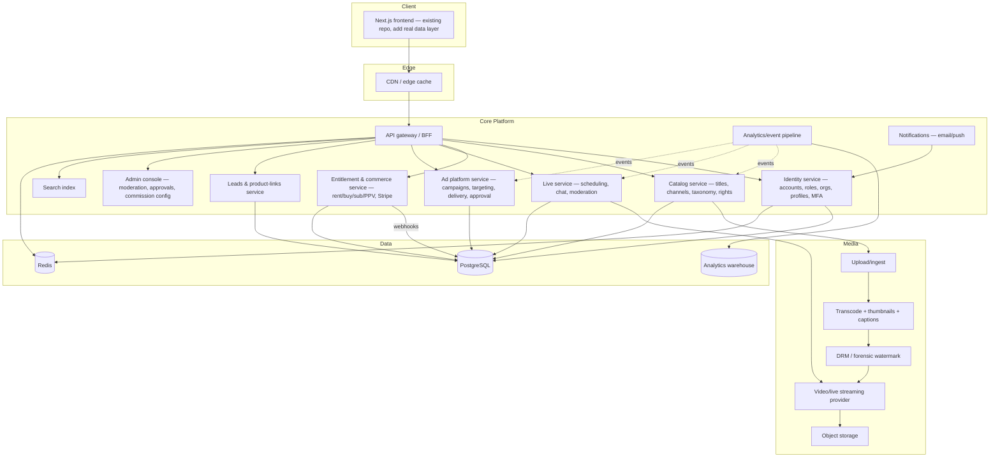

# MYHitch Nexus — Build Plan

Derived from a full crawl of the existing frontend demo (see [REQUIREMENTS.md](REQUIREMENTS.md) for the raw inventory). No written requirements existed prior to this document — everything below is inferred from the UI and should be **validated with stakeholders before Phase 1 starts** (see §6 Open Questions).

## 1. What this product actually is

Nexus is not "a video site" — the frontend implies five products bolted onto one account system:

1. A **Netflix/Vimeo-OTT-style consumer streaming service** (rent/buy/subscribe/watch)
2. A **YouTube-style creator platform** (upload, channel, playlists, analytics, payouts)
3. A **Twitch-style live-streaming platform** (scheduling, ingest, chat, tickets)
4. A **Google-Ads-style advertising platform** (campaign builder, targeting, approval workflow, delivery, brand safety, billing)
5. A **lightweight CRM + affiliate-commerce layer** for business channels (leads, product links)

This is a multi-year, multi-team platform if built to the full depth the frontend shows. The plan below is phased so something real ships early, with the harder verticals (ads, live, payouts) coming once the core catalogue/account/playback loop is solid.

## 2. Recommended architecture

### Tech stack recommendation

| Layer | Recommendation | Why |
|---|---|---|
| Frontend | Keep the existing **Next.js** app; move off static export to a hosted deployment (Vercel or containerized Node) so it can call real APIs and hold real sessions | Reuse the ~30 pages already built; avoid a rewrite |
| BFF/API | Node.js + TypeScript (NestJS or tRPC/Next Route Handlers) | Shared language with frontend, fast iteration |
| Primary DB | PostgreSQL | Relational integrity for entitlements, rights, campaigns |
| Cache/session | Redis | Sessions, rate limiting, live viewer counts |
| Search | Typesense or Elasticsearch (Algolia if budget allows) | Faceted catalogue search matches the Explore/Search filter model exactly |
| Object storage | S3 or Cloudflare R2 | Raw uploads, thumbnails, captions |
| Video (VOD + Live) | **Mux** or **Cloudflare Stream** (build) — or AWS MediaConvert + IVS + CloudFront (more control, more ops) | Both give transcoding, adaptive bitrate, live ingest, and hooks for DRM/watermarking without building a video pipeline from scratch |
| DRM / forensic watermark | Vendor add-on from chosen video provider, or Verimatrix/NAGRA if enterprise-grade needed | The demo explicitly shows a per-user forensic watermark on paid content — this is a real requirement, not cosmetic |
| Payments | **Stripe**: Payments + Billing (subscriptions/memberships) + Connect (creator payouts) | Covers rent/buy/PPV, recurring memberships, dunning, and payout splits/holds in one vendor |
| Ads | Build campaign/targeting/approval data model in-house; delivery/decisioning can start as a simple in-house ad-server and later evaluate Google Ad Manager or Kevel if scale demands | The campaign wizard is bespoke business logic (approval gate, brand safety); an off-the-shelf ad server won't match it |
| Transcription/captions | AWS Transcribe or AssemblyAI (auto-transcribe toggle seen in Upload) | |
| Email | Postmark or SendGrid | Password reset, dunning, analytics export, lead notifications |
| Analytics event pipeline | Segment (or self-hosted RudderStack) → warehouse (BigQuery/ClickHouse) → creator/business/ad dashboards | Matches the multiple analytics surfaces (creator, business, ads) off one event stream |
| Infra | Docker + Kubernetes or ECS Fargate; GitHub Actions CI/CD | |
| Observability | Grafana/Prometheus or Datadog | |

## 3. Roles, orgs and permissions — foundational design decision

Build this **first**, correctly, because every other module depends on it:

- **Account** = a person (login identity, MFA, profiles).
- **Organisation** = a channel that isn't a bare personal Creator channel (Business, Government, Education, Non-profit). An Account has **membership(s)** in Organisation(s) with a role (Owner/Editor/Analyst, at minimum).
- **Roles** (Viewer/Creator/Business/Advertiser/Producer/Education/Government/Admin) are **capabilities granted to an Account or membership**, additive, independently verifiable (Business/Advertiser/Producer require a verification step).
- **Admin** is a separate internal role, not self-service signup — build a minimal internal console from Phase 1 (moderation queue + campaign approval queue are launch-blocking, not nice-to-haves, since Upload and Campaigns both hard-depend on an approval step).

## 4. Phased roadmap

### Phase 0 — Foundations (infra + identity + catalogue skeleton)
- Stand up API gateway, Postgres, Redis, CI/CD, environments.
- Identity service: accounts, login (email+password, OAuth), sessions (fix the demo's `sessionStorage`-only bug), household profiles, MFA scaffold, org/membership model, role grants.
- Catalog service: Title, Channel, taxonomy (content type/sub-category) tables; basic admin CRUD (internal only, no UI polish yet).
- Wire the existing frontend to real auth + a real (even if thin) catalogue API, replacing mock data page by page.
- **Exit criterion**: a real account can log in, a real title exists in Postgres, and the homepage renders it.

### Phase 1 — Viewer MVP (the loop that proves the product)
- Integrate chosen video provider for VOD upload→transcode→playback (internal-only upload tool is fine here; Creator Studio upload UI comes in Phase 2).
- Public browse/filter pages (Films/Commercial/Education/News/Entertainment/Explore/Search) against real catalogue + search index.
- Title detail page: real playback, ratings, comments, watchlist, related titles.
- Channel pages (Videos/About tabs; Playlists/Live tabs can stub until Phase 2/3).
- Free/ad-supported access only — no payments yet.
- **Exit criterion**: a viewer can discover and watch a real free video end-to-end, rate it, comment, and add it to a watchlist.

### Phase 2 — Creator Studio MVP
- Upload wizard (Upload→Metadata→Thumbnails→Captions→Rights→Publishing) backed by the real media pipeline; auto-thumbnail via provider capability or a simple frame-extraction service (AI-confidence-scored suggestions can come later — ship basic extraction first).
- Publish states (Draft/Private/Unlisted/Scheduled/Published/Archived) + moderation-trigger rules (18+/labelled/paid-promotion → Admin queue).
- Creator dashboard (KPIs, recent uploads, moderation-task alerts) backed by the analytics event pipeline (basic version).
- Playlists (Series/episodes deferred to Phase 5 — no reference data existed for it, needs its own design pass).
- Admin: content moderation queue (approve/reject held content and comments).
- **Exit criterion**: a creator can publish a real video through the full rights/moderation pipeline and see it appear on the public site.

### Phase 3 — Monetization (payments layer)
- Stripe integration: Rent, Buy, Pay-per-view, Nexus Premium (platform subscription), Channel memberships.
- Entitlement engine (per-viewer access state: none/rented+expiry/purchased/subscribed) enforced at the playback-authorization layer.
- Account pages: Purchases, Rentals, Subscriptions (with real active/past-due-dunning/cancelled states — fixing the demo's status-bucketing bug).
- Creator Revenue: real balance tracking, Stripe Connect payouts, hold period, admin-configurable commission rates per revenue stream.
- **Exit criterion**: a viewer can pay to rent/buy/subscribe, entitlement is enforced on the real player, and a creator sees real (even if small) payout numbers.

### Phase 4 — Live streaming
- Live provider integration (RTMP/WebRTC ingest → live player), scheduling, access modes (Open/Subscribers-only/Ticketed/Private/Invitation-only — ticketed reuses the Phase 3 payment engine).
- Chat (with moderation tooling: slow mode, timeouts, banned words — the demo's unexplored Moderation tab), polls.
- Live hub (`/live/`) with Live now/Upcoming/Past & replays, replay = auto-VOD after stream ends.
- **Exit criterion**: a creator can schedule and go live, viewers can watch+chat, and a ticketed stream charges correctly.

### Phase 5 — Business & Advertising
- Business org onboarding + verification workflow.
- Campaign wizard (Basics→Budget/Bid→Targeting→Creative→Brand safety→Review) writing to a real Campaign model with a mandatory **Admin approval queue** before delivery.
- In-house ad delivery/decisioning against targeting rules (start simple: rule-based matching + frequency capping; defer real-time bidding/optimization).
- Ad placements actually inserted into the VOD/live player (pre/mid/post-roll, overlay, sponsored-card).
- Product Links (build a first-party lightweight product catalogue rather than a fictional "Mart" — or integrate a real e-commerce platform via its affiliate API) + "Shop this video" timestamped module.
- Leads CRM (capture → pipeline stages → export).
- Enterprise billing (Net-30 invoicing, VAT, credit approval) — likely needs a lightweight accounting integration (e.g. Stripe Invoicing or Xero/QuickBooks sync).
- **Exit criterion**: an advertiser can submit a campaign, an admin approves it, it delivers real impressions against real inventory, and it's billed correctly.

### Phase 6 — Depth, compliance & scale
- Series/episodes + next-episode autoplay (net-new data model, no reference implementation).
- Education accreditation/completion-record features, if confirmed as a real compliance requirement.
- Producer/Distributor bulk import (CSV/XML against rights schedules).
- Real analytics depth: retention curves, traffic-source attribution, ad performance (fill rate/eCPM), audience geo/device breakdowns.
- Security/compliance hardening: role-gated MFA enforcement, GDPR data-subject tooling, PCI scope minimization (offload to Stripe), accessibility audit, localization for the 11 languages already listed in signup.
- Forensic watermarking on all paid playback (if not already covered by the Phase 1 video vendor choice), territory/geo-restriction enforcement replacing the demo's manual "simulate country" toggle.
- Load/scale testing, multi-region CDN, DR/backup strategy.

## 5. Cross-cutting concerns to design once, early

- **Content moderation & approval workflows** — one internal admin console serving both the content-review queue (Phase 2) and the campaign-approval queue (Phase 5); build the queue/approvals framework generically in Phase 2 so Phase 5 reuses it.
- **Entitlement/authorization checks at the player**, not just at the UI — the UI hiding a "Play" button is not access control.
- **Multi-tenancy correctness** — the crawl found campaigns leaking across advertiser workspaces in the demo; get org-scoped data isolation right from Phase 0, it's expensive to retrofit.
- **Internationalization** — signup already lists 11 languages and 12+ countries (including Sri Lanka, suggesting a specific target market); decide the i18n framework in Phase 0 rather than bolting it on.
- **Analytics event schema** — creator analytics, business analytics, and ad performance all read from what should be one underlying event stream; design the event taxonomy before Phase 2, not per-feature.

## 6. Open questions to resolve with stakeholders before Phase 1

See REQUIREMENTS.md §7 for the full list found during the crawl; the highest-priority ones:

1. Should anonymous/free browsing and playback be allowed, or is an account mandatory for all viewing (as the current demo forces)?
2. Is "Mart" a real third-party product catalogue to integrate, or should Product Links be a first-party feature?
3. What DRM/watermarking vendor and budget applies to paid content?
4. Are Education "accredited courses" and "completion records" tied to a real accreditation body/compliance requirement, or just marketing copy?
5. What's the actual org/tenant model — can one business account manage multiple ad campaigns for other businesses (as the demo data implies), or is that a demo artifact to ignore?
6. Priority order confirmation: does the business want ads/live/payments in the order phased above, or does a specific vertical (e.g. Live for an events business, or Ads for a media-sales business) need to move earlier?

## 7. Suggested next steps

1. Walk this plan and REQUIREMENTS.md with stakeholders; resolve §6.
2. Stand up Phase 0 infra and identity service.
3. Pick and contract the video/live vendor (Mux vs Cloudflare Stream vs AWS stack) — this decision gates Phases 1, 2, 4 and 6, so make it early.
4. Re-platform the existing frontend off static export onto a real deployment target so it can be wired to live APIs incrementally, page by page, instead of a big-bang rewrite.
